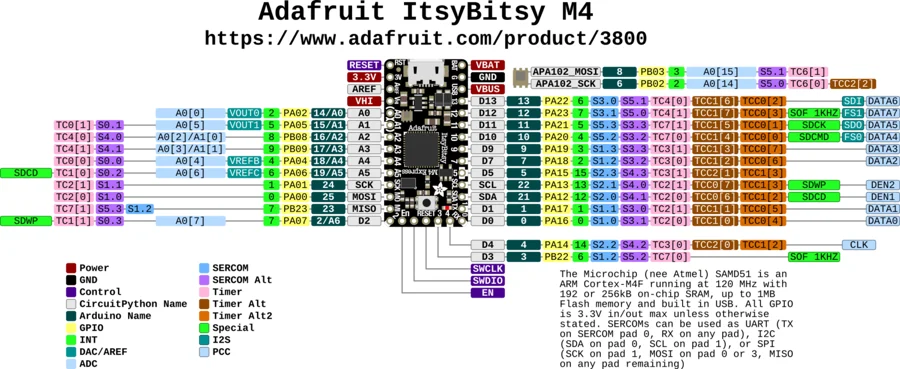

# ItsyBitsy M4 Express

**Adafruit** · SAMD51

Revision: Not identified

Coverage: Physical pinout source collected; scope and revision require confirmation

[Browse all manufacturers](../../../../BROWSE.md) · [Devices & IoT](../../../../DEVICES.md) · [Open in the browser guide](https://valleytech-black-wire-guide.pages.dev/?board=adafruit-itsybitsy-m4-express)

Architecture: **ARM**

## Specifications and hardware documentation

- [Specifications & hardware guide](https://www.adafruit.com/product/3800)

## Original manufacturer graphical reference (PDF)

**original reference PDF** · Reviewed source · PDF

[Open original reference](../../../../library/media/2dd5ae5ab1acab8d786b116e11465430560fc9d9d08815feba06be92baead58b.pdf)

**Credit and rights:** Adafruit / original diagram contributors. Rights not established for this asset; attribution retained. Original artwork is not covered by Black Wire's editorial license.. Source/manufacturer: Adafruit.

[Source 1](https://raw.githubusercontent.com/adafruit/Adafruit-ItsyBitsy-M4-Express-PCB/77ccac24a6eb36fca6f780fd45511d039f0e574f/Adafruit%20ItsyBitsy%20M4%20Pinout.pdf) · [Source 2](https://www.adafruit.com/product/3800) · [Source 3](https://github.com/adafruit/Adafruit-ItsyBitsy-M4-Express-PCB/tree/77ccac24a6eb36fca6f780fd45511d039f0e574f)

Original publisher reference. Exact board/revision and electrical limits still require confirmation.

Image revision: Not identified

SHA-256: `2dd5ae5ab1acab8d786b116e11465430560fc9d9d08815feba06be92baead58b`

## Manufacturer board pinout — page 1

**pinout image** · Reviewed source · PNG

[Open original reference](../../../../library/media/e77eb70fb6e88f97721720709f4f17d9671bfceedc7fe7c86921eb731ee2efd9.png)

**Credit and rights:** Adafruit / original diagram contributors. Rights not established for this asset; attribution retained. Original artwork is not covered by Black Wire's editorial license.. Source/manufacturer: Adafruit.

[Source 1](https://raw.githubusercontent.com/adafruit/Adafruit-ItsyBitsy-M4-Express-PCB/77ccac24a6eb36fca6f780fd45511d039f0e574f/Adafruit%20ItsyBitsy%20M4%20Pinout.pdf) · [Source 2](https://www.adafruit.com/product/3800) · [Source 3](https://github.com/adafruit/Adafruit-ItsyBitsy-M4-Express-PCB/tree/77ccac24a6eb36fca6f780fd45511d039f0e574f)

Original publisher reference. Exact board/revision and electrical limits still require confirmation.  PDF page rendered at 144 dpi without changing labels. Original vector PDF retained.

Image revision: Not identified

SHA-256: `e77eb70fb6e88f97721720709f4f17d9671bfceedc7fe7c86921eb731ee2efd9`

Pin assignments have not been independently electrically verified. Check board revision before wiring.
