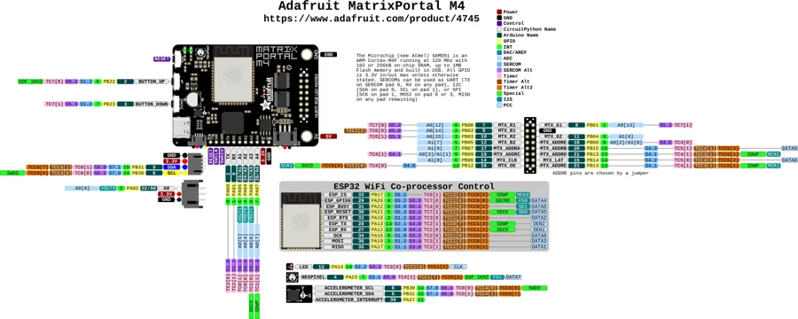

# MatrixPortal M4

**Adafruit** · SAMD51

Revision: Not identified

Coverage: Physical pinout source collected; scope and revision require confirmation

[Browse all manufacturers](../../../../BROWSE.md) · [Devices & IoT](../../../../DEVICES.md) · [Open in the browser guide](https://valleytech-black-wire-guide.pages.dev/?board=adafruit-matrixportal-m4)

Architecture: **ARM**

## Specifications and hardware documentation

- [Specifications & hardware guide](https://www.adafruit.com/product/4745)

## Original manufacturer graphical reference (PDF)

**original reference PDF** · Reviewed source · PDF

[Open original reference](../../../../library/media/287262eea0ef4877c1a8a8dcae05c0e20e752d2923b5a60fd99ba02a73a7cc7b.pdf)

**Credit and rights:** Adafruit / original diagram contributors. Rights not established for this asset; attribution retained. Original artwork is not covered by Black Wire's editorial license.. Source/manufacturer: Adafruit.

[Source 1](https://raw.githubusercontent.com/adafruit/Adafruit-MatrixPortal-M4-PCB/200f94f83a08dd23e0b6cb51ff53554e0a123f94/Adafruit%20MatrixPortal%20M4%20Pinout.pdf) · [Source 2](https://www.adafruit.com/product/4745) · [Source 3](https://github.com/adafruit/Adafruit-MatrixPortal-M4-PCB/tree/200f94f83a08dd23e0b6cb51ff53554e0a123f94)

Original publisher reference. Exact board/revision and electrical limits still require confirmation.

Image revision: Not identified

SHA-256: `287262eea0ef4877c1a8a8dcae05c0e20e752d2923b5a60fd99ba02a73a7cc7b`

## Manufacturer board pinout — page 1

**pinout image** · Reviewed source · PNG

[Open original reference](../../../../library/media/10e6ea8290f8140921958d561c8ff2b35184e2b695cc258bb9e5b186c28128be.png)

**Credit and rights:** Adafruit / original diagram contributors. Rights not established for this asset; attribution retained. Original artwork is not covered by Black Wire's editorial license.. Source/manufacturer: Adafruit.

[Source 1](https://raw.githubusercontent.com/adafruit/Adafruit-MatrixPortal-M4-PCB/200f94f83a08dd23e0b6cb51ff53554e0a123f94/Adafruit%20MatrixPortal%20M4%20Pinout.pdf) · [Source 2](https://www.adafruit.com/product/4745) · [Source 3](https://github.com/adafruit/Adafruit-MatrixPortal-M4-PCB/tree/200f94f83a08dd23e0b6cb51ff53554e0a123f94)

Original publisher reference. Exact board/revision and electrical limits still require confirmation.  PDF page rendered at 144 dpi without changing labels. Original vector PDF retained.

Image revision: Not identified

SHA-256: `10e6ea8290f8140921958d561c8ff2b35184e2b695cc258bb9e5b186c28128be`

Pin assignments have not been independently electrically verified. Check board revision before wiring.
