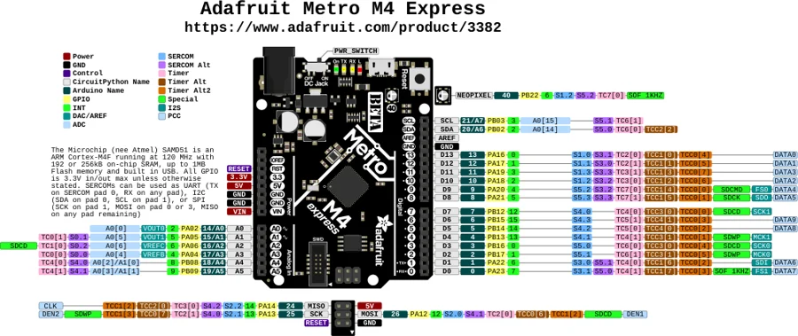

# Metro M4 Express

**Adafruit** · SAMD51

Revision: Not identified

Coverage: Physical pinout source collected; scope and revision require confirmation

[Browse all manufacturers](../../../../BROWSE.md) · [Devices & IoT](../../../../DEVICES.md) · [Open in the browser guide](https://valleytech-black-wire-guide.pages.dev/?board=adafruit-metro-m4-express)

Architecture: **ARM**

## Specifications and hardware documentation

- [Specifications & hardware guide](https://www.adafruit.com/product/3382)

## Original manufacturer graphical reference (PDF)

**original reference PDF** · Reviewed source · PDF

[Open original reference](../../../../library/media/3fe186edfbfa6c5901265db31889af9387d26ca611e980d9338799de6acfadc4.pdf)

**Credit and rights:** Adafruit / original diagram contributors. Rights not established for this asset; attribution retained. Original artwork is not covered by Black Wire's editorial license.. Source/manufacturer: Adafruit.

[Source 1](https://raw.githubusercontent.com/adafruit/Adafruit-Metro-M4-Express-PCB/4aafb2ac645c0d93eed7e4fd6cb71c8eef1a3ac6/Adafruit%20Metro%20M4%20Express%20Pinout.pdf) · [Source 2](https://www.adafruit.com/product/3382) · [Source 3](https://github.com/adafruit/Adafruit-Metro-M4-Express-PCB/tree/4aafb2ac645c0d93eed7e4fd6cb71c8eef1a3ac6)

Original publisher reference. Exact board/revision and electrical limits still require confirmation.

Image revision: Not identified

SHA-256: `3fe186edfbfa6c5901265db31889af9387d26ca611e980d9338799de6acfadc4`

## Manufacturer board pinout — page 1

**pinout image** · Reviewed source · PNG

[Open original reference](../../../../library/media/b663740f234954499194bf49fdeadffc2b1be365e48cf7344a7d70f1f9c375a3.png)

**Credit and rights:** Adafruit / original diagram contributors. Rights not established for this asset; attribution retained. Original artwork is not covered by Black Wire's editorial license.. Source/manufacturer: Adafruit.

[Source 1](https://raw.githubusercontent.com/adafruit/Adafruit-Metro-M4-Express-PCB/4aafb2ac645c0d93eed7e4fd6cb71c8eef1a3ac6/Adafruit%20Metro%20M4%20Express%20Pinout.pdf) · [Source 2](https://www.adafruit.com/product/3382) · [Source 3](https://github.com/adafruit/Adafruit-Metro-M4-Express-PCB/tree/4aafb2ac645c0d93eed7e4fd6cb71c8eef1a3ac6)

Original publisher reference. Exact board/revision and electrical limits still require confirmation.  PDF page rendered at 144 dpi without changing labels. Original vector PDF retained.

Image revision: Not identified

SHA-256: `b663740f234954499194bf49fdeadffc2b1be365e48cf7344a7d70f1f9c375a3`

Pin assignments have not been independently electrically verified. Check board revision before wiring.
