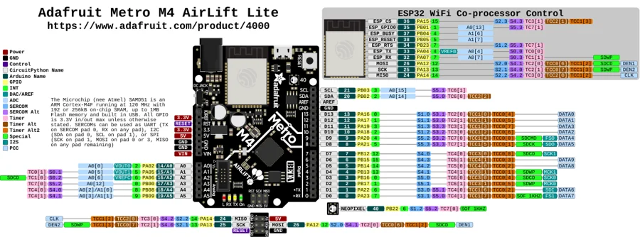

# Metro M4 Express AirLift

**Adafruit** · SAMD51

Revision: Not identified

Coverage: Physical pinout source collected; scope and revision require confirmation

[Browse all manufacturers](../../../../BROWSE.md) · [Devices & IoT](../../../../DEVICES.md) · [Open in the browser guide](https://valleytech-black-wire-guide.pages.dev/?board=adafruit-metro-m4-express-airlift)

Architecture: **ARM**

## Specifications and hardware documentation

- [Specifications & hardware guide](https://www.adafruit.com/product/4000)

## Original manufacturer graphical reference (PDF)

**original reference PDF** · Reviewed source · PDF

[Open original reference](../../../../library/media/e901cd42de0ba3d7db91eaefd3b5b00cc7b3afbef1d07bcd9b89cedd91fe313c.pdf)

**Credit and rights:** Adafruit / original diagram contributors. Rights not established for this asset; attribution retained. Original artwork is not covered by Black Wire's editorial license.. Source/manufacturer: Adafruit.

[Source 1](https://raw.githubusercontent.com/adafruit/Adafruit-Metro-M4-Express-AirLift-PCB/502637b33ce97a9a3048938506316001ef6dcd72/Adafruit%20Metro%20M4%20Express%20AirLift%20Pinout.pdf) · [Source 2](https://www.adafruit.com/product/4000) · [Source 3](https://github.com/adafruit/Adafruit-Metro-M4-Express-AirLift-PCB/tree/502637b33ce97a9a3048938506316001ef6dcd72)

Original publisher reference. Exact board/revision and electrical limits still require confirmation.

Image revision: Not identified

SHA-256: `e901cd42de0ba3d7db91eaefd3b5b00cc7b3afbef1d07bcd9b89cedd91fe313c`

## Manufacturer board pinout — page 1

**pinout image** · Reviewed source · PNG

[Open original reference](../../../../library/media/c45af1f60c3e322994fa573a0addef1cff42a2d72f1d6d8dc888ea6424dc02a6.png)

**Credit and rights:** Adafruit / original diagram contributors. Rights not established for this asset; attribution retained. Original artwork is not covered by Black Wire's editorial license.. Source/manufacturer: Adafruit.

[Source 1](https://raw.githubusercontent.com/adafruit/Adafruit-Metro-M4-Express-AirLift-PCB/502637b33ce97a9a3048938506316001ef6dcd72/Adafruit%20Metro%20M4%20Express%20AirLift%20Pinout.pdf) · [Source 2](https://www.adafruit.com/product/4000) · [Source 3](https://github.com/adafruit/Adafruit-Metro-M4-Express-AirLift-PCB/tree/502637b33ce97a9a3048938506316001ef6dcd72)

Original publisher reference. Exact board/revision and electrical limits still require confirmation.  PDF page rendered at 144 dpi without changing labels. Original vector PDF retained.

Image revision: Not identified

SHA-256: `c45af1f60c3e322994fa573a0addef1cff42a2d72f1d6d8dc888ea6424dc02a6`

Pin assignments have not been independently electrically verified. Check board revision before wiring.
