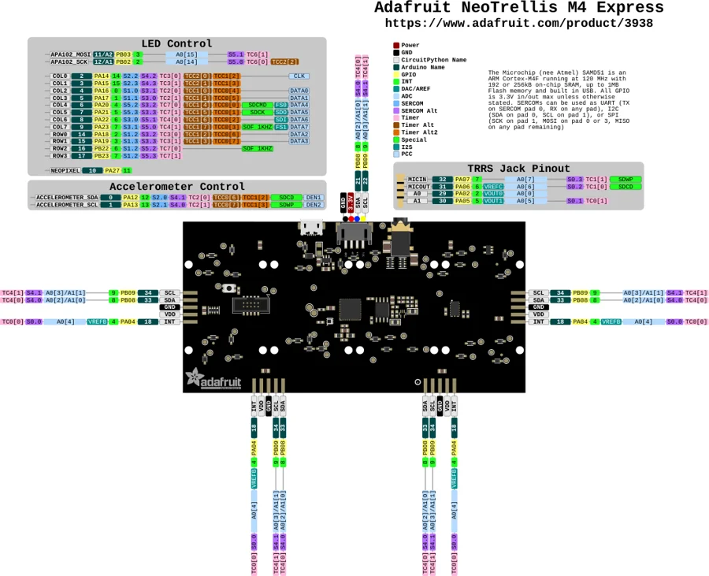

# NeoTrellis M4

**Adafruit** · SAMD51

Revision: Not identified

Coverage: Physical pinout source collected; scope and revision require confirmation

[Browse all manufacturers](../../../../BROWSE.md) · [Devices & IoT](../../../../DEVICES.md) · [Open in the browser guide](https://valleytech-black-wire-guide.pages.dev/?board=adafruit-neotrellis-m4)

Architecture: **ARM**

## Specifications and hardware documentation

- [Specifications & hardware guide](https://www.adafruit.com/product/3938)

## Original manufacturer graphical reference (PDF)

**original reference PDF** · Reviewed source · PDF

[Open original reference](../../../../library/media/3d5d759fcfe490ad105172520260f887948b3a9f0afb2faf9ece9e52bfd00695.pdf)

**Credit and rights:** Adafruit / original diagram contributors. Rights not established for this asset; attribution retained. Original artwork is not covered by Black Wire's editorial license.. Source/manufacturer: Adafruit.

[Source 1](https://raw.githubusercontent.com/adafruit/Adafruit-NeoTrellis-M4-PCB-and-Enclosure/3e6e7d4f37c7df0f40a096f67ab64dfadd4c15db/Adafruit%20NeoTrellis%20M4%20Pinout.pdf) · [Source 2](https://www.adafruit.com/product/3938) · [Source 3](https://github.com/adafruit/Adafruit-NeoTrellis-M4-PCB-and-Enclosure/tree/3e6e7d4f37c7df0f40a096f67ab64dfadd4c15db)

Original publisher reference. Exact board/revision and electrical limits still require confirmation.

Image revision: Not identified

SHA-256: `3d5d759fcfe490ad105172520260f887948b3a9f0afb2faf9ece9e52bfd00695`

## Manufacturer board pinout — page 1

**pinout image** · Reviewed source · PNG

[Open original reference](../../../../library/media/fd5c0d260315bf7db4416247fe716e9cbb0dea7539c002d7b64a9d5721336503.png)

**Credit and rights:** Adafruit / original diagram contributors. Rights not established for this asset; attribution retained. Original artwork is not covered by Black Wire's editorial license.. Source/manufacturer: Adafruit.

[Source 1](https://raw.githubusercontent.com/adafruit/Adafruit-NeoTrellis-M4-PCB-and-Enclosure/3e6e7d4f37c7df0f40a096f67ab64dfadd4c15db/Adafruit%20NeoTrellis%20M4%20Pinout.pdf) · [Source 2](https://www.adafruit.com/product/3938) · [Source 3](https://github.com/adafruit/Adafruit-NeoTrellis-M4-PCB-and-Enclosure/tree/3e6e7d4f37c7df0f40a096f67ab64dfadd4c15db)

Original publisher reference. Exact board/revision and electrical limits still require confirmation.  PDF page rendered at 144 dpi without changing labels. Original vector PDF retained.

Image revision: Not identified

SHA-256: `fd5c0d260315bf7db4416247fe716e9cbb0dea7539c002d7b64a9d5721336503`

Pin assignments have not been independently electrically verified. Check board revision before wiring.
