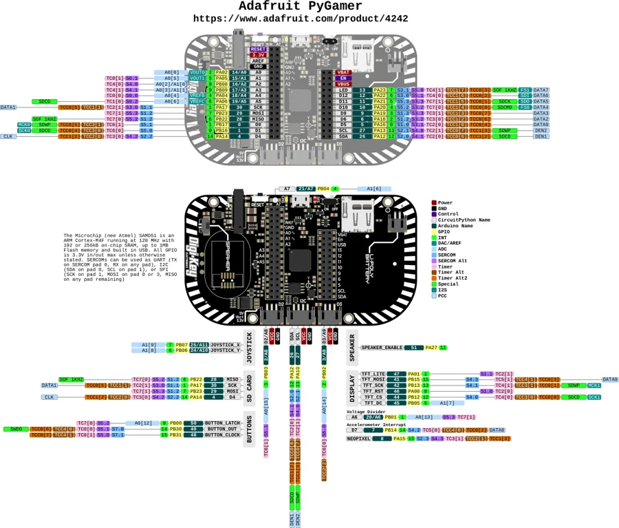

# PyGamer

**Adafruit** · SAMD51

Revision: Not identified

Coverage: Physical pinout source collected; scope and revision require confirmation

[Browse all manufacturers](../../../../BROWSE.md) · [Devices & IoT](../../../../DEVICES.md) · [Open in the browser guide](https://valleytech-black-wire-guide.pages.dev/?board=adafruit-pygamer)

Architecture: **ARM**

## Specifications and hardware documentation

- [Specifications & hardware guide](https://www.adafruit.com/product/4242)

## Original manufacturer graphical reference (PDF)

**original reference PDF** · Reviewed source · PDF

[Open original reference](../../../../library/media/7ec7bdb1d5ee94256cd566848d8edbb86dd306a877de08d62225fa94a9633a10.pdf)

**Credit and rights:** Adafruit / original diagram contributors. Rights not established for this asset; attribution retained. Original artwork is not covered by Black Wire's editorial license.. Source/manufacturer: Adafruit.

[Source 1](https://raw.githubusercontent.com/adafruit/Adafruit-PyGamer-PCB/6725ded4a2049f7bf44a9078c141ceb65a5547e9/Adafruit%20PyGamer%20Pinout.pdf) · [Source 2](https://www.adafruit.com/product/4242) · [Source 3](https://github.com/adafruit/Adafruit-PyGamer-PCB/tree/6725ded4a2049f7bf44a9078c141ceb65a5547e9)

Original publisher reference. Exact board/revision and electrical limits still require confirmation.

Image revision: Not identified

SHA-256: `7ec7bdb1d5ee94256cd566848d8edbb86dd306a877de08d62225fa94a9633a10`

## Manufacturer board pinout — page 1

**pinout image** · Reviewed source · PNG

[Open original reference](../../../../library/media/201cbb90a8dce9fcaec14d38db9a2ac2f92974c1789df1b35d1d0c60b847a2f2.png)

**Credit and rights:** Adafruit / original diagram contributors. Rights not established for this asset; attribution retained. Original artwork is not covered by Black Wire's editorial license.. Source/manufacturer: Adafruit.

[Source 1](https://raw.githubusercontent.com/adafruit/Adafruit-PyGamer-PCB/6725ded4a2049f7bf44a9078c141ceb65a5547e9/Adafruit%20PyGamer%20Pinout.pdf) · [Source 2](https://www.adafruit.com/product/4242) · [Source 3](https://github.com/adafruit/Adafruit-PyGamer-PCB/tree/6725ded4a2049f7bf44a9078c141ceb65a5547e9)

Original publisher reference. Exact board/revision and electrical limits still require confirmation.  PDF page rendered at 144 dpi without changing labels. Original vector PDF retained.

Image revision: Not identified

SHA-256: `201cbb90a8dce9fcaec14d38db9a2ac2f92974c1789df1b35d1d0c60b847a2f2`

Pin assignments have not been independently electrically verified. Check board revision before wiring.
