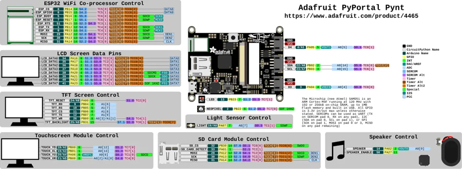

# PyPortal Pynt

**Adafruit** · SAMD51

Revision: Not identified

Coverage: Physical pinout source collected; scope and revision require confirmation

[Browse all manufacturers](../../../../BROWSE.md) · [Devices & IoT](../../../../DEVICES.md) · [Open in the browser guide](https://valleytech-black-wire-guide.pages.dev/?board=adafruit-pyportal-pynt)

Architecture: **ARM**

## Specifications and hardware documentation

- [Specifications & hardware guide](https://www.adafruit.com/product/4465)

## Original manufacturer graphical reference (PDF)

**original reference PDF** · Reviewed source · PDF

[Open original reference](../../../../library/media/ffb8acc093602cf017a6482033893fdd90d50c5fbc343120f28b8628e176086c.pdf)

**Credit and rights:** Adafruit / original diagram contributors. Rights not established for this asset; attribution retained. Original artwork is not covered by Black Wire's editorial license.. Source/manufacturer: Adafruit.

[Source 1](https://raw.githubusercontent.com/adafruit/Adafruit-PyPortal-PCB/90d9aa7ba3f892fd4adb31815c99ede26c10757c/Adafruit%20PyPortal%20Pynt%20Pinout.pdf) · [Source 2](https://www.adafruit.com/product/4465) · [Source 3](https://github.com/adafruit/Adafruit-PyPortal-PCB/tree/90d9aa7ba3f892fd4adb31815c99ede26c10757c)

Original publisher reference. Exact board/revision and electrical limits still require confirmation.

Image revision: Not identified

SHA-256: `ffb8acc093602cf017a6482033893fdd90d50c5fbc343120f28b8628e176086c`

## Manufacturer board pinout — page 1

**pinout image** · Reviewed source · PNG

[Open original reference](../../../../library/media/cb476de16c92fe5008069a8737c6be79b5169e0b228b18a4ca891f09a1a3500d.png)

**Credit and rights:** Adafruit / original diagram contributors. Rights not established for this asset; attribution retained. Original artwork is not covered by Black Wire's editorial license.. Source/manufacturer: Adafruit.

[Source 1](https://raw.githubusercontent.com/adafruit/Adafruit-PyPortal-PCB/90d9aa7ba3f892fd4adb31815c99ede26c10757c/Adafruit%20PyPortal%20Pynt%20Pinout.pdf) · [Source 2](https://www.adafruit.com/product/4465) · [Source 3](https://github.com/adafruit/Adafruit-PyPortal-PCB/tree/90d9aa7ba3f892fd4adb31815c99ede26c10757c)

Original publisher reference. Exact board/revision and electrical limits still require confirmation.  PDF page rendered at 144 dpi without changing labels. Original vector PDF retained.

Image revision: Not identified

SHA-256: `cb476de16c92fe5008069a8737c6be79b5169e0b228b18a4ca891f09a1a3500d`

Pin assignments have not been independently electrically verified. Check board revision before wiring.
