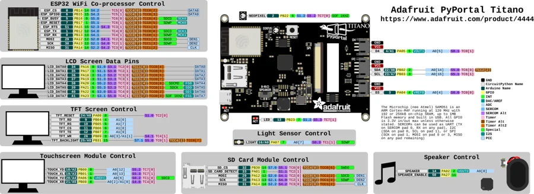

# PyPortal Titano

**Adafruit** · SAMD51

Revision: Not identified

Coverage: Physical pinout source collected; scope and revision require confirmation

[Browse all manufacturers](../../../../BROWSE.md) · [Devices & IoT](../../../../DEVICES.md) · [Open in the browser guide](https://valleytech-black-wire-guide.pages.dev/?board=adafruit-pyportal-titano)

Architecture: **ARM**

## Specifications and hardware documentation

- [Specifications & hardware guide](https://www.adafruit.com/product/4444)

## Original manufacturer graphical reference (PDF)

**original reference PDF** · Reviewed source · PDF

[Open original reference](../../../../library/media/fe5e78bf05977c6b6a84cda056a578113469a70e467f12411df95f4de350b993.pdf)

**Credit and rights:** Adafruit / original diagram contributors. Rights not established for this asset; attribution retained. Original artwork is not covered by Black Wire's editorial license.. Source/manufacturer: Adafruit.

[Source 1](https://raw.githubusercontent.com/adafruit/Adafruit-PyPortal-PCB/90d9aa7ba3f892fd4adb31815c99ede26c10757c/Adafruit%20PyPortal%20Titano%20Pinout.pdf) · [Source 2](https://www.adafruit.com/product/4444) · [Source 3](https://github.com/adafruit/Adafruit-PyPortal-PCB/tree/90d9aa7ba3f892fd4adb31815c99ede26c10757c)

Original publisher reference. Exact board/revision and electrical limits still require confirmation.

Image revision: Not identified

SHA-256: `fe5e78bf05977c6b6a84cda056a578113469a70e467f12411df95f4de350b993`

## Manufacturer board pinout — page 1

**pinout image** · Reviewed source · PNG

[Open original reference](../../../../library/media/a2513f396f68b96f6972b352d9de8f21ca0fd624a883b6111624fd2d6d595197.png)

**Credit and rights:** Adafruit / original diagram contributors. Rights not established for this asset; attribution retained. Original artwork is not covered by Black Wire's editorial license.. Source/manufacturer: Adafruit.

[Source 1](https://raw.githubusercontent.com/adafruit/Adafruit-PyPortal-PCB/90d9aa7ba3f892fd4adb31815c99ede26c10757c/Adafruit%20PyPortal%20Titano%20Pinout.pdf) · [Source 2](https://www.adafruit.com/product/4444) · [Source 3](https://github.com/adafruit/Adafruit-PyPortal-PCB/tree/90d9aa7ba3f892fd4adb31815c99ede26c10757c)

Original publisher reference. Exact board/revision and electrical limits still require confirmation.  PDF page rendered at 144 dpi without changing labels. Original vector PDF retained.

Image revision: Not identified

SHA-256: `a2513f396f68b96f6972b352d9de8f21ca0fd624a883b6111624fd2d6d595197`

Pin assignments have not been independently electrically verified. Check board revision before wiring.
