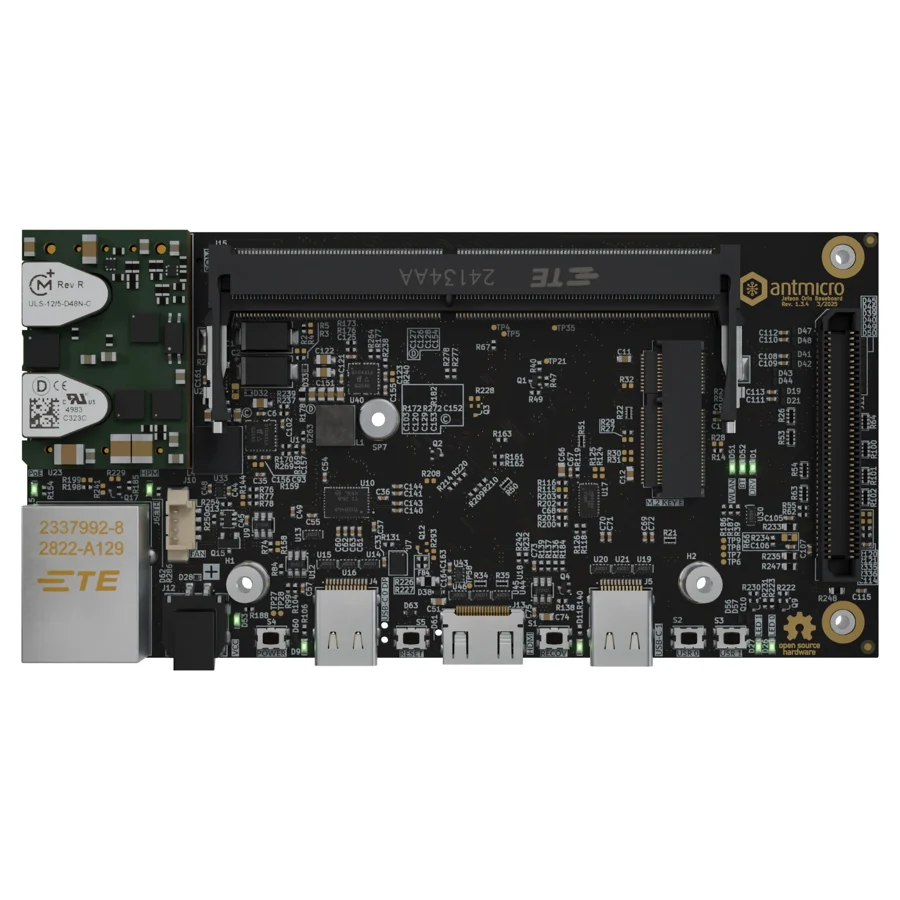

# Jetson Orin Baseboard

**Antmicro** · Expansion

Revision: See exact source revision

Coverage: Supporting references collected; physical GPIO map still needed

[Browse all manufacturers](../../../../BROWSE.md) · [Devices & IoT](../../../../DEVICES.md) · [Open in the browser guide](https://valleytech-black-wire-guide.pages.dev/?board=antmicro-jetson-orin-baseboard)

## Datasheets and original documentation

Board datasheet: **not yet recorded**. Visual reference: **available**.

[Original manufacturer hardware website](https://openhardware.antmicro.com/boards/jetson-orin-baseboard/)

- **design-files / board**: [Open hardware design repository](https://github.com/antmicro/jetson-orin-baseboard) · online

Match the exact board, carrier and PCB revision. A component datasheet does not define the board header or input-power limits.

[Documentation coverage and remaining gaps](../../../../DOCUMENTATION.md)

## Specifications and hardware documentation

- [Manufacturer specifications & hardware guide](https://openhardware.antmicro.com/boards/jetson-orin-baseboard/)

## Manufacturer board render

**product photograph** · Reviewed source · WEBP

[Open original reference](../../../../library/media/4a6b180ead6099460d67bc2884310a8f8f1489e4eb73e96cf9c81c7d5e23904b.webp)

**Credit and rights:** Antmicro / original reference contributors. Asset-specific redistribution and print rights have not been established. Original artwork is not relicensed by the Black Wire editorial license.. Source/manufacturer: Antmicro.

[Source 1](https://openhardware.antmicro.com/imported/boards/jetson-orin-baseboard/previews/orthoT.webp) · [Source 2](https://openhardware.antmicro.com/boards/jetson-orin-baseboard/)

Visual identification only. Per-pin physical diagram still needed; consult the source design repository.

Image revision: See exact source revision

SHA-256: `4a6b180ead6099460d67bc2884310a8f8f1489e4eb73e96cf9c81c7d5e23904b`

Pin assignments have not been independently electrically verified. Check board revision before wiring.
