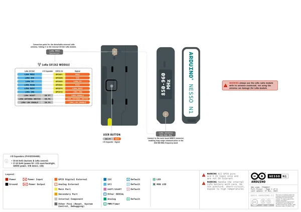
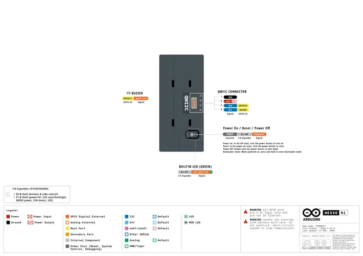
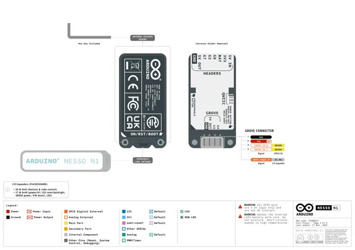
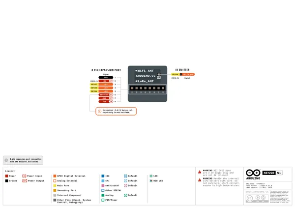
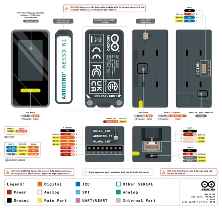
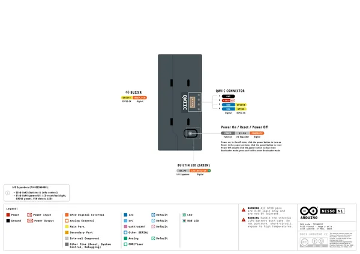
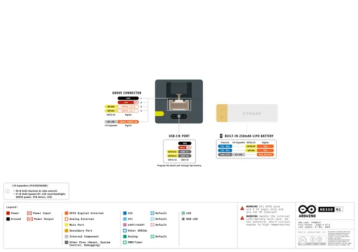
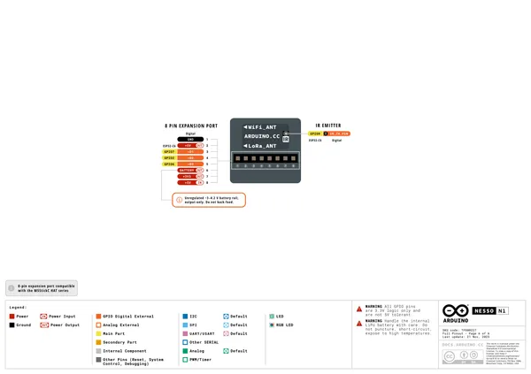
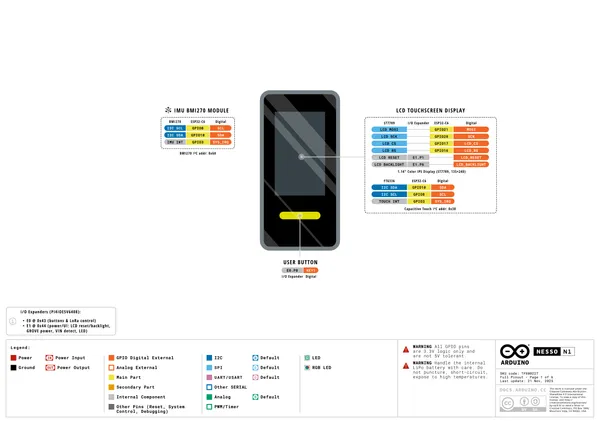

# Nesso N1

**Arduino** · ESP32-C6

Revision: Not identified  
Coverage: Pinout image collected

[Browse all manufacturers](../../../../BROWSE.md) · [Desktop app](https://github.com/valleytechsolutions/black-wire-desktop)

## Pinout

**pinout image** · Reviewed source · PNG

[Open original reference](../../../../library/media/82b6b1d8636e0997ddc947a5f725f6011048d9d8c976f595dd8518805b091f9a.png)

**Credit and rights:** Not established; source attribution retained. Source/manufacturer: Arduino.

[Source 1](https://m5stack-doc.oss-cn-shenzhen.aliyuncs.com/1198/TPX00227-full-pinout_page_02.png) · [Source 2](https://docs.m5stack.com/en/core/Arduino_Nesso_N1)

Imported from existing M5Stack Board Reference; original working path preserved.

SHA-256: `82b6b1d8636e0997ddc947a5f725f6011048d9d8c976f595dd8518805b091f9a`

## Pinout

**pinout image** · Reviewed source · PNG

[Open original reference](../../../../library/media/e33c2a0b31f78a9dc0ae4f3cbb1984fa49ef4ab6692fba4414abc2a2126ff9bb.png)

**Credit and rights:** Not established; source attribution retained. Source/manufacturer: Arduino.

[Source 1](https://m5stack-doc.oss-cn-shenzhen.aliyuncs.com/1198/TPX00227-full-pinout_page_03.png) · [Source 2](https://docs.m5stack.com/en/core/Arduino_Nesso_N1)

Imported from existing M5Stack Board Reference; original working path preserved. Only the named connector or subsection is covered.

**Partial diagram. Confirm missing pins against the exact board documentation.**

SHA-256: `e33c2a0b31f78a9dc0ae4f3cbb1984fa49ef4ab6692fba4414abc2a2126ff9bb`

## Pinout

**pinout image** · Reviewed source · PNG

[Open original reference](../../../../library/media/27ab0be9cc303b18ca582bd4d743aa6e602309b6edfa41ddc03a2caa4a9cb473.png)

**Credit and rights:** Not established; source attribution retained. Source/manufacturer: Arduino.

[Source 1](https://m5stack-doc.oss-cn-shenzhen.aliyuncs.com/1198/TPX00227-full-pinout_page_04.png) · [Source 2](https://docs.m5stack.com/en/core/Arduino_Nesso_N1)

Imported from existing M5Stack Board Reference; original working path preserved.

SHA-256: `27ab0be9cc303b18ca582bd4d743aa6e602309b6edfa41ddc03a2caa4a9cb473`

## Pinout

**pinout image** · Reviewed source · PNG

[Open original reference](../../../../library/media/f27a232d9e2dcb7eefcc10c920d3081f818e7452e78d4263f56ba28233f2a669.png)

**Credit and rights:** Not established; source attribution retained. Source/manufacturer: Arduino.

[Source 1](https://m5stack-doc.oss-cn-shenzhen.aliyuncs.com/1198/TPX00227-full-pinout_page_05.png) · [Source 2](https://docs.m5stack.com/en/core/Arduino_Nesso_N1)

Imported from existing M5Stack Board Reference; original working path preserved. Only the named connector or subsection is covered.

**Partial diagram. Confirm missing pins against the exact board documentation.**

SHA-256: `f27a232d9e2dcb7eefcc10c920d3081f818e7452e78d4263f56ba28233f2a669`

## Pinout

**pinout image** · Reviewed source · PNG

[Open original reference](../../../../library/media/1b2349863a66d260d8ff0ebaf00703787890dc680b8833e334f165b05fabcd7b.png)

**Credit and rights:** Not established; source attribution retained. Source/manufacturer: Arduino.

[Source 1](https://m5stack-doc.oss-cn-shenzhen.aliyuncs.com/1198/TPX00227-full-pinout_page_06.png) · [Source 2](https://docs.m5stack.com/en/core/Arduino_Nesso_N1)

Imported from existing M5Stack Board Reference; original working path preserved. Only the named connector or subsection is covered.

**Partial diagram. Confirm missing pins against the exact board documentation.**

SHA-256: `1b2349863a66d260d8ff0ebaf00703787890dc680b8833e334f165b05fabcd7b`

## Pinout

**pinout image** · Reviewed source · PNG

[Open original reference](../../../../library/media/343dbda5cdf7ebb88e917073bea90c929cda28dd647a94afd970c14b34a3674d.png)

**Credit and rights:** Not established; source attribution retained. Source/manufacturer: Arduino.

[Source 1](https://m5stack-doc.oss-cn-shenzhen.aliyuncs.com/1198/TPX00227-full-pinout_page_01.png) · [Source 2](https://docs.m5stack.com/en/core/Arduino_Nesso_N1)

Imported from existing M5Stack Board Reference; original working path preserved. Only the named connector or subsection is covered.

**Partial diagram. Confirm missing pins against the exact board documentation.**

SHA-256: `343dbda5cdf7ebb88e917073bea90c929cda28dd647a94afd970c14b34a3674d`

## TPX00227-pinout

**pinout image** · Reviewed source · PNG

[Open original reference](../../../../library/media/4382be8f60b154ed6818255df9605e9a38ae2da9c560be18f559361c020f70eb.png)

**Credit and rights:** Not established; source attribution retained. Source/manufacturer: Arduino.

[Source 1](https://raw.githubusercontent.com/arduino/docs-content/dab66ecbd6ad52cd742da6c19c5b6330a7f2caae/content/hardware/kits/maker/nesso-n1/datasheet/assets/TPX00227-pinout.png) · [Source 2](https://docs.arduino.cc/hardware/nesso-n1/) · [Source 3](https://github.com/arduino/docs-content/blob/dab66ecbd6ad52cd742da6c19c5b6330a7f2caae/content/hardware/kits/maker/nesso-n1/product.md) · [Source 4](https://github.com/arduino/docs-content/blob/dab66ecbd6ad52cd742da6c19c5b6330a7f2caae/content/hardware/kits/maker/nesso-n1/datasheet/assets/TPX00227-pinout.png)

Official Arduino documentation repository pinned at dab66ecbd6ad52cd742da6c19c5b6330a7f2caae. Match the board model, SKU and revision printed on each source sheet; lifecycle is not inferred from repository folder placement.

SHA-256: `4382be8f60b154ed6818255df9605e9a38ae2da9c560be18f559361c020f70eb`

## simple-pinout

**pinout image** · Reviewed source · PNG

[Open original reference](../../../../library/media/66f35b307699723d033cfb19af51e5a81f1a11841d8eb2c37d0abc60114f5ade.png)

**Credit and rights:** Not established; source attribution retained. Source/manufacturer: Arduino.

[Source 1](https://raw.githubusercontent.com/arduino/docs-content/dab66ecbd6ad52cd742da6c19c5b6330a7f2caae/content/hardware/kits/maker/nesso-n1/tutorials/user-manual/assets/simple-pinout.png) · [Source 2](https://docs.arduino.cc/hardware/nesso-n1/) · [Source 3](https://github.com/arduino/docs-content/blob/dab66ecbd6ad52cd742da6c19c5b6330a7f2caae/content/hardware/kits/maker/nesso-n1/product.md) · [Source 4](https://github.com/arduino/docs-content/blob/dab66ecbd6ad52cd742da6c19c5b6330a7f2caae/content/hardware/kits/maker/nesso-n1/tutorials/user-manual/assets/simple-pinout.png)

Official Arduino documentation repository pinned at dab66ecbd6ad52cd742da6c19c5b6330a7f2caae. Match the board model, SKU and revision printed on each source sheet; lifecycle is not inferred from repository folder placement.

SHA-256: `66f35b307699723d033cfb19af51e5a81f1a11841d8eb2c37d0abc60114f5ade`

## Official full pinout - page 3

**pinout image** · Reviewed source · PNG

[Open original reference](../../../../library/media/f4535c70907a01bc5bb919121cc2eecfbcc09e29744f93f1428b5fd9fa0b42c1.png)

**Credit and rights:** Not established; source attribution retained. Source/manufacturer: Arduino.

[Source 1](https://raw.githubusercontent.com/arduino/docs-content/dab66ecbd6ad52cd742da6c19c5b6330a7f2caae/content/hardware/kits/maker/nesso-n1/downloads/TPX00227-full-pinout.pdf) · [Source 2](https://docs.arduino.cc/hardware/nesso-n1/) · [Source 3](https://github.com/arduino/docs-content/blob/dab66ecbd6ad52cd742da6c19c5b6330a7f2caae/content/hardware/kits/maker/nesso-n1/product.md) · [Source 4](https://github.com/arduino/docs-content/blob/dab66ecbd6ad52cd742da6c19c5b6330a7f2caae/content/hardware/kits/maker/nesso-n1/downloads/TPX00227-full-pinout.pdf)

Official Arduino documentation repository pinned at dab66ecbd6ad52cd742da6c19c5b6330a7f2caae. Match the board model, SKU and revision printed on each source sheet; lifecycle is not inferred from repository folder placement. Original PDF page 3 rendered at 220 dpi; no labels changed.

SHA-256: `f4535c70907a01bc5bb919121cc2eecfbcc09e29744f93f1428b5fd9fa0b42c1`

## Official full pinout - page 4

**pinout image** · Reviewed source · PNG

[Open original reference](../../../../library/media/161e238392639a9b59bf825388ac585d2cae6e3c040fb7cd2984fde55d393b60.png)

**Credit and rights:** Not established; source attribution retained. Source/manufacturer: Arduino.

[Source 1](https://raw.githubusercontent.com/arduino/docs-content/dab66ecbd6ad52cd742da6c19c5b6330a7f2caae/content/hardware/kits/maker/nesso-n1/downloads/TPX00227-full-pinout.pdf) · [Source 2](https://docs.arduino.cc/hardware/nesso-n1/) · [Source 3](https://github.com/arduino/docs-content/blob/dab66ecbd6ad52cd742da6c19c5b6330a7f2caae/content/hardware/kits/maker/nesso-n1/product.md) · [Source 4](https://github.com/arduino/docs-content/blob/dab66ecbd6ad52cd742da6c19c5b6330a7f2caae/content/hardware/kits/maker/nesso-n1/downloads/TPX00227-full-pinout.pdf)

Official Arduino documentation repository pinned at dab66ecbd6ad52cd742da6c19c5b6330a7f2caae. Match the board model, SKU and revision printed on each source sheet; lifecycle is not inferred from repository folder placement. Original PDF page 4 rendered at 220 dpi; no labels changed.

SHA-256: `161e238392639a9b59bf825388ac585d2cae6e3c040fb7cd2984fde55d393b60`

## Official full pinout - page 5

**pinout image** · Reviewed source · PNG

[Open original reference](../../../../library/media/795652b45ccf0d8a3cbc7567e1e2afa6552045a61b3e3c1223bb4c7ff3bb7f83.png)

**Credit and rights:** Not established; source attribution retained. Source/manufacturer: Arduino.

[Source 1](https://raw.githubusercontent.com/arduino/docs-content/dab66ecbd6ad52cd742da6c19c5b6330a7f2caae/content/hardware/kits/maker/nesso-n1/downloads/TPX00227-full-pinout.pdf) · [Source 2](https://docs.arduino.cc/hardware/nesso-n1/) · [Source 3](https://github.com/arduino/docs-content/blob/dab66ecbd6ad52cd742da6c19c5b6330a7f2caae/content/hardware/kits/maker/nesso-n1/product.md) · [Source 4](https://github.com/arduino/docs-content/blob/dab66ecbd6ad52cd742da6c19c5b6330a7f2caae/content/hardware/kits/maker/nesso-n1/downloads/TPX00227-full-pinout.pdf)

Official Arduino documentation repository pinned at dab66ecbd6ad52cd742da6c19c5b6330a7f2caae. Match the board model, SKU and revision printed on each source sheet; lifecycle is not inferred from repository folder placement. Original PDF page 5 rendered at 220 dpi; no labels changed.

SHA-256: `795652b45ccf0d8a3cbc7567e1e2afa6552045a61b3e3c1223bb4c7ff3bb7f83`

## Official full pinout - page 6

**pinout image** · Reviewed source · PNG

[Open original reference](../../../../library/media/53585da9a0dd5456dc8455943d03cadbba115aca514448848934f3f2976fba5a.png)

**Credit and rights:** Not established; source attribution retained. Source/manufacturer: Arduino.

[Source 1](https://raw.githubusercontent.com/arduino/docs-content/dab66ecbd6ad52cd742da6c19c5b6330a7f2caae/content/hardware/kits/maker/nesso-n1/downloads/TPX00227-full-pinout.pdf) · [Source 2](https://docs.arduino.cc/hardware/nesso-n1/) · [Source 3](https://github.com/arduino/docs-content/blob/dab66ecbd6ad52cd742da6c19c5b6330a7f2caae/content/hardware/kits/maker/nesso-n1/product.md) · [Source 4](https://github.com/arduino/docs-content/blob/dab66ecbd6ad52cd742da6c19c5b6330a7f2caae/content/hardware/kits/maker/nesso-n1/downloads/TPX00227-full-pinout.pdf)

Official Arduino documentation repository pinned at dab66ecbd6ad52cd742da6c19c5b6330a7f2caae. Match the board model, SKU and revision printed on each source sheet; lifecycle is not inferred from repository folder placement. Original PDF page 6 rendered at 220 dpi; no labels changed.

SHA-256: `53585da9a0dd5456dc8455943d03cadbba115aca514448848934f3f2976fba5a`

## Official full pinout - page 1

**GPIO reference image** · Reviewed source · PNG

[Open original reference](../../../../library/media/2b0710af44458862d03e332012478ba2e1aa360db68f2fd5316596557287da61.png)

**Credit and rights:** Not established; source attribution retained. Source/manufacturer: Arduino.

[Source 1](https://raw.githubusercontent.com/arduino/docs-content/dab66ecbd6ad52cd742da6c19c5b6330a7f2caae/content/hardware/kits/maker/nesso-n1/downloads/TPX00227-full-pinout.pdf) · [Source 2](https://docs.arduino.cc/hardware/nesso-n1/) · [Source 3](https://github.com/arduino/docs-content/blob/dab66ecbd6ad52cd742da6c19c5b6330a7f2caae/content/hardware/kits/maker/nesso-n1/product.md) · [Source 4](https://github.com/arduino/docs-content/blob/dab66ecbd6ad52cd742da6c19c5b6330a7f2caae/content/hardware/kits/maker/nesso-n1/downloads/TPX00227-full-pinout.pdf)

Official Arduino documentation repository pinned at dab66ecbd6ad52cd742da6c19c5b6330a7f2caae. Match the board model, SKU and revision printed on each source sheet; lifecycle is not inferred from repository folder placement. Original PDF page 1 rendered at 220 dpi; no labels changed.

SHA-256: `2b0710af44458862d03e332012478ba2e1aa360db68f2fd5316596557287da61`

## Official full pinout - page 2

**GPIO reference image** · Reviewed source · PNG

[Open original reference](../../../../library/media/8771179d11aefea93961034ae8a516fb86c46ae4c5faa74f74211ee82d89a6a9.png)

**Credit and rights:** Not established; source attribution retained. Source/manufacturer: Arduino.

[Source 1](https://raw.githubusercontent.com/arduino/docs-content/dab66ecbd6ad52cd742da6c19c5b6330a7f2caae/content/hardware/kits/maker/nesso-n1/downloads/TPX00227-full-pinout.pdf) · [Source 2](https://docs.arduino.cc/hardware/nesso-n1/) · [Source 3](https://github.com/arduino/docs-content/blob/dab66ecbd6ad52cd742da6c19c5b6330a7f2caae/content/hardware/kits/maker/nesso-n1/product.md) · [Source 4](https://github.com/arduino/docs-content/blob/dab66ecbd6ad52cd742da6c19c5b6330a7f2caae/content/hardware/kits/maker/nesso-n1/downloads/TPX00227-full-pinout.pdf)

Official Arduino documentation repository pinned at dab66ecbd6ad52cd742da6c19c5b6330a7f2caae. Match the board model, SKU and revision printed on each source sheet; lifecycle is not inferred from repository folder placement. Original PDF page 2 rendered at 220 dpi; no labels changed.

SHA-256: `8771179d11aefea93961034ae8a516fb86c46ae4c5faa74f74211ee82d89a6a9`

## Full board pinout PDF

**original reference PDF** · Reviewed source · PDF

[Open original reference](../../../../library/media/54811abce84c80e144d3a6ecceba8e11cbfd2dd036dae8737f9241c2f0ff8a22.pdf)

**Credit and rights:** Not established; source attribution retained. Source/manufacturer: Arduino.

[Source 1](https://raw.githubusercontent.com/arduino/docs-content/dab66ecbd6ad52cd742da6c19c5b6330a7f2caae/content/hardware/kits/maker/nesso-n1/downloads/TPX00227-full-pinout.pdf) · [Source 2](https://docs.arduino.cc/hardware/nesso-n1/) · [Source 3](https://github.com/arduino/docs-content/blob/dab66ecbd6ad52cd742da6c19c5b6330a7f2caae/content/hardware/kits/maker/nesso-n1/product.md) · [Source 4](https://github.com/arduino/docs-content/blob/dab66ecbd6ad52cd742da6c19c5b6330a7f2caae/content/hardware/kits/maker/nesso-n1/downloads/TPX00227-full-pinout.pdf)

Official Arduino documentation repository pinned at dab66ecbd6ad52cd742da6c19c5b6330a7f2caae. Match the board model, SKU and revision printed on each source sheet; lifecycle is not inferred from repository folder placement.

SHA-256: `54811abce84c80e144d3a6ecceba8e11cbfd2dd036dae8737f9241c2f0ff8a22`

Pin assignments have not been independently electrically verified. Check board revision before wiring.
