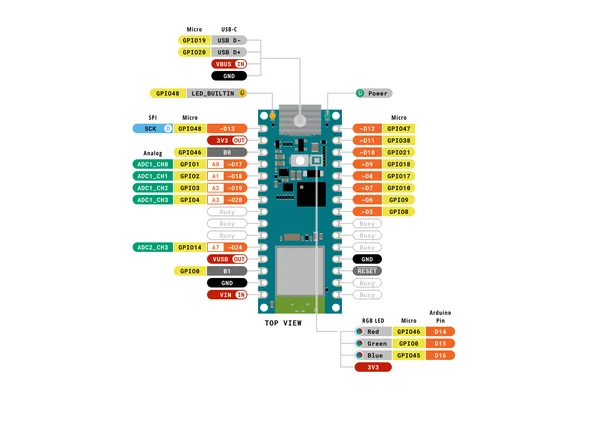
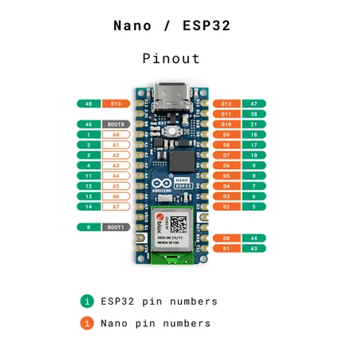
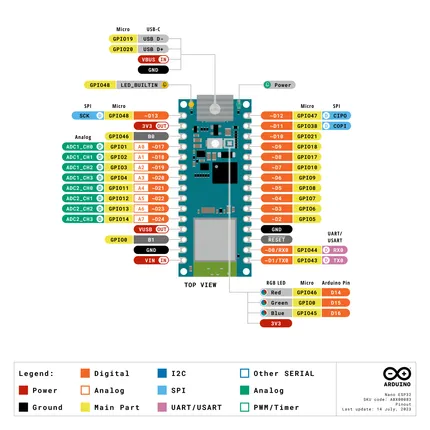
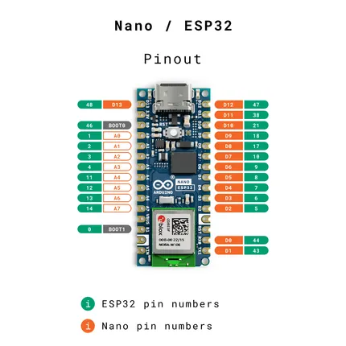
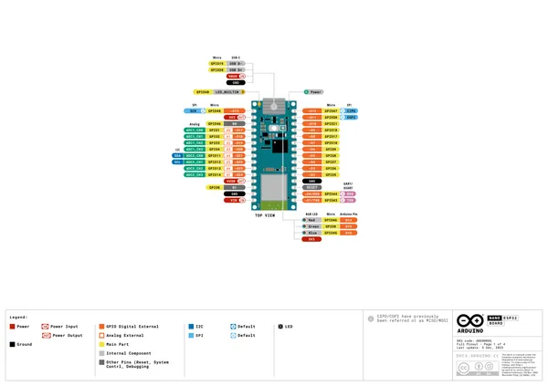
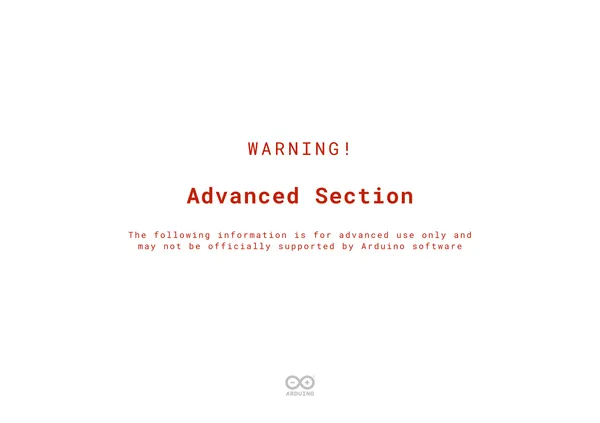
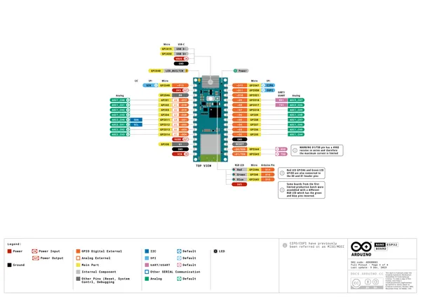
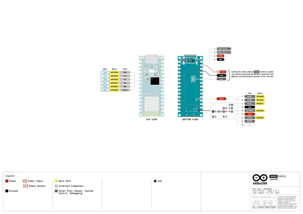

# Nano ESP32

**Arduino** · ESP32-S3

Revision: Not identified  
Coverage: Pinout image collected

[Browse all manufacturers](../../../../BROWSE.md) · [Desktop app](https://github.com/valleytechsolutions/black-wire-desktop)

## ESP_Pinout_Alvik

**pinout image** · Reviewed source · PNG

[Open original reference](../../../../library/media/95cf4115bf8a1b8d2c55f4ed67a7b31538460b3d1407cda9422d539c9ed0c5df.png)

**Credit and rights:** Not established; source attribution retained. Source/manufacturer: Arduino.

[Source 1](https://raw.githubusercontent.com/arduino/docs-content/dab66ecbd6ad52cd742da6c19c5b6330a7f2caae/content/hardware/edu/solution-and-kits/alvik/tutorials/user-manual/assets/ESP_Pinout_Alvik.png) · [Source 2](https://docs.arduino.cc/hardware/alvik/) · [Source 3](https://github.com/arduino/docs-content/blob/dab66ecbd6ad52cd742da6c19c5b6330a7f2caae/content/hardware/edu/solution-and-kits/alvik/product.md) · [Source 4](https://github.com/arduino/docs-content/blob/dab66ecbd6ad52cd742da6c19c5b6330a7f2caae/content/hardware/edu/solution-and-kits/alvik/tutorials/user-manual/assets/ESP_Pinout_Alvik.png)

Official Arduino documentation repository pinned at dab66ecbd6ad52cd742da6c19c5b6330a7f2caae. Match the board model, SKU and revision printed on each source sheet; lifecycle is not inferred from repository folder placement. Nano ESP32 board pictured in the Alvik manual; filed under the board actually shown.

SHA-256: `95cf4115bf8a1b8d2c55f4ed67a7b31538460b3d1407cda9422d539c9ed0c5df`

## esp-pinout

**pinout image** · Reviewed source · PNG

[Open original reference](../../../../library/media/aa6bacf9290e5bf6056975f016f1e1206c13b72040eac4351b9d3276c5a11de0.png)

**Credit and rights:** Not established; source attribution retained. Source/manufacturer: Arduino.

[Source 1](https://raw.githubusercontent.com/arduino/docs-content/dab66ecbd6ad52cd742da6c19c5b6330a7f2caae/content/hardware/edu/solution-and-kits/alvik/tutorials/user-manual/assets/esp-pinout.png) · [Source 2](https://docs.arduino.cc/hardware/alvik/) · [Source 3](https://github.com/arduino/docs-content/blob/dab66ecbd6ad52cd742da6c19c5b6330a7f2caae/content/hardware/edu/solution-and-kits/alvik/product.md) · [Source 4](https://github.com/arduino/docs-content/blob/dab66ecbd6ad52cd742da6c19c5b6330a7f2caae/content/hardware/edu/solution-and-kits/alvik/tutorials/user-manual/assets/esp-pinout.png)

Official Arduino documentation repository pinned at dab66ecbd6ad52cd742da6c19c5b6330a7f2caae. Match the board model, SKU and revision printed on each source sheet; lifecycle is not inferred from repository folder placement. Nano ESP32 board pictured in the Alvik manual; filed under the board actually shown.

SHA-256: `aa6bacf9290e5bf6056975f016f1e1206c13b72040eac4351b9d3276c5a11de0`

## pinout

**pinout image** · Reviewed source · PNG

[Open original reference](../../../../library/media/9babec9aaf1afb15364c7b2d3df343bb03eb1c8932a016acd9d76fc93d87b88c.png)

**Credit and rights:** Not established; source attribution retained. Source/manufacturer: Arduino.

[Source 1](https://raw.githubusercontent.com/arduino/docs-content/dab66ecbd6ad52cd742da6c19c5b6330a7f2caae/content/hardware/nano/boards/nano-esp32/datasheet/assets/pinout.png) · [Source 2](https://docs.arduino.cc/hardware/nano-esp32/) · [Source 3](https://github.com/arduino/docs-content/blob/dab66ecbd6ad52cd742da6c19c5b6330a7f2caae/content/hardware/nano/boards/nano-esp32/product.md) · [Source 4](https://github.com/arduino/docs-content/blob/dab66ecbd6ad52cd742da6c19c5b6330a7f2caae/content/hardware/nano/boards/nano-esp32/datasheet/assets/pinout.png)

Official Arduino documentation repository pinned at dab66ecbd6ad52cd742da6c19c5b6330a7f2caae. Match the board model, SKU and revision printed on each source sheet; lifecycle is not inferred from repository folder placement.

SHA-256: `9babec9aaf1afb15364c7b2d3df343bb03eb1c8932a016acd9d76fc93d87b88c`

## esp-pinout

**pinout image** · Reviewed source · PNG

[Open original reference](../../../../library/media/740bcb0d57106b12ef293b933b14c9b541120cd85b5603fd5bc03457a9b4f662.png)

**Credit and rights:** Not established; source attribution retained. Source/manufacturer: Arduino.

[Source 1](https://raw.githubusercontent.com/arduino/docs-content/dab66ecbd6ad52cd742da6c19c5b6330a7f2caae/content/hardware/nano/boards/nano-esp32/tutorials/cheat-sheet/assets/esp-pinout.png) · [Source 2](https://docs.arduino.cc/hardware/nano-esp32/) · [Source 3](https://github.com/arduino/docs-content/blob/dab66ecbd6ad52cd742da6c19c5b6330a7f2caae/content/hardware/nano/boards/nano-esp32/product.md) · [Source 4](https://github.com/arduino/docs-content/blob/dab66ecbd6ad52cd742da6c19c5b6330a7f2caae/content/hardware/nano/boards/nano-esp32/tutorials/cheat-sheet/assets/esp-pinout.png) · [Source 5](https://github.com/arduino/docs-content/blob/dab66ecbd6ad52cd742da6c19c5b6330a7f2caae/content/hardware/nano/boards/nano-esp32/tutorials/pin-setup/assets/esp-pinout.png)

Official Arduino documentation repository pinned at dab66ecbd6ad52cd742da6c19c5b6330a7f2caae. Match the board model, SKU and revision printed on each source sheet; lifecycle is not inferred from repository folder placement.

SHA-256: `740bcb0d57106b12ef293b933b14c9b541120cd85b5603fd5bc03457a9b4f662`

## Official full pinout - page 1

**pinout image** · Reviewed source · PNG

[Open original reference](../../../../library/media/2ddd48af081b6528d7bb0954435d0c2635a6f8cf5813023a13f7a9191d0bfc9e.png)

**Credit and rights:** Not established; source attribution retained. Source/manufacturer: Arduino.

[Source 1](https://raw.githubusercontent.com/arduino/docs-content/dab66ecbd6ad52cd742da6c19c5b6330a7f2caae/content/hardware/nano/boards/nano-esp32/downloads/ABX00083-full-pinout.pdf) · [Source 2](https://docs.arduino.cc/hardware/nano-esp32/) · [Source 3](https://github.com/arduino/docs-content/blob/dab66ecbd6ad52cd742da6c19c5b6330a7f2caae/content/hardware/nano/boards/nano-esp32/product.md) · [Source 4](https://github.com/arduino/docs-content/blob/dab66ecbd6ad52cd742da6c19c5b6330a7f2caae/content/hardware/nano/boards/nano-esp32/downloads/ABX00083-full-pinout.pdf)

Official Arduino documentation repository pinned at dab66ecbd6ad52cd742da6c19c5b6330a7f2caae. Match the board model, SKU and revision printed on each source sheet; lifecycle is not inferred from repository folder placement. Original PDF page 1 rendered at 220 dpi; no labels changed.

SHA-256: `2ddd48af081b6528d7bb0954435d0c2635a6f8cf5813023a13f7a9191d0bfc9e`

## Official full pinout - page 2

**pinout image** · Reviewed source · PNG

[Open original reference](../../../../library/media/14683b7169c351a3e128b2aca8d7b7bf7f3e460d36903676125a184308b31afe.png)

**Credit and rights:** Not established; source attribution retained. Source/manufacturer: Arduino.

[Source 1](https://raw.githubusercontent.com/arduino/docs-content/dab66ecbd6ad52cd742da6c19c5b6330a7f2caae/content/hardware/nano/boards/nano-esp32/downloads/ABX00083-full-pinout.pdf) · [Source 2](https://docs.arduino.cc/hardware/nano-esp32/) · [Source 3](https://github.com/arduino/docs-content/blob/dab66ecbd6ad52cd742da6c19c5b6330a7f2caae/content/hardware/nano/boards/nano-esp32/product.md) · [Source 4](https://github.com/arduino/docs-content/blob/dab66ecbd6ad52cd742da6c19c5b6330a7f2caae/content/hardware/nano/boards/nano-esp32/downloads/ABX00083-full-pinout.pdf)

Official Arduino documentation repository pinned at dab66ecbd6ad52cd742da6c19c5b6330a7f2caae. Match the board model, SKU and revision printed on each source sheet; lifecycle is not inferred from repository folder placement. Original PDF page 2 rendered at 220 dpi; no labels changed.

SHA-256: `14683b7169c351a3e128b2aca8d7b7bf7f3e460d36903676125a184308b31afe`

## Official full pinout - page 3

**pinout image** · Reviewed source · PNG

[Open original reference](../../../../library/media/b4b2e4c9003ae4b91e01c3715a61cce3f60cc8b06c567aa3600b4cb812355585.png)

**Credit and rights:** Not established; source attribution retained. Source/manufacturer: Arduino.

[Source 1](https://raw.githubusercontent.com/arduino/docs-content/dab66ecbd6ad52cd742da6c19c5b6330a7f2caae/content/hardware/nano/boards/nano-esp32/downloads/ABX00083-full-pinout.pdf) · [Source 2](https://docs.arduino.cc/hardware/nano-esp32/) · [Source 3](https://github.com/arduino/docs-content/blob/dab66ecbd6ad52cd742da6c19c5b6330a7f2caae/content/hardware/nano/boards/nano-esp32/product.md) · [Source 4](https://github.com/arduino/docs-content/blob/dab66ecbd6ad52cd742da6c19c5b6330a7f2caae/content/hardware/nano/boards/nano-esp32/downloads/ABX00083-full-pinout.pdf)

Official Arduino documentation repository pinned at dab66ecbd6ad52cd742da6c19c5b6330a7f2caae. Match the board model, SKU and revision printed on each source sheet; lifecycle is not inferred from repository folder placement. Original PDF page 3 rendered at 220 dpi; no labels changed.

SHA-256: `b4b2e4c9003ae4b91e01c3715a61cce3f60cc8b06c567aa3600b4cb812355585`

## Official full pinout - page 4

**pinout image** · Reviewed source · PNG

[Open original reference](../../../../library/media/5f61a89bf8bb015af6c4ef19a3d8a59c2dea2538400962180d0cb7d05ab21ced.png)

**Credit and rights:** Not established; source attribution retained. Source/manufacturer: Arduino.

[Source 1](https://raw.githubusercontent.com/arduino/docs-content/dab66ecbd6ad52cd742da6c19c5b6330a7f2caae/content/hardware/nano/boards/nano-esp32/downloads/ABX00083-full-pinout.pdf) · [Source 2](https://docs.arduino.cc/hardware/nano-esp32/) · [Source 3](https://github.com/arduino/docs-content/blob/dab66ecbd6ad52cd742da6c19c5b6330a7f2caae/content/hardware/nano/boards/nano-esp32/product.md) · [Source 4](https://github.com/arduino/docs-content/blob/dab66ecbd6ad52cd742da6c19c5b6330a7f2caae/content/hardware/nano/boards/nano-esp32/downloads/ABX00083-full-pinout.pdf)

Official Arduino documentation repository pinned at dab66ecbd6ad52cd742da6c19c5b6330a7f2caae. Match the board model, SKU and revision printed on each source sheet; lifecycle is not inferred from repository folder placement. Original PDF page 4 rendered at 220 dpi; no labels changed.

SHA-256: `5f61a89bf8bb015af6c4ef19a3d8a59c2dea2538400962180d0cb7d05ab21ced`

## Full board pinout PDF

**original reference PDF** · Reviewed source · PDF

[Open original reference](../../../../library/media/2418c2a90c9099d20f3425647607ce0b2ba426a0f1ff04ced50416fc789dc47d.pdf)

**Credit and rights:** Not established; source attribution retained. Source/manufacturer: Arduino.

[Source 1](https://raw.githubusercontent.com/arduino/docs-content/dab66ecbd6ad52cd742da6c19c5b6330a7f2caae/content/hardware/nano/boards/nano-esp32/downloads/ABX00083-full-pinout.pdf) · [Source 2](https://docs.arduino.cc/hardware/nano-esp32/) · [Source 3](https://github.com/arduino/docs-content/blob/dab66ecbd6ad52cd742da6c19c5b6330a7f2caae/content/hardware/nano/boards/nano-esp32/product.md) · [Source 4](https://github.com/arduino/docs-content/blob/dab66ecbd6ad52cd742da6c19c5b6330a7f2caae/content/hardware/nano/boards/nano-esp32/downloads/ABX00083-full-pinout.pdf)

Official Arduino documentation repository pinned at dab66ecbd6ad52cd742da6c19c5b6330a7f2caae. Match the board model, SKU and revision printed on each source sheet; lifecycle is not inferred from repository folder placement.

SHA-256: `2418c2a90c9099d20f3425647607ce0b2ba426a0f1ff04ced50416fc789dc47d`

Pin assignments have not been independently electrically verified. Check board revision before wiring.
