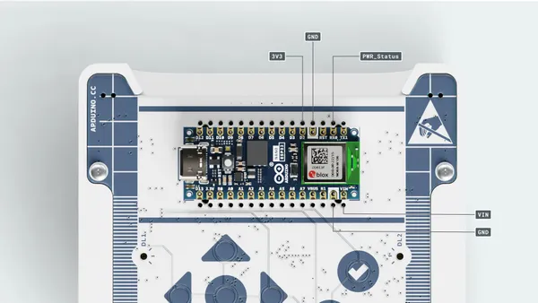

# Alvik

**Arduino** · GPIO device

Revision: Not identified  
Coverage: Partial pinout collected; full reference still needed

[Browse all manufacturers](../../../../BROWSE.md) · [Desktop app](https://github.com/valleytechsolutions/black-wire-desktop)

## Alvik_Docs_Pinout_Callout

**pinout image** · Reviewed source · JPG

[Open original reference](../../../../library/media/c7937870a5404355632ad631bd043c2df098aec33483002cfbd347b59d9d15e0.jpg)

**Credit and rights:** Not established; source attribution retained. Source/manufacturer: Arduino.

[Source 1](https://raw.githubusercontent.com/arduino/docs-content/dab66ecbd6ad52cd742da6c19c5b6330a7f2caae/content/hardware/edu/solution-and-kits/alvik/tutorials/user-manual/assets/Alvik_Docs_Pinout_Callout.jpg) · [Source 2](https://docs.arduino.cc/hardware/alvik/) · [Source 3](https://github.com/arduino/docs-content/blob/dab66ecbd6ad52cd742da6c19c5b6330a7f2caae/content/hardware/edu/solution-and-kits/alvik/product.md) · [Source 4](https://github.com/arduino/docs-content/blob/dab66ecbd6ad52cd742da6c19c5b6330a7f2caae/content/hardware/edu/solution-and-kits/alvik/tutorials/user-manual/assets/Alvik_Docs_Pinout_Callout.jpg)

Official Arduino documentation repository pinned at dab66ecbd6ad52cd742da6c19c5b6330a7f2caae. Match the board model, SKU and revision printed on each source sheet; lifecycle is not inferred from repository folder placement.

**Partial diagram. Confirm missing pins against the exact board documentation.**

SHA-256: `c7937870a5404355632ad631bd043c2df098aec33483002cfbd347b59d9d15e0`

Pin assignments have not been independently electrically verified. Check board revision before wiring.
