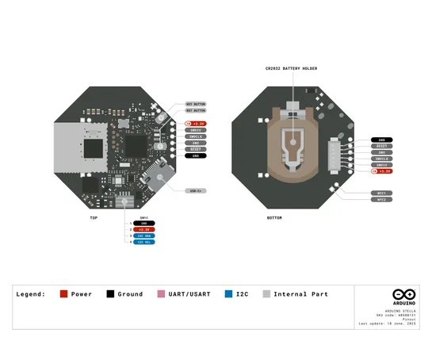
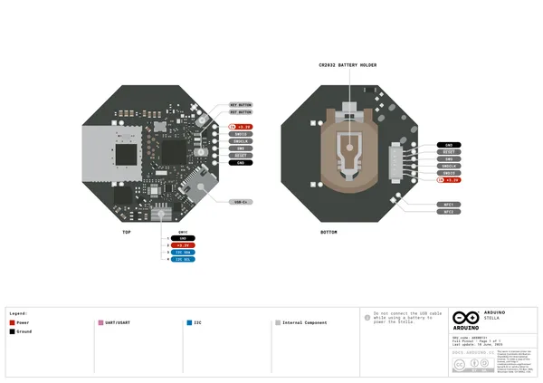

# Stella

**Arduino** · GPIO device

Revision: Not identified  
Coverage: Pinout image collected

[Browse all manufacturers](../../../../BROWSE.md) · [Devices & IoT](../../../../DEVICES.md) · [Open in the browser guide](https://valleytech-black-wire-guide.pages.dev/?board=arduino-gpio-device-stella)

Device category: **Controllers & instruments**

## stella-pinout-v3

**pinout image** · Reviewed source · PNG

[Open original reference](../../../../library/media/853835a7a1019304eec5233e773617f1bcfa0d9279043dd919275480c33b0133.png)

**Credit and rights:** Not established; source attribution retained. Source/manufacturer: Arduino.

[Source 1](https://raw.githubusercontent.com/arduino/docs-content/dab66ecbd6ad52cd742da6c19c5b6330a7f2caae/content/hardware/pro-solutions/solutions-and-kits/stella/datasheet/assets/stella-pinout-v3.png) · [Source 2](https://docs.arduino.cc/hardware/stella/) · [Source 3](https://github.com/arduino/docs-content/blob/dab66ecbd6ad52cd742da6c19c5b6330a7f2caae/content/hardware/pro-solutions/solutions-and-kits/stella/product.md) · [Source 4](https://github.com/arduino/docs-content/blob/dab66ecbd6ad52cd742da6c19c5b6330a7f2caae/content/hardware/pro-solutions/solutions-and-kits/stella/datasheet/assets/stella-pinout-v3.png)

Official Arduino documentation repository pinned at dab66ecbd6ad52cd742da6c19c5b6330a7f2caae. Match the board model, SKU and revision printed on each source sheet; lifecycle is not inferred from repository folder placement.

Image revision: Not identified

SHA-256: `853835a7a1019304eec5233e773617f1bcfa0d9279043dd919275480c33b0133`

## Official full pinout - page 1

**pinout image** · Reviewed source · PNG

[Open original reference](../../../../library/media/509b6126ec62b9baed197a705e3279e9c8cc6f583fa6aae78f74b16c8b68856b.png)

**Credit and rights:** Not established; source attribution retained. Source/manufacturer: Arduino.

[Source 1](https://raw.githubusercontent.com/arduino/docs-content/dab66ecbd6ad52cd742da6c19c5b6330a7f2caae/content/hardware/pro-solutions/solutions-and-kits/stella/downloads/ABX00131-full-pinout.pdf) · [Source 2](https://docs.arduino.cc/hardware/stella/) · [Source 3](https://github.com/arduino/docs-content/blob/dab66ecbd6ad52cd742da6c19c5b6330a7f2caae/content/hardware/pro-solutions/solutions-and-kits/stella/product.md) · [Source 4](https://github.com/arduino/docs-content/blob/dab66ecbd6ad52cd742da6c19c5b6330a7f2caae/content/hardware/pro-solutions/solutions-and-kits/stella/downloads/ABX00131-full-pinout.pdf)

Official Arduino documentation repository pinned at dab66ecbd6ad52cd742da6c19c5b6330a7f2caae. Match the board model, SKU and revision printed on each source sheet; lifecycle is not inferred from repository folder placement. Original PDF page 1 rendered at 220 dpi; no labels changed.

Image revision: Not identified

SHA-256: `509b6126ec62b9baed197a705e3279e9c8cc6f583fa6aae78f74b16c8b68856b`

## Full board pinout PDF

**original reference PDF** · Reviewed source · PDF

[Open original reference](../../../../library/media/a00b52d1d3dd22ebbc335075211bd6f65dc55c64e418cc5d827019db46d46f25.pdf)

**Credit and rights:** Not established; source attribution retained. Source/manufacturer: Arduino.

[Source 1](https://raw.githubusercontent.com/arduino/docs-content/dab66ecbd6ad52cd742da6c19c5b6330a7f2caae/content/hardware/pro-solutions/solutions-and-kits/stella/downloads/ABX00131-full-pinout.pdf) · [Source 2](https://docs.arduino.cc/hardware/stella/) · [Source 3](https://github.com/arduino/docs-content/blob/dab66ecbd6ad52cd742da6c19c5b6330a7f2caae/content/hardware/pro-solutions/solutions-and-kits/stella/product.md) · [Source 4](https://github.com/arduino/docs-content/blob/dab66ecbd6ad52cd742da6c19c5b6330a7f2caae/content/hardware/pro-solutions/solutions-and-kits/stella/downloads/ABX00131-full-pinout.pdf)

Official Arduino documentation repository pinned at dab66ecbd6ad52cd742da6c19c5b6330a7f2caae. Match the board model, SKU and revision printed on each source sheet; lifecycle is not inferred from repository folder placement.

Image revision: Not identified

SHA-256: `a00b52d1d3dd22ebbc335075211bd6f65dc55c64e418cc5d827019db46d46f25`

Pin assignments have not been independently electrically verified. Check board revision before wiring.
