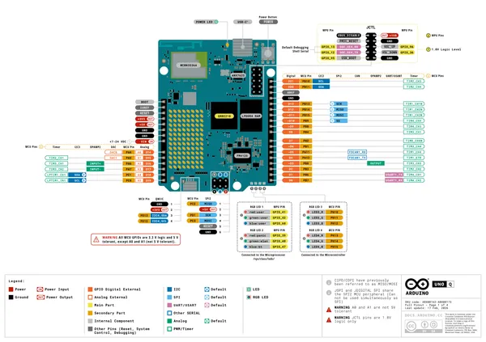
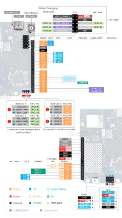
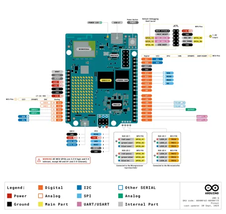
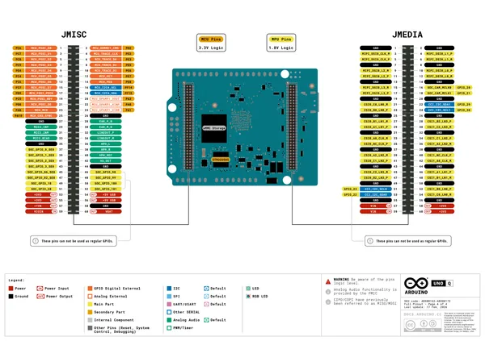
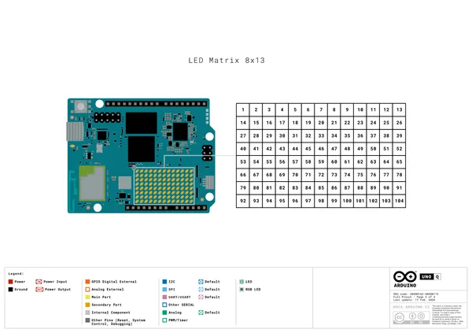

# Arduino UNO Q

**Arduino** · Other

Revision: Not identified  
Coverage: Pinout image collected

[Browse all manufacturers](../../../../BROWSE.md) · [Desktop app](https://github.com/valleytechsolutions/black-wire-desktop)

## Top headers and JCTL

**pinout image** · Reviewed source · PNG

[Open original reference](../../../../library/media/f051a7f6e7bc387188b48557f0797da19390d1b7297d58332de57c4c3d3e3bed.png)

**Credit and rights:** CC BY-SA 4.0, printed on source. Source/manufacturer: Arduino.

[Source 1](https://docs.arduino.cc/resources/pinouts/ABX00162-full-pinout.pdf)

Official full pinout PDF page 1, rendered at 250 dpi without changing labels.

SHA-256: `f051a7f6e7bc387188b48557f0797da19390d1b7297d58332de57c4c3d3e3bed`

## Bottom JMISC and JMEDIA

**pinout image** · Reviewed source · PNG

[Open original reference](../../../../library/media/0456a715268b6a8f4fa1a24aacf7ec0d12183b426327b87d80123f484fefa6f2.png)

**Credit and rights:** CC BY-SA 4.0, printed on source. Source/manufacturer: Arduino.

[Source 1](https://docs.arduino.cc/resources/pinouts/ABX00162-full-pinout.pdf)

Official full pinout PDF page 4, rendered at 250 dpi without changing labels.

SHA-256: `0456a715268b6a8f4fa1a24aacf7ec0d12183b426327b87d80123f484fefa6f2`

## Pinout

**pinout image** · Reviewed source · WEBP

[Open original reference](../../../../library/media/2edb12e10d420002eb55f14634740400f01478512d3b711087d419ec72fa0dd6.webp)

**Credit and rights:** Not recorded; retain original attribution. Source/manufacturer: Arduino.

[Source 1](https://docs.waveshare.com/assets/images/Ws-UNO-Q-Interface-Front-adbcb252a42a17bdf6a1542a6e708c93.webp) · [Source 2](https://docs.waveshare.com/Arduino-UNO-Q-02016)

SHA-256: `2edb12e10d420002eb55f14634740400f01478512d3b711087d419ec72fa0dd6`

## ABX00162-ABX00173_pinout

**pinout image** · Reviewed source · PNG

[Open original reference](../../../../library/media/2acfca0f5c0c36b9715fd3bb7fcd04475a1a3472a335735f9c42083277eaec32.png)

**Credit and rights:** Not established; source attribution retained. Source/manufacturer: Arduino.

[Source 1](https://raw.githubusercontent.com/arduino/docs-content/dab66ecbd6ad52cd742da6c19c5b6330a7f2caae/content/hardware/uno/boards/uno-q/datasheet/assets/ABX00162-ABX00173_pinout.png) · [Source 2](https://docs.arduino.cc/hardware/uno-q/) · [Source 3](https://github.com/arduino/docs-content/blob/dab66ecbd6ad52cd742da6c19c5b6330a7f2caae/content/hardware/uno/boards/uno-q/product.md) · [Source 4](https://github.com/arduino/docs-content/blob/dab66ecbd6ad52cd742da6c19c5b6330a7f2caae/content/hardware/uno/boards/uno-q/datasheet/assets/ABX00162-ABX00173_pinout.png) · [Source 5](https://github.com/arduino/docs-content/blob/dab66ecbd6ad52cd742da6c19c5b6330a7f2caae/content/hardware/uno/boards/uno-q/tutorials/01.user-manual/assets/Simple-pinout-ABX00162.png)

Official Arduino documentation repository pinned at dab66ecbd6ad52cd742da6c19c5b6330a7f2caae. Match the board model, SKU and revision printed on each source sheet; lifecycle is not inferred from repository folder placement.

SHA-256: `2acfca0f5c0c36b9715fd3bb7fcd04475a1a3472a335735f9c42083277eaec32`

## Official full pinout - page 1

**pinout image** · Reviewed source · PNG

[Open original reference](../../../../library/media/f7c1f621e86240e8a177b3c492b656ccffede6447301e488b656d9f61f38d26e.png)

**Credit and rights:** Not established; source attribution retained. Source/manufacturer: Arduino.

[Source 1](https://raw.githubusercontent.com/arduino/docs-content/dab66ecbd6ad52cd742da6c19c5b6330a7f2caae/content/hardware/uno/boards/uno-q/downloads/ABX00162-full-pinout.pdf) · [Source 2](https://docs.arduino.cc/hardware/uno-q/) · [Source 3](https://github.com/arduino/docs-content/blob/dab66ecbd6ad52cd742da6c19c5b6330a7f2caae/content/hardware/uno/boards/uno-q/product.md) · [Source 4](https://github.com/arduino/docs-content/blob/dab66ecbd6ad52cd742da6c19c5b6330a7f2caae/content/hardware/uno/boards/uno-q/downloads/ABX00162-full-pinout.pdf)

Official Arduino documentation repository pinned at dab66ecbd6ad52cd742da6c19c5b6330a7f2caae. Match the board model, SKU and revision printed on each source sheet; lifecycle is not inferred from repository folder placement. Original PDF page 1 rendered at 220 dpi; no labels changed.

SHA-256: `f7c1f621e86240e8a177b3c492b656ccffede6447301e488b656d9f61f38d26e`

## Official full pinout - page 2

**pinout image** · Reviewed source · PNG

[Open original reference](../../../../library/media/77143dad80d9def2198f2d812d552696e3faa607e65b99ac4964a7787aec8cf0.png)

**Credit and rights:** Not established; source attribution retained. Source/manufacturer: Arduino.

[Source 1](https://raw.githubusercontent.com/arduino/docs-content/dab66ecbd6ad52cd742da6c19c5b6330a7f2caae/content/hardware/uno/boards/uno-q/downloads/ABX00162-full-pinout.pdf) · [Source 2](https://docs.arduino.cc/hardware/uno-q/) · [Source 3](https://github.com/arduino/docs-content/blob/dab66ecbd6ad52cd742da6c19c5b6330a7f2caae/content/hardware/uno/boards/uno-q/product.md) · [Source 4](https://github.com/arduino/docs-content/blob/dab66ecbd6ad52cd742da6c19c5b6330a7f2caae/content/hardware/uno/boards/uno-q/downloads/ABX00162-full-pinout.pdf)

Official Arduino documentation repository pinned at dab66ecbd6ad52cd742da6c19c5b6330a7f2caae. Match the board model, SKU and revision printed on each source sheet; lifecycle is not inferred from repository folder placement. Original PDF page 2 rendered at 220 dpi; no labels changed.

SHA-256: `77143dad80d9def2198f2d812d552696e3faa607e65b99ac4964a7787aec8cf0`

## Official full pinout - page 4

**pinout image** · Reviewed source · PNG

[Open original reference](../../../../library/media/31944f41e0cecf6ac3a13990b9347dd4fa2e6518972f24211460396f520d7480.png)

**Credit and rights:** Not established; source attribution retained. Source/manufacturer: Arduino.

[Source 1](https://raw.githubusercontent.com/arduino/docs-content/dab66ecbd6ad52cd742da6c19c5b6330a7f2caae/content/hardware/uno/boards/uno-q/downloads/ABX00162-full-pinout.pdf) · [Source 2](https://docs.arduino.cc/hardware/uno-q/) · [Source 3](https://github.com/arduino/docs-content/blob/dab66ecbd6ad52cd742da6c19c5b6330a7f2caae/content/hardware/uno/boards/uno-q/product.md) · [Source 4](https://github.com/arduino/docs-content/blob/dab66ecbd6ad52cd742da6c19c5b6330a7f2caae/content/hardware/uno/boards/uno-q/downloads/ABX00162-full-pinout.pdf)

Official Arduino documentation repository pinned at dab66ecbd6ad52cd742da6c19c5b6330a7f2caae. Match the board model, SKU and revision printed on each source sheet; lifecycle is not inferred from repository folder placement. Original PDF page 4 rendered at 220 dpi; no labels changed.

SHA-256: `31944f41e0cecf6ac3a13990b9347dd4fa2e6518972f24211460396f520d7480`

## Official full pinout - page 3

**GPIO reference image** · Reviewed source · PNG

[Open original reference](../../../../library/media/e342ba9997a69edac1192e85d1795f46ef9d07eeb6460929be3e9fac426a8efb.png)

**Credit and rights:** Not established; source attribution retained. Source/manufacturer: Arduino.

[Source 1](https://raw.githubusercontent.com/arduino/docs-content/dab66ecbd6ad52cd742da6c19c5b6330a7f2caae/content/hardware/uno/boards/uno-q/downloads/ABX00162-full-pinout.pdf) · [Source 2](https://docs.arduino.cc/hardware/uno-q/) · [Source 3](https://github.com/arduino/docs-content/blob/dab66ecbd6ad52cd742da6c19c5b6330a7f2caae/content/hardware/uno/boards/uno-q/product.md) · [Source 4](https://github.com/arduino/docs-content/blob/dab66ecbd6ad52cd742da6c19c5b6330a7f2caae/content/hardware/uno/boards/uno-q/downloads/ABX00162-full-pinout.pdf)

Official Arduino documentation repository pinned at dab66ecbd6ad52cd742da6c19c5b6330a7f2caae. Match the board model, SKU and revision printed on each source sheet; lifecycle is not inferred from repository folder placement. Original PDF page 3 rendered at 220 dpi; no labels changed.

SHA-256: `e342ba9997a69edac1192e85d1795f46ef9d07eeb6460929be3e9fac426a8efb`

## Full board pinout PDF

**original reference PDF** · Reviewed source · PDF

[Open original reference](../../../../library/media/c4cd57bf718939eb2659b7e4ce5523c070c2a9f85c06009ad56964286fc81153.pdf)

**Credit and rights:** Not established; source attribution retained. Source/manufacturer: Arduino.

[Source 1](https://raw.githubusercontent.com/arduino/docs-content/dab66ecbd6ad52cd742da6c19c5b6330a7f2caae/content/hardware/uno/boards/uno-q/downloads/ABX00162-full-pinout.pdf) · [Source 2](https://docs.arduino.cc/hardware/uno-q/) · [Source 3](https://github.com/arduino/docs-content/blob/dab66ecbd6ad52cd742da6c19c5b6330a7f2caae/content/hardware/uno/boards/uno-q/product.md) · [Source 4](https://github.com/arduino/docs-content/blob/dab66ecbd6ad52cd742da6c19c5b6330a7f2caae/content/hardware/uno/boards/uno-q/downloads/ABX00162-full-pinout.pdf)

Official Arduino documentation repository pinned at dab66ecbd6ad52cd742da6c19c5b6330a7f2caae. Match the board model, SKU and revision printed on each source sheet; lifecycle is not inferred from repository folder placement.

SHA-256: `c4cd57bf718939eb2659b7e4ce5523c070c2a9f85c06009ad56964286fc81153`

Pin assignments have not been independently electrically verified. Check board revision before wiring.
