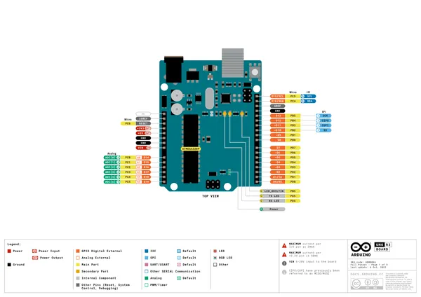
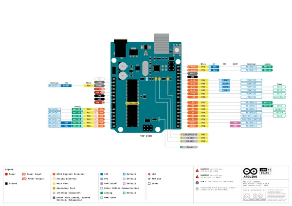
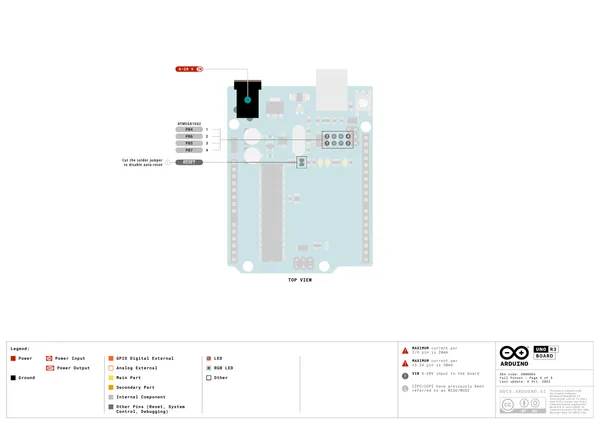
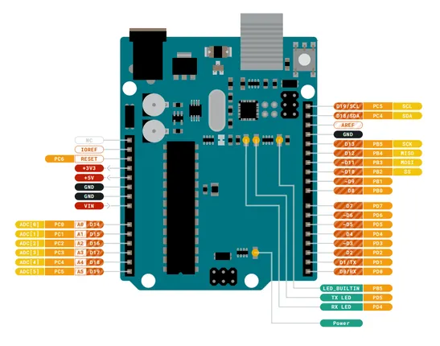
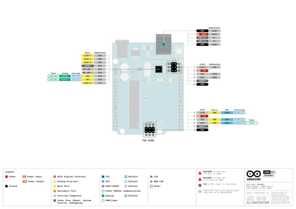
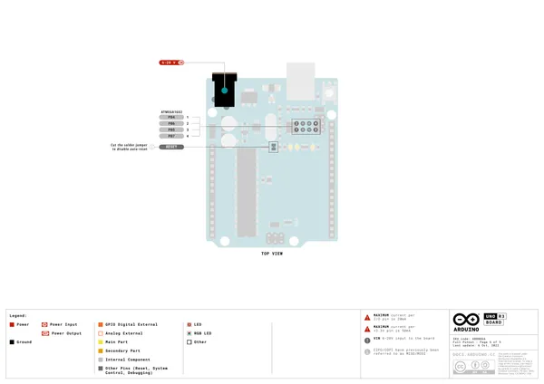

# Arduino UNO R3

**Arduino** · Other

Revision: Not identified  
Coverage: Pinout image collected

[Browse all manufacturers](../../../../BROWSE.md) · [Desktop app](https://github.com/valleytechsolutions/black-wire-desktop)

## Main headers

**pinout image** · Reviewed source · PNG

[Open original reference](../../../../library/media/711d0b07cf970450b01a3e152813d60a53cdc2d0ac536b4c83c11d13c29b9b6f.png)

**Credit and rights:** CC BY-SA 4.0, printed on source. Source/manufacturer: Arduino.

[Source 1](https://content.arduino.cc/assets/A000066-full-pinout.pdf)

Official full pinout PDF page 1, rendered at 250 dpi without changing labels.

SHA-256: `711d0b07cf970450b01a3e152813d60a53cdc2d0ac536b4c83c11d13c29b9b6f`

## Headers with alternate functions

**pinout image** · Reviewed source · PNG

[Open original reference](../../../../library/media/c637d639f8619a100df797e02acf91b71ec4d483925936a6d5c9daaeae8cee2e.png)

**Credit and rights:** CC BY-SA 4.0, printed on source. Source/manufacturer: Arduino.

[Source 1](https://content.arduino.cc/assets/A000066-full-pinout.pdf)

Official full pinout PDF page 3, rendered at 250 dpi without changing labels.

SHA-256: `c637d639f8619a100df797e02acf91b71ec4d483925936a6d5c9daaeae8cee2e`

## ICSP headers

**pinout image** · Reviewed source · PNG

[Open original reference](../../../../library/media/41495afdbf7d44fa4e8976bdfddea4c72d6e4bfdcfe33247dd645e6a4457bf95.png)

**Credit and rights:** CC BY-SA 4.0, printed on source. Source/manufacturer: Arduino.

[Source 1](https://content.arduino.cc/assets/A000066-full-pinout.pdf)

Official full pinout PDF page 4, rendered at 250 dpi without changing labels.

SHA-256: `41495afdbf7d44fa4e8976bdfddea4c72d6e4bfdcfe33247dd645e6a4457bf95`

## Solder pads and reset jumper

**pinout image** · Reviewed source · PNG

[Open original reference](../../../../library/media/f806c6473d80d8aeb092d360706e97fffa943c6b1a83c0e50fc26c9b9cd2e46c.png)

**Credit and rights:** CC BY-SA 4.0, printed on source. Source/manufacturer: Arduino.

[Source 1](https://content.arduino.cc/assets/A000066-full-pinout.pdf)

Official full pinout PDF page 5, rendered at 250 dpi without changing labels.

SHA-256: `f806c6473d80d8aeb092d360706e97fffa943c6b1a83c0e50fc26c9b9cd2e46c`

## pinout

**pinout image** · Reviewed source · PNG

[Open original reference](../../../../library/media/6a0c2088a28c29be99006b4e21dfdafc8b546838fe864b1c6278722abc3dcb9d.png)

**Credit and rights:** Not established; source attribution retained. Source/manufacturer: Arduino.

[Source 1](https://raw.githubusercontent.com/arduino/docs-content/dab66ecbd6ad52cd742da6c19c5b6330a7f2caae/content/hardware/uno/boards/uno-rev3/datasheet/assets/pinout.png) · [Source 2](https://docs.arduino.cc/hardware/uno-rev3/) · [Source 3](https://github.com/arduino/docs-content/blob/dab66ecbd6ad52cd742da6c19c5b6330a7f2caae/content/hardware/uno/boards/uno-rev3/product.md) · [Source 4](https://github.com/arduino/docs-content/blob/dab66ecbd6ad52cd742da6c19c5b6330a7f2caae/content/hardware/uno/boards/uno-rev3/datasheet/assets/pinout.png)

Official Arduino documentation repository pinned at dab66ecbd6ad52cd742da6c19c5b6330a7f2caae. Match the board model, SKU and revision printed on each source sheet; lifecycle is not inferred from repository folder placement.

SHA-256: `6a0c2088a28c29be99006b4e21dfdafc8b546838fe864b1c6278722abc3dcb9d`

## Official full pinout - page 1

**pinout image** · Reviewed source · PNG

[Open original reference](../../../../library/media/b9b0f518afd97eae583c8009038890f8d05d4bf674d3e97a24c723fde9779703.png)

**Credit and rights:** CC BY-SA 4.0 notice printed in the original PDF; preserve attribution and verify scope for publication.. Source/manufacturer: Arduino.

[Source 1](https://raw.githubusercontent.com/arduino/docs-content/dab66ecbd6ad52cd742da6c19c5b6330a7f2caae/content/hardware/uno/boards/uno-rev3/downloads/A000066-full-pinout.pdf) · [Source 2](https://docs.arduino.cc/hardware/uno-rev3/) · [Source 3](https://github.com/arduino/docs-content/blob/dab66ecbd6ad52cd742da6c19c5b6330a7f2caae/content/hardware/uno/boards/uno-rev3/product.md) · [Source 4](https://github.com/arduino/docs-content/blob/dab66ecbd6ad52cd742da6c19c5b6330a7f2caae/content/hardware/uno/boards/uno-rev3/downloads/A000066-full-pinout.pdf)

Official Arduino documentation repository pinned at dab66ecbd6ad52cd742da6c19c5b6330a7f2caae. Match the board model, SKU and revision printed on each source sheet; lifecycle is not inferred from repository folder placement. Original PDF page 1 rendered at 220 dpi; no labels changed.

SHA-256: `b9b0f518afd97eae583c8009038890f8d05d4bf674d3e97a24c723fde9779703`

## Official full pinout - page 3

**pinout image** · Reviewed source · PNG

[Open original reference](../../../../library/media/32bb5568b1d6d490ea1d48e3b7b6d81c76596b011bf6cd2d922056e595890e30.png)

**Credit and rights:** CC BY-SA 4.0 notice printed in the original PDF; preserve attribution and verify scope for publication.. Source/manufacturer: Arduino.

[Source 1](https://raw.githubusercontent.com/arduino/docs-content/dab66ecbd6ad52cd742da6c19c5b6330a7f2caae/content/hardware/uno/boards/uno-rev3/downloads/A000066-full-pinout.pdf) · [Source 2](https://docs.arduino.cc/hardware/uno-rev3/) · [Source 3](https://github.com/arduino/docs-content/blob/dab66ecbd6ad52cd742da6c19c5b6330a7f2caae/content/hardware/uno/boards/uno-rev3/product.md) · [Source 4](https://github.com/arduino/docs-content/blob/dab66ecbd6ad52cd742da6c19c5b6330a7f2caae/content/hardware/uno/boards/uno-rev3/downloads/A000066-full-pinout.pdf)

Official Arduino documentation repository pinned at dab66ecbd6ad52cd742da6c19c5b6330a7f2caae. Match the board model, SKU and revision printed on each source sheet; lifecycle is not inferred from repository folder placement. Original PDF page 3 rendered at 220 dpi; no labels changed.

SHA-256: `32bb5568b1d6d490ea1d48e3b7b6d81c76596b011bf6cd2d922056e595890e30`

## Official full pinout - page 4

**pinout image** · Reviewed source · PNG

[Open original reference](../../../../library/media/eb7a04d4cb31dbc03a4c3ed116b807d71077b1fca41d77feb7e6680f50d5ebc6.png)

**Credit and rights:** CC BY-SA 4.0 notice printed in the original PDF; preserve attribution and verify scope for publication.. Source/manufacturer: Arduino.

[Source 1](https://raw.githubusercontent.com/arduino/docs-content/dab66ecbd6ad52cd742da6c19c5b6330a7f2caae/content/hardware/uno/boards/uno-rev3/downloads/A000066-full-pinout.pdf) · [Source 2](https://docs.arduino.cc/hardware/uno-rev3/) · [Source 3](https://github.com/arduino/docs-content/blob/dab66ecbd6ad52cd742da6c19c5b6330a7f2caae/content/hardware/uno/boards/uno-rev3/product.md) · [Source 4](https://github.com/arduino/docs-content/blob/dab66ecbd6ad52cd742da6c19c5b6330a7f2caae/content/hardware/uno/boards/uno-rev3/downloads/A000066-full-pinout.pdf)

Official Arduino documentation repository pinned at dab66ecbd6ad52cd742da6c19c5b6330a7f2caae. Match the board model, SKU and revision printed on each source sheet; lifecycle is not inferred from repository folder placement. Original PDF page 4 rendered at 220 dpi; no labels changed.

SHA-256: `eb7a04d4cb31dbc03a4c3ed116b807d71077b1fca41d77feb7e6680f50d5ebc6`

## Official full pinout - page 5

**pinout image** · Reviewed source · PNG

[Open original reference](../../../../library/media/dfaecb9e94324d4be4357d219426d4352c1caa86426b43d6bcb433b676e23087.png)

**Credit and rights:** CC BY-SA 4.0 notice printed in the original PDF; preserve attribution and verify scope for publication.. Source/manufacturer: Arduino.

[Source 1](https://raw.githubusercontent.com/arduino/docs-content/dab66ecbd6ad52cd742da6c19c5b6330a7f2caae/content/hardware/uno/boards/uno-rev3/downloads/A000066-full-pinout.pdf) · [Source 2](https://docs.arduino.cc/hardware/uno-rev3/) · [Source 3](https://github.com/arduino/docs-content/blob/dab66ecbd6ad52cd742da6c19c5b6330a7f2caae/content/hardware/uno/boards/uno-rev3/product.md) · [Source 4](https://github.com/arduino/docs-content/blob/dab66ecbd6ad52cd742da6c19c5b6330a7f2caae/content/hardware/uno/boards/uno-rev3/downloads/A000066-full-pinout.pdf)

Official Arduino documentation repository pinned at dab66ecbd6ad52cd742da6c19c5b6330a7f2caae. Match the board model, SKU and revision printed on each source sheet; lifecycle is not inferred from repository folder placement. Original PDF page 5 rendered at 220 dpi; no labels changed.

SHA-256: `dfaecb9e94324d4be4357d219426d4352c1caa86426b43d6bcb433b676e23087`

## Full board pinout PDF

**original reference PDF** · Reviewed source · PDF

[Open original reference](../../../../library/media/088b4d7d776abf443cb050c31875221aa5fc7f0533470b33e035c249cf240007.pdf)

**Credit and rights:** Not established; source attribution retained. Source/manufacturer: Arduino.

[Source 1](https://raw.githubusercontent.com/arduino/docs-content/dab66ecbd6ad52cd742da6c19c5b6330a7f2caae/content/hardware/uno/boards/uno-rev3/downloads/A000066-full-pinout.pdf) · [Source 2](https://docs.arduino.cc/hardware/uno-rev3/) · [Source 3](https://github.com/arduino/docs-content/blob/dab66ecbd6ad52cd742da6c19c5b6330a7f2caae/content/hardware/uno/boards/uno-rev3/product.md) · [Source 4](https://github.com/arduino/docs-content/blob/dab66ecbd6ad52cd742da6c19c5b6330a7f2caae/content/hardware/uno/boards/uno-rev3/downloads/A000066-full-pinout.pdf)

Official Arduino documentation repository pinned at dab66ecbd6ad52cd742da6c19c5b6330a7f2caae. Match the board model, SKU and revision printed on each source sheet; lifecycle is not inferred from repository folder placement.

SHA-256: `088b4d7d776abf443cb050c31875221aa5fc7f0533470b33e035c249cf240007`

Pin assignments have not been independently electrically verified. Check board revision before wiring.
