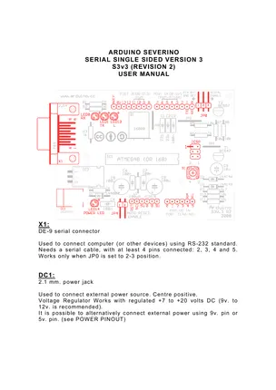

# Board Serial Single Sided v3

**Arduino** · Other

Revision: Multiple source/revision records; see individual assets  
Coverage: Partial pinout collected; full reference still needed

[Browse all manufacturers](../../../../BROWSE.md) · [Desktop app](https://github.com/valleytechsolutions/black-wire-desktop)

## Board pinout - original PDF page 1

**pinout image** · Reviewed source · PNG

[Open original reference](../../../../library/media/eb21ac05c72e46855f53677f9c8e2b80aa85f5077af2c3190ece339d5df07313.png)

**Credit and rights:** Not established; source attribution retained. Source/manufacturer: Arduino.

[Source 1](https://www.arduino.cc/en/uploads/Main/ArduinoSeverinoManual2.pdf) · [Source 2](https://docs.arduino.cc/retired/boards/arduino-serial-single-sided-3/)

Severino historical board manual. Match the source revision. Original PDF page 1 rendered at 220 dpi; no labels changed.

**Partial diagram. Confirm missing pins against the exact board documentation.**

SHA-256: `eb21ac05c72e46855f53677f9c8e2b80aa85f5077af2c3190ece339d5df07313`

## Historical board manual

**original reference PDF** · Reviewed source · PDF

[Open original reference](../../../../library/media/7121a9e0d53675a63fe5778fa5b1618ecd3bef126ccd2929b0db3ca4ae105402.pdf)

**Credit and rights:** Not established; source attribution retained. Source/manufacturer: Arduino.

[Source 1](https://www.arduino.cc/en/uploads/Main/ArduinoSeverinoManual2.pdf) · [Source 2](https://docs.arduino.cc/retired/boards/arduino-serial-single-sided-3/)

Severino historical board manual. Match the source revision.

SHA-256: `7121a9e0d53675a63fe5778fa5b1618ecd3bef126ccd2929b0db3ca4ae105402`

Pin assignments have not been independently electrically verified. Check board revision before wiring.
