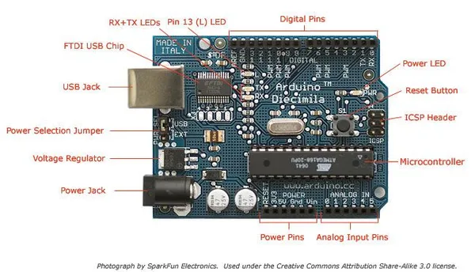

# Diecimila

**Arduino** · Other

Revision: Not identified  
Coverage: Board labels only; pinout needed

[Browse all manufacturers](../../../../BROWSE.md) · [Desktop app](https://github.com/valleytechsolutions/black-wire-desktop)

## ArduinoDiecimilaComponents

**board labeling image** · Reviewed source · JPG

[Open original reference](../../../../library/media/295dcfcccdafafde52aa97f7aad7d18c1758518085c88afff15aaf51984342b5.jpg)

**Credit and rights:** Not established; source attribution retained. Source/manufacturer: Arduino.

[Source 1](https://raw.githubusercontent.com/arduino/docs-content/dab66ecbd6ad52cd742da6c19c5b6330a7f2caae/content/retired/01.boards/arduino-diecimila/assets/ArduinoDiecimilaComponents.jpg) · [Source 2](https://docs.arduino.cc/retired/boards/arduino-diecimila/) · [Source 3](https://github.com/arduino/docs-content/blob/dab66ecbd6ad52cd742da6c19c5b6330a7f2caae/content/retired/01.boards/arduino-diecimila/content.md)

Official Arduino documentation repository pinned at dab66ecbd6ad52cd742da6c19c5b6330a7f2caae. Match the board model, SKU and revision printed on each source sheet; lifecycle is not inferred from repository folder placement.

SHA-256: `295dcfcccdafafde52aa97f7aad7d18c1758518085c88afff15aaf51984342b5`

Pin assignments have not been independently electrically verified. Check board revision before wiring.
