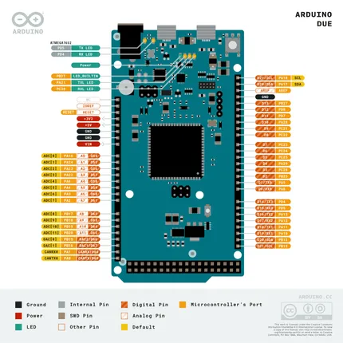
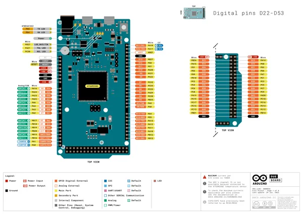
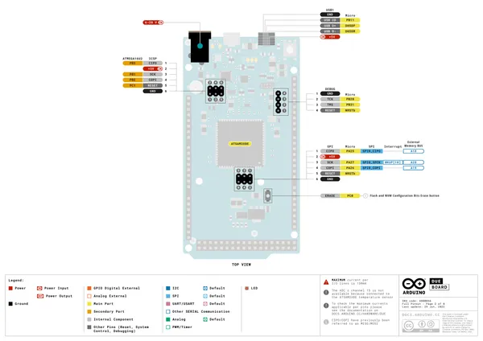
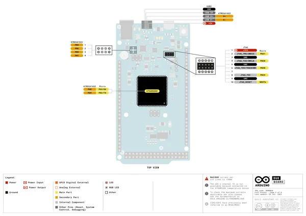
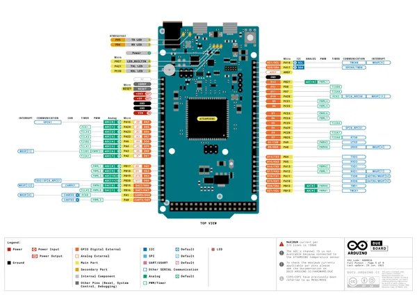
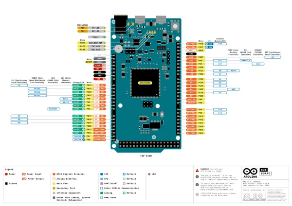
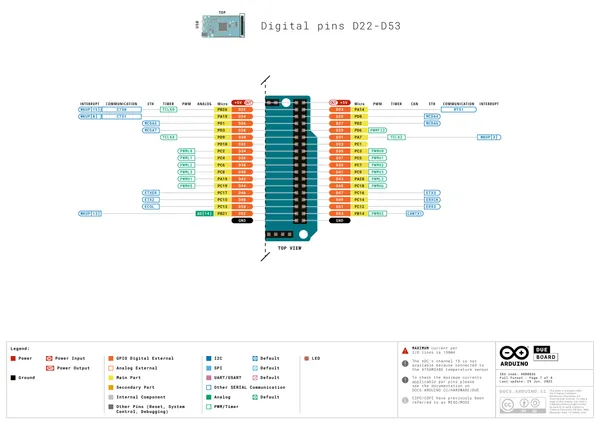
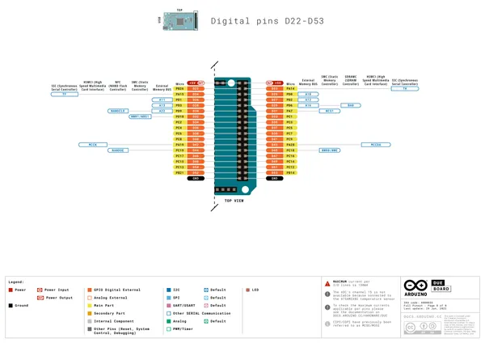

# Due

**Arduino** · Other

Revision: Not identified  
Coverage: Pinout image collected

[Browse all manufacturers](../../../../BROWSE.md) · [Desktop app](https://github.com/valleytechsolutions/black-wire-desktop)

## ad-pinout

**pinout image** · Reviewed source · PNG

[Open original reference](../../../../library/media/c27ea43d89224c099f132796d380989c499c3aab9759c243655c5f3db0bb6706.png)

**Credit and rights:** Not established; source attribution retained. Source/manufacturer: Arduino.

[Source 1](https://raw.githubusercontent.com/arduino/docs-content/dab66ecbd6ad52cd742da6c19c5b6330a7f2caae/content/hardware/mega/boards/due/datasheet/assets/ad-pinout.png) · [Source 2](https://docs.arduino.cc/hardware/due/) · [Source 3](https://github.com/arduino/docs-content/blob/dab66ecbd6ad52cd742da6c19c5b6330a7f2caae/content/hardware/mega/boards/due/product.md) · [Source 4](https://github.com/arduino/docs-content/blob/dab66ecbd6ad52cd742da6c19c5b6330a7f2caae/content/hardware/mega/boards/due/datasheet/assets/ad-pinout.png)

Official Arduino documentation repository pinned at dab66ecbd6ad52cd742da6c19c5b6330a7f2caae. Match the board model, SKU and revision printed on each source sheet; lifecycle is not inferred from repository folder placement.

SHA-256: `c27ea43d89224c099f132796d380989c499c3aab9759c243655c5f3db0bb6706`

## Official full pinout - page 1

**pinout image** · Reviewed source · PNG

[Open original reference](../../../../library/media/b260c2cadcfafe1aa5bd7642c7ef2e7d46785e4a41a882c107d978009a05e7b7.png)

**Credit and rights:** CC BY-SA 4.0 notice printed in the original PDF; preserve attribution and verify scope for publication.. Source/manufacturer: Arduino.

[Source 1](https://raw.githubusercontent.com/arduino/docs-content/dab66ecbd6ad52cd742da6c19c5b6330a7f2caae/content/hardware/mega/boards/due/downloads/A000056-full-pinout.pdf) · [Source 2](https://docs.arduino.cc/hardware/due/) · [Source 3](https://github.com/arduino/docs-content/blob/dab66ecbd6ad52cd742da6c19c5b6330a7f2caae/content/hardware/mega/boards/due/product.md) · [Source 4](https://github.com/arduino/docs-content/blob/dab66ecbd6ad52cd742da6c19c5b6330a7f2caae/content/hardware/mega/boards/due/downloads/A000056-full-pinout.pdf)

Official Arduino documentation repository pinned at dab66ecbd6ad52cd742da6c19c5b6330a7f2caae. Match the board model, SKU and revision printed on each source sheet; lifecycle is not inferred from repository folder placement. Original PDF page 1 rendered at 220 dpi; no labels changed.

SHA-256: `b260c2cadcfafe1aa5bd7642c7ef2e7d46785e4a41a882c107d978009a05e7b7`

## Official full pinout - page 2

**pinout image** · Reviewed source · PNG

[Open original reference](../../../../library/media/788e5efd2be17800845105dd5c94089490efec011fa5d9b4c64b856f73c81298.png)

**Credit and rights:** CC BY-SA 4.0 notice printed in the original PDF; preserve attribution and verify scope for publication.. Source/manufacturer: Arduino.

[Source 1](https://raw.githubusercontent.com/arduino/docs-content/dab66ecbd6ad52cd742da6c19c5b6330a7f2caae/content/hardware/mega/boards/due/downloads/A000056-full-pinout.pdf) · [Source 2](https://docs.arduino.cc/hardware/due/) · [Source 3](https://github.com/arduino/docs-content/blob/dab66ecbd6ad52cd742da6c19c5b6330a7f2caae/content/hardware/mega/boards/due/product.md) · [Source 4](https://github.com/arduino/docs-content/blob/dab66ecbd6ad52cd742da6c19c5b6330a7f2caae/content/hardware/mega/boards/due/downloads/A000056-full-pinout.pdf)

Official Arduino documentation repository pinned at dab66ecbd6ad52cd742da6c19c5b6330a7f2caae. Match the board model, SKU and revision printed on each source sheet; lifecycle is not inferred from repository folder placement. Original PDF page 2 rendered at 220 dpi; no labels changed.

SHA-256: `788e5efd2be17800845105dd5c94089490efec011fa5d9b4c64b856f73c81298`

## Official full pinout - page 3

**pinout image** · Reviewed source · PNG

[Open original reference](../../../../library/media/c61db7245a6d25e974f491bb9a05b1b9f2cf36f0afd976fec95ce10c21f2f27d.png)

**Credit and rights:** CC BY-SA 4.0 notice printed in the original PDF; preserve attribution and verify scope for publication.. Source/manufacturer: Arduino.

[Source 1](https://raw.githubusercontent.com/arduino/docs-content/dab66ecbd6ad52cd742da6c19c5b6330a7f2caae/content/hardware/mega/boards/due/downloads/A000056-full-pinout.pdf) · [Source 2](https://docs.arduino.cc/hardware/due/) · [Source 3](https://github.com/arduino/docs-content/blob/dab66ecbd6ad52cd742da6c19c5b6330a7f2caae/content/hardware/mega/boards/due/product.md) · [Source 4](https://github.com/arduino/docs-content/blob/dab66ecbd6ad52cd742da6c19c5b6330a7f2caae/content/hardware/mega/boards/due/downloads/A000056-full-pinout.pdf)

Official Arduino documentation repository pinned at dab66ecbd6ad52cd742da6c19c5b6330a7f2caae. Match the board model, SKU and revision printed on each source sheet; lifecycle is not inferred from repository folder placement. Original PDF page 3 rendered at 220 dpi; no labels changed.

SHA-256: `c61db7245a6d25e974f491bb9a05b1b9f2cf36f0afd976fec95ce10c21f2f27d`

## Official full pinout - page 5

**pinout image** · Reviewed source · PNG

[Open original reference](../../../../library/media/38daf0e8481862e2fb9394eddb3ea76d12e3b21889e53558cf175061ad3e6490.png)

**Credit and rights:** CC BY-SA 4.0 notice printed in the original PDF; preserve attribution and verify scope for publication.. Source/manufacturer: Arduino.

[Source 1](https://raw.githubusercontent.com/arduino/docs-content/dab66ecbd6ad52cd742da6c19c5b6330a7f2caae/content/hardware/mega/boards/due/downloads/A000056-full-pinout.pdf) · [Source 2](https://docs.arduino.cc/hardware/due/) · [Source 3](https://github.com/arduino/docs-content/blob/dab66ecbd6ad52cd742da6c19c5b6330a7f2caae/content/hardware/mega/boards/due/product.md) · [Source 4](https://github.com/arduino/docs-content/blob/dab66ecbd6ad52cd742da6c19c5b6330a7f2caae/content/hardware/mega/boards/due/downloads/A000056-full-pinout.pdf)

Official Arduino documentation repository pinned at dab66ecbd6ad52cd742da6c19c5b6330a7f2caae. Match the board model, SKU and revision printed on each source sheet; lifecycle is not inferred from repository folder placement. Original PDF page 5 rendered at 220 dpi; no labels changed.

SHA-256: `38daf0e8481862e2fb9394eddb3ea76d12e3b21889e53558cf175061ad3e6490`

## Official full pinout - page 6

**pinout image** · Reviewed source · PNG

[Open original reference](../../../../library/media/151745ed0c39685a895f10c78bccbe9ef4ba38f6e88e4e43f8949a37103dfbc0.png)

**Credit and rights:** CC BY-SA 4.0 notice printed in the original PDF; preserve attribution and verify scope for publication.. Source/manufacturer: Arduino.

[Source 1](https://raw.githubusercontent.com/arduino/docs-content/dab66ecbd6ad52cd742da6c19c5b6330a7f2caae/content/hardware/mega/boards/due/downloads/A000056-full-pinout.pdf) · [Source 2](https://docs.arduino.cc/hardware/due/) · [Source 3](https://github.com/arduino/docs-content/blob/dab66ecbd6ad52cd742da6c19c5b6330a7f2caae/content/hardware/mega/boards/due/product.md) · [Source 4](https://github.com/arduino/docs-content/blob/dab66ecbd6ad52cd742da6c19c5b6330a7f2caae/content/hardware/mega/boards/due/downloads/A000056-full-pinout.pdf)

Official Arduino documentation repository pinned at dab66ecbd6ad52cd742da6c19c5b6330a7f2caae. Match the board model, SKU and revision printed on each source sheet; lifecycle is not inferred from repository folder placement. Original PDF page 6 rendered at 220 dpi; no labels changed.

SHA-256: `151745ed0c39685a895f10c78bccbe9ef4ba38f6e88e4e43f8949a37103dfbc0`

## Official full pinout - page 7

**pinout image** · Reviewed source · PNG

[Open original reference](../../../../library/media/bc950c232f6c30205a24f77cd16c627621517a12f7e4eba8392261981928090d.png)

**Credit and rights:** CC BY-SA 4.0 notice printed in the original PDF; preserve attribution and verify scope for publication.. Source/manufacturer: Arduino.

[Source 1](https://raw.githubusercontent.com/arduino/docs-content/dab66ecbd6ad52cd742da6c19c5b6330a7f2caae/content/hardware/mega/boards/due/downloads/A000056-full-pinout.pdf) · [Source 2](https://docs.arduino.cc/hardware/due/) · [Source 3](https://github.com/arduino/docs-content/blob/dab66ecbd6ad52cd742da6c19c5b6330a7f2caae/content/hardware/mega/boards/due/product.md) · [Source 4](https://github.com/arduino/docs-content/blob/dab66ecbd6ad52cd742da6c19c5b6330a7f2caae/content/hardware/mega/boards/due/downloads/A000056-full-pinout.pdf)

Official Arduino documentation repository pinned at dab66ecbd6ad52cd742da6c19c5b6330a7f2caae. Match the board model, SKU and revision printed on each source sheet; lifecycle is not inferred from repository folder placement. Original PDF page 7 rendered at 220 dpi; no labels changed.

SHA-256: `bc950c232f6c30205a24f77cd16c627621517a12f7e4eba8392261981928090d`

## Official full pinout - page 8

**pinout image** · Reviewed source · PNG

[Open original reference](../../../../library/media/0703282951a43c3a3c09d62fcebfb6772fd85a035fd91f5d9b03795f2c56972d.png)

**Credit and rights:** CC BY-SA 4.0 notice printed in the original PDF; preserve attribution and verify scope for publication.. Source/manufacturer: Arduino.

[Source 1](https://raw.githubusercontent.com/arduino/docs-content/dab66ecbd6ad52cd742da6c19c5b6330a7f2caae/content/hardware/mega/boards/due/downloads/A000056-full-pinout.pdf) · [Source 2](https://docs.arduino.cc/hardware/due/) · [Source 3](https://github.com/arduino/docs-content/blob/dab66ecbd6ad52cd742da6c19c5b6330a7f2caae/content/hardware/mega/boards/due/product.md) · [Source 4](https://github.com/arduino/docs-content/blob/dab66ecbd6ad52cd742da6c19c5b6330a7f2caae/content/hardware/mega/boards/due/downloads/A000056-full-pinout.pdf)

Official Arduino documentation repository pinned at dab66ecbd6ad52cd742da6c19c5b6330a7f2caae. Match the board model, SKU and revision printed on each source sheet; lifecycle is not inferred from repository folder placement. Original PDF page 8 rendered at 220 dpi; no labels changed.

SHA-256: `0703282951a43c3a3c09d62fcebfb6772fd85a035fd91f5d9b03795f2c56972d`

## Full board pinout PDF

**original reference PDF** · Reviewed source · PDF

[Open original reference](../../../../library/media/a9b33b9e069e82dcac6c6026422d22f399ec5e93e7a44082b783b3864018c9b4.pdf)

**Credit and rights:** Not established; source attribution retained. Source/manufacturer: Arduino.

[Source 1](https://raw.githubusercontent.com/arduino/docs-content/dab66ecbd6ad52cd742da6c19c5b6330a7f2caae/content/hardware/mega/boards/due/downloads/A000056-full-pinout.pdf) · [Source 2](https://docs.arduino.cc/hardware/due/) · [Source 3](https://github.com/arduino/docs-content/blob/dab66ecbd6ad52cd742da6c19c5b6330a7f2caae/content/hardware/mega/boards/due/product.md) · [Source 4](https://github.com/arduino/docs-content/blob/dab66ecbd6ad52cd742da6c19c5b6330a7f2caae/content/hardware/mega/boards/due/downloads/A000056-full-pinout.pdf)

Official Arduino documentation repository pinned at dab66ecbd6ad52cd742da6c19c5b6330a7f2caae. Match the board model, SKU and revision printed on each source sheet; lifecycle is not inferred from repository folder placement.

SHA-256: `a9b33b9e069e82dcac6c6026422d22f399ec5e93e7a44082b783b3864018c9b4`

Pin assignments have not been independently electrically verified. Check board revision before wiring.
