# Edge Control

**Arduino** · Other

Revision: Not identified  
Coverage: Pinout image collected

[Browse all manufacturers](../../../../BROWSE.md) · [Desktop app](https://github.com/valleytechsolutions/black-wire-desktop)

## simple-pinout

**pinout image** · Reviewed source · PNG

[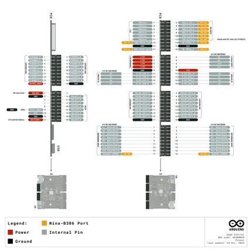](../../../../library/media/6049e9c42fd380be11d4cf123a753ede3e76a105ea69c3640abffda647a78c6f.png)

[Open original reference](../../../../library/media/6049e9c42fd380be11d4cf123a753ede3e76a105ea69c3640abffda647a78c6f.png)

**Credit and rights:** Not established; source attribution retained. Source/manufacturer: Arduino.

[Source 1](https://raw.githubusercontent.com/arduino/docs-content/dab66ecbd6ad52cd742da6c19c5b6330a7f2caae/content/hardware/pro-solutions/solutions-and-kits/edge-control/tutorials/01.user-manual/assets/simple-pinout.png) · [Source 2](https://docs.arduino.cc/hardware/edge-control/) · [Source 3](https://github.com/arduino/docs-content/blob/dab66ecbd6ad52cd742da6c19c5b6330a7f2caae/content/hardware/pro-solutions/solutions-and-kits/edge-control/product.md) · [Source 4](https://github.com/arduino/docs-content/blob/dab66ecbd6ad52cd742da6c19c5b6330a7f2caae/content/hardware/pro-solutions/solutions-and-kits/edge-control/tutorials/01.user-manual/assets/simple-pinout.png)

Official Arduino documentation repository pinned at dab66ecbd6ad52cd742da6c19c5b6330a7f2caae. Match the board model, SKU and revision printed on each source sheet; lifecycle is not inferred from repository folder placement.

SHA-256: `6049e9c42fd380be11d4cf123a753ede3e76a105ea69c3640abffda647a78c6f`

## Official full pinout - page 1

**pinout image** · Reviewed source · PNG

[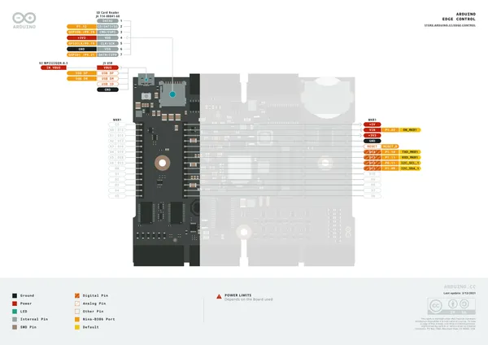](../../../../library/media/23953c699f950d715e6e1175a79c4664026299d3dc2e14c0656495ede91978b5.png)

[Open original reference](../../../../library/media/23953c699f950d715e6e1175a79c4664026299d3dc2e14c0656495ede91978b5.png)

**Credit and rights:** CC BY-SA 4.0 notice printed in the original PDF; preserve attribution and verify scope for publication.. Source/manufacturer: Arduino.

[Source 1](https://raw.githubusercontent.com/arduino/docs-content/dab66ecbd6ad52cd742da6c19c5b6330a7f2caae/content/hardware/pro-solutions/solutions-and-kits/edge-control/downloads/AKX00034-full-pinout.pdf) · [Source 2](https://docs.arduino.cc/hardware/edge-control/) · [Source 3](https://github.com/arduino/docs-content/blob/dab66ecbd6ad52cd742da6c19c5b6330a7f2caae/content/hardware/pro-solutions/solutions-and-kits/edge-control/product.md) · [Source 4](https://github.com/arduino/docs-content/blob/dab66ecbd6ad52cd742da6c19c5b6330a7f2caae/content/hardware/pro-solutions/solutions-and-kits/edge-control/downloads/AKX00034-full-pinout.pdf)

Official Arduino documentation repository pinned at dab66ecbd6ad52cd742da6c19c5b6330a7f2caae. Match the board model, SKU and revision printed on each source sheet; lifecycle is not inferred from repository folder placement. Original PDF page 1 rendered at 220 dpi; no labels changed.

SHA-256: `23953c699f950d715e6e1175a79c4664026299d3dc2e14c0656495ede91978b5`

## Official full pinout - page 2

**pinout image** · Reviewed source · PNG

[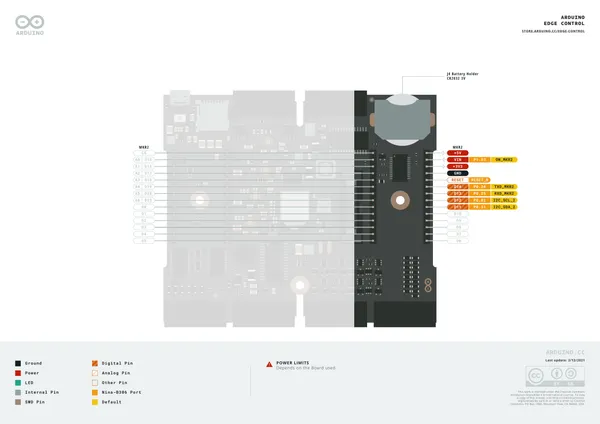](../../../../library/media/a5f1865766c272ca0f6b8ef9905ed71b0e8b56ac220f41288617a6ee289de188.png)

[Open original reference](../../../../library/media/a5f1865766c272ca0f6b8ef9905ed71b0e8b56ac220f41288617a6ee289de188.png)

**Credit and rights:** CC BY-SA 4.0 notice printed in the original PDF; preserve attribution and verify scope for publication.. Source/manufacturer: Arduino.

[Source 1](https://raw.githubusercontent.com/arduino/docs-content/dab66ecbd6ad52cd742da6c19c5b6330a7f2caae/content/hardware/pro-solutions/solutions-and-kits/edge-control/downloads/AKX00034-full-pinout.pdf) · [Source 2](https://docs.arduino.cc/hardware/edge-control/) · [Source 3](https://github.com/arduino/docs-content/blob/dab66ecbd6ad52cd742da6c19c5b6330a7f2caae/content/hardware/pro-solutions/solutions-and-kits/edge-control/product.md) · [Source 4](https://github.com/arduino/docs-content/blob/dab66ecbd6ad52cd742da6c19c5b6330a7f2caae/content/hardware/pro-solutions/solutions-and-kits/edge-control/downloads/AKX00034-full-pinout.pdf)

Official Arduino documentation repository pinned at dab66ecbd6ad52cd742da6c19c5b6330a7f2caae. Match the board model, SKU and revision printed on each source sheet; lifecycle is not inferred from repository folder placement. Original PDF page 2 rendered at 220 dpi; no labels changed.

SHA-256: `a5f1865766c272ca0f6b8ef9905ed71b0e8b56ac220f41288617a6ee289de188`

## Official full pinout - page 3

**pinout image** · Reviewed source · PNG

[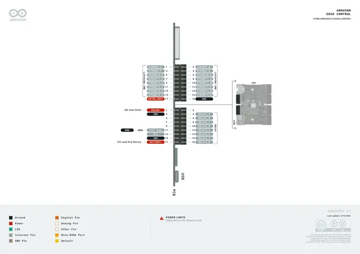](../../../../library/media/b27e61bacb78f1f3a49d7c6ad4b0014bae61d708441c254f750b4b4b007dfd70.png)

[Open original reference](../../../../library/media/b27e61bacb78f1f3a49d7c6ad4b0014bae61d708441c254f750b4b4b007dfd70.png)

**Credit and rights:** CC BY-SA 4.0 notice printed in the original PDF; preserve attribution and verify scope for publication.. Source/manufacturer: Arduino.

[Source 1](https://raw.githubusercontent.com/arduino/docs-content/dab66ecbd6ad52cd742da6c19c5b6330a7f2caae/content/hardware/pro-solutions/solutions-and-kits/edge-control/downloads/AKX00034-full-pinout.pdf) · [Source 2](https://docs.arduino.cc/hardware/edge-control/) · [Source 3](https://github.com/arduino/docs-content/blob/dab66ecbd6ad52cd742da6c19c5b6330a7f2caae/content/hardware/pro-solutions/solutions-and-kits/edge-control/product.md) · [Source 4](https://github.com/arduino/docs-content/blob/dab66ecbd6ad52cd742da6c19c5b6330a7f2caae/content/hardware/pro-solutions/solutions-and-kits/edge-control/downloads/AKX00034-full-pinout.pdf)

Official Arduino documentation repository pinned at dab66ecbd6ad52cd742da6c19c5b6330a7f2caae. Match the board model, SKU and revision printed on each source sheet; lifecycle is not inferred from repository folder placement. Original PDF page 3 rendered at 220 dpi; no labels changed.

SHA-256: `b27e61bacb78f1f3a49d7c6ad4b0014bae61d708441c254f750b4b4b007dfd70`

## Official full pinout - page 4

**pinout image** · Reviewed source · PNG

[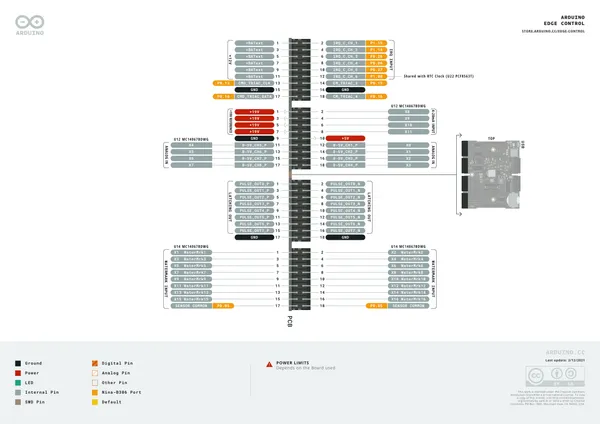](../../../../library/media/23f3b1b92ee985086b8d1628ac7d63341128f5b26b9129f2be1631001a5a48ab.png)

[Open original reference](../../../../library/media/23f3b1b92ee985086b8d1628ac7d63341128f5b26b9129f2be1631001a5a48ab.png)

**Credit and rights:** CC BY-SA 4.0 notice printed in the original PDF; preserve attribution and verify scope for publication.. Source/manufacturer: Arduino.

[Source 1](https://raw.githubusercontent.com/arduino/docs-content/dab66ecbd6ad52cd742da6c19c5b6330a7f2caae/content/hardware/pro-solutions/solutions-and-kits/edge-control/downloads/AKX00034-full-pinout.pdf) · [Source 2](https://docs.arduino.cc/hardware/edge-control/) · [Source 3](https://github.com/arduino/docs-content/blob/dab66ecbd6ad52cd742da6c19c5b6330a7f2caae/content/hardware/pro-solutions/solutions-and-kits/edge-control/product.md) · [Source 4](https://github.com/arduino/docs-content/blob/dab66ecbd6ad52cd742da6c19c5b6330a7f2caae/content/hardware/pro-solutions/solutions-and-kits/edge-control/downloads/AKX00034-full-pinout.pdf)

Official Arduino documentation repository pinned at dab66ecbd6ad52cd742da6c19c5b6330a7f2caae. Match the board model, SKU and revision printed on each source sheet; lifecycle is not inferred from repository folder placement. Original PDF page 4 rendered at 220 dpi; no labels changed.

SHA-256: `23f3b1b92ee985086b8d1628ac7d63341128f5b26b9129f2be1631001a5a48ab`

## Official full pinout - page 5

**pinout image** · Reviewed source · PNG

[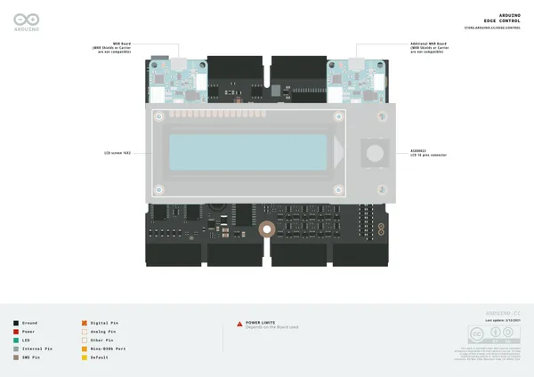](../../../../library/media/abe9d0c1e4e91fe74d99086514243c927acae7371a7f49db79c36e6d1f6c541b.png)

[Open original reference](../../../../library/media/abe9d0c1e4e91fe74d99086514243c927acae7371a7f49db79c36e6d1f6c541b.png)

**Credit and rights:** CC BY-SA 4.0 notice printed in the original PDF; preserve attribution and verify scope for publication.. Source/manufacturer: Arduino.

[Source 1](https://raw.githubusercontent.com/arduino/docs-content/dab66ecbd6ad52cd742da6c19c5b6330a7f2caae/content/hardware/pro-solutions/solutions-and-kits/edge-control/downloads/AKX00034-full-pinout.pdf) · [Source 2](https://docs.arduino.cc/hardware/edge-control/) · [Source 3](https://github.com/arduino/docs-content/blob/dab66ecbd6ad52cd742da6c19c5b6330a7f2caae/content/hardware/pro-solutions/solutions-and-kits/edge-control/product.md) · [Source 4](https://github.com/arduino/docs-content/blob/dab66ecbd6ad52cd742da6c19c5b6330a7f2caae/content/hardware/pro-solutions/solutions-and-kits/edge-control/downloads/AKX00034-full-pinout.pdf)

Official Arduino documentation repository pinned at dab66ecbd6ad52cd742da6c19c5b6330a7f2caae. Match the board model, SKU and revision printed on each source sheet; lifecycle is not inferred from repository folder placement. Original PDF page 5 rendered at 220 dpi; no labels changed.

SHA-256: `abe9d0c1e4e91fe74d99086514243c927acae7371a7f49db79c36e6d1f6c541b`

## Official full pinout - page 6

**pinout image** · Reviewed source · PNG

[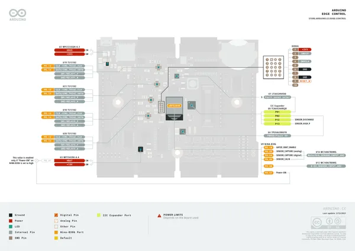](../../../../library/media/d628384cffc8f5c09de2f06dcdf37e06dda76c74732e39f9d6f18d5c255235e1.png)

[Open original reference](../../../../library/media/d628384cffc8f5c09de2f06dcdf37e06dda76c74732e39f9d6f18d5c255235e1.png)

**Credit and rights:** CC BY-SA 4.0 notice printed in the original PDF; preserve attribution and verify scope for publication.. Source/manufacturer: Arduino.

[Source 1](https://raw.githubusercontent.com/arduino/docs-content/dab66ecbd6ad52cd742da6c19c5b6330a7f2caae/content/hardware/pro-solutions/solutions-and-kits/edge-control/downloads/AKX00034-full-pinout.pdf) · [Source 2](https://docs.arduino.cc/hardware/edge-control/) · [Source 3](https://github.com/arduino/docs-content/blob/dab66ecbd6ad52cd742da6c19c5b6330a7f2caae/content/hardware/pro-solutions/solutions-and-kits/edge-control/product.md) · [Source 4](https://github.com/arduino/docs-content/blob/dab66ecbd6ad52cd742da6c19c5b6330a7f2caae/content/hardware/pro-solutions/solutions-and-kits/edge-control/downloads/AKX00034-full-pinout.pdf)

Official Arduino documentation repository pinned at dab66ecbd6ad52cd742da6c19c5b6330a7f2caae. Match the board model, SKU and revision printed on each source sheet; lifecycle is not inferred from repository folder placement. Original PDF page 6 rendered at 220 dpi; no labels changed.

SHA-256: `d628384cffc8f5c09de2f06dcdf37e06dda76c74732e39f9d6f18d5c255235e1`

## Official full pinout - page 7

**GPIO reference image** · Reviewed source · PNG

[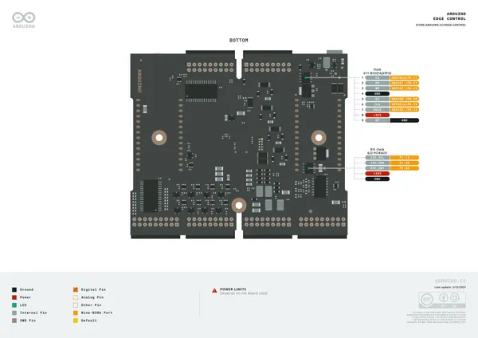](../../../../library/media/61ceb7c1a592982339e5c20cec10446b2ce12bd3ab0f77f32df6ee604420a20c.png)

[Open original reference](../../../../library/media/61ceb7c1a592982339e5c20cec10446b2ce12bd3ab0f77f32df6ee604420a20c.png)

**Credit and rights:** CC BY-SA 4.0 notice printed in the original PDF; preserve attribution and verify scope for publication.. Source/manufacturer: Arduino.

[Source 1](https://raw.githubusercontent.com/arduino/docs-content/dab66ecbd6ad52cd742da6c19c5b6330a7f2caae/content/hardware/pro-solutions/solutions-and-kits/edge-control/downloads/AKX00034-full-pinout.pdf) · [Source 2](https://docs.arduino.cc/hardware/edge-control/) · [Source 3](https://github.com/arduino/docs-content/blob/dab66ecbd6ad52cd742da6c19c5b6330a7f2caae/content/hardware/pro-solutions/solutions-and-kits/edge-control/product.md) · [Source 4](https://github.com/arduino/docs-content/blob/dab66ecbd6ad52cd742da6c19c5b6330a7f2caae/content/hardware/pro-solutions/solutions-and-kits/edge-control/downloads/AKX00034-full-pinout.pdf)

Official Arduino documentation repository pinned at dab66ecbd6ad52cd742da6c19c5b6330a7f2caae. Match the board model, SKU and revision printed on each source sheet; lifecycle is not inferred from repository folder placement. Original PDF page 7 rendered at 220 dpi; no labels changed.

SHA-256: `61ceb7c1a592982339e5c20cec10446b2ce12bd3ab0f77f32df6ee604420a20c`

## Official full pinout - page 8

**GPIO reference image** · Reviewed source · PNG

[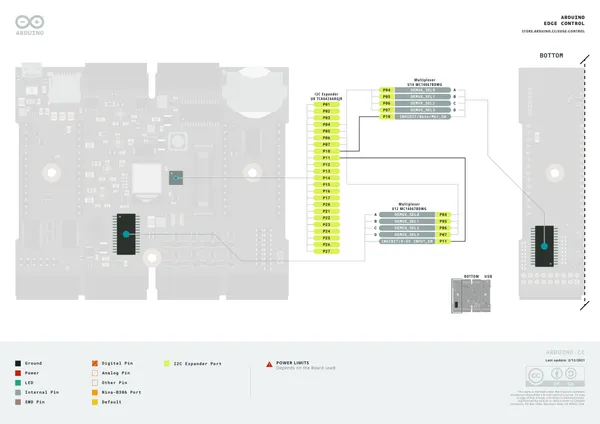](../../../../library/media/a8fe21a4aeb03b99cd1bb203c190494d2a16e34dcd9b8875ea132e36d0efefc1.png)

[Open original reference](../../../../library/media/a8fe21a4aeb03b99cd1bb203c190494d2a16e34dcd9b8875ea132e36d0efefc1.png)

**Credit and rights:** CC BY-SA 4.0 notice printed in the original PDF; preserve attribution and verify scope for publication.. Source/manufacturer: Arduino.

[Source 1](https://raw.githubusercontent.com/arduino/docs-content/dab66ecbd6ad52cd742da6c19c5b6330a7f2caae/content/hardware/pro-solutions/solutions-and-kits/edge-control/downloads/AKX00034-full-pinout.pdf) · [Source 2](https://docs.arduino.cc/hardware/edge-control/) · [Source 3](https://github.com/arduino/docs-content/blob/dab66ecbd6ad52cd742da6c19c5b6330a7f2caae/content/hardware/pro-solutions/solutions-and-kits/edge-control/product.md) · [Source 4](https://github.com/arduino/docs-content/blob/dab66ecbd6ad52cd742da6c19c5b6330a7f2caae/content/hardware/pro-solutions/solutions-and-kits/edge-control/downloads/AKX00034-full-pinout.pdf)

Official Arduino documentation repository pinned at dab66ecbd6ad52cd742da6c19c5b6330a7f2caae. Match the board model, SKU and revision printed on each source sheet; lifecycle is not inferred from repository folder placement. Original PDF page 8 rendered at 220 dpi; no labels changed.

SHA-256: `a8fe21a4aeb03b99cd1bb203c190494d2a16e34dcd9b8875ea132e36d0efefc1`

## Official full pinout - page 9

**GPIO reference image** · Reviewed source · PNG

[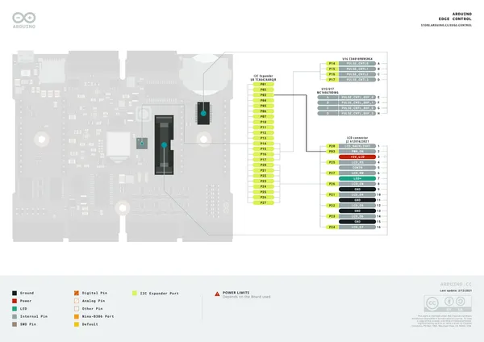](../../../../library/media/e3371c1d7d53a28dfac34a83b668b11da6bc3fd4d717e8195bf7d010e81d0b35.png)

[Open original reference](../../../../library/media/e3371c1d7d53a28dfac34a83b668b11da6bc3fd4d717e8195bf7d010e81d0b35.png)

**Credit and rights:** CC BY-SA 4.0 notice printed in the original PDF; preserve attribution and verify scope for publication.. Source/manufacturer: Arduino.

[Source 1](https://raw.githubusercontent.com/arduino/docs-content/dab66ecbd6ad52cd742da6c19c5b6330a7f2caae/content/hardware/pro-solutions/solutions-and-kits/edge-control/downloads/AKX00034-full-pinout.pdf) · [Source 2](https://docs.arduino.cc/hardware/edge-control/) · [Source 3](https://github.com/arduino/docs-content/blob/dab66ecbd6ad52cd742da6c19c5b6330a7f2caae/content/hardware/pro-solutions/solutions-and-kits/edge-control/product.md) · [Source 4](https://github.com/arduino/docs-content/blob/dab66ecbd6ad52cd742da6c19c5b6330a7f2caae/content/hardware/pro-solutions/solutions-and-kits/edge-control/downloads/AKX00034-full-pinout.pdf)

Official Arduino documentation repository pinned at dab66ecbd6ad52cd742da6c19c5b6330a7f2caae. Match the board model, SKU and revision printed on each source sheet; lifecycle is not inferred from repository folder placement. Original PDF page 9 rendered at 220 dpi; no labels changed.

SHA-256: `e3371c1d7d53a28dfac34a83b668b11da6bc3fd4d717e8195bf7d010e81d0b35`

## Official full pinout - page 10

**GPIO reference image** · Reviewed source · PNG

[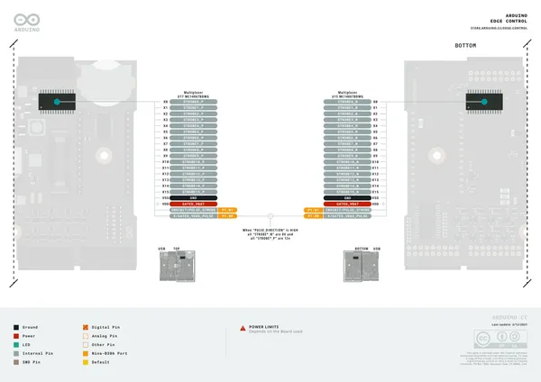](../../../../library/media/05f7f808168d6baf71486cb59d560e3558d0cd14b32c957afb4b172a9b8d0ca7.png)

[Open original reference](../../../../library/media/05f7f808168d6baf71486cb59d560e3558d0cd14b32c957afb4b172a9b8d0ca7.png)

**Credit and rights:** CC BY-SA 4.0 notice printed in the original PDF; preserve attribution and verify scope for publication.. Source/manufacturer: Arduino.

[Source 1](https://raw.githubusercontent.com/arduino/docs-content/dab66ecbd6ad52cd742da6c19c5b6330a7f2caae/content/hardware/pro-solutions/solutions-and-kits/edge-control/downloads/AKX00034-full-pinout.pdf) · [Source 2](https://docs.arduino.cc/hardware/edge-control/) · [Source 3](https://github.com/arduino/docs-content/blob/dab66ecbd6ad52cd742da6c19c5b6330a7f2caae/content/hardware/pro-solutions/solutions-and-kits/edge-control/product.md) · [Source 4](https://github.com/arduino/docs-content/blob/dab66ecbd6ad52cd742da6c19c5b6330a7f2caae/content/hardware/pro-solutions/solutions-and-kits/edge-control/downloads/AKX00034-full-pinout.pdf)

Official Arduino documentation repository pinned at dab66ecbd6ad52cd742da6c19c5b6330a7f2caae. Match the board model, SKU and revision printed on each source sheet; lifecycle is not inferred from repository folder placement. Original PDF page 10 rendered at 220 dpi; no labels changed.

SHA-256: `05f7f808168d6baf71486cb59d560e3558d0cd14b32c957afb4b172a9b8d0ca7`

## Full board pinout PDF

**original reference PDF** · Reviewed source · PDF

[Open original reference](../../../../library/media/260df51179f4270306bf251543c3b9e4b37f9b07354e253be71cb6b2dd4d376e.pdf)

**Credit and rights:** Not established; source attribution retained. Source/manufacturer: Arduino.

[Source 1](https://raw.githubusercontent.com/arduino/docs-content/dab66ecbd6ad52cd742da6c19c5b6330a7f2caae/content/hardware/pro-solutions/solutions-and-kits/edge-control/downloads/AKX00034-full-pinout.pdf) · [Source 2](https://docs.arduino.cc/hardware/edge-control/) · [Source 3](https://github.com/arduino/docs-content/blob/dab66ecbd6ad52cd742da6c19c5b6330a7f2caae/content/hardware/pro-solutions/solutions-and-kits/edge-control/product.md) · [Source 4](https://github.com/arduino/docs-content/blob/dab66ecbd6ad52cd742da6c19c5b6330a7f2caae/content/hardware/pro-solutions/solutions-and-kits/edge-control/downloads/AKX00034-full-pinout.pdf)

Official Arduino documentation repository pinned at dab66ecbd6ad52cd742da6c19c5b6330a7f2caae. Match the board model, SKU and revision printed on each source sheet; lifecycle is not inferred from repository folder placement.

SHA-256: `260df51179f4270306bf251543c3b9e4b37f9b07354e253be71cb6b2dd4d376e`

Pin assignments have not been independently electrically verified. Check board revision before wiring.
