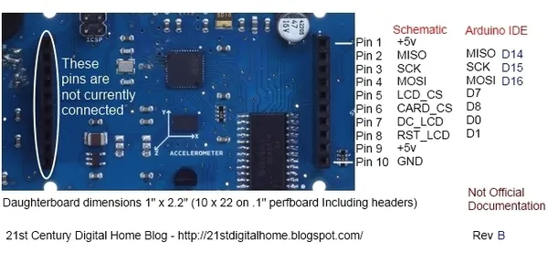
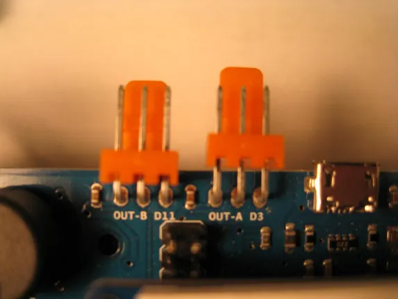
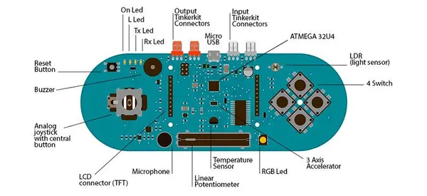

# Esplora

**Arduino** · Other

Revision: Multiple source/revision records; see individual assets  
Coverage: Partial pinout collected; full reference still needed

[Browse all manufacturers](../../../../BROWSE.md) · [Desktop app](https://github.com/valleytechsolutions/black-wire-desktop)

## Expansion header reference

**pinout image** · Reviewed source · JPG

[Open original reference](../../../../library/media/64bbb00619d05cab669cae0d2955f5c5782eb8c49cdbdf88eeb9be79a6be8e9a.jpg)

**Credit and rights:** Not established; source attribution retained. Source/manufacturer: Arduino.

[Source 1](https://blogger.googleusercontent.com/img/b/R29vZ2xl/AVvXsEhMxqHjI4KC_idJti7xVRkfmDefEyY60iTPq28Uip88Gg8klndEWr0Hebql8MDz6CWVgtad9lrc2U0UgfRBqaeJgDtgrIEBSdPJ0kRhZsDKZLxcu-y4zg_FlN7j3XfCENCZk0Boz4oDe_A/s1600/EsploraPinsRevB.jpg) · [Source 2](https://21stdigitalhome.blogspot.com/2012/12/esplora-expansion-header-pinouts.html)

Original author TheKitty (The 21st Century Digital Home); supplementary partial physical connector map. Not independently electrically verified.

**Partial diagram. Confirm missing pins against the exact board documentation.**

SHA-256: `64bbb00619d05cab669cae0d2955f5c5782eb8c49cdbdf88eeb9be79a6be8e9a`

## TinkerKit output connector reference

**board labeling image** · Reviewed source · JPG

[Open original reference](../../../../library/media/7f57bfe4831224a2140da95f94741c956c7d77daa67142664bc29368d630c545.jpg)

**Credit and rights:** Not established; source attribution retained. Source/manufacturer: Arduino.

[Source 1](https://blogger.googleusercontent.com/img/b/R29vZ2xl/AVvXsEguc2RvaQJ6NE3dNpnn63GizLJNlCx_EFvlriPWB_A1nNmcVKnJxPNlExQHAeSo_pdZ0BGWL4cCR8qf43vcoRA3iIedO15MguRdzXjZngGVgcOUlGpy-kODqz_xRSxNSIJaKTMO87jHNuo/s1600/IMG_1426.JPG) · [Source 2](https://21stdigitalhome.blogspot.com/2013/01/arduino-esplora-tinkerkit-outputs.html)

Original author TheKitty (The 21st Century Digital Home); supplementary partial physical connector map. Not independently electrically verified.

**Partial diagram. Confirm missing pins against the exact board documentation.**

SHA-256: `7f57bfe4831224a2140da95f94741c956c7d77daa67142664bc29368d630c545`

## 8209014766_1b5a58e3c2_c

**board labeling image** · Reviewed source · JPG

[Open original reference](../../../../library/media/68cc7d23eb88815181a530fbac55a98fae5607be60e10cb869e4a3c8d5059032.jpg)

**Credit and rights:** Not established; source attribution retained. Source/manufacturer: Arduino.

[Source 1](https://raw.githubusercontent.com/arduino/docs-content/dab66ecbd6ad52cd742da6c19c5b6330a7f2caae/content/retired/01.boards/arduino-esplora/assets/8209014766_1b5a58e3c2_c.jpg) · [Source 2](https://docs.arduino.cc/retired/boards/arduino-esplora/) · [Source 3](https://github.com/arduino/docs-content/blob/dab66ecbd6ad52cd742da6c19c5b6330a7f2caae/content/retired/01.boards/arduino-esplora/content.md)

Official Arduino documentation repository pinned at dab66ecbd6ad52cd742da6c19c5b6330a7f2caae. Match the board model, SKU and revision printed on each source sheet; lifecycle is not inferred from repository folder placement.

SHA-256: `68cc7d23eb88815181a530fbac55a98fae5607be60e10cb869e4a3c8d5059032`

Pin assignments have not been independently electrically verified. Check board revision before wiring.
