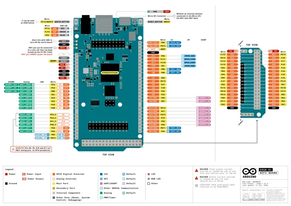
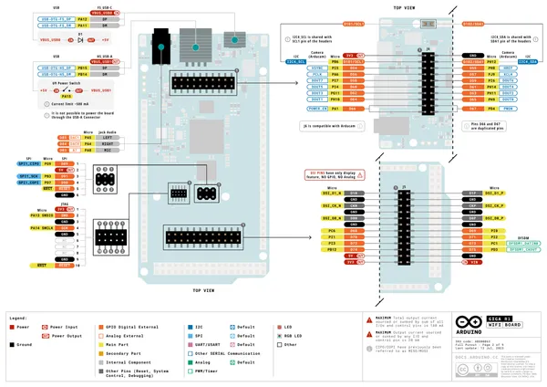
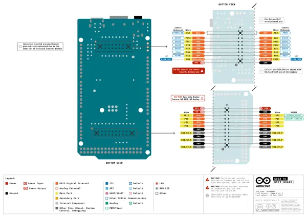
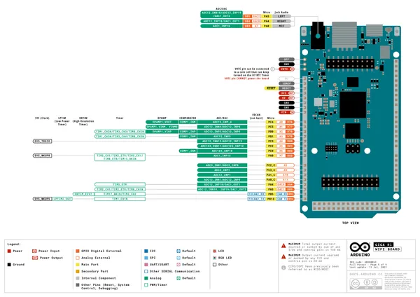
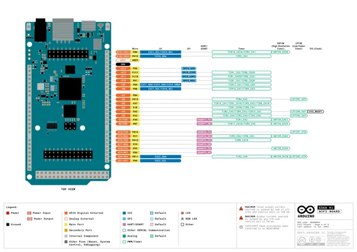
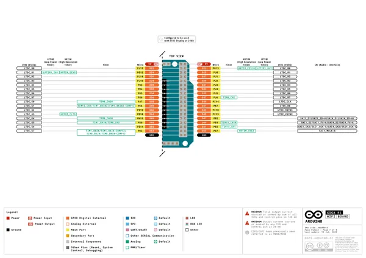
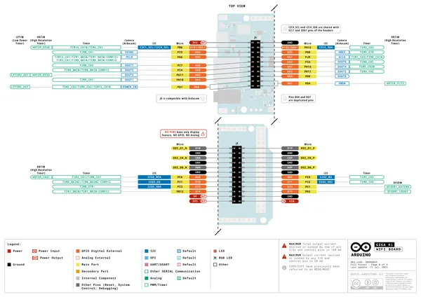
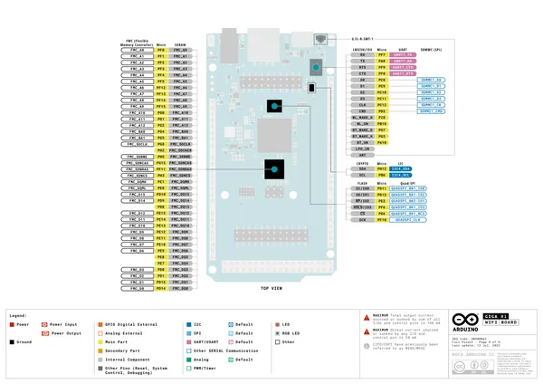

# GIGA R1 WiFi

**Arduino** · Other

Revision: Not identified  
Coverage: Pinout image collected

[Browse all manufacturers](../../../../BROWSE.md) · [Desktop app](https://github.com/valleytechsolutions/black-wire-desktop)

## Official full pinout - page 1

**pinout image** · Reviewed source · PNG

[Open original reference](../../../../library/media/9c3a233a2196800ac64e47141c4179bfb2b764a5b74dbcff0f73aab4926f469e.png)

**Credit and rights:** CC BY-SA 4.0 notice printed in the original PDF; preserve attribution and verify scope for publication.. Source/manufacturer: Arduino.

[Source 1](https://raw.githubusercontent.com/arduino/docs-content/dab66ecbd6ad52cd742da6c19c5b6330a7f2caae/content/hardware/mega/boards/giga-r1-wifi/downloads/ABX00063-full-pinout.pdf) · [Source 2](https://docs.arduino.cc/hardware/giga-r1-wifi/) · [Source 3](https://github.com/arduino/docs-content/blob/dab66ecbd6ad52cd742da6c19c5b6330a7f2caae/content/hardware/mega/boards/giga-r1-wifi/product.md) · [Source 4](https://github.com/arduino/docs-content/blob/dab66ecbd6ad52cd742da6c19c5b6330a7f2caae/content/hardware/mega/boards/giga-r1-wifi/downloads/ABX00063-full-pinout.pdf)

Official Arduino documentation repository pinned at dab66ecbd6ad52cd742da6c19c5b6330a7f2caae. Match the board model, SKU and revision printed on each source sheet; lifecycle is not inferred from repository folder placement. Original PDF page 1 rendered at 220 dpi; no labels changed.

SHA-256: `9c3a233a2196800ac64e47141c4179bfb2b764a5b74dbcff0f73aab4926f469e`

## Official full pinout - page 2

**pinout image** · Reviewed source · PNG

[Open original reference](../../../../library/media/a905026c2b02d658f16d853c29f137946552f98bf58dd722cfc51671bf608a00.png)

**Credit and rights:** CC BY-SA 4.0 notice printed in the original PDF; preserve attribution and verify scope for publication.. Source/manufacturer: Arduino.

[Source 1](https://raw.githubusercontent.com/arduino/docs-content/dab66ecbd6ad52cd742da6c19c5b6330a7f2caae/content/hardware/mega/boards/giga-r1-wifi/downloads/ABX00063-full-pinout.pdf) · [Source 2](https://docs.arduino.cc/hardware/giga-r1-wifi/) · [Source 3](https://github.com/arduino/docs-content/blob/dab66ecbd6ad52cd742da6c19c5b6330a7f2caae/content/hardware/mega/boards/giga-r1-wifi/product.md) · [Source 4](https://github.com/arduino/docs-content/blob/dab66ecbd6ad52cd742da6c19c5b6330a7f2caae/content/hardware/mega/boards/giga-r1-wifi/downloads/ABX00063-full-pinout.pdf)

Official Arduino documentation repository pinned at dab66ecbd6ad52cd742da6c19c5b6330a7f2caae. Match the board model, SKU and revision printed on each source sheet; lifecycle is not inferred from repository folder placement. Original PDF page 2 rendered at 220 dpi; no labels changed.

SHA-256: `a905026c2b02d658f16d853c29f137946552f98bf58dd722cfc51671bf608a00`

## Official full pinout - page 3

**pinout image** · Reviewed source · PNG

[Open original reference](../../../../library/media/e2a028bbba83b1ae7153e005f7d437eab06f929d944e25499a7aabffdf44c0f9.png)

**Credit and rights:** CC BY-SA 4.0 notice printed in the original PDF; preserve attribution and verify scope for publication.. Source/manufacturer: Arduino.

[Source 1](https://raw.githubusercontent.com/arduino/docs-content/dab66ecbd6ad52cd742da6c19c5b6330a7f2caae/content/hardware/mega/boards/giga-r1-wifi/downloads/ABX00063-full-pinout.pdf) · [Source 2](https://docs.arduino.cc/hardware/giga-r1-wifi/) · [Source 3](https://github.com/arduino/docs-content/blob/dab66ecbd6ad52cd742da6c19c5b6330a7f2caae/content/hardware/mega/boards/giga-r1-wifi/product.md) · [Source 4](https://github.com/arduino/docs-content/blob/dab66ecbd6ad52cd742da6c19c5b6330a7f2caae/content/hardware/mega/boards/giga-r1-wifi/downloads/ABX00063-full-pinout.pdf)

Official Arduino documentation repository pinned at dab66ecbd6ad52cd742da6c19c5b6330a7f2caae. Match the board model, SKU and revision printed on each source sheet; lifecycle is not inferred from repository folder placement. Original PDF page 3 rendered at 220 dpi; no labels changed.

SHA-256: `e2a028bbba83b1ae7153e005f7d437eab06f929d944e25499a7aabffdf44c0f9`

## Official full pinout - page 5

**pinout image** · Reviewed source · PNG

[Open original reference](../../../../library/media/ccc1c5af51350fb11c2ba0db12b40ff480cdd588faeb345def359923d1a2d3cf.png)

**Credit and rights:** CC BY-SA 4.0 notice printed in the original PDF; preserve attribution and verify scope for publication.. Source/manufacturer: Arduino.

[Source 1](https://raw.githubusercontent.com/arduino/docs-content/dab66ecbd6ad52cd742da6c19c5b6330a7f2caae/content/hardware/mega/boards/giga-r1-wifi/downloads/ABX00063-full-pinout.pdf) · [Source 2](https://docs.arduino.cc/hardware/giga-r1-wifi/) · [Source 3](https://github.com/arduino/docs-content/blob/dab66ecbd6ad52cd742da6c19c5b6330a7f2caae/content/hardware/mega/boards/giga-r1-wifi/product.md) · [Source 4](https://github.com/arduino/docs-content/blob/dab66ecbd6ad52cd742da6c19c5b6330a7f2caae/content/hardware/mega/boards/giga-r1-wifi/downloads/ABX00063-full-pinout.pdf)

Official Arduino documentation repository pinned at dab66ecbd6ad52cd742da6c19c5b6330a7f2caae. Match the board model, SKU and revision printed on each source sheet; lifecycle is not inferred from repository folder placement. Original PDF page 5 rendered at 220 dpi; no labels changed.

SHA-256: `ccc1c5af51350fb11c2ba0db12b40ff480cdd588faeb345def359923d1a2d3cf`

## Official full pinout - page 6

**pinout image** · Reviewed source · PNG

[Open original reference](../../../../library/media/1fa07bb1a76525f50ce5c631272de835a5be4c956e3b01c1c57fb546e76a1561.png)

**Credit and rights:** CC BY-SA 4.0 notice printed in the original PDF; preserve attribution and verify scope for publication.. Source/manufacturer: Arduino.

[Source 1](https://raw.githubusercontent.com/arduino/docs-content/dab66ecbd6ad52cd742da6c19c5b6330a7f2caae/content/hardware/mega/boards/giga-r1-wifi/downloads/ABX00063-full-pinout.pdf) · [Source 2](https://docs.arduino.cc/hardware/giga-r1-wifi/) · [Source 3](https://github.com/arduino/docs-content/blob/dab66ecbd6ad52cd742da6c19c5b6330a7f2caae/content/hardware/mega/boards/giga-r1-wifi/product.md) · [Source 4](https://github.com/arduino/docs-content/blob/dab66ecbd6ad52cd742da6c19c5b6330a7f2caae/content/hardware/mega/boards/giga-r1-wifi/downloads/ABX00063-full-pinout.pdf)

Official Arduino documentation repository pinned at dab66ecbd6ad52cd742da6c19c5b6330a7f2caae. Match the board model, SKU and revision printed on each source sheet; lifecycle is not inferred from repository folder placement. Original PDF page 6 rendered at 220 dpi; no labels changed.

SHA-256: `1fa07bb1a76525f50ce5c631272de835a5be4c956e3b01c1c57fb546e76a1561`

## Official full pinout - page 7

**pinout image** · Reviewed source · PNG

[Open original reference](../../../../library/media/32c292fe9568d9bc47038f55d873c295445649982a89ad6ec08e45e1b318e1e8.png)

**Credit and rights:** CC BY-SA 4.0 notice printed in the original PDF; preserve attribution and verify scope for publication.. Source/manufacturer: Arduino.

[Source 1](https://raw.githubusercontent.com/arduino/docs-content/dab66ecbd6ad52cd742da6c19c5b6330a7f2caae/content/hardware/mega/boards/giga-r1-wifi/downloads/ABX00063-full-pinout.pdf) · [Source 2](https://docs.arduino.cc/hardware/giga-r1-wifi/) · [Source 3](https://github.com/arduino/docs-content/blob/dab66ecbd6ad52cd742da6c19c5b6330a7f2caae/content/hardware/mega/boards/giga-r1-wifi/product.md) · [Source 4](https://github.com/arduino/docs-content/blob/dab66ecbd6ad52cd742da6c19c5b6330a7f2caae/content/hardware/mega/boards/giga-r1-wifi/downloads/ABX00063-full-pinout.pdf)

Official Arduino documentation repository pinned at dab66ecbd6ad52cd742da6c19c5b6330a7f2caae. Match the board model, SKU and revision printed on each source sheet; lifecycle is not inferred from repository folder placement. Original PDF page 7 rendered at 220 dpi; no labels changed.

SHA-256: `32c292fe9568d9bc47038f55d873c295445649982a89ad6ec08e45e1b318e1e8`

## Official full pinout - page 8

**pinout image** · Reviewed source · PNG

[Open original reference](../../../../library/media/f5966c465e8afb7ebee9fa3fbb2babcd3a09b0dd97e426a0daf87f21365d0d25.png)

**Credit and rights:** CC BY-SA 4.0 notice printed in the original PDF; preserve attribution and verify scope for publication.. Source/manufacturer: Arduino.

[Source 1](https://raw.githubusercontent.com/arduino/docs-content/dab66ecbd6ad52cd742da6c19c5b6330a7f2caae/content/hardware/mega/boards/giga-r1-wifi/downloads/ABX00063-full-pinout.pdf) · [Source 2](https://docs.arduino.cc/hardware/giga-r1-wifi/) · [Source 3](https://github.com/arduino/docs-content/blob/dab66ecbd6ad52cd742da6c19c5b6330a7f2caae/content/hardware/mega/boards/giga-r1-wifi/product.md) · [Source 4](https://github.com/arduino/docs-content/blob/dab66ecbd6ad52cd742da6c19c5b6330a7f2caae/content/hardware/mega/boards/giga-r1-wifi/downloads/ABX00063-full-pinout.pdf)

Official Arduino documentation repository pinned at dab66ecbd6ad52cd742da6c19c5b6330a7f2caae. Match the board model, SKU and revision printed on each source sheet; lifecycle is not inferred from repository folder placement. Original PDF page 8 rendered at 220 dpi; no labels changed.

SHA-256: `f5966c465e8afb7ebee9fa3fbb2babcd3a09b0dd97e426a0daf87f21365d0d25`

## Official full pinout - page 9

**pinout image** · Reviewed source · PNG

[Open original reference](../../../../library/media/2d3e072bed93c2b1970b10b73433ee89887031c2fa3e9f7cf114d134c6086cda.png)

**Credit and rights:** CC BY-SA 4.0 notice printed in the original PDF; preserve attribution and verify scope for publication.. Source/manufacturer: Arduino.

[Source 1](https://raw.githubusercontent.com/arduino/docs-content/dab66ecbd6ad52cd742da6c19c5b6330a7f2caae/content/hardware/mega/boards/giga-r1-wifi/downloads/ABX00063-full-pinout.pdf) · [Source 2](https://docs.arduino.cc/hardware/giga-r1-wifi/) · [Source 3](https://github.com/arduino/docs-content/blob/dab66ecbd6ad52cd742da6c19c5b6330a7f2caae/content/hardware/mega/boards/giga-r1-wifi/product.md) · [Source 4](https://github.com/arduino/docs-content/blob/dab66ecbd6ad52cd742da6c19c5b6330a7f2caae/content/hardware/mega/boards/giga-r1-wifi/downloads/ABX00063-full-pinout.pdf)

Official Arduino documentation repository pinned at dab66ecbd6ad52cd742da6c19c5b6330a7f2caae. Match the board model, SKU and revision printed on each source sheet; lifecycle is not inferred from repository folder placement. Original PDF page 9 rendered at 220 dpi; no labels changed.

SHA-256: `2d3e072bed93c2b1970b10b73433ee89887031c2fa3e9f7cf114d134c6086cda`

## Full board pinout PDF

**original reference PDF** · Reviewed source · PDF

[Open original reference](../../../../library/media/8addb3c21912216de663da5ab2a4c0a4bf60e3aa0b8be587070d1316ebe2dc1d.pdf)

**Credit and rights:** Not established; source attribution retained. Source/manufacturer: Arduino.

[Source 1](https://raw.githubusercontent.com/arduino/docs-content/dab66ecbd6ad52cd742da6c19c5b6330a7f2caae/content/hardware/mega/boards/giga-r1-wifi/downloads/ABX00063-full-pinout.pdf) · [Source 2](https://docs.arduino.cc/hardware/giga-r1-wifi/) · [Source 3](https://github.com/arduino/docs-content/blob/dab66ecbd6ad52cd742da6c19c5b6330a7f2caae/content/hardware/mega/boards/giga-r1-wifi/product.md) · [Source 4](https://github.com/arduino/docs-content/blob/dab66ecbd6ad52cd742da6c19c5b6330a7f2caae/content/hardware/mega/boards/giga-r1-wifi/downloads/ABX00063-full-pinout.pdf)

Official Arduino documentation repository pinned at dab66ecbd6ad52cd742da6c19c5b6330a7f2caae. Match the board model, SKU and revision printed on each source sheet; lifecycle is not inferred from repository folder placement.

SHA-256: `8addb3c21912216de663da5ab2a4c0a4bf60e3aa0b8be587070d1316ebe2dc1d`

Pin assignments have not been independently electrically verified. Check board revision before wiring.
