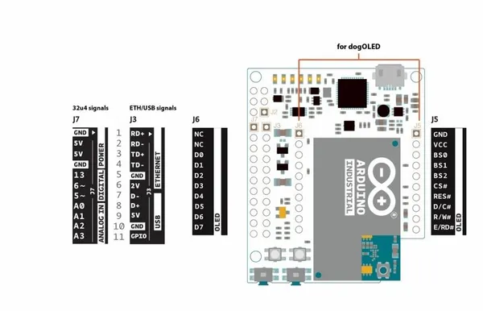
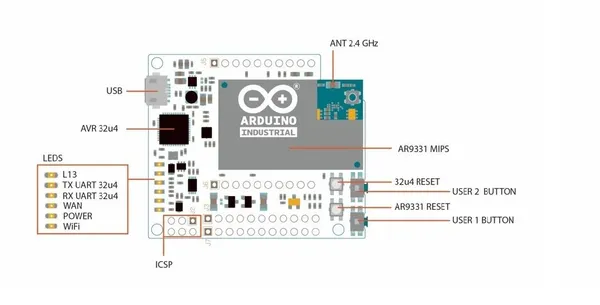

# Industrial 101

**Arduino** · Other

Revision: Not identified  
Coverage: Pinout image collected

[Browse all manufacturers](../../../../BROWSE.md) · [Desktop app](https://github.com/valleytechsolutions/black-wire-desktop)

## 2-pinout_industrial101_

**pinout image** · Reviewed source · JPG

[Open original reference](../../../../library/media/aac7241e503b766d7b6657b55ee30bb67f418b93dadc18a0d6f47ab778ffe40e.jpg)

**Credit and rights:** Not established; source attribution retained. Source/manufacturer: Arduino.

[Source 1](https://raw.githubusercontent.com/arduino/docs-content/dab66ecbd6ad52cd742da6c19c5b6330a7f2caae/content/retired/01.boards/arduino-industrial-101/assets/2-pinout_industrial101_.jpg) · [Source 2](https://docs.arduino.cc/retired/boards/arduino-industrial-101/) · [Source 3](https://github.com/arduino/docs-content/blob/dab66ecbd6ad52cd742da6c19c5b6330a7f2caae/content/retired/01.boards/arduino-industrial-101/content.md) · [Source 4](https://github.com/arduino/docs-content/blob/dab66ecbd6ad52cd742da6c19c5b6330a7f2caae/content/retired/01.boards/arduino-industrial-101/assets/2-pinout_industrial101_.jpg)

Official Arduino documentation repository pinned at dab66ecbd6ad52cd742da6c19c5b6330a7f2caae. Match the board model, SKU and revision printed on each source sheet; lifecycle is not inferred from repository folder placement.

SHA-256: `aac7241e503b766d7b6657b55ee30bb67f418b93dadc18a0d6f47ab778ffe40e`

## 1-pinout_industrial101_

**board labeling image** · Reviewed source · JPG

[Open original reference](../../../../library/media/27154361ab2a0df3a9f31740cb740353313fe8ce369ea12b2ea829f77e8fd562.jpg)

**Credit and rights:** Not established; source attribution retained. Source/manufacturer: Arduino.

[Source 1](https://raw.githubusercontent.com/arduino/docs-content/dab66ecbd6ad52cd742da6c19c5b6330a7f2caae/content/retired/01.boards/arduino-industrial-101/assets/1-pinout_industrial101_.jpg) · [Source 2](https://docs.arduino.cc/retired/boards/arduino-industrial-101/) · [Source 3](https://github.com/arduino/docs-content/blob/dab66ecbd6ad52cd742da6c19c5b6330a7f2caae/content/retired/01.boards/arduino-industrial-101/content.md) · [Source 4](https://github.com/arduino/docs-content/blob/dab66ecbd6ad52cd742da6c19c5b6330a7f2caae/content/retired/01.boards/arduino-industrial-101/assets/1-pinout_industrial101_.jpg)

Official Arduino documentation repository pinned at dab66ecbd6ad52cd742da6c19c5b6330a7f2caae. Match the board model, SKU and revision printed on each source sheet; lifecycle is not inferred from repository folder placement.

SHA-256: `27154361ab2a0df3a9f31740cb740353313fe8ce369ea12b2ea829f77e8fd562`

Pin assignments have not been independently electrically verified. Check board revision before wiring.
