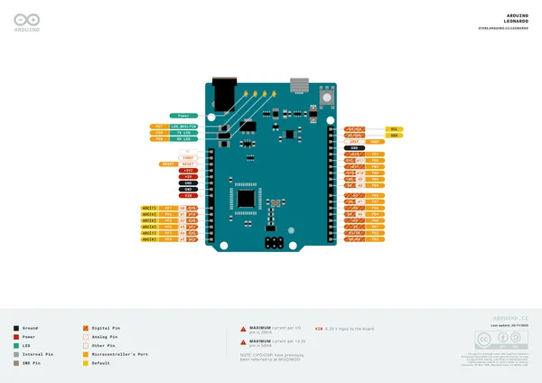
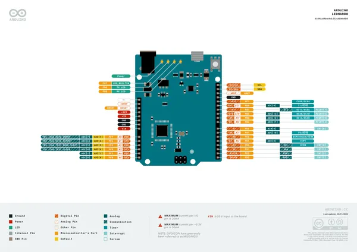
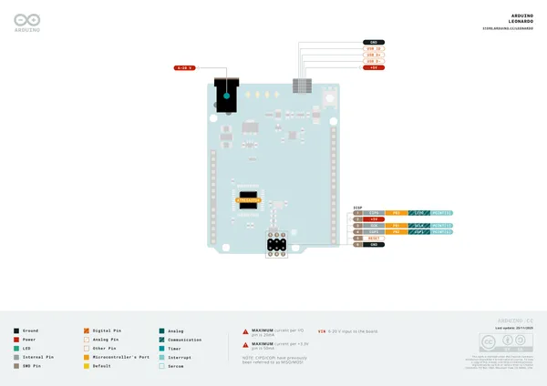

# Leonardo

**Arduino** · Other

Revision: Not identified  
Coverage: Pinout image collected

[Browse all manufacturers](../../../../BROWSE.md) · [Desktop app](https://github.com/valleytechsolutions/black-wire-desktop)

## Official full pinout - page 1

**pinout image** · Reviewed source · PNG

[Open original reference](../../../../library/media/0ad6a011cba8a84262de0bfd01ca02b6b8897a6835ad3041fea840e579efcd9d.png)

**Credit and rights:** CC BY-SA 4.0 notice printed in the original PDF; preserve attribution and verify scope for publication.. Source/manufacturer: Arduino.

[Source 1](https://raw.githubusercontent.com/arduino/docs-content/dab66ecbd6ad52cd742da6c19c5b6330a7f2caae/content/hardware/hero/boards/leonardo/downloads/A000057-full-pinout.pdf) · [Source 2](https://docs.arduino.cc/hardware/leonardo/) · [Source 3](https://github.com/arduino/docs-content/blob/dab66ecbd6ad52cd742da6c19c5b6330a7f2caae/content/hardware/hero/boards/leonardo/product.md) · [Source 4](https://github.com/arduino/docs-content/blob/dab66ecbd6ad52cd742da6c19c5b6330a7f2caae/content/hardware/hero/boards/leonardo/downloads/A000057-full-pinout.pdf)

Official Arduino documentation repository pinned at dab66ecbd6ad52cd742da6c19c5b6330a7f2caae. Match the board model, SKU and revision printed on each source sheet; lifecycle is not inferred from repository folder placement. Original PDF page 1 rendered at 220 dpi; no labels changed.

SHA-256: `0ad6a011cba8a84262de0bfd01ca02b6b8897a6835ad3041fea840e579efcd9d`

## Official full pinout - page 2

**pinout image** · Reviewed source · PNG

[Open original reference](../../../../library/media/3e0498ead803515b8c5eff76a3438d8c1b5e17750fd62e2080ab572d930ef4fd.png)

**Credit and rights:** CC BY-SA 4.0 notice printed in the original PDF; preserve attribution and verify scope for publication.. Source/manufacturer: Arduino.

[Source 1](https://raw.githubusercontent.com/arduino/docs-content/dab66ecbd6ad52cd742da6c19c5b6330a7f2caae/content/hardware/hero/boards/leonardo/downloads/A000057-full-pinout.pdf) · [Source 2](https://docs.arduino.cc/hardware/leonardo/) · [Source 3](https://github.com/arduino/docs-content/blob/dab66ecbd6ad52cd742da6c19c5b6330a7f2caae/content/hardware/hero/boards/leonardo/product.md) · [Source 4](https://github.com/arduino/docs-content/blob/dab66ecbd6ad52cd742da6c19c5b6330a7f2caae/content/hardware/hero/boards/leonardo/downloads/A000057-full-pinout.pdf)

Official Arduino documentation repository pinned at dab66ecbd6ad52cd742da6c19c5b6330a7f2caae. Match the board model, SKU and revision printed on each source sheet; lifecycle is not inferred from repository folder placement. Original PDF page 2 rendered at 220 dpi; no labels changed.

SHA-256: `3e0498ead803515b8c5eff76a3438d8c1b5e17750fd62e2080ab572d930ef4fd`

## Official full pinout - page 3

**pinout image** · Reviewed source · PNG

[Open original reference](../../../../library/media/14769e5db7dea8eccfe5d92c155c61005e3c1556a825f3903df5184420f2d86b.png)

**Credit and rights:** CC BY-SA 4.0 notice printed in the original PDF; preserve attribution and verify scope for publication.. Source/manufacturer: Arduino.

[Source 1](https://raw.githubusercontent.com/arduino/docs-content/dab66ecbd6ad52cd742da6c19c5b6330a7f2caae/content/hardware/hero/boards/leonardo/downloads/A000057-full-pinout.pdf) · [Source 2](https://docs.arduino.cc/hardware/leonardo/) · [Source 3](https://github.com/arduino/docs-content/blob/dab66ecbd6ad52cd742da6c19c5b6330a7f2caae/content/hardware/hero/boards/leonardo/product.md) · [Source 4](https://github.com/arduino/docs-content/blob/dab66ecbd6ad52cd742da6c19c5b6330a7f2caae/content/hardware/hero/boards/leonardo/downloads/A000057-full-pinout.pdf)

Official Arduino documentation repository pinned at dab66ecbd6ad52cd742da6c19c5b6330a7f2caae. Match the board model, SKU and revision printed on each source sheet; lifecycle is not inferred from repository folder placement. Original PDF page 3 rendered at 220 dpi; no labels changed.

SHA-256: `14769e5db7dea8eccfe5d92c155c61005e3c1556a825f3903df5184420f2d86b`

## Full board pinout PDF

**original reference PDF** · Reviewed source · PDF

[Open original reference](../../../../library/media/a7bf8c0087aa44cf7c3b0e958f10389340b6c7b3425ca4047aa1e42d9818821e.pdf)

**Credit and rights:** Not established; source attribution retained. Source/manufacturer: Arduino.

[Source 1](https://raw.githubusercontent.com/arduino/docs-content/dab66ecbd6ad52cd742da6c19c5b6330a7f2caae/content/hardware/hero/boards/leonardo/downloads/A000057-full-pinout.pdf) · [Source 2](https://docs.arduino.cc/hardware/leonardo/) · [Source 3](https://github.com/arduino/docs-content/blob/dab66ecbd6ad52cd742da6c19c5b6330a7f2caae/content/hardware/hero/boards/leonardo/product.md) · [Source 4](https://github.com/arduino/docs-content/blob/dab66ecbd6ad52cd742da6c19c5b6330a7f2caae/content/hardware/hero/boards/leonardo/downloads/A000057-full-pinout.pdf)

Official Arduino documentation repository pinned at dab66ecbd6ad52cd742da6c19c5b6330a7f2caae. Match the board model, SKU and revision printed on each source sheet; lifecycle is not inferred from repository folder placement.

SHA-256: `a7bf8c0087aa44cf7c3b0e958f10389340b6c7b3425ca4047aa1e42d9818821e`

Pin assignments have not been independently electrically verified. Check board revision before wiring.
