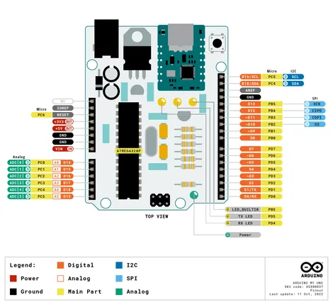
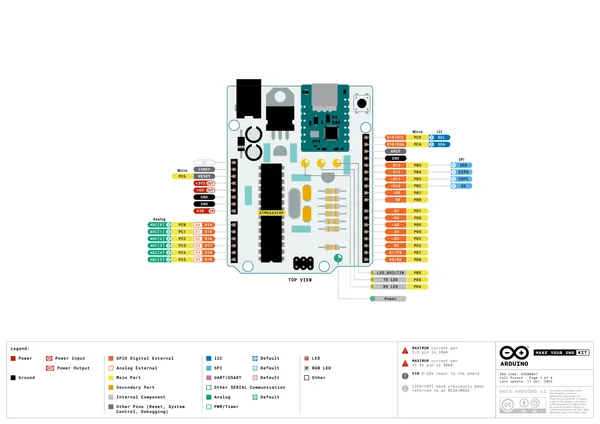
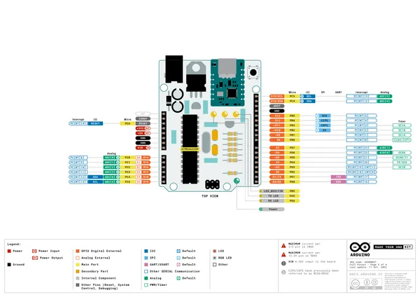
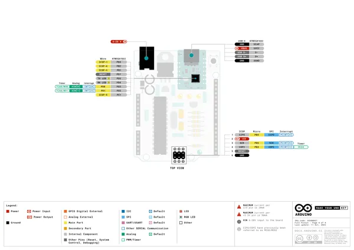

# Make Your UNO Kit

**Arduino** · Other

Revision: Not identified  
Coverage: Pinout image collected

[Browse all manufacturers](../../../../BROWSE.md) · [Desktop app](https://github.com/valleytechsolutions/black-wire-desktop)

## pinout

**pinout image** · Reviewed source · PNG

[Open original reference](../../../../library/media/295f0836c73b8e24be6ea1c340487a75b0fdef5c62599653dcb05945dae6390a.png)

**Credit and rights:** Not established; source attribution retained. Source/manufacturer: Arduino.

[Source 1](https://raw.githubusercontent.com/arduino/docs-content/dab66ecbd6ad52cd742da6c19c5b6330a7f2caae/content/hardware/kits/maker/make-your-uno-kit/datasheet/assets/pinout.png) · [Source 2](https://docs.arduino.cc/hardware/make-your-uno-kit/) · [Source 3](https://github.com/arduino/docs-content/blob/dab66ecbd6ad52cd742da6c19c5b6330a7f2caae/content/hardware/kits/maker/make-your-uno-kit/product.md) · [Source 4](https://github.com/arduino/docs-content/blob/dab66ecbd6ad52cd742da6c19c5b6330a7f2caae/content/hardware/kits/maker/make-your-uno-kit/datasheet/assets/pinout.png)

Official Arduino documentation repository pinned at dab66ecbd6ad52cd742da6c19c5b6330a7f2caae. Match the board model, SKU and revision printed on each source sheet; lifecycle is not inferred from repository folder placement.

SHA-256: `295f0836c73b8e24be6ea1c340487a75b0fdef5c62599653dcb05945dae6390a`

## Official full pinout - page 1

**pinout image** · Reviewed source · PNG

[Open original reference](../../../../library/media/ad49b4e5ba43f3960e000cebfa725efd6ab6f0b496e5bf3f1c3bfc6993a09da5.png)

**Credit and rights:** CC BY-SA 4.0 notice printed in the original PDF; preserve attribution and verify scope for publication.. Source/manufacturer: Arduino.

[Source 1](https://raw.githubusercontent.com/arduino/docs-content/dab66ecbd6ad52cd742da6c19c5b6330a7f2caae/content/hardware/kits/maker/make-your-uno-kit/downloads/ASX00037-full-pinout.pdf) · [Source 2](https://docs.arduino.cc/hardware/make-your-uno-kit/) · [Source 3](https://github.com/arduino/docs-content/blob/dab66ecbd6ad52cd742da6c19c5b6330a7f2caae/content/hardware/kits/maker/make-your-uno-kit/product.md) · [Source 4](https://github.com/arduino/docs-content/blob/dab66ecbd6ad52cd742da6c19c5b6330a7f2caae/content/hardware/kits/maker/make-your-uno-kit/downloads/ASX00037-full-pinout.pdf)

Official Arduino documentation repository pinned at dab66ecbd6ad52cd742da6c19c5b6330a7f2caae. Match the board model, SKU and revision printed on each source sheet; lifecycle is not inferred from repository folder placement. Original PDF page 1 rendered at 220 dpi; no labels changed.

SHA-256: `ad49b4e5ba43f3960e000cebfa725efd6ab6f0b496e5bf3f1c3bfc6993a09da5`

## Official full pinout - page 3

**pinout image** · Reviewed source · PNG

[Open original reference](../../../../library/media/507bbb96d66a39918c696686dca96d9e68533a48627075e37ca314b6cd837b32.png)

**Credit and rights:** CC BY-SA 4.0 notice printed in the original PDF; preserve attribution and verify scope for publication.. Source/manufacturer: Arduino.

[Source 1](https://raw.githubusercontent.com/arduino/docs-content/dab66ecbd6ad52cd742da6c19c5b6330a7f2caae/content/hardware/kits/maker/make-your-uno-kit/downloads/ASX00037-full-pinout.pdf) · [Source 2](https://docs.arduino.cc/hardware/make-your-uno-kit/) · [Source 3](https://github.com/arduino/docs-content/blob/dab66ecbd6ad52cd742da6c19c5b6330a7f2caae/content/hardware/kits/maker/make-your-uno-kit/product.md) · [Source 4](https://github.com/arduino/docs-content/blob/dab66ecbd6ad52cd742da6c19c5b6330a7f2caae/content/hardware/kits/maker/make-your-uno-kit/downloads/ASX00037-full-pinout.pdf)

Official Arduino documentation repository pinned at dab66ecbd6ad52cd742da6c19c5b6330a7f2caae. Match the board model, SKU and revision printed on each source sheet; lifecycle is not inferred from repository folder placement. Original PDF page 3 rendered at 220 dpi; no labels changed.

SHA-256: `507bbb96d66a39918c696686dca96d9e68533a48627075e37ca314b6cd837b32`

## Official full pinout - page 4

**pinout image** · Reviewed source · PNG

[Open original reference](../../../../library/media/a104d77872f61a3d700f3d05245a5adef38a632539f969e579ca03840a665038.png)

**Credit and rights:** CC BY-SA 4.0 notice printed in the original PDF; preserve attribution and verify scope for publication.. Source/manufacturer: Arduino.

[Source 1](https://raw.githubusercontent.com/arduino/docs-content/dab66ecbd6ad52cd742da6c19c5b6330a7f2caae/content/hardware/kits/maker/make-your-uno-kit/downloads/ASX00037-full-pinout.pdf) · [Source 2](https://docs.arduino.cc/hardware/make-your-uno-kit/) · [Source 3](https://github.com/arduino/docs-content/blob/dab66ecbd6ad52cd742da6c19c5b6330a7f2caae/content/hardware/kits/maker/make-your-uno-kit/product.md) · [Source 4](https://github.com/arduino/docs-content/blob/dab66ecbd6ad52cd742da6c19c5b6330a7f2caae/content/hardware/kits/maker/make-your-uno-kit/downloads/ASX00037-full-pinout.pdf)

Official Arduino documentation repository pinned at dab66ecbd6ad52cd742da6c19c5b6330a7f2caae. Match the board model, SKU and revision printed on each source sheet; lifecycle is not inferred from repository folder placement. Original PDF page 4 rendered at 220 dpi; no labels changed.

SHA-256: `a104d77872f61a3d700f3d05245a5adef38a632539f969e579ca03840a665038`

## Full board pinout PDF

**original reference PDF** · Reviewed source · PDF

[Open original reference](../../../../library/media/274d70fd0a6a2c9f4b4f8e6f7e0637cf23eda9483ad25f3475ee460bc8923803.pdf)

**Credit and rights:** Not established; source attribution retained. Source/manufacturer: Arduino.

[Source 1](https://raw.githubusercontent.com/arduino/docs-content/dab66ecbd6ad52cd742da6c19c5b6330a7f2caae/content/hardware/kits/maker/make-your-uno-kit/downloads/ASX00037-full-pinout.pdf) · [Source 2](https://docs.arduino.cc/hardware/make-your-uno-kit/) · [Source 3](https://github.com/arduino/docs-content/blob/dab66ecbd6ad52cd742da6c19c5b6330a7f2caae/content/hardware/kits/maker/make-your-uno-kit/product.md) · [Source 4](https://github.com/arduino/docs-content/blob/dab66ecbd6ad52cd742da6c19c5b6330a7f2caae/content/hardware/kits/maker/make-your-uno-kit/downloads/ASX00037-full-pinout.pdf)

Official Arduino documentation repository pinned at dab66ecbd6ad52cd742da6c19c5b6330a7f2caae. Match the board model, SKU and revision printed on each source sheet; lifecycle is not inferred from repository folder placement.

SHA-256: `274d70fd0a6a2c9f4b4f8e6f7e0637cf23eda9483ad25f3475ee460bc8923803`

Pin assignments have not been independently electrically verified. Check board revision before wiring.
