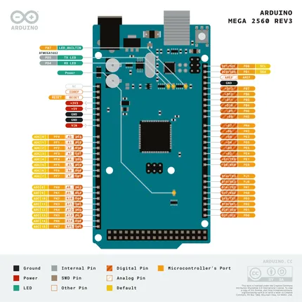
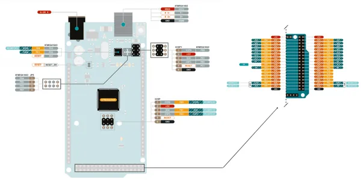
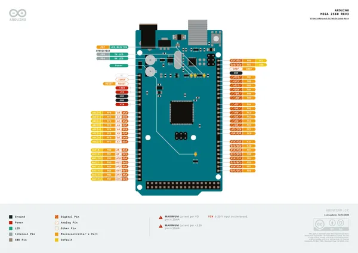
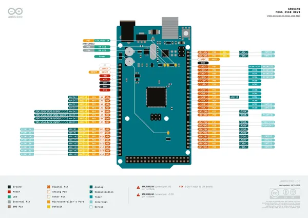
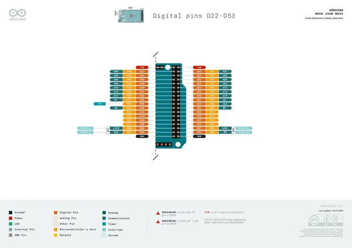
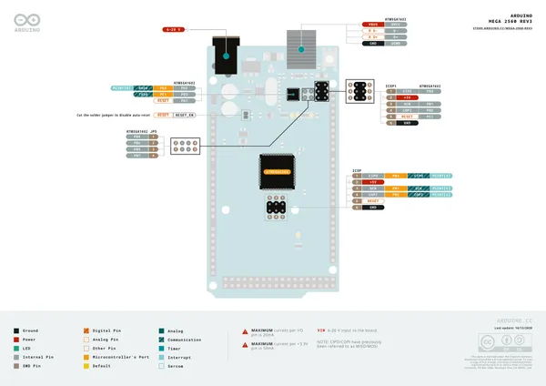

# Mega 2560 Rev3

**Arduino** · Other

Revision: Not identified  
Coverage: Pinout image collected

[Browse all manufacturers](../../../../BROWSE.md) · [Desktop app](https://github.com/valleytechsolutions/black-wire-desktop)

## ArduinoMEGAPinOut

**pinout image** · Reviewed source · PNG

[Open original reference](../../../../library/media/cf354d573fec1c4970f1ab265b17c2e69144054299e78ddd6c2a6a367a29964f.png)

**Credit and rights:** Not established; source attribution retained. Source/manufacturer: Arduino.

[Source 1](https://raw.githubusercontent.com/arduino/docs-content/dab66ecbd6ad52cd742da6c19c5b6330a7f2caae/content/hardware/mega/boards/mega-2560/datasheet/assets/ArduinoMEGAPinOut.png) · [Source 2](https://docs.arduino.cc/hardware/mega-2560/) · [Source 3](https://github.com/arduino/docs-content/blob/dab66ecbd6ad52cd742da6c19c5b6330a7f2caae/content/hardware/mega/boards/mega-2560/product.md) · [Source 4](https://github.com/arduino/docs-content/blob/dab66ecbd6ad52cd742da6c19c5b6330a7f2caae/content/hardware/mega/boards/mega-2560/datasheet/assets/ArduinoMEGAPinOut.png)

Official Arduino documentation repository pinned at dab66ecbd6ad52cd742da6c19c5b6330a7f2caae. Match the board model, SKU and revision printed on each source sheet; lifecycle is not inferred from repository folder placement.

SHA-256: `cf354d573fec1c4970f1ab265b17c2e69144054299e78ddd6c2a6a367a29964f`

## ArduinoMEGAPinOut2

**pinout image** · Reviewed source · PNG

[Open original reference](../../../../library/media/2fbda1fcd6a8d9c6ac409a24e0b6b5c93614c305b09e705100bf602071afca19.png)

**Credit and rights:** Not established; source attribution retained. Source/manufacturer: Arduino.

[Source 1](https://raw.githubusercontent.com/arduino/docs-content/dab66ecbd6ad52cd742da6c19c5b6330a7f2caae/content/hardware/mega/boards/mega-2560/datasheet/assets/ArduinoMEGAPinOut2.png) · [Source 2](https://docs.arduino.cc/hardware/mega-2560/) · [Source 3](https://github.com/arduino/docs-content/blob/dab66ecbd6ad52cd742da6c19c5b6330a7f2caae/content/hardware/mega/boards/mega-2560/product.md) · [Source 4](https://github.com/arduino/docs-content/blob/dab66ecbd6ad52cd742da6c19c5b6330a7f2caae/content/hardware/mega/boards/mega-2560/datasheet/assets/ArduinoMEGAPinOut2.png)

Official Arduino documentation repository pinned at dab66ecbd6ad52cd742da6c19c5b6330a7f2caae. Match the board model, SKU and revision printed on each source sheet; lifecycle is not inferred from repository folder placement.

SHA-256: `2fbda1fcd6a8d9c6ac409a24e0b6b5c93614c305b09e705100bf602071afca19`

## Official full pinout - page 1

**pinout image** · Reviewed source · PNG

[Open original reference](../../../../library/media/44a955de5bad05e9fd67dcf6d3e8fa656100778b1922e145d5d4ba9d2100856f.png)

**Credit and rights:** CC BY-SA 4.0 notice printed in the original PDF; preserve attribution and verify scope for publication.. Source/manufacturer: Arduino.

[Source 1](https://raw.githubusercontent.com/arduino/docs-content/dab66ecbd6ad52cd742da6c19c5b6330a7f2caae/content/hardware/mega/boards/mega-2560/downloads/A000067-full-pinout.pdf) · [Source 2](https://docs.arduino.cc/hardware/mega-2560/) · [Source 3](https://github.com/arduino/docs-content/blob/dab66ecbd6ad52cd742da6c19c5b6330a7f2caae/content/hardware/mega/boards/mega-2560/product.md) · [Source 4](https://github.com/arduino/docs-content/blob/dab66ecbd6ad52cd742da6c19c5b6330a7f2caae/content/hardware/mega/boards/mega-2560/downloads/A000067-full-pinout.pdf)

Official Arduino documentation repository pinned at dab66ecbd6ad52cd742da6c19c5b6330a7f2caae. Match the board model, SKU and revision printed on each source sheet; lifecycle is not inferred from repository folder placement. Original PDF page 1 rendered at 220 dpi; no labels changed.

SHA-256: `44a955de5bad05e9fd67dcf6d3e8fa656100778b1922e145d5d4ba9d2100856f`

## Official full pinout - page 2

**pinout image** · Reviewed source · PNG

[Open original reference](../../../../library/media/0a772ecfb6b56570cac4a9948d61b24573547df05fb5beef2ae48ce446999c77.png)

**Credit and rights:** CC BY-SA 4.0 notice printed in the original PDF; preserve attribution and verify scope for publication.. Source/manufacturer: Arduino.

[Source 1](https://raw.githubusercontent.com/arduino/docs-content/dab66ecbd6ad52cd742da6c19c5b6330a7f2caae/content/hardware/mega/boards/mega-2560/downloads/A000067-full-pinout.pdf) · [Source 2](https://docs.arduino.cc/hardware/mega-2560/) · [Source 3](https://github.com/arduino/docs-content/blob/dab66ecbd6ad52cd742da6c19c5b6330a7f2caae/content/hardware/mega/boards/mega-2560/product.md) · [Source 4](https://github.com/arduino/docs-content/blob/dab66ecbd6ad52cd742da6c19c5b6330a7f2caae/content/hardware/mega/boards/mega-2560/downloads/A000067-full-pinout.pdf)

Official Arduino documentation repository pinned at dab66ecbd6ad52cd742da6c19c5b6330a7f2caae. Match the board model, SKU and revision printed on each source sheet; lifecycle is not inferred from repository folder placement. Original PDF page 2 rendered at 220 dpi; no labels changed.

SHA-256: `0a772ecfb6b56570cac4a9948d61b24573547df05fb5beef2ae48ce446999c77`

## Official full pinout - page 3

**pinout image** · Reviewed source · PNG

[Open original reference](../../../../library/media/5e456c07317c9d6bf9107fa0bd6cebba3b95e27da86998d2c3528f933efa07d2.png)

**Credit and rights:** CC BY-SA 4.0 notice printed in the original PDF; preserve attribution and verify scope for publication.. Source/manufacturer: Arduino.

[Source 1](https://raw.githubusercontent.com/arduino/docs-content/dab66ecbd6ad52cd742da6c19c5b6330a7f2caae/content/hardware/mega/boards/mega-2560/downloads/A000067-full-pinout.pdf) · [Source 2](https://docs.arduino.cc/hardware/mega-2560/) · [Source 3](https://github.com/arduino/docs-content/blob/dab66ecbd6ad52cd742da6c19c5b6330a7f2caae/content/hardware/mega/boards/mega-2560/product.md) · [Source 4](https://github.com/arduino/docs-content/blob/dab66ecbd6ad52cd742da6c19c5b6330a7f2caae/content/hardware/mega/boards/mega-2560/downloads/A000067-full-pinout.pdf)

Official Arduino documentation repository pinned at dab66ecbd6ad52cd742da6c19c5b6330a7f2caae. Match the board model, SKU and revision printed on each source sheet; lifecycle is not inferred from repository folder placement. Original PDF page 3 rendered at 220 dpi; no labels changed.

SHA-256: `5e456c07317c9d6bf9107fa0bd6cebba3b95e27da86998d2c3528f933efa07d2`

## Official full pinout - page 4

**pinout image** · Reviewed source · PNG

[Open original reference](../../../../library/media/d684e65c326391f59366f45969aba594c121e2064bd79e7a52b3cede65bafbf8.png)

**Credit and rights:** CC BY-SA 4.0 notice printed in the original PDF; preserve attribution and verify scope for publication.. Source/manufacturer: Arduino.

[Source 1](https://raw.githubusercontent.com/arduino/docs-content/dab66ecbd6ad52cd742da6c19c5b6330a7f2caae/content/hardware/mega/boards/mega-2560/downloads/A000067-full-pinout.pdf) · [Source 2](https://docs.arduino.cc/hardware/mega-2560/) · [Source 3](https://github.com/arduino/docs-content/blob/dab66ecbd6ad52cd742da6c19c5b6330a7f2caae/content/hardware/mega/boards/mega-2560/product.md) · [Source 4](https://github.com/arduino/docs-content/blob/dab66ecbd6ad52cd742da6c19c5b6330a7f2caae/content/hardware/mega/boards/mega-2560/downloads/A000067-full-pinout.pdf)

Official Arduino documentation repository pinned at dab66ecbd6ad52cd742da6c19c5b6330a7f2caae. Match the board model, SKU and revision printed on each source sheet; lifecycle is not inferred from repository folder placement. Original PDF page 4 rendered at 220 dpi; no labels changed.

SHA-256: `d684e65c326391f59366f45969aba594c121e2064bd79e7a52b3cede65bafbf8`

## Full board pinout PDF

**original reference PDF** · Reviewed source · PDF

[Open original reference](../../../../library/media/ecc6204d0683269e8ee3f328764c92932121f2d98daca7fd3ff3ea45bd4d090f.pdf)

**Credit and rights:** Not established; source attribution retained. Source/manufacturer: Arduino.

[Source 1](https://raw.githubusercontent.com/arduino/docs-content/dab66ecbd6ad52cd742da6c19c5b6330a7f2caae/content/hardware/mega/boards/mega-2560/downloads/A000067-full-pinout.pdf) · [Source 2](https://docs.arduino.cc/hardware/mega-2560/) · [Source 3](https://github.com/arduino/docs-content/blob/dab66ecbd6ad52cd742da6c19c5b6330a7f2caae/content/hardware/mega/boards/mega-2560/product.md) · [Source 4](https://github.com/arduino/docs-content/blob/dab66ecbd6ad52cd742da6c19c5b6330a7f2caae/content/hardware/mega/boards/mega-2560/downloads/A000067-full-pinout.pdf)

Official Arduino documentation repository pinned at dab66ecbd6ad52cd742da6c19c5b6330a7f2caae. Match the board model, SKU and revision printed on each source sheet; lifecycle is not inferred from repository folder placement.

SHA-256: `ecc6204d0683269e8ee3f328764c92932121f2d98daca7fd3ff3ea45bd4d090f`

Pin assignments have not been independently electrically verified. Check board revision before wiring.
