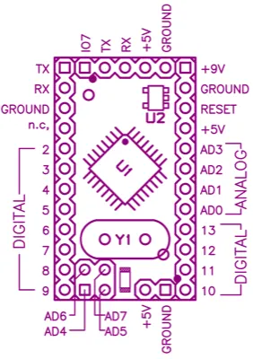

# Mini 03

**Arduino** · Other

Revision: Mini revision 03  
Coverage: Pinout image collected

[Browse all manufacturers](../../../../BROWSE.md) · [Desktop app](https://github.com/valleytechsolutions/black-wire-desktop)

## Mini 03 physical pin map

**pinout image** · Reviewed source · PNG

[Open original reference](../../../../library/media/de513da31785df58e380f086419a819a107ed045c35e853f35b67863bfdf820b.png)

**Credit and rights:** Not established; source attribution retained. Source/manufacturer: Arduino.

[Source 1](https://raw.githubusercontent.com/arduino/docs-content/dab66ecbd6ad52cd742da6c19c5b6330a7f2caae/content/retired/01.boards/arduino-mini-05/assets/arduino_mini_pinout.png) · [Source 2](https://docs.arduino.cc/retired/boards/arduino-mini-05/) · [Source 3](https://github.com/arduino/docs-content/blob/dab66ecbd6ad52cd742da6c19c5b6330a7f2caae/content/retired/01.boards/arduino-mini-05/content.md) · [Source 4](https://github.com/arduino/docs-content/blob/dab66ecbd6ad52cd742da6c19c5b6330a7f2caae/content/retired/01.boards/arduino-mini-05/assets/arduino_mini_pinout.png)

Official Arduino documentation repository pinned at dab66ecbd6ad52cd742da6c19c5b6330a7f2caae. Match the board model, SKU and revision printed on each source sheet; lifecycle is not inferred from repository folder placement. The source page explicitly assigns this drawing to Mini 03, despite hosting it on the Mini 05 page. Earlier Mini revisions lack the IO7 header at the top.

SHA-256: `de513da31785df58e380f086419a819a107ed045c35e853f35b67863bfdf820b`

Pin assignments have not been independently electrically verified. Check board revision before wiring.
