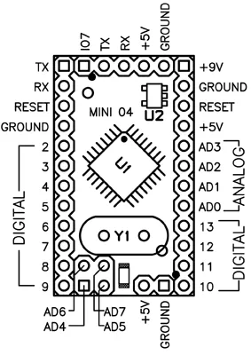

# Mini 04 and 05 shared reference

**Arduino** · Other

Revision: Mini revisions 04 and 05  
Coverage: Pinout image collected

[Browse all manufacturers](../../../../BROWSE.md) · [Desktop app](https://github.com/valleytechsolutions/black-wire-desktop)

## Mini 04 and 05 physical pin map

**pinout image** · Reviewed source · PNG

[Open original reference](../../../../library/media/a30e3cfb8658240ebbdb48ec0c2d9bb5fb148391adbb9c95930f877a74551f4b.png)

**Credit and rights:** Not established; source attribution retained. Source/manufacturer: Arduino.

[Source 1](https://raw.githubusercontent.com/arduino/docs-content/dab66ecbd6ad52cd742da6c19c5b6330a7f2caae/content/retired/01.boards/arduino-mini-05/assets/arduino_mini04_pinout.png) · [Source 2](https://docs.arduino.cc/retired/boards/arduino-mini-05/) · [Source 3](https://github.com/arduino/docs-content/blob/dab66ecbd6ad52cd742da6c19c5b6330a7f2caae/content/retired/01.boards/arduino-mini-05/content.md) · [Source 4](https://github.com/arduino/docs-content/blob/dab66ecbd6ad52cd742da6c19c5b6330a7f2caae/content/retired/01.boards/arduino-mini-05/assets/arduino_mini04_pinout.png)

Official Arduino documentation repository pinned at dab66ecbd6ad52cd742da6c19c5b6330a7f2caae. Match the board model, SKU and revision printed on each source sheet; lifecycle is not inferred from repository folder placement. Official page explicitly says this image covers Mini 04 and 05. Ground moved relative to Mini 03. Shared reference is named explicitly, not counted as a separate PCB design.

SHA-256: `a30e3cfb8658240ebbdb48ec0c2d9bb5fb148391adbb9c95930f877a74551f4b`

Pin assignments have not been independently electrically verified. Check board revision before wiring.
