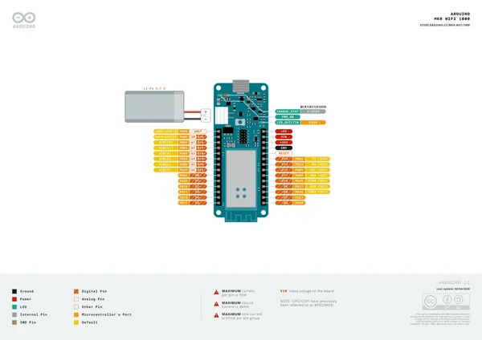
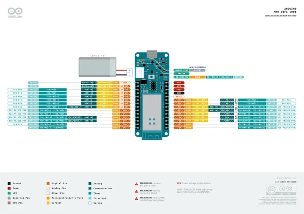
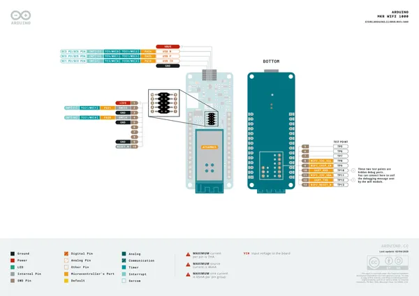

# MKR 1000 WiFi

**Arduino** · Other

Revision: Not identified  
Coverage: Pinout image collected

[Browse all manufacturers](../../../../BROWSE.md) · [Desktop app](https://github.com/valleytechsolutions/black-wire-desktop)

## Official full pinout - page 1

**pinout image** · Reviewed source · PNG

[Open original reference](../../../../library/media/372cb535c54015164936b2fc23b38fbb2e9375daeb64a35ee866ac4bd2fe191d.png)

**Credit and rights:** CC BY-SA 4.0 notice printed in the original PDF; preserve attribution and verify scope for publication.. Source/manufacturer: Arduino.

[Source 1](https://raw.githubusercontent.com/arduino/docs-content/dab66ecbd6ad52cd742da6c19c5b6330a7f2caae/content/hardware/mkr/01.boards/mkr-1000-wifi/downloads/ABX00004-full-pinout.pdf) · [Source 2](https://docs.arduino.cc/hardware/mkr-1000-wifi/) · [Source 3](https://github.com/arduino/docs-content/blob/dab66ecbd6ad52cd742da6c19c5b6330a7f2caae/content/hardware/mkr/01.boards/mkr-1000-wifi/product.md) · [Source 4](https://github.com/arduino/docs-content/blob/dab66ecbd6ad52cd742da6c19c5b6330a7f2caae/content/hardware/mkr/01.boards/mkr-1000-wifi/downloads/ABX00004-full-pinout.pdf)

Official Arduino documentation repository pinned at dab66ecbd6ad52cd742da6c19c5b6330a7f2caae. Match the board model, SKU and revision printed on each source sheet; lifecycle is not inferred from repository folder placement. Original PDF page 1 rendered at 220 dpi; no labels changed.

SHA-256: `372cb535c54015164936b2fc23b38fbb2e9375daeb64a35ee866ac4bd2fe191d`

## Official full pinout - page 2

**pinout image** · Reviewed source · PNG

[Open original reference](../../../../library/media/2d845668657b6641576c68bda783c102536e362a014641cff15ec80ee5a9ccc6.png)

**Credit and rights:** CC BY-SA 4.0 notice printed in the original PDF; preserve attribution and verify scope for publication.. Source/manufacturer: Arduino.

[Source 1](https://raw.githubusercontent.com/arduino/docs-content/dab66ecbd6ad52cd742da6c19c5b6330a7f2caae/content/hardware/mkr/01.boards/mkr-1000-wifi/downloads/ABX00004-full-pinout.pdf) · [Source 2](https://docs.arduino.cc/hardware/mkr-1000-wifi/) · [Source 3](https://github.com/arduino/docs-content/blob/dab66ecbd6ad52cd742da6c19c5b6330a7f2caae/content/hardware/mkr/01.boards/mkr-1000-wifi/product.md) · [Source 4](https://github.com/arduino/docs-content/blob/dab66ecbd6ad52cd742da6c19c5b6330a7f2caae/content/hardware/mkr/01.boards/mkr-1000-wifi/downloads/ABX00004-full-pinout.pdf)

Official Arduino documentation repository pinned at dab66ecbd6ad52cd742da6c19c5b6330a7f2caae. Match the board model, SKU and revision printed on each source sheet; lifecycle is not inferred from repository folder placement. Original PDF page 2 rendered at 220 dpi; no labels changed.

SHA-256: `2d845668657b6641576c68bda783c102536e362a014641cff15ec80ee5a9ccc6`

## Official full pinout - page 3

**pinout image** · Reviewed source · PNG

[Open original reference](../../../../library/media/07a4fa18b99f09cdecb991787024adccb7a894f0e5141a505814530810c84507.png)

**Credit and rights:** CC BY-SA 4.0 notice printed in the original PDF; preserve attribution and verify scope for publication.. Source/manufacturer: Arduino.

[Source 1](https://raw.githubusercontent.com/arduino/docs-content/dab66ecbd6ad52cd742da6c19c5b6330a7f2caae/content/hardware/mkr/01.boards/mkr-1000-wifi/downloads/ABX00004-full-pinout.pdf) · [Source 2](https://docs.arduino.cc/hardware/mkr-1000-wifi/) · [Source 3](https://github.com/arduino/docs-content/blob/dab66ecbd6ad52cd742da6c19c5b6330a7f2caae/content/hardware/mkr/01.boards/mkr-1000-wifi/product.md) · [Source 4](https://github.com/arduino/docs-content/blob/dab66ecbd6ad52cd742da6c19c5b6330a7f2caae/content/hardware/mkr/01.boards/mkr-1000-wifi/downloads/ABX00004-full-pinout.pdf)

Official Arduino documentation repository pinned at dab66ecbd6ad52cd742da6c19c5b6330a7f2caae. Match the board model, SKU and revision printed on each source sheet; lifecycle is not inferred from repository folder placement. Original PDF page 3 rendered at 220 dpi; no labels changed.

SHA-256: `07a4fa18b99f09cdecb991787024adccb7a894f0e5141a505814530810c84507`

## Full board pinout PDF

**original reference PDF** · Reviewed source · PDF

[Open original reference](../../../../library/media/998b9a3c11cc27c1ec320ec43703d6086ed4015f4ce095cc070061519bc19f1b.pdf)

**Credit and rights:** Not established; source attribution retained. Source/manufacturer: Arduino.

[Source 1](https://raw.githubusercontent.com/arduino/docs-content/dab66ecbd6ad52cd742da6c19c5b6330a7f2caae/content/hardware/mkr/01.boards/mkr-1000-wifi/downloads/ABX00004-full-pinout.pdf) · [Source 2](https://docs.arduino.cc/hardware/mkr-1000-wifi/) · [Source 3](https://github.com/arduino/docs-content/blob/dab66ecbd6ad52cd742da6c19c5b6330a7f2caae/content/hardware/mkr/01.boards/mkr-1000-wifi/product.md) · [Source 4](https://github.com/arduino/docs-content/blob/dab66ecbd6ad52cd742da6c19c5b6330a7f2caae/content/hardware/mkr/01.boards/mkr-1000-wifi/downloads/ABX00004-full-pinout.pdf)

Official Arduino documentation repository pinned at dab66ecbd6ad52cd742da6c19c5b6330a7f2caae. Match the board model, SKU and revision printed on each source sheet; lifecycle is not inferred from repository folder placement.

SHA-256: `998b9a3c11cc27c1ec320ec43703d6086ed4015f4ce095cc070061519bc19f1b`

Pin assignments have not been independently electrically verified. Check board revision before wiring.
