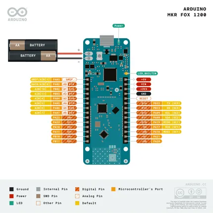
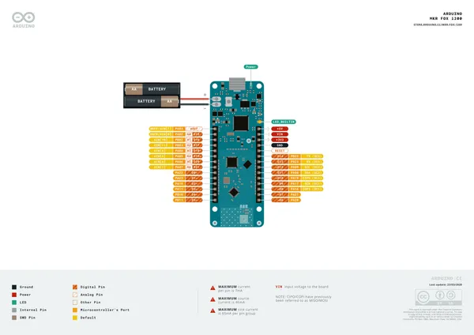
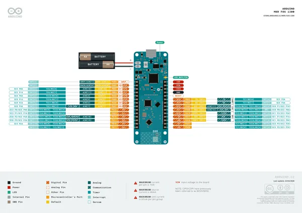
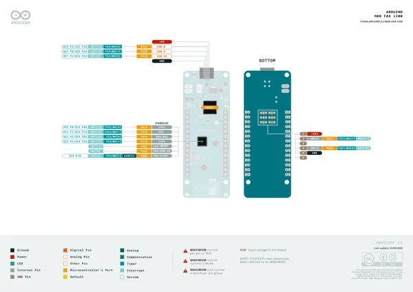

# MKR FOX 1200

**Arduino** · Other

Revision: Not identified  
Coverage: Pinout image collected

[Browse all manufacturers](../../../../BROWSE.md) · [Desktop app](https://github.com/valleytechsolutions/black-wire-desktop)

## pinout

**pinout image** · Reviewed source · PNG

[Open original reference](../../../../library/media/0cb9ca4bffe80a2563f382452161ed3b26dfee7beff3a9208c0f9b68bbfcffb6.png)

**Credit and rights:** Not established; source attribution retained. Source/manufacturer: Arduino.

[Source 1](https://raw.githubusercontent.com/arduino/docs-content/dab66ecbd6ad52cd742da6c19c5b6330a7f2caae/content/hardware/mkr/01.boards/mkr-fox-1200/pinout.png) · [Source 2](https://docs.arduino.cc/hardware/mkr-fox-1200/) · [Source 3](https://github.com/arduino/docs-content/blob/dab66ecbd6ad52cd742da6c19c5b6330a7f2caae/content/hardware/mkr/01.boards/mkr-fox-1200/product.md) · [Source 4](https://github.com/arduino/docs-content/blob/dab66ecbd6ad52cd742da6c19c5b6330a7f2caae/content/hardware/mkr/01.boards/mkr-fox-1200/pinout.png)

Official Arduino documentation repository pinned at dab66ecbd6ad52cd742da6c19c5b6330a7f2caae. Match the board model, SKU and revision printed on each source sheet; lifecycle is not inferred from repository folder placement.

SHA-256: `0cb9ca4bffe80a2563f382452161ed3b26dfee7beff3a9208c0f9b68bbfcffb6`

## Official full pinout - page 1

**pinout image** · Reviewed source · PNG

[Open original reference](../../../../library/media/5d26ac99798eb069db145822b087882852c46d73ee9add6aa234cfb62f08c17e.png)

**Credit and rights:** CC BY-SA 4.0 notice printed in the original PDF; preserve attribution and verify scope for publication.. Source/manufacturer: Arduino.

[Source 1](https://raw.githubusercontent.com/arduino/docs-content/dab66ecbd6ad52cd742da6c19c5b6330a7f2caae/content/hardware/mkr/01.boards/mkr-fox-1200/downloads/ABX00014-full-pinout.pdf) · [Source 2](https://docs.arduino.cc/hardware/mkr-fox-1200/) · [Source 3](https://github.com/arduino/docs-content/blob/dab66ecbd6ad52cd742da6c19c5b6330a7f2caae/content/hardware/mkr/01.boards/mkr-fox-1200/product.md) · [Source 4](https://github.com/arduino/docs-content/blob/dab66ecbd6ad52cd742da6c19c5b6330a7f2caae/content/hardware/mkr/01.boards/mkr-fox-1200/downloads/ABX00014-full-pinout.pdf)

Official Arduino documentation repository pinned at dab66ecbd6ad52cd742da6c19c5b6330a7f2caae. Match the board model, SKU and revision printed on each source sheet; lifecycle is not inferred from repository folder placement. Original PDF page 1 rendered at 220 dpi; no labels changed.

SHA-256: `5d26ac99798eb069db145822b087882852c46d73ee9add6aa234cfb62f08c17e`

## Official full pinout - page 2

**pinout image** · Reviewed source · PNG

[Open original reference](../../../../library/media/cbbd9ba4d1d8107b2a683abac54dd465ecc9db5dd3dcf93784b4edab504cbadd.png)

**Credit and rights:** CC BY-SA 4.0 notice printed in the original PDF; preserve attribution and verify scope for publication.. Source/manufacturer: Arduino.

[Source 1](https://raw.githubusercontent.com/arduino/docs-content/dab66ecbd6ad52cd742da6c19c5b6330a7f2caae/content/hardware/mkr/01.boards/mkr-fox-1200/downloads/ABX00014-full-pinout.pdf) · [Source 2](https://docs.arduino.cc/hardware/mkr-fox-1200/) · [Source 3](https://github.com/arduino/docs-content/blob/dab66ecbd6ad52cd742da6c19c5b6330a7f2caae/content/hardware/mkr/01.boards/mkr-fox-1200/product.md) · [Source 4](https://github.com/arduino/docs-content/blob/dab66ecbd6ad52cd742da6c19c5b6330a7f2caae/content/hardware/mkr/01.boards/mkr-fox-1200/downloads/ABX00014-full-pinout.pdf)

Official Arduino documentation repository pinned at dab66ecbd6ad52cd742da6c19c5b6330a7f2caae. Match the board model, SKU and revision printed on each source sheet; lifecycle is not inferred from repository folder placement. Original PDF page 2 rendered at 220 dpi; no labels changed.

SHA-256: `cbbd9ba4d1d8107b2a683abac54dd465ecc9db5dd3dcf93784b4edab504cbadd`

## Official full pinout - page 3

**pinout image** · Reviewed source · PNG

[Open original reference](../../../../library/media/8b74477e275f39782c05d2045b3165cc2fd9180be097a8a984ae65227edad4cb.png)

**Credit and rights:** CC BY-SA 4.0 notice printed in the original PDF; preserve attribution and verify scope for publication.. Source/manufacturer: Arduino.

[Source 1](https://raw.githubusercontent.com/arduino/docs-content/dab66ecbd6ad52cd742da6c19c5b6330a7f2caae/content/hardware/mkr/01.boards/mkr-fox-1200/downloads/ABX00014-full-pinout.pdf) · [Source 2](https://docs.arduino.cc/hardware/mkr-fox-1200/) · [Source 3](https://github.com/arduino/docs-content/blob/dab66ecbd6ad52cd742da6c19c5b6330a7f2caae/content/hardware/mkr/01.boards/mkr-fox-1200/product.md) · [Source 4](https://github.com/arduino/docs-content/blob/dab66ecbd6ad52cd742da6c19c5b6330a7f2caae/content/hardware/mkr/01.boards/mkr-fox-1200/downloads/ABX00014-full-pinout.pdf)

Official Arduino documentation repository pinned at dab66ecbd6ad52cd742da6c19c5b6330a7f2caae. Match the board model, SKU and revision printed on each source sheet; lifecycle is not inferred from repository folder placement. Original PDF page 3 rendered at 220 dpi; no labels changed.

SHA-256: `8b74477e275f39782c05d2045b3165cc2fd9180be097a8a984ae65227edad4cb`

## Full board pinout PDF

**original reference PDF** · Reviewed source · PDF

[Open original reference](../../../../library/media/e003701cbe7c2976465bdaf45ccd0dfe085fe2b57c36b6cac62f97e7ef75a7a1.pdf)

**Credit and rights:** Not established; source attribution retained. Source/manufacturer: Arduino.

[Source 1](https://raw.githubusercontent.com/arduino/docs-content/dab66ecbd6ad52cd742da6c19c5b6330a7f2caae/content/hardware/mkr/01.boards/mkr-fox-1200/downloads/ABX00014-full-pinout.pdf) · [Source 2](https://docs.arduino.cc/hardware/mkr-fox-1200/) · [Source 3](https://github.com/arduino/docs-content/blob/dab66ecbd6ad52cd742da6c19c5b6330a7f2caae/content/hardware/mkr/01.boards/mkr-fox-1200/product.md) · [Source 4](https://github.com/arduino/docs-content/blob/dab66ecbd6ad52cd742da6c19c5b6330a7f2caae/content/hardware/mkr/01.boards/mkr-fox-1200/downloads/ABX00014-full-pinout.pdf)

Official Arduino documentation repository pinned at dab66ecbd6ad52cd742da6c19c5b6330a7f2caae. Match the board model, SKU and revision printed on each source sheet; lifecycle is not inferred from repository folder placement.

SHA-256: `e003701cbe7c2976465bdaf45ccd0dfe085fe2b57c36b6cac62f97e7ef75a7a1`

Pin assignments have not been independently electrically verified. Check board revision before wiring.
