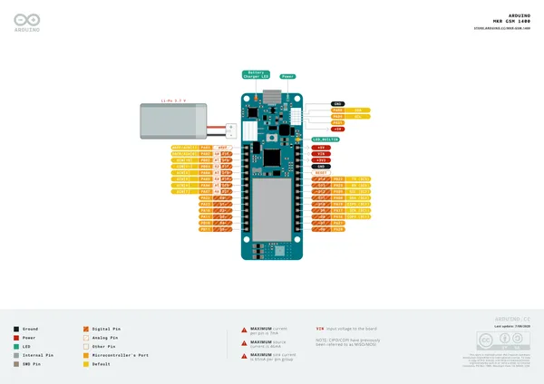
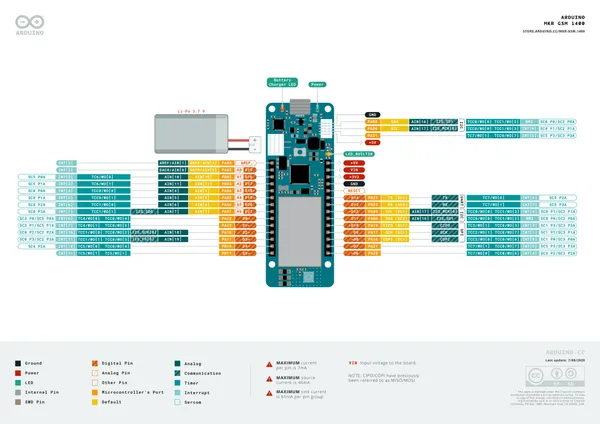
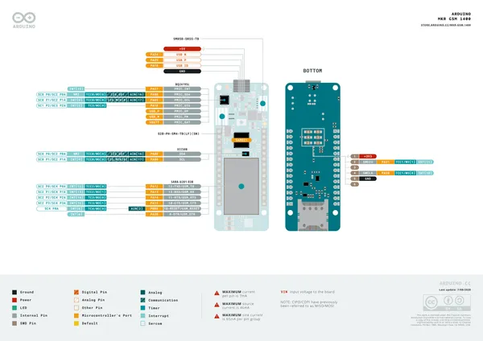

# MKR GSM 1400

**Arduino** · Other

Revision: Not identified  
Coverage: Pinout image collected

[Browse all manufacturers](../../../../BROWSE.md) · [Desktop app](https://github.com/valleytechsolutions/black-wire-desktop)

## Official full pinout - page 1

**pinout image** · Reviewed source · PNG

[Open original reference](../../../../library/media/64085de3fa3115fd125c2708ea422238171a7c4b3c558af3fec26110a1889639.png)

**Credit and rights:** CC BY-SA 4.0 notice printed in the original PDF; preserve attribution and verify scope for publication.. Source/manufacturer: Arduino.

[Source 1](https://raw.githubusercontent.com/arduino/docs-content/dab66ecbd6ad52cd742da6c19c5b6330a7f2caae/content/hardware/mkr/01.boards/mkr-gsm-1400/downloads/ABX00018-full-pinout.pdf) · [Source 2](https://docs.arduino.cc/hardware/mkr-gsm-1400/) · [Source 3](https://github.com/arduino/docs-content/blob/dab66ecbd6ad52cd742da6c19c5b6330a7f2caae/content/hardware/mkr/01.boards/mkr-gsm-1400/product.md) · [Source 4](https://github.com/arduino/docs-content/blob/dab66ecbd6ad52cd742da6c19c5b6330a7f2caae/content/hardware/mkr/01.boards/mkr-gsm-1400/downloads/ABX00018-full-pinout.pdf)

Official Arduino documentation repository pinned at dab66ecbd6ad52cd742da6c19c5b6330a7f2caae. Match the board model, SKU and revision printed on each source sheet; lifecycle is not inferred from repository folder placement. Original PDF page 1 rendered at 220 dpi; no labels changed.

SHA-256: `64085de3fa3115fd125c2708ea422238171a7c4b3c558af3fec26110a1889639`

## Official full pinout - page 2

**pinout image** · Reviewed source · PNG

[Open original reference](../../../../library/media/58f9cbff2e5a54c9a7f0c3221bfcca891649a8a5fb8a9d3eeee1a49214739081.png)

**Credit and rights:** CC BY-SA 4.0 notice printed in the original PDF; preserve attribution and verify scope for publication.. Source/manufacturer: Arduino.

[Source 1](https://raw.githubusercontent.com/arduino/docs-content/dab66ecbd6ad52cd742da6c19c5b6330a7f2caae/content/hardware/mkr/01.boards/mkr-gsm-1400/downloads/ABX00018-full-pinout.pdf) · [Source 2](https://docs.arduino.cc/hardware/mkr-gsm-1400/) · [Source 3](https://github.com/arduino/docs-content/blob/dab66ecbd6ad52cd742da6c19c5b6330a7f2caae/content/hardware/mkr/01.boards/mkr-gsm-1400/product.md) · [Source 4](https://github.com/arduino/docs-content/blob/dab66ecbd6ad52cd742da6c19c5b6330a7f2caae/content/hardware/mkr/01.boards/mkr-gsm-1400/downloads/ABX00018-full-pinout.pdf)

Official Arduino documentation repository pinned at dab66ecbd6ad52cd742da6c19c5b6330a7f2caae. Match the board model, SKU and revision printed on each source sheet; lifecycle is not inferred from repository folder placement. Original PDF page 2 rendered at 220 dpi; no labels changed.

SHA-256: `58f9cbff2e5a54c9a7f0c3221bfcca891649a8a5fb8a9d3eeee1a49214739081`

## Official full pinout - page 3

**pinout image** · Reviewed source · PNG

[Open original reference](../../../../library/media/2dbeb328ddbedf7ddb3b568ba213e3edb9fcb1758b6c8d3806cd58570a7a6542.png)

**Credit and rights:** CC BY-SA 4.0 notice printed in the original PDF; preserve attribution and verify scope for publication.. Source/manufacturer: Arduino.

[Source 1](https://raw.githubusercontent.com/arduino/docs-content/dab66ecbd6ad52cd742da6c19c5b6330a7f2caae/content/hardware/mkr/01.boards/mkr-gsm-1400/downloads/ABX00018-full-pinout.pdf) · [Source 2](https://docs.arduino.cc/hardware/mkr-gsm-1400/) · [Source 3](https://github.com/arduino/docs-content/blob/dab66ecbd6ad52cd742da6c19c5b6330a7f2caae/content/hardware/mkr/01.boards/mkr-gsm-1400/product.md) · [Source 4](https://github.com/arduino/docs-content/blob/dab66ecbd6ad52cd742da6c19c5b6330a7f2caae/content/hardware/mkr/01.boards/mkr-gsm-1400/downloads/ABX00018-full-pinout.pdf)

Official Arduino documentation repository pinned at dab66ecbd6ad52cd742da6c19c5b6330a7f2caae. Match the board model, SKU and revision printed on each source sheet; lifecycle is not inferred from repository folder placement. Original PDF page 3 rendered at 220 dpi; no labels changed.

SHA-256: `2dbeb328ddbedf7ddb3b568ba213e3edb9fcb1758b6c8d3806cd58570a7a6542`

## Full board pinout PDF

**original reference PDF** · Reviewed source · PDF

[Open original reference](../../../../library/media/41153cf01512d222ea33bfa248c3bebabcc9ecda3219b202433c6c4594ff33c7.pdf)

**Credit and rights:** Not established; source attribution retained. Source/manufacturer: Arduino.

[Source 1](https://raw.githubusercontent.com/arduino/docs-content/dab66ecbd6ad52cd742da6c19c5b6330a7f2caae/content/hardware/mkr/01.boards/mkr-gsm-1400/downloads/ABX00018-full-pinout.pdf) · [Source 2](https://docs.arduino.cc/hardware/mkr-gsm-1400/) · [Source 3](https://github.com/arduino/docs-content/blob/dab66ecbd6ad52cd742da6c19c5b6330a7f2caae/content/hardware/mkr/01.boards/mkr-gsm-1400/product.md) · [Source 4](https://github.com/arduino/docs-content/blob/dab66ecbd6ad52cd742da6c19c5b6330a7f2caae/content/hardware/mkr/01.boards/mkr-gsm-1400/downloads/ABX00018-full-pinout.pdf)

Official Arduino documentation repository pinned at dab66ecbd6ad52cd742da6c19c5b6330a7f2caae. Match the board model, SKU and revision printed on each source sheet; lifecycle is not inferred from repository folder placement.

SHA-256: `41153cf01512d222ea33bfa248c3bebabcc9ecda3219b202433c6c4594ff33c7`

Pin assignments have not been independently electrically verified. Check board revision before wiring.
