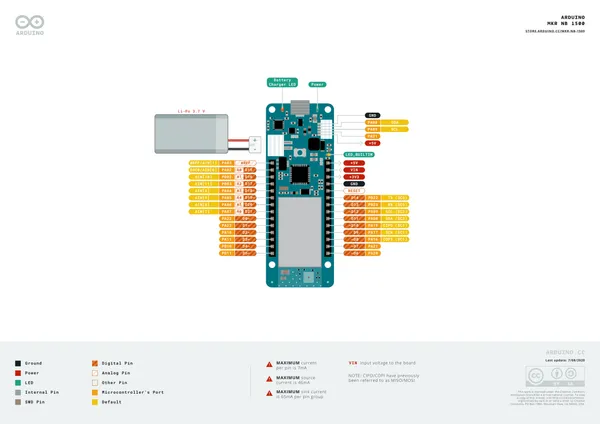
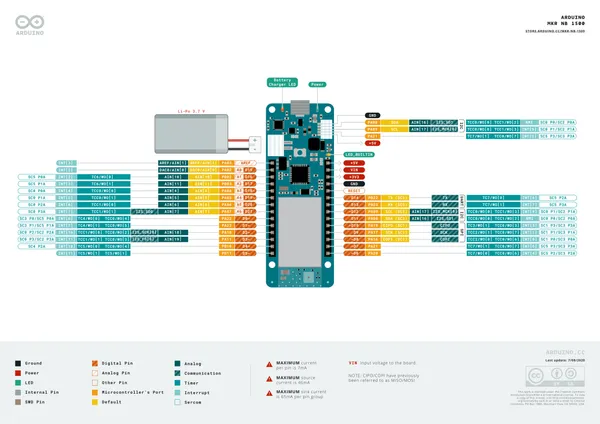
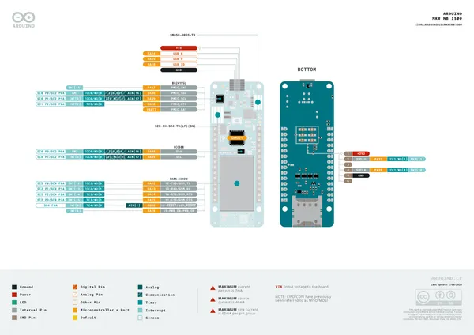

# MKR NB 1500

**Arduino** · Other

Revision: Not identified  
Coverage: Pinout image collected

[Browse all manufacturers](../../../../BROWSE.md) · [Desktop app](https://github.com/valleytechsolutions/black-wire-desktop)

## Official full pinout - page 1

**pinout image** · Reviewed source · PNG

[Open original reference](../../../../library/media/e6bd4dfeed87ced96c0be1c02e2fc3510d6c796740c5a46b6c87e5e63ec13b85.png)

**Credit and rights:** CC BY-SA 4.0 notice printed in the original PDF; preserve attribution and verify scope for publication.. Source/manufacturer: Arduino.

[Source 1](https://raw.githubusercontent.com/arduino/docs-content/dab66ecbd6ad52cd742da6c19c5b6330a7f2caae/content/hardware/mkr/01.boards/mkr-nb-1500/downloads/ABX00019-full-pinout.pdf) · [Source 2](https://docs.arduino.cc/hardware/mkr-nb-1500/) · [Source 3](https://github.com/arduino/docs-content/blob/dab66ecbd6ad52cd742da6c19c5b6330a7f2caae/content/hardware/mkr/01.boards/mkr-nb-1500/product.md) · [Source 4](https://github.com/arduino/docs-content/blob/dab66ecbd6ad52cd742da6c19c5b6330a7f2caae/content/hardware/mkr/01.boards/mkr-nb-1500/downloads/ABX00019-full-pinout.pdf)

Official Arduino documentation repository pinned at dab66ecbd6ad52cd742da6c19c5b6330a7f2caae. Match the board model, SKU and revision printed on each source sheet; lifecycle is not inferred from repository folder placement. Original PDF page 1 rendered at 220 dpi; no labels changed.

SHA-256: `e6bd4dfeed87ced96c0be1c02e2fc3510d6c796740c5a46b6c87e5e63ec13b85`

## Official full pinout - page 2

**pinout image** · Reviewed source · PNG

[Open original reference](../../../../library/media/f62bf6813322496792a671ba5e69f246f355f17f0ce585ceebce469a045f3d82.png)

**Credit and rights:** CC BY-SA 4.0 notice printed in the original PDF; preserve attribution and verify scope for publication.. Source/manufacturer: Arduino.

[Source 1](https://raw.githubusercontent.com/arduino/docs-content/dab66ecbd6ad52cd742da6c19c5b6330a7f2caae/content/hardware/mkr/01.boards/mkr-nb-1500/downloads/ABX00019-full-pinout.pdf) · [Source 2](https://docs.arduino.cc/hardware/mkr-nb-1500/) · [Source 3](https://github.com/arduino/docs-content/blob/dab66ecbd6ad52cd742da6c19c5b6330a7f2caae/content/hardware/mkr/01.boards/mkr-nb-1500/product.md) · [Source 4](https://github.com/arduino/docs-content/blob/dab66ecbd6ad52cd742da6c19c5b6330a7f2caae/content/hardware/mkr/01.boards/mkr-nb-1500/downloads/ABX00019-full-pinout.pdf)

Official Arduino documentation repository pinned at dab66ecbd6ad52cd742da6c19c5b6330a7f2caae. Match the board model, SKU and revision printed on each source sheet; lifecycle is not inferred from repository folder placement. Original PDF page 2 rendered at 220 dpi; no labels changed.

SHA-256: `f62bf6813322496792a671ba5e69f246f355f17f0ce585ceebce469a045f3d82`

## Official full pinout - page 3

**pinout image** · Reviewed source · PNG

[Open original reference](../../../../library/media/733a7fb15c3641069761982ba874e9dba399b907f75594fcb581a447c664adc7.png)

**Credit and rights:** CC BY-SA 4.0 notice printed in the original PDF; preserve attribution and verify scope for publication.. Source/manufacturer: Arduino.

[Source 1](https://raw.githubusercontent.com/arduino/docs-content/dab66ecbd6ad52cd742da6c19c5b6330a7f2caae/content/hardware/mkr/01.boards/mkr-nb-1500/downloads/ABX00019-full-pinout.pdf) · [Source 2](https://docs.arduino.cc/hardware/mkr-nb-1500/) · [Source 3](https://github.com/arduino/docs-content/blob/dab66ecbd6ad52cd742da6c19c5b6330a7f2caae/content/hardware/mkr/01.boards/mkr-nb-1500/product.md) · [Source 4](https://github.com/arduino/docs-content/blob/dab66ecbd6ad52cd742da6c19c5b6330a7f2caae/content/hardware/mkr/01.boards/mkr-nb-1500/downloads/ABX00019-full-pinout.pdf)

Official Arduino documentation repository pinned at dab66ecbd6ad52cd742da6c19c5b6330a7f2caae. Match the board model, SKU and revision printed on each source sheet; lifecycle is not inferred from repository folder placement. Original PDF page 3 rendered at 220 dpi; no labels changed.

SHA-256: `733a7fb15c3641069761982ba874e9dba399b907f75594fcb581a447c664adc7`

## Full board pinout PDF

**original reference PDF** · Reviewed source · PDF

[Open original reference](../../../../library/media/4824065a09d096150e329478808c88b5695245a9e5d3f30a615eee328bd5f887.pdf)

**Credit and rights:** Not established; source attribution retained. Source/manufacturer: Arduino.

[Source 1](https://raw.githubusercontent.com/arduino/docs-content/dab66ecbd6ad52cd742da6c19c5b6330a7f2caae/content/hardware/mkr/01.boards/mkr-nb-1500/downloads/ABX00019-full-pinout.pdf) · [Source 2](https://docs.arduino.cc/hardware/mkr-nb-1500/) · [Source 3](https://github.com/arduino/docs-content/blob/dab66ecbd6ad52cd742da6c19c5b6330a7f2caae/content/hardware/mkr/01.boards/mkr-nb-1500/product.md) · [Source 4](https://github.com/arduino/docs-content/blob/dab66ecbd6ad52cd742da6c19c5b6330a7f2caae/content/hardware/mkr/01.boards/mkr-nb-1500/downloads/ABX00019-full-pinout.pdf)

Official Arduino documentation repository pinned at dab66ecbd6ad52cd742da6c19c5b6330a7f2caae. Match the board model, SKU and revision printed on each source sheet; lifecycle is not inferred from repository folder placement.

SHA-256: `4824065a09d096150e329478808c88b5695245a9e5d3f30a615eee328bd5f887`

Pin assignments have not been independently electrically verified. Check board revision before wiring.
