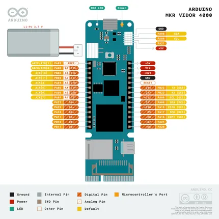
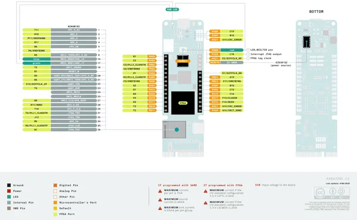
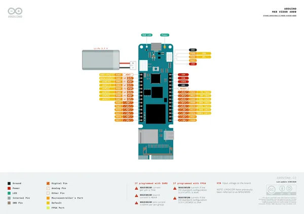
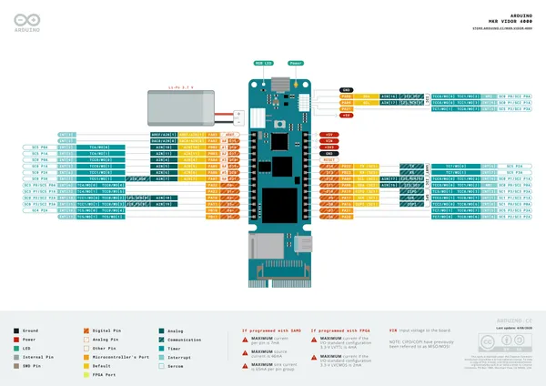
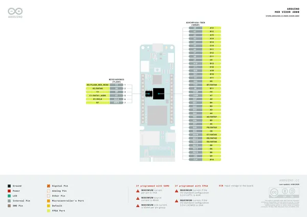
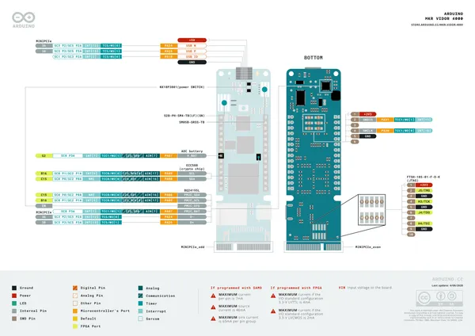
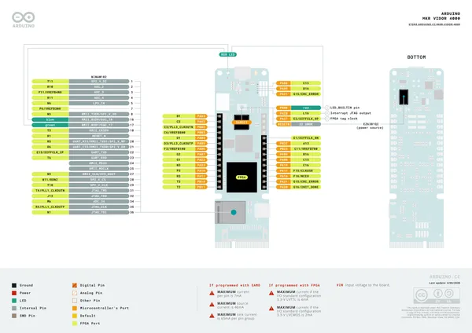
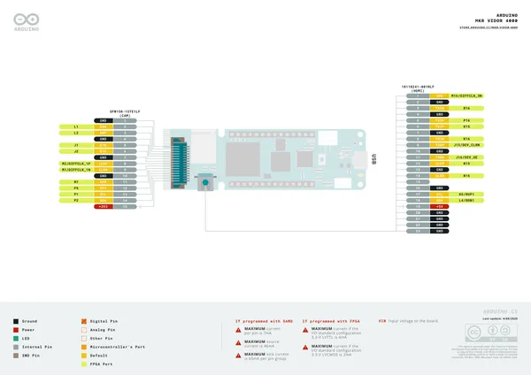
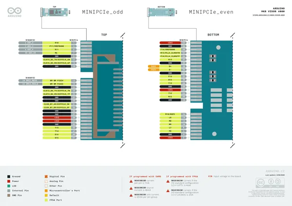

# MKR Vidor 4000

**Arduino** · Other

Revision: Not identified  
Coverage: Pinout image collected

[Browse all manufacturers](../../../../BROWSE.md) · [Desktop app](https://github.com/valleytechsolutions/black-wire-desktop)

## MKR_Vidor_Pinout

**pinout image** · Reviewed source · PNG

[Open original reference](../../../../library/media/b3e5cbcf51397b0b051f6361d3ebbb06ac695dd93670bd67d11257c5c6575572.png)

**Credit and rights:** Not established; source attribution retained. Source/manufacturer: Arduino.

[Source 1](https://raw.githubusercontent.com/arduino/docs-content/dab66ecbd6ad52cd742da6c19c5b6330a7f2caae/content/hardware/mkr/01.boards/mkr-vidor-4000/datasheets/assets/MKR_Vidor_Pinout.png) · [Source 2](https://docs.arduino.cc/hardware/mkr-vidor-4000/) · [Source 3](https://github.com/arduino/docs-content/blob/dab66ecbd6ad52cd742da6c19c5b6330a7f2caae/content/hardware/mkr/01.boards/mkr-vidor-4000/product.md) · [Source 4](https://github.com/arduino/docs-content/blob/dab66ecbd6ad52cd742da6c19c5b6330a7f2caae/content/hardware/mkr/01.boards/mkr-vidor-4000/datasheets/assets/MKR_Vidor_Pinout.png)

Official Arduino documentation repository pinned at dab66ecbd6ad52cd742da6c19c5b6330a7f2caae. Match the board model, SKU and revision printed on each source sheet; lifecycle is not inferred from repository folder placement.

SHA-256: `b3e5cbcf51397b0b051f6361d3ebbb06ac695dd93670bd67d11257c5c6575572`

## MKR_Vidor_Pinout_fpga

**pinout image** · Reviewed source · PNG

[Open original reference](../../../../library/media/b2d4580b928f722d9e94392651078b849718e7ad463b659fdd4a7efe1bc421ee.png)

**Credit and rights:** Not established; source attribution retained. Source/manufacturer: Arduino.

[Source 1](https://raw.githubusercontent.com/arduino/docs-content/dab66ecbd6ad52cd742da6c19c5b6330a7f2caae/content/hardware/mkr/01.boards/mkr-vidor-4000/datasheets/assets/MKR_Vidor_Pinout_fpga.png) · [Source 2](https://docs.arduino.cc/hardware/mkr-vidor-4000/) · [Source 3](https://github.com/arduino/docs-content/blob/dab66ecbd6ad52cd742da6c19c5b6330a7f2caae/content/hardware/mkr/01.boards/mkr-vidor-4000/product.md) · [Source 4](https://github.com/arduino/docs-content/blob/dab66ecbd6ad52cd742da6c19c5b6330a7f2caae/content/hardware/mkr/01.boards/mkr-vidor-4000/datasheets/assets/MKR_Vidor_Pinout_fpga.png)

Official Arduino documentation repository pinned at dab66ecbd6ad52cd742da6c19c5b6330a7f2caae. Match the board model, SKU and revision printed on each source sheet; lifecycle is not inferred from repository folder placement.

SHA-256: `b2d4580b928f722d9e94392651078b849718e7ad463b659fdd4a7efe1bc421ee`

## Official full pinout - page 1

**pinout image** · Reviewed source · PNG

[Open original reference](../../../../library/media/48651a077276526f8153216a025c780db91b87a76905fb27ee350a8d88df5a76.png)

**Credit and rights:** CC BY-SA 4.0 notice printed in the original PDF; preserve attribution and verify scope for publication.. Source/manufacturer: Arduino.

[Source 1](https://raw.githubusercontent.com/arduino/docs-content/dab66ecbd6ad52cd742da6c19c5b6330a7f2caae/content/hardware/mkr/01.boards/mkr-vidor-4000/downloads/ABX00022-full-pinout.pdf) · [Source 2](https://docs.arduino.cc/hardware/mkr-vidor-4000/) · [Source 3](https://github.com/arduino/docs-content/blob/dab66ecbd6ad52cd742da6c19c5b6330a7f2caae/content/hardware/mkr/01.boards/mkr-vidor-4000/product.md) · [Source 4](https://github.com/arduino/docs-content/blob/dab66ecbd6ad52cd742da6c19c5b6330a7f2caae/content/hardware/mkr/01.boards/mkr-vidor-4000/downloads/ABX00022-full-pinout.pdf)

Official Arduino documentation repository pinned at dab66ecbd6ad52cd742da6c19c5b6330a7f2caae. Match the board model, SKU and revision printed on each source sheet; lifecycle is not inferred from repository folder placement. Original PDF page 1 rendered at 220 dpi; no labels changed.

SHA-256: `48651a077276526f8153216a025c780db91b87a76905fb27ee350a8d88df5a76`

## Official full pinout - page 2

**pinout image** · Reviewed source · PNG

[Open original reference](../../../../library/media/31a8061c5fa233cce618ac9413fc00c7feb524993a6b7a1ce6d884d358762573.png)

**Credit and rights:** CC BY-SA 4.0 notice printed in the original PDF; preserve attribution and verify scope for publication.. Source/manufacturer: Arduino.

[Source 1](https://raw.githubusercontent.com/arduino/docs-content/dab66ecbd6ad52cd742da6c19c5b6330a7f2caae/content/hardware/mkr/01.boards/mkr-vidor-4000/downloads/ABX00022-full-pinout.pdf) · [Source 2](https://docs.arduino.cc/hardware/mkr-vidor-4000/) · [Source 3](https://github.com/arduino/docs-content/blob/dab66ecbd6ad52cd742da6c19c5b6330a7f2caae/content/hardware/mkr/01.boards/mkr-vidor-4000/product.md) · [Source 4](https://github.com/arduino/docs-content/blob/dab66ecbd6ad52cd742da6c19c5b6330a7f2caae/content/hardware/mkr/01.boards/mkr-vidor-4000/downloads/ABX00022-full-pinout.pdf)

Official Arduino documentation repository pinned at dab66ecbd6ad52cd742da6c19c5b6330a7f2caae. Match the board model, SKU and revision printed on each source sheet; lifecycle is not inferred from repository folder placement. Original PDF page 2 rendered at 220 dpi; no labels changed.

SHA-256: `31a8061c5fa233cce618ac9413fc00c7feb524993a6b7a1ce6d884d358762573`

## Official full pinout - page 3

**pinout image** · Reviewed source · PNG

[Open original reference](../../../../library/media/640ed9abb3551a3355352ff481c6aebf6b9c4f552e9d1f3c4893da78cd15c8a8.png)

**Credit and rights:** CC BY-SA 4.0 notice printed in the original PDF; preserve attribution and verify scope for publication.. Source/manufacturer: Arduino.

[Source 1](https://raw.githubusercontent.com/arduino/docs-content/dab66ecbd6ad52cd742da6c19c5b6330a7f2caae/content/hardware/mkr/01.boards/mkr-vidor-4000/downloads/ABX00022-full-pinout.pdf) · [Source 2](https://docs.arduino.cc/hardware/mkr-vidor-4000/) · [Source 3](https://github.com/arduino/docs-content/blob/dab66ecbd6ad52cd742da6c19c5b6330a7f2caae/content/hardware/mkr/01.boards/mkr-vidor-4000/product.md) · [Source 4](https://github.com/arduino/docs-content/blob/dab66ecbd6ad52cd742da6c19c5b6330a7f2caae/content/hardware/mkr/01.boards/mkr-vidor-4000/downloads/ABX00022-full-pinout.pdf)

Official Arduino documentation repository pinned at dab66ecbd6ad52cd742da6c19c5b6330a7f2caae. Match the board model, SKU and revision printed on each source sheet; lifecycle is not inferred from repository folder placement. Original PDF page 3 rendered at 220 dpi; no labels changed.

SHA-256: `640ed9abb3551a3355352ff481c6aebf6b9c4f552e9d1f3c4893da78cd15c8a8`

## Official full pinout - page 4

**pinout image** · Reviewed source · PNG

[Open original reference](../../../../library/media/72694f47c07160ebc67cb73aba131111a53d4871fdca1e9d6acbe4e27072956e.png)

**Credit and rights:** CC BY-SA 4.0 notice printed in the original PDF; preserve attribution and verify scope for publication.. Source/manufacturer: Arduino.

[Source 1](https://raw.githubusercontent.com/arduino/docs-content/dab66ecbd6ad52cd742da6c19c5b6330a7f2caae/content/hardware/mkr/01.boards/mkr-vidor-4000/downloads/ABX00022-full-pinout.pdf) · [Source 2](https://docs.arduino.cc/hardware/mkr-vidor-4000/) · [Source 3](https://github.com/arduino/docs-content/blob/dab66ecbd6ad52cd742da6c19c5b6330a7f2caae/content/hardware/mkr/01.boards/mkr-vidor-4000/product.md) · [Source 4](https://github.com/arduino/docs-content/blob/dab66ecbd6ad52cd742da6c19c5b6330a7f2caae/content/hardware/mkr/01.boards/mkr-vidor-4000/downloads/ABX00022-full-pinout.pdf)

Official Arduino documentation repository pinned at dab66ecbd6ad52cd742da6c19c5b6330a7f2caae. Match the board model, SKU and revision printed on each source sheet; lifecycle is not inferred from repository folder placement. Original PDF page 4 rendered at 220 dpi; no labels changed.

SHA-256: `72694f47c07160ebc67cb73aba131111a53d4871fdca1e9d6acbe4e27072956e`

## Official full pinout - page 5

**pinout image** · Reviewed source · PNG

[Open original reference](../../../../library/media/e35804d92cfc5b32c98a5cbfd474fdc9b238c0d8835209cebf858e509f2f2763.png)

**Credit and rights:** CC BY-SA 4.0 notice printed in the original PDF; preserve attribution and verify scope for publication.. Source/manufacturer: Arduino.

[Source 1](https://raw.githubusercontent.com/arduino/docs-content/dab66ecbd6ad52cd742da6c19c5b6330a7f2caae/content/hardware/mkr/01.boards/mkr-vidor-4000/downloads/ABX00022-full-pinout.pdf) · [Source 2](https://docs.arduino.cc/hardware/mkr-vidor-4000/) · [Source 3](https://github.com/arduino/docs-content/blob/dab66ecbd6ad52cd742da6c19c5b6330a7f2caae/content/hardware/mkr/01.boards/mkr-vidor-4000/product.md) · [Source 4](https://github.com/arduino/docs-content/blob/dab66ecbd6ad52cd742da6c19c5b6330a7f2caae/content/hardware/mkr/01.boards/mkr-vidor-4000/downloads/ABX00022-full-pinout.pdf)

Official Arduino documentation repository pinned at dab66ecbd6ad52cd742da6c19c5b6330a7f2caae. Match the board model, SKU and revision printed on each source sheet; lifecycle is not inferred from repository folder placement. Original PDF page 5 rendered at 220 dpi; no labels changed.

SHA-256: `e35804d92cfc5b32c98a5cbfd474fdc9b238c0d8835209cebf858e509f2f2763`

## Official full pinout - page 6

**pinout image** · Reviewed source · PNG

[Open original reference](../../../../library/media/a3453e6a0c2154b90bc165695d65b2bf75f1ab11b130dd7149a4d40747110098.png)

**Credit and rights:** CC BY-SA 4.0 notice printed in the original PDF; preserve attribution and verify scope for publication.. Source/manufacturer: Arduino.

[Source 1](https://raw.githubusercontent.com/arduino/docs-content/dab66ecbd6ad52cd742da6c19c5b6330a7f2caae/content/hardware/mkr/01.boards/mkr-vidor-4000/downloads/ABX00022-full-pinout.pdf) · [Source 2](https://docs.arduino.cc/hardware/mkr-vidor-4000/) · [Source 3](https://github.com/arduino/docs-content/blob/dab66ecbd6ad52cd742da6c19c5b6330a7f2caae/content/hardware/mkr/01.boards/mkr-vidor-4000/product.md) · [Source 4](https://github.com/arduino/docs-content/blob/dab66ecbd6ad52cd742da6c19c5b6330a7f2caae/content/hardware/mkr/01.boards/mkr-vidor-4000/downloads/ABX00022-full-pinout.pdf)

Official Arduino documentation repository pinned at dab66ecbd6ad52cd742da6c19c5b6330a7f2caae. Match the board model, SKU and revision printed on each source sheet; lifecycle is not inferred from repository folder placement. Original PDF page 6 rendered at 220 dpi; no labels changed.

SHA-256: `a3453e6a0c2154b90bc165695d65b2bf75f1ab11b130dd7149a4d40747110098`

## Official full pinout - page 7

**pinout image** · Reviewed source · PNG

[Open original reference](../../../../library/media/eceecf963abe9705f7f598f4c6b6c80809ae2abe2bc5a46b215d6c48dfbb2412.png)

**Credit and rights:** CC BY-SA 4.0 notice printed in the original PDF; preserve attribution and verify scope for publication.. Source/manufacturer: Arduino.

[Source 1](https://raw.githubusercontent.com/arduino/docs-content/dab66ecbd6ad52cd742da6c19c5b6330a7f2caae/content/hardware/mkr/01.boards/mkr-vidor-4000/downloads/ABX00022-full-pinout.pdf) · [Source 2](https://docs.arduino.cc/hardware/mkr-vidor-4000/) · [Source 3](https://github.com/arduino/docs-content/blob/dab66ecbd6ad52cd742da6c19c5b6330a7f2caae/content/hardware/mkr/01.boards/mkr-vidor-4000/product.md) · [Source 4](https://github.com/arduino/docs-content/blob/dab66ecbd6ad52cd742da6c19c5b6330a7f2caae/content/hardware/mkr/01.boards/mkr-vidor-4000/downloads/ABX00022-full-pinout.pdf)

Official Arduino documentation repository pinned at dab66ecbd6ad52cd742da6c19c5b6330a7f2caae. Match the board model, SKU and revision printed on each source sheet; lifecycle is not inferred from repository folder placement. Original PDF page 7 rendered at 220 dpi; no labels changed.

SHA-256: `eceecf963abe9705f7f598f4c6b6c80809ae2abe2bc5a46b215d6c48dfbb2412`

## Full board pinout PDF

**original reference PDF** · Reviewed source · PDF

[Open original reference](../../../../library/media/d1cde6703d69e6fae1d2681e4126814f26e1529150918d48f2fa7265ba7e58ca.pdf)

**Credit and rights:** Not established; source attribution retained. Source/manufacturer: Arduino.

[Source 1](https://raw.githubusercontent.com/arduino/docs-content/dab66ecbd6ad52cd742da6c19c5b6330a7f2caae/content/hardware/mkr/01.boards/mkr-vidor-4000/downloads/ABX00022-full-pinout.pdf) · [Source 2](https://docs.arduino.cc/hardware/mkr-vidor-4000/) · [Source 3](https://github.com/arduino/docs-content/blob/dab66ecbd6ad52cd742da6c19c5b6330a7f2caae/content/hardware/mkr/01.boards/mkr-vidor-4000/product.md) · [Source 4](https://github.com/arduino/docs-content/blob/dab66ecbd6ad52cd742da6c19c5b6330a7f2caae/content/hardware/mkr/01.boards/mkr-vidor-4000/downloads/ABX00022-full-pinout.pdf)

Official Arduino documentation repository pinned at dab66ecbd6ad52cd742da6c19c5b6330a7f2caae. Match the board model, SKU and revision printed on each source sheet; lifecycle is not inferred from repository folder placement.

SHA-256: `d1cde6703d69e6fae1d2681e4126814f26e1529150918d48f2fa7265ba7e58ca`

Pin assignments have not been independently electrically verified. Check board revision before wiring.
