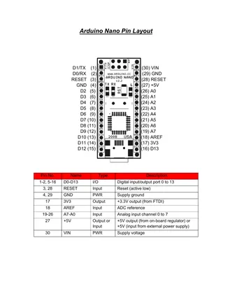

# Nano 2.2

**Arduino** · Other

Revision: Multiple source/revision records; see individual assets  
Coverage: Pinout image collected

[Browse all manufacturers](../../../../BROWSE.md) · [Desktop app](https://github.com/valleytechsolutions/black-wire-desktop)

## Board pinout - original PDF page 2

**pinout image** · Reviewed source · PNG

[Open original reference](../../../../library/media/04cfe60501d1684bae3aca0f175234b143a9881270854780639fece99f932eb9.png)

**Credit and rights:** Not established; source attribution retained. Source/manufacturer: Arduino.

[Source 1](https://www.arduino.cc/en/uploads/Main/ArduinoNanoManual.pdf) · [Source 2](https://docs.arduino.cc/hardware/nano/)

Historical Nano 2.2 manual. Do not apply to Nano 3.x or modern Nano-family boards without matching hardware. Original PDF page 2 rendered at 220 dpi; no labels changed.

SHA-256: `04cfe60501d1684bae3aca0f175234b143a9881270854780639fece99f932eb9`

## Historical board manual

**original reference PDF** · Reviewed source · PDF

[Open original reference](../../../../library/media/8fbfbf3ba4d08edc93ad5da3b4e18e0edc8690d92f690b1cc7895d9f085ef28f.pdf)

**Credit and rights:** Not established; source attribution retained. Source/manufacturer: Arduino.

[Source 1](https://www.arduino.cc/en/uploads/Main/ArduinoNanoManual.pdf) · [Source 2](https://docs.arduino.cc/hardware/nano/)

Historical Nano 2.2 manual. Do not apply to Nano 3.x or modern Nano-family boards without matching hardware.

SHA-256: `8fbfbf3ba4d08edc93ad5da3b4e18e0edc8690d92f690b1cc7895d9f085ef28f`

Pin assignments have not been independently electrically verified. Check board revision before wiring.
