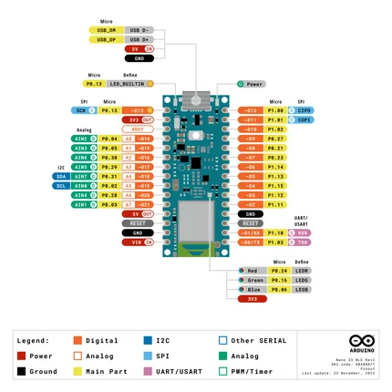
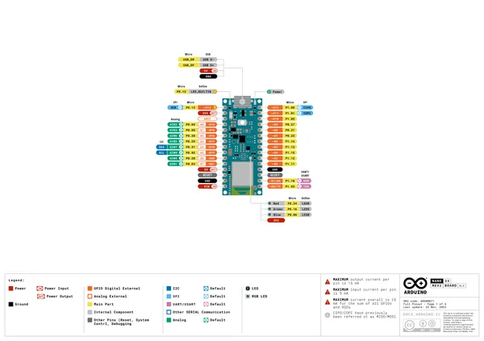
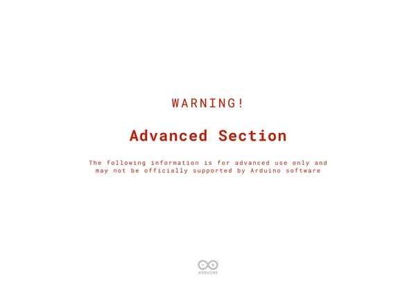
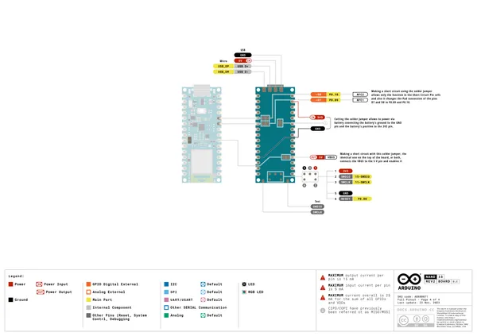
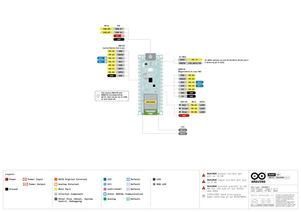

# Nano 33 BLE Rev2

**Arduino** · Other

Revision: Not identified  
Coverage: Pinout image collected

[Browse all manufacturers](../../../../BROWSE.md) · [Desktop app](https://github.com/valleytechsolutions/black-wire-desktop)

## pinout

**pinout image** · Reviewed source · PNG

[Open original reference](../../../../library/media/a8ea8186b38ce231fa163ca06c823417620a97085d8e8d7557f760544806d4b8.png)

**Credit and rights:** Not established; source attribution retained. Source/manufacturer: Arduino.

[Source 1](https://raw.githubusercontent.com/arduino/docs-content/dab66ecbd6ad52cd742da6c19c5b6330a7f2caae/content/hardware/nano/boards/nano-33-ble-rev2/datasheet/assets/pinout.png) · [Source 2](https://docs.arduino.cc/hardware/nano-33-ble-rev2/) · [Source 3](https://github.com/arduino/docs-content/blob/dab66ecbd6ad52cd742da6c19c5b6330a7f2caae/content/hardware/nano/boards/nano-33-ble-rev2/product.md) · [Source 4](https://github.com/arduino/docs-content/blob/dab66ecbd6ad52cd742da6c19c5b6330a7f2caae/content/hardware/nano/boards/nano-33-ble-rev2/datasheet/assets/pinout.png) · [Source 5](https://github.com/arduino/docs-content/blob/dab66ecbd6ad52cd742da6c19c5b6330a7f2caae/content/hardware/nano/boards/nano-33-ble-rev2/tutorials/cheat-sheet/assets/pinout.png)

Official Arduino documentation repository pinned at dab66ecbd6ad52cd742da6c19c5b6330a7f2caae. Match the board model, SKU and revision printed on each source sheet; lifecycle is not inferred from repository folder placement.

SHA-256: `a8ea8186b38ce231fa163ca06c823417620a97085d8e8d7557f760544806d4b8`

## Official full pinout - page 1

**pinout image** · Reviewed source · PNG

[Open original reference](../../../../library/media/1a7ba1c5e7ae436ccee84c6e099e30788d412dc58d107b5ea885228bc8e3608a.png)

**Credit and rights:** Not established; source attribution retained. Source/manufacturer: Arduino.

[Source 1](https://raw.githubusercontent.com/arduino/docs-content/dab66ecbd6ad52cd742da6c19c5b6330a7f2caae/content/hardware/nano/boards/nano-33-ble-rev2/downloads/ABX00071-full-pinout.pdf) · [Source 2](https://docs.arduino.cc/hardware/nano-33-ble-rev2/) · [Source 3](https://github.com/arduino/docs-content/blob/dab66ecbd6ad52cd742da6c19c5b6330a7f2caae/content/hardware/nano/boards/nano-33-ble-rev2/product.md) · [Source 4](https://github.com/arduino/docs-content/blob/dab66ecbd6ad52cd742da6c19c5b6330a7f2caae/content/hardware/nano/boards/nano-33-ble-rev2/downloads/ABX00071-full-pinout.pdf)

Official Arduino documentation repository pinned at dab66ecbd6ad52cd742da6c19c5b6330a7f2caae. Match the board model, SKU and revision printed on each source sheet; lifecycle is not inferred from repository folder placement. Original PDF page 1 rendered at 220 dpi; no labels changed.

SHA-256: `1a7ba1c5e7ae436ccee84c6e099e30788d412dc58d107b5ea885228bc8e3608a`

## Official full pinout - page 2

**pinout image** · Reviewed source · PNG

[Open original reference](../../../../library/media/21660162df2f8a4b6b476cd8e189626ea86bbad2da44a21f1a1a3fcf564ec28e.png)

**Credit and rights:** Not established; source attribution retained. Source/manufacturer: Arduino.

[Source 1](https://raw.githubusercontent.com/arduino/docs-content/dab66ecbd6ad52cd742da6c19c5b6330a7f2caae/content/hardware/nano/boards/nano-33-ble-rev2/downloads/ABX00071-full-pinout.pdf) · [Source 2](https://docs.arduino.cc/hardware/nano-33-ble-rev2/) · [Source 3](https://github.com/arduino/docs-content/blob/dab66ecbd6ad52cd742da6c19c5b6330a7f2caae/content/hardware/nano/boards/nano-33-ble-rev2/product.md) · [Source 4](https://github.com/arduino/docs-content/blob/dab66ecbd6ad52cd742da6c19c5b6330a7f2caae/content/hardware/nano/boards/nano-33-ble-rev2/downloads/ABX00071-full-pinout.pdf)

Official Arduino documentation repository pinned at dab66ecbd6ad52cd742da6c19c5b6330a7f2caae. Match the board model, SKU and revision printed on each source sheet; lifecycle is not inferred from repository folder placement. Original PDF page 2 rendered at 220 dpi; no labels changed.

SHA-256: `21660162df2f8a4b6b476cd8e189626ea86bbad2da44a21f1a1a3fcf564ec28e`

## Official full pinout - page 4

**pinout image** · Reviewed source · PNG

[Open original reference](../../../../library/media/c000d2f59b9f1944ee737a9b67e9ea6ed9aabe9cd0860fa0c75f422bcd641a85.png)

**Credit and rights:** Not established; source attribution retained. Source/manufacturer: Arduino.

[Source 1](https://raw.githubusercontent.com/arduino/docs-content/dab66ecbd6ad52cd742da6c19c5b6330a7f2caae/content/hardware/nano/boards/nano-33-ble-rev2/downloads/ABX00071-full-pinout.pdf) · [Source 2](https://docs.arduino.cc/hardware/nano-33-ble-rev2/) · [Source 3](https://github.com/arduino/docs-content/blob/dab66ecbd6ad52cd742da6c19c5b6330a7f2caae/content/hardware/nano/boards/nano-33-ble-rev2/product.md) · [Source 4](https://github.com/arduino/docs-content/blob/dab66ecbd6ad52cd742da6c19c5b6330a7f2caae/content/hardware/nano/boards/nano-33-ble-rev2/downloads/ABX00071-full-pinout.pdf)

Official Arduino documentation repository pinned at dab66ecbd6ad52cd742da6c19c5b6330a7f2caae. Match the board model, SKU and revision printed on each source sheet; lifecycle is not inferred from repository folder placement. Original PDF page 4 rendered at 220 dpi; no labels changed.

SHA-256: `c000d2f59b9f1944ee737a9b67e9ea6ed9aabe9cd0860fa0c75f422bcd641a85`

## Official full pinout - page 3

**GPIO reference image** · Reviewed source · PNG

[Open original reference](../../../../library/media/1caa94629537e5bbe0f658bac026b97072433335c32ef4f57f6845064526537a.png)

**Credit and rights:** Not established; source attribution retained. Source/manufacturer: Arduino.

[Source 1](https://raw.githubusercontent.com/arduino/docs-content/dab66ecbd6ad52cd742da6c19c5b6330a7f2caae/content/hardware/nano/boards/nano-33-ble-rev2/downloads/ABX00071-full-pinout.pdf) · [Source 2](https://docs.arduino.cc/hardware/nano-33-ble-rev2/) · [Source 3](https://github.com/arduino/docs-content/blob/dab66ecbd6ad52cd742da6c19c5b6330a7f2caae/content/hardware/nano/boards/nano-33-ble-rev2/product.md) · [Source 4](https://github.com/arduino/docs-content/blob/dab66ecbd6ad52cd742da6c19c5b6330a7f2caae/content/hardware/nano/boards/nano-33-ble-rev2/downloads/ABX00071-full-pinout.pdf)

Official Arduino documentation repository pinned at dab66ecbd6ad52cd742da6c19c5b6330a7f2caae. Match the board model, SKU and revision printed on each source sheet; lifecycle is not inferred from repository folder placement. Original PDF page 3 rendered at 220 dpi; no labels changed.

SHA-256: `1caa94629537e5bbe0f658bac026b97072433335c32ef4f57f6845064526537a`

## Full board pinout PDF

**original reference PDF** · Reviewed source · PDF

[Open original reference](../../../../library/media/913ac69dcbfa46aa5e78be797222cbd9c7525983c5e41997fba56234aa3df1bd.pdf)

**Credit and rights:** Not established; source attribution retained. Source/manufacturer: Arduino.

[Source 1](https://raw.githubusercontent.com/arduino/docs-content/dab66ecbd6ad52cd742da6c19c5b6330a7f2caae/content/hardware/nano/boards/nano-33-ble-rev2/downloads/ABX00071-full-pinout.pdf) · [Source 2](https://docs.arduino.cc/hardware/nano-33-ble-rev2/) · [Source 3](https://github.com/arduino/docs-content/blob/dab66ecbd6ad52cd742da6c19c5b6330a7f2caae/content/hardware/nano/boards/nano-33-ble-rev2/product.md) · [Source 4](https://github.com/arduino/docs-content/blob/dab66ecbd6ad52cd742da6c19c5b6330a7f2caae/content/hardware/nano/boards/nano-33-ble-rev2/downloads/ABX00071-full-pinout.pdf)

Official Arduino documentation repository pinned at dab66ecbd6ad52cd742da6c19c5b6330a7f2caae. Match the board model, SKU and revision printed on each source sheet; lifecycle is not inferred from repository folder placement.

SHA-256: `913ac69dcbfa46aa5e78be797222cbd9c7525983c5e41997fba56234aa3df1bd`

Pin assignments have not been independently electrically verified. Check board revision before wiring.
