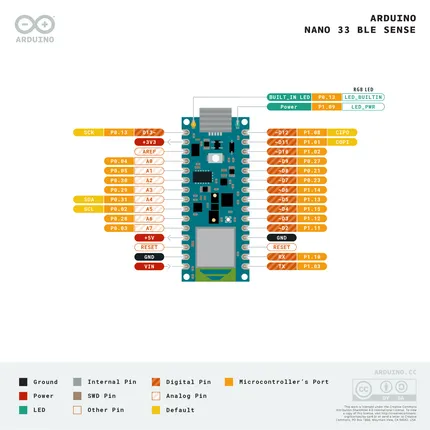
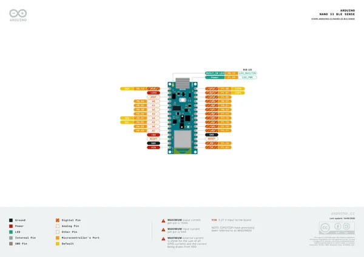
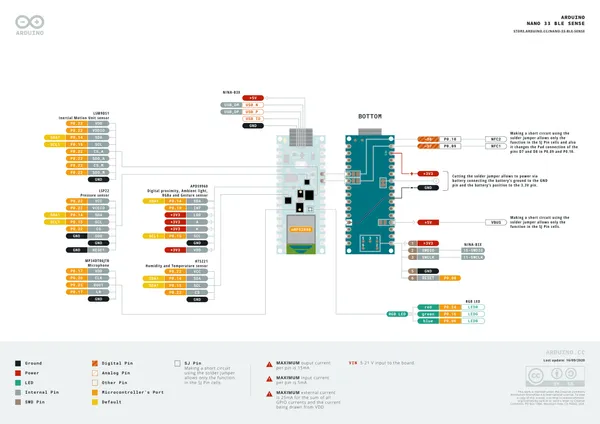

# Nano 33 BLE Sense

**Arduino** · Other

Revision: Not identified  
Coverage: Pinout image collected

[Browse all manufacturers](../../../../BROWSE.md) · [Desktop app](https://github.com/valleytechsolutions/black-wire-desktop)

## pinout

**pinout image** · Reviewed source · PNG

[Open original reference](../../../../library/media/3c2c3e7555a6c33f1e32bc6d5e64e1915882a9e1a706824bb912758f9244ecc7.png)

**Credit and rights:** Not established; source attribution retained. Source/manufacturer: Arduino.

[Source 1](https://raw.githubusercontent.com/arduino/docs-content/dab66ecbd6ad52cd742da6c19c5b6330a7f2caae/content/hardware/nano/boards/nano-33-ble-sense/datasheet/assets/pinout.png) · [Source 2](https://docs.arduino.cc/hardware/nano-33-ble-sense/) · [Source 3](https://github.com/arduino/docs-content/blob/dab66ecbd6ad52cd742da6c19c5b6330a7f2caae/content/hardware/nano/boards/nano-33-ble-sense/product.md) · [Source 4](https://github.com/arduino/docs-content/blob/dab66ecbd6ad52cd742da6c19c5b6330a7f2caae/content/hardware/nano/boards/nano-33-ble-sense/datasheet/assets/pinout.png)

Official Arduino documentation repository pinned at dab66ecbd6ad52cd742da6c19c5b6330a7f2caae. Match the board model, SKU and revision printed on each source sheet; lifecycle is not inferred from repository folder placement.

SHA-256: `3c2c3e7555a6c33f1e32bc6d5e64e1915882a9e1a706824bb912758f9244ecc7`

## pinout

**pinout image** · Reviewed source · PNG

[Open original reference](../../../../library/media/94a19c438b108b8388e59988a42ab8ef8885b37de215006e440d7fca69894b84.png)

**Credit and rights:** Not established; source attribution retained. Source/manufacturer: Arduino.

[Source 1](https://raw.githubusercontent.com/arduino/docs-content/dab66ecbd6ad52cd742da6c19c5b6330a7f2caae/content/hardware/nano/boards/nano-33-ble-sense/tutorials/cheat-sheet/assets/pinout.png) · [Source 2](https://docs.arduino.cc/hardware/nano-33-ble-sense/) · [Source 3](https://github.com/arduino/docs-content/blob/dab66ecbd6ad52cd742da6c19c5b6330a7f2caae/content/hardware/nano/boards/nano-33-ble-sense/product.md) · [Source 4](https://github.com/arduino/docs-content/blob/dab66ecbd6ad52cd742da6c19c5b6330a7f2caae/content/hardware/nano/boards/nano-33-ble-sense/tutorials/cheat-sheet/assets/pinout.png)

Official Arduino documentation repository pinned at dab66ecbd6ad52cd742da6c19c5b6330a7f2caae. Match the board model, SKU and revision printed on each source sheet; lifecycle is not inferred from repository folder placement.

SHA-256: `94a19c438b108b8388e59988a42ab8ef8885b37de215006e440d7fca69894b84`

## Official full pinout - page 1

**pinout image** · Reviewed source · PNG

[Open original reference](../../../../library/media/dde4050b9d0f054cd61ac07202adea58c9c16ab79ed2505fcc6de60bbf4fe2d1.png)

**Credit and rights:** CC BY-SA 4.0 notice printed in the original PDF; preserve attribution and verify scope for publication.. Source/manufacturer: Arduino.

[Source 1](https://raw.githubusercontent.com/arduino/docs-content/dab66ecbd6ad52cd742da6c19c5b6330a7f2caae/content/hardware/nano/boards/nano-33-ble-sense/downloads/ABX00031-full-pinout.pdf) · [Source 2](https://docs.arduino.cc/hardware/nano-33-ble-sense/) · [Source 3](https://github.com/arduino/docs-content/blob/dab66ecbd6ad52cd742da6c19c5b6330a7f2caae/content/hardware/nano/boards/nano-33-ble-sense/product.md) · [Source 4](https://github.com/arduino/docs-content/blob/dab66ecbd6ad52cd742da6c19c5b6330a7f2caae/content/hardware/nano/boards/nano-33-ble-sense/downloads/ABX00031-full-pinout.pdf)

Official Arduino documentation repository pinned at dab66ecbd6ad52cd742da6c19c5b6330a7f2caae. Match the board model, SKU and revision printed on each source sheet; lifecycle is not inferred from repository folder placement. Original PDF page 1 rendered at 220 dpi; no labels changed.

SHA-256: `dde4050b9d0f054cd61ac07202adea58c9c16ab79ed2505fcc6de60bbf4fe2d1`

## Official full pinout - page 2

**pinout image** · Reviewed source · PNG

[Open original reference](../../../../library/media/33dc6f070e92fe9635cab21aa0f4d28bacd9086e3dc888747beb003c94114f6e.png)

**Credit and rights:** CC BY-SA 4.0 notice printed in the original PDF; preserve attribution and verify scope for publication.. Source/manufacturer: Arduino.

[Source 1](https://raw.githubusercontent.com/arduino/docs-content/dab66ecbd6ad52cd742da6c19c5b6330a7f2caae/content/hardware/nano/boards/nano-33-ble-sense/downloads/ABX00031-full-pinout.pdf) · [Source 2](https://docs.arduino.cc/hardware/nano-33-ble-sense/) · [Source 3](https://github.com/arduino/docs-content/blob/dab66ecbd6ad52cd742da6c19c5b6330a7f2caae/content/hardware/nano/boards/nano-33-ble-sense/product.md) · [Source 4](https://github.com/arduino/docs-content/blob/dab66ecbd6ad52cd742da6c19c5b6330a7f2caae/content/hardware/nano/boards/nano-33-ble-sense/downloads/ABX00031-full-pinout.pdf)

Official Arduino documentation repository pinned at dab66ecbd6ad52cd742da6c19c5b6330a7f2caae. Match the board model, SKU and revision printed on each source sheet; lifecycle is not inferred from repository folder placement. Original PDF page 2 rendered at 220 dpi; no labels changed.

SHA-256: `33dc6f070e92fe9635cab21aa0f4d28bacd9086e3dc888747beb003c94114f6e`

## Full board pinout PDF

**original reference PDF** · Reviewed source · PDF

[Open original reference](../../../../library/media/cd0ee595327f1eb693b371ebcb81e84cb0c4b56a6280eccfc95a6e8bd3f98078.pdf)

**Credit and rights:** Not established; source attribution retained. Source/manufacturer: Arduino.

[Source 1](https://raw.githubusercontent.com/arduino/docs-content/dab66ecbd6ad52cd742da6c19c5b6330a7f2caae/content/hardware/nano/boards/nano-33-ble-sense/downloads/ABX00031-full-pinout.pdf) · [Source 2](https://docs.arduino.cc/hardware/nano-33-ble-sense/) · [Source 3](https://github.com/arduino/docs-content/blob/dab66ecbd6ad52cd742da6c19c5b6330a7f2caae/content/hardware/nano/boards/nano-33-ble-sense/product.md) · [Source 4](https://github.com/arduino/docs-content/blob/dab66ecbd6ad52cd742da6c19c5b6330a7f2caae/content/hardware/nano/boards/nano-33-ble-sense/downloads/ABX00031-full-pinout.pdf)

Official Arduino documentation repository pinned at dab66ecbd6ad52cd742da6c19c5b6330a7f2caae. Match the board model, SKU and revision printed on each source sheet; lifecycle is not inferred from repository folder placement.

SHA-256: `cd0ee595327f1eb693b371ebcb81e84cb0c4b56a6280eccfc95a6e8bd3f98078`

Pin assignments have not been independently electrically verified. Check board revision before wiring.
