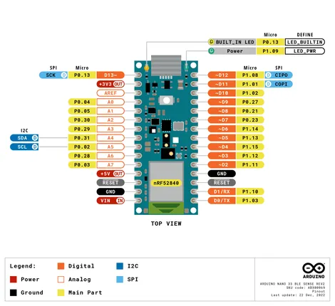
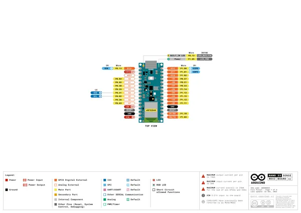
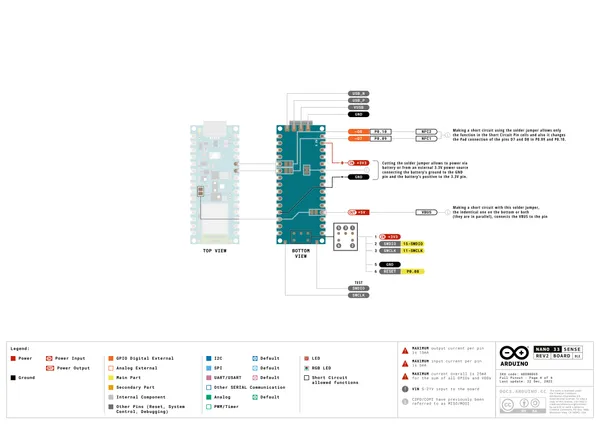
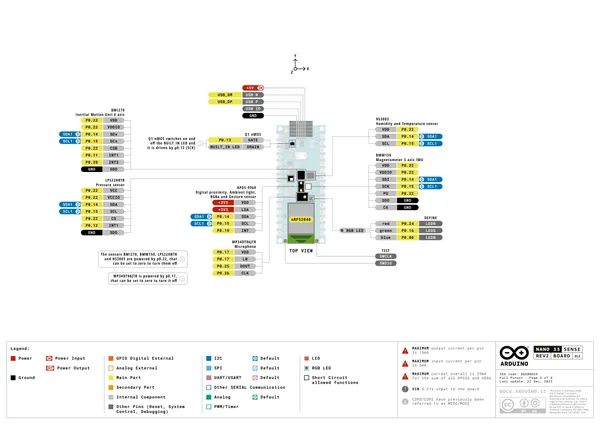

# Nano 33 BLE Sense Rev2

**Arduino** · Other

Revision: Not identified  
Coverage: Pinout image collected

[Browse all manufacturers](../../../../BROWSE.md) · [Desktop app](https://github.com/valleytechsolutions/black-wire-desktop)

## pinout

**pinout image** · Reviewed source · PNG

[Open original reference](../../../../library/media/3c2c3e7555a6c33f1e32bc6d5e64e1915882a9e1a706824bb912758f9244ecc7.png)

**Credit and rights:** Not established; source attribution retained. Source/manufacturer: Arduino.

[Source 1](https://raw.githubusercontent.com/arduino/docs-content/dab66ecbd6ad52cd742da6c19c5b6330a7f2caae/content/hardware/nano/boards/nano-33-ble-sense-rev2/datasheet/assets/pinout.png) · [Source 2](https://docs.arduino.cc/hardware/nano-33-ble-sense-rev2/) · [Source 3](https://github.com/arduino/docs-content/blob/dab66ecbd6ad52cd742da6c19c5b6330a7f2caae/content/hardware/nano/boards/nano-33-ble-sense-rev2/product.md) · [Source 4](https://github.com/arduino/docs-content/blob/dab66ecbd6ad52cd742da6c19c5b6330a7f2caae/content/hardware/nano/boards/nano-33-ble-sense-rev2/datasheet/assets/pinout.png)

Official Arduino documentation repository pinned at dab66ecbd6ad52cd742da6c19c5b6330a7f2caae. Match the board model, SKU and revision printed on each source sheet; lifecycle is not inferred from repository folder placement.

SHA-256: `3c2c3e7555a6c33f1e32bc6d5e64e1915882a9e1a706824bb912758f9244ecc7`

## pinout

**pinout image** · Reviewed source · PNG

[Open original reference](../../../../library/media/a28b9e28f8559c319bf44d2b19e6e6701faaf28e11e6f4d31fc5265286cf3dee.png)

**Credit and rights:** Not established; source attribution retained. Source/manufacturer: Arduino.

[Source 1](https://raw.githubusercontent.com/arduino/docs-content/dab66ecbd6ad52cd742da6c19c5b6330a7f2caae/content/hardware/nano/boards/nano-33-ble-sense-rev2/tutorials/cheat-sheet/assets/pinout.png) · [Source 2](https://docs.arduino.cc/hardware/nano-33-ble-sense-rev2/) · [Source 3](https://github.com/arduino/docs-content/blob/dab66ecbd6ad52cd742da6c19c5b6330a7f2caae/content/hardware/nano/boards/nano-33-ble-sense-rev2/product.md) · [Source 4](https://github.com/arduino/docs-content/blob/dab66ecbd6ad52cd742da6c19c5b6330a7f2caae/content/hardware/nano/boards/nano-33-ble-sense-rev2/tutorials/cheat-sheet/assets/pinout.png)

Official Arduino documentation repository pinned at dab66ecbd6ad52cd742da6c19c5b6330a7f2caae. Match the board model, SKU and revision printed on each source sheet; lifecycle is not inferred from repository folder placement.

SHA-256: `a28b9e28f8559c319bf44d2b19e6e6701faaf28e11e6f4d31fc5265286cf3dee`

## Official full pinout - page 1

**pinout image** · Reviewed source · PNG

[Open original reference](../../../../library/media/37bb6f9d596ef3a55252d10341a3f0f77e91968d53495b5f8fa81b5523b10aef.png)

**Credit and rights:** CC BY-SA 4.0 notice printed in the original PDF; preserve attribution and verify scope for publication.. Source/manufacturer: Arduino.

[Source 1](https://raw.githubusercontent.com/arduino/docs-content/dab66ecbd6ad52cd742da6c19c5b6330a7f2caae/content/hardware/nano/boards/nano-33-ble-sense-rev2/downloads/ABX00069-full-pinout.pdf) · [Source 2](https://docs.arduino.cc/hardware/nano-33-ble-sense-rev2/) · [Source 3](https://github.com/arduino/docs-content/blob/dab66ecbd6ad52cd742da6c19c5b6330a7f2caae/content/hardware/nano/boards/nano-33-ble-sense-rev2/product.md) · [Source 4](https://github.com/arduino/docs-content/blob/dab66ecbd6ad52cd742da6c19c5b6330a7f2caae/content/hardware/nano/boards/nano-33-ble-sense-rev2/downloads/ABX00069-full-pinout.pdf)

Official Arduino documentation repository pinned at dab66ecbd6ad52cd742da6c19c5b6330a7f2caae. Match the board model, SKU and revision printed on each source sheet; lifecycle is not inferred from repository folder placement. Original PDF page 1 rendered at 220 dpi; no labels changed.

SHA-256: `37bb6f9d596ef3a55252d10341a3f0f77e91968d53495b5f8fa81b5523b10aef`

## Official full pinout - page 4

**pinout image** · Reviewed source · PNG

[Open original reference](../../../../library/media/fa2c069359ba73eedb823ea7c070ceb65b7ed667a8a2a1fbb290fbc84ef328ec.png)

**Credit and rights:** CC BY-SA 4.0 notice printed in the original PDF; preserve attribution and verify scope for publication.. Source/manufacturer: Arduino.

[Source 1](https://raw.githubusercontent.com/arduino/docs-content/dab66ecbd6ad52cd742da6c19c5b6330a7f2caae/content/hardware/nano/boards/nano-33-ble-sense-rev2/downloads/ABX00069-full-pinout.pdf) · [Source 2](https://docs.arduino.cc/hardware/nano-33-ble-sense-rev2/) · [Source 3](https://github.com/arduino/docs-content/blob/dab66ecbd6ad52cd742da6c19c5b6330a7f2caae/content/hardware/nano/boards/nano-33-ble-sense-rev2/product.md) · [Source 4](https://github.com/arduino/docs-content/blob/dab66ecbd6ad52cd742da6c19c5b6330a7f2caae/content/hardware/nano/boards/nano-33-ble-sense-rev2/downloads/ABX00069-full-pinout.pdf)

Official Arduino documentation repository pinned at dab66ecbd6ad52cd742da6c19c5b6330a7f2caae. Match the board model, SKU and revision printed on each source sheet; lifecycle is not inferred from repository folder placement. Original PDF page 4 rendered at 220 dpi; no labels changed.

SHA-256: `fa2c069359ba73eedb823ea7c070ceb65b7ed667a8a2a1fbb290fbc84ef328ec`

## Official full pinout - page 3

**GPIO reference image** · Reviewed source · PNG

[Open original reference](../../../../library/media/dae323ae2d04e293c3a9c581905eaf1c98ff1fa0fd734248c02a5df07703cb0a.png)

**Credit and rights:** CC BY-SA 4.0 notice printed in the original PDF; preserve attribution and verify scope for publication.. Source/manufacturer: Arduino.

[Source 1](https://raw.githubusercontent.com/arduino/docs-content/dab66ecbd6ad52cd742da6c19c5b6330a7f2caae/content/hardware/nano/boards/nano-33-ble-sense-rev2/downloads/ABX00069-full-pinout.pdf) · [Source 2](https://docs.arduino.cc/hardware/nano-33-ble-sense-rev2/) · [Source 3](https://github.com/arduino/docs-content/blob/dab66ecbd6ad52cd742da6c19c5b6330a7f2caae/content/hardware/nano/boards/nano-33-ble-sense-rev2/product.md) · [Source 4](https://github.com/arduino/docs-content/blob/dab66ecbd6ad52cd742da6c19c5b6330a7f2caae/content/hardware/nano/boards/nano-33-ble-sense-rev2/downloads/ABX00069-full-pinout.pdf)

Official Arduino documentation repository pinned at dab66ecbd6ad52cd742da6c19c5b6330a7f2caae. Match the board model, SKU and revision printed on each source sheet; lifecycle is not inferred from repository folder placement. Original PDF page 3 rendered at 220 dpi; no labels changed.

SHA-256: `dae323ae2d04e293c3a9c581905eaf1c98ff1fa0fd734248c02a5df07703cb0a`

## Full board pinout PDF

**original reference PDF** · Reviewed source · PDF

[Open original reference](../../../../library/media/ef39158198f440c89aaba1412e56af93da83a4af3f44f30ba601b90d020ee879.pdf)

**Credit and rights:** Not established; source attribution retained. Source/manufacturer: Arduino.

[Source 1](https://raw.githubusercontent.com/arduino/docs-content/dab66ecbd6ad52cd742da6c19c5b6330a7f2caae/content/hardware/nano/boards/nano-33-ble-sense-rev2/downloads/ABX00069-full-pinout.pdf) · [Source 2](https://docs.arduino.cc/hardware/nano-33-ble-sense-rev2/) · [Source 3](https://github.com/arduino/docs-content/blob/dab66ecbd6ad52cd742da6c19c5b6330a7f2caae/content/hardware/nano/boards/nano-33-ble-sense-rev2/product.md) · [Source 4](https://github.com/arduino/docs-content/blob/dab66ecbd6ad52cd742da6c19c5b6330a7f2caae/content/hardware/nano/boards/nano-33-ble-sense-rev2/downloads/ABX00069-full-pinout.pdf)

Official Arduino documentation repository pinned at dab66ecbd6ad52cd742da6c19c5b6330a7f2caae. Match the board model, SKU and revision printed on each source sheet; lifecycle is not inferred from repository folder placement.

SHA-256: `ef39158198f440c89aaba1412e56af93da83a4af3f44f30ba601b90d020ee879`

Pin assignments have not been independently electrically verified. Check board revision before wiring.
