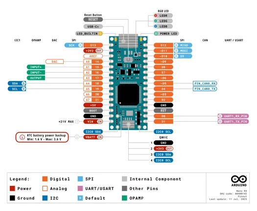
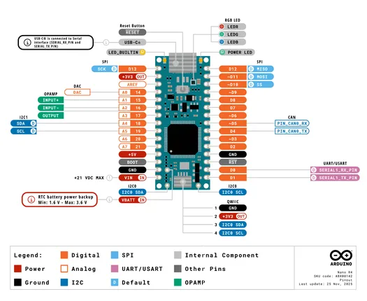

# Nano R4

**Arduino** · Other

Revision: Not identified  
Coverage: Pinout image collected

[Browse all manufacturers](../../../../BROWSE.md) · [Desktop app](https://github.com/valleytechsolutions/black-wire-desktop)

## ABX00142-pinout

**pinout image** · Reviewed source · PNG

[Open original reference](../../../../library/media/af2026b74c5cdb9a99d4c19d3725cc7b4e32ddb6b79ec6d30c4c39709f08eb4e.png)

**Credit and rights:** Not established; source attribution retained. Source/manufacturer: Arduino.

[Source 1](https://raw.githubusercontent.com/arduino/docs-content/dab66ecbd6ad52cd742da6c19c5b6330a7f2caae/content/hardware/nano/boards/nano-r4/datasheet/assets/ABX00142-pinout.png) · [Source 2](https://docs.arduino.cc/hardware/nano-r4/) · [Source 3](https://github.com/arduino/docs-content/blob/dab66ecbd6ad52cd742da6c19c5b6330a7f2caae/content/hardware/nano/boards/nano-r4/product.md) · [Source 4](https://github.com/arduino/docs-content/blob/dab66ecbd6ad52cd742da6c19c5b6330a7f2caae/content/hardware/nano/boards/nano-r4/datasheet/assets/ABX00142-pinout.png)

Official Arduino documentation repository pinned at dab66ecbd6ad52cd742da6c19c5b6330a7f2caae. Match the board model, SKU and revision printed on each source sheet; lifecycle is not inferred from repository folder placement.

SHA-256: `af2026b74c5cdb9a99d4c19d3725cc7b4e32ddb6b79ec6d30c4c39709f08eb4e`

## simple-pinout

**pinout image** · Reviewed source · PNG

[Open original reference](../../../../library/media/91d22ca132208da48c12e6b3e9c48c9864516b5e00a18d2c505df92c912ef44a.png)

**Credit and rights:** Not established; source attribution retained. Source/manufacturer: Arduino.

[Source 1](https://raw.githubusercontent.com/arduino/docs-content/dab66ecbd6ad52cd742da6c19c5b6330a7f2caae/content/hardware/nano/boards/nano-r4/tutorials/01.user-manual/assets/simple-pinout.png) · [Source 2](https://docs.arduino.cc/hardware/nano-r4/) · [Source 3](https://github.com/arduino/docs-content/blob/dab66ecbd6ad52cd742da6c19c5b6330a7f2caae/content/hardware/nano/boards/nano-r4/product.md) · [Source 4](https://github.com/arduino/docs-content/blob/dab66ecbd6ad52cd742da6c19c5b6330a7f2caae/content/hardware/nano/boards/nano-r4/tutorials/01.user-manual/assets/simple-pinout.png)

Official Arduino documentation repository pinned at dab66ecbd6ad52cd742da6c19c5b6330a7f2caae. Match the board model, SKU and revision printed on each source sheet; lifecycle is not inferred from repository folder placement.

SHA-256: `91d22ca132208da48c12e6b3e9c48c9864516b5e00a18d2c505df92c912ef44a`

## Official full pinout - page 1

**pinout image** · Reviewed source · PNG

[Open original reference](../../../../library/media/ec831ea29c1103474c9fe4332eee42e765cb94a7398a9241a62a2e562a677a65.png)

**Credit and rights:** Not established; source attribution retained. Source/manufacturer: Arduino.

[Source 1](https://raw.githubusercontent.com/arduino/docs-content/dab66ecbd6ad52cd742da6c19c5b6330a7f2caae/content/hardware/nano/boards/nano-r4/downloads/ABX00142-full-pinout.pdf) · [Source 2](https://docs.arduino.cc/hardware/nano-r4/) · [Source 3](https://github.com/arduino/docs-content/blob/dab66ecbd6ad52cd742da6c19c5b6330a7f2caae/content/hardware/nano/boards/nano-r4/product.md) · [Source 4](https://github.com/arduino/docs-content/blob/dab66ecbd6ad52cd742da6c19c5b6330a7f2caae/content/hardware/nano/boards/nano-r4/downloads/ABX00142-full-pinout.pdf)

Official Arduino documentation repository pinned at dab66ecbd6ad52cd742da6c19c5b6330a7f2caae. Match the board model, SKU and revision printed on each source sheet; lifecycle is not inferred from repository folder placement. Original PDF page 1 rendered at 220 dpi; no labels changed.

SHA-256: `ec831ea29c1103474c9fe4332eee42e765cb94a7398a9241a62a2e562a677a65`

## Full board pinout PDF

**original reference PDF** · Reviewed source · PDF

[Open original reference](../../../../library/media/7c38033b330807ff95c7eb79078538498e9b01b3c5acf5efde89a0d108391384.pdf)

**Credit and rights:** Not established; source attribution retained. Source/manufacturer: Arduino.

[Source 1](https://raw.githubusercontent.com/arduino/docs-content/dab66ecbd6ad52cd742da6c19c5b6330a7f2caae/content/hardware/nano/boards/nano-r4/downloads/ABX00142-full-pinout.pdf) · [Source 2](https://docs.arduino.cc/hardware/nano-r4/) · [Source 3](https://github.com/arduino/docs-content/blob/dab66ecbd6ad52cd742da6c19c5b6330a7f2caae/content/hardware/nano/boards/nano-r4/product.md) · [Source 4](https://github.com/arduino/docs-content/blob/dab66ecbd6ad52cd742da6c19c5b6330a7f2caae/content/hardware/nano/boards/nano-r4/downloads/ABX00142-full-pinout.pdf)

Official Arduino documentation repository pinned at dab66ecbd6ad52cd742da6c19c5b6330a7f2caae. Match the board model, SKU and revision printed on each source sheet; lifecycle is not inferred from repository folder placement.

SHA-256: `7c38033b330807ff95c7eb79078538498e9b01b3c5acf5efde89a0d108391384`

Pin assignments have not been independently electrically verified. Check board revision before wiring.
