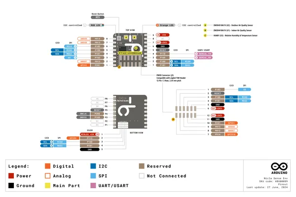
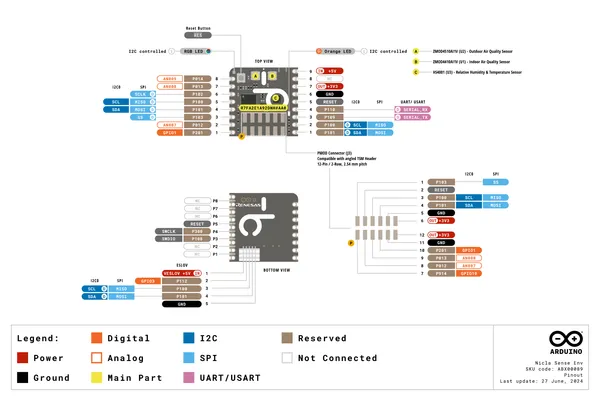

# Nicla Sense Env

**Arduino** · Other

Revision: Not identified  
Coverage: Pinout image collected

[Browse all manufacturers](../../../../BROWSE.md) · [Desktop app](https://github.com/valleytechsolutions/black-wire-desktop)

## Nicla_Sense_Env_Pinout

**pinout image** · Reviewed source · PNG

[Open original reference](../../../../library/media/be16d597d30343157c1d5d2f656fc9024fdcc4b0332e1aceb2f3ce9878434aeb.png)

**Credit and rights:** Not established; source attribution retained. Source/manufacturer: Arduino.

[Source 1](https://raw.githubusercontent.com/arduino/docs-content/dab66ecbd6ad52cd742da6c19c5b6330a7f2caae/content/hardware/nicla/boards/nicla-sense-env/datasheet/assets/Nicla_Sense_Env_Pinout.png) · [Source 2](https://docs.arduino.cc/hardware/nicla-sense-env/) · [Source 3](https://github.com/arduino/docs-content/blob/dab66ecbd6ad52cd742da6c19c5b6330a7f2caae/content/hardware/nicla/boards/nicla-sense-env/product.md) · [Source 4](https://github.com/arduino/docs-content/blob/dab66ecbd6ad52cd742da6c19c5b6330a7f2caae/content/hardware/nicla/boards/nicla-sense-env/datasheet/assets/Nicla_Sense_Env_Pinout.png)

Official Arduino documentation repository pinned at dab66ecbd6ad52cd742da6c19c5b6330a7f2caae. Match the board model, SKU and revision printed on each source sheet; lifecycle is not inferred from repository folder placement.

SHA-256: `be16d597d30343157c1d5d2f656fc9024fdcc4b0332e1aceb2f3ce9878434aeb`

## Official full pinout - page 1

**pinout image** · Reviewed source · PNG

[Open original reference](../../../../library/media/59c70532a0e5af39a3d05261753c1234545de8090e6815c83da1065fa82bdbea.png)

**Credit and rights:** Not established; source attribution retained. Source/manufacturer: Arduino.

[Source 1](https://raw.githubusercontent.com/arduino/docs-content/dab66ecbd6ad52cd742da6c19c5b6330a7f2caae/content/hardware/nicla/boards/nicla-sense-env/downloads/ABX00089-full-pinout.pdf) · [Source 2](https://docs.arduino.cc/hardware/nicla-sense-env/) · [Source 3](https://github.com/arduino/docs-content/blob/dab66ecbd6ad52cd742da6c19c5b6330a7f2caae/content/hardware/nicla/boards/nicla-sense-env/product.md) · [Source 4](https://github.com/arduino/docs-content/blob/dab66ecbd6ad52cd742da6c19c5b6330a7f2caae/content/hardware/nicla/boards/nicla-sense-env/downloads/ABX00089-full-pinout.pdf)

Official Arduino documentation repository pinned at dab66ecbd6ad52cd742da6c19c5b6330a7f2caae. Match the board model, SKU and revision printed on each source sheet; lifecycle is not inferred from repository folder placement. Original PDF page 1 rendered at 220 dpi; no labels changed.

SHA-256: `59c70532a0e5af39a3d05261753c1234545de8090e6815c83da1065fa82bdbea`

## Full board pinout PDF

**original reference PDF** · Reviewed source · PDF

[Open original reference](../../../../library/media/b31f8e9075ba5738714fed54729d947af2e1d08e1942a6450b9c6ae9b661cbbe.pdf)

**Credit and rights:** Not established; source attribution retained. Source/manufacturer: Arduino.

[Source 1](https://raw.githubusercontent.com/arduino/docs-content/dab66ecbd6ad52cd742da6c19c5b6330a7f2caae/content/hardware/nicla/boards/nicla-sense-env/downloads/ABX00089-full-pinout.pdf) · [Source 2](https://docs.arduino.cc/hardware/nicla-sense-env/) · [Source 3](https://github.com/arduino/docs-content/blob/dab66ecbd6ad52cd742da6c19c5b6330a7f2caae/content/hardware/nicla/boards/nicla-sense-env/product.md) · [Source 4](https://github.com/arduino/docs-content/blob/dab66ecbd6ad52cd742da6c19c5b6330a7f2caae/content/hardware/nicla/boards/nicla-sense-env/downloads/ABX00089-full-pinout.pdf)

Official Arduino documentation repository pinned at dab66ecbd6ad52cd742da6c19c5b6330a7f2caae. Match the board model, SKU and revision printed on each source sheet; lifecycle is not inferred from repository folder placement.

SHA-256: `b31f8e9075ba5738714fed54729d947af2e1d08e1942a6450b9c6ae9b661cbbe`

Pin assignments have not been independently electrically verified. Check board revision before wiring.
