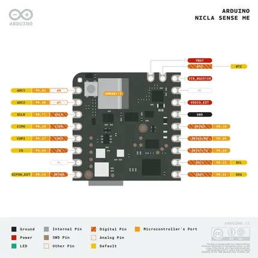
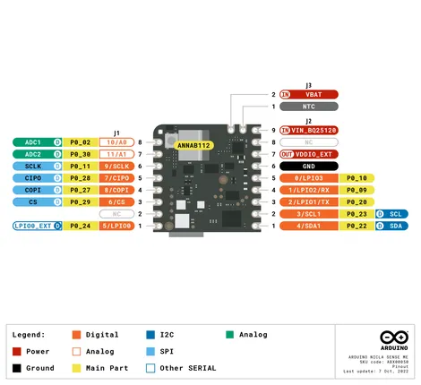
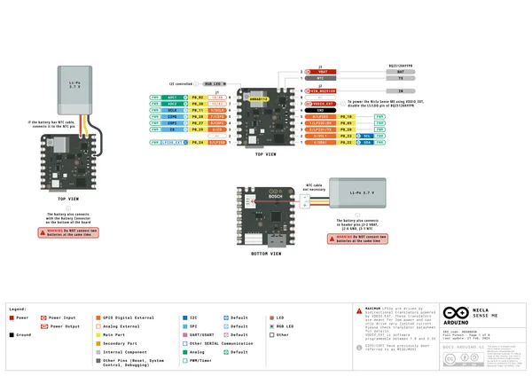
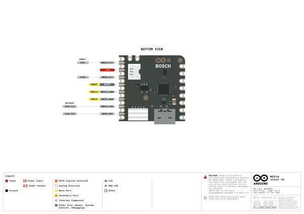
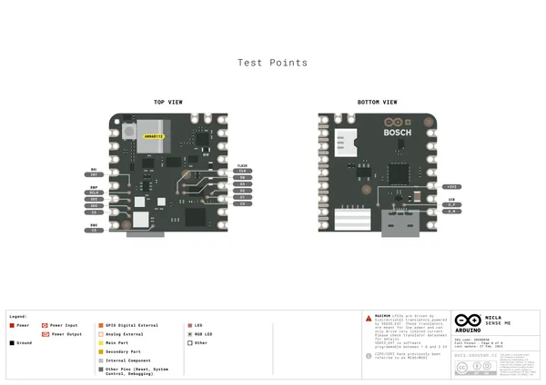
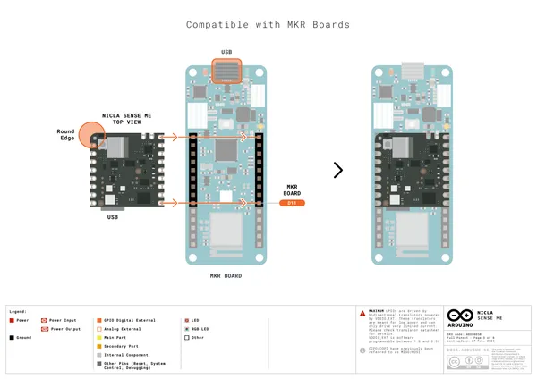
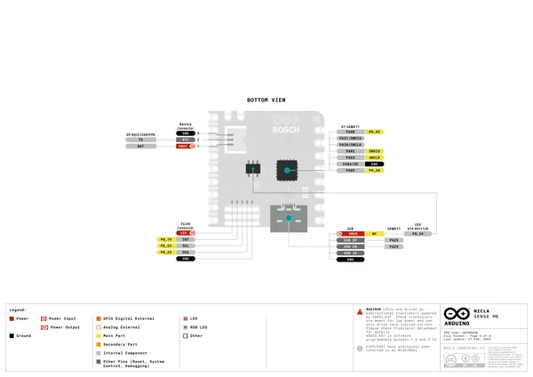
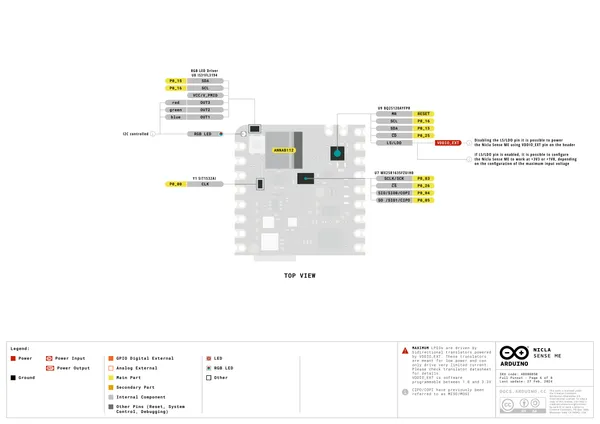
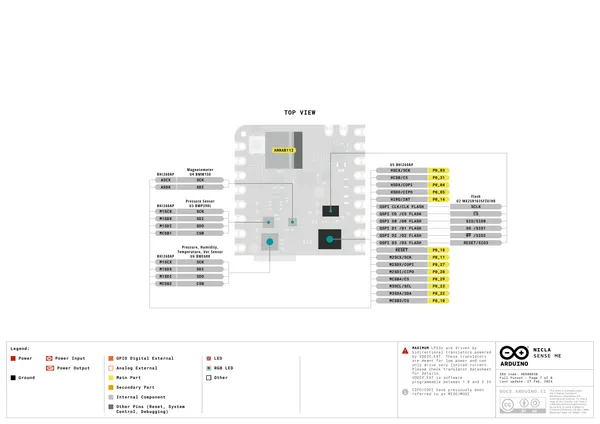

# Nicla Sense ME

**Arduino** · Other

Revision: Not identified  
Coverage: Pinout image collected

[Browse all manufacturers](../../../../BROWSE.md) · [Desktop app](https://github.com/valleytechsolutions/black-wire-desktop)

## AKX00050-pinout

**pinout image** · Reviewed source · PNG

[Open original reference](../../../../library/media/3d065f3347ef3f95f49dca150dc448f51823071758e15453ad52e2bd4989c251.png)

**Credit and rights:** Not established; source attribution retained. Source/manufacturer: Arduino.

[Source 1](https://raw.githubusercontent.com/arduino/docs-content/dab66ecbd6ad52cd742da6c19c5b6330a7f2caae/content/hardware/nicla/boards/nicla-sense-me/tutorials/cheat-sheet/assets/AKX00050-pinout.png) · [Source 2](https://docs.arduino.cc/hardware/nicla-sense-me/) · [Source 3](https://github.com/arduino/docs-content/blob/dab66ecbd6ad52cd742da6c19c5b6330a7f2caae/content/hardware/nicla/boards/nicla-sense-me/product.md) · [Source 4](https://github.com/arduino/docs-content/blob/dab66ecbd6ad52cd742da6c19c5b6330a7f2caae/content/hardware/nicla/boards/nicla-sense-me/tutorials/cheat-sheet/assets/AKX00050-pinout.png)

Official Arduino documentation repository pinned at dab66ecbd6ad52cd742da6c19c5b6330a7f2caae. Match the board model, SKU and revision printed on each source sheet; lifecycle is not inferred from repository folder placement.

SHA-256: `3d065f3347ef3f95f49dca150dc448f51823071758e15453ad52e2bd4989c251`

## simple-pinout

**pinout image** · Reviewed source · PNG

[Open original reference](../../../../library/media/66b44b4290d1c8811242a30b964baef73f00cefafe77ace665c985084d21b59d.png)

**Credit and rights:** Not established; source attribution retained. Source/manufacturer: Arduino.

[Source 1](https://raw.githubusercontent.com/arduino/docs-content/dab66ecbd6ad52cd742da6c19c5b6330a7f2caae/content/hardware/nicla/boards/nicla-sense-me/tutorials/user-manual/assets/simple-pinout.png) · [Source 2](https://docs.arduino.cc/hardware/nicla-sense-me/) · [Source 3](https://github.com/arduino/docs-content/blob/dab66ecbd6ad52cd742da6c19c5b6330a7f2caae/content/hardware/nicla/boards/nicla-sense-me/product.md) · [Source 4](https://github.com/arduino/docs-content/blob/dab66ecbd6ad52cd742da6c19c5b6330a7f2caae/content/hardware/nicla/boards/nicla-sense-me/tutorials/user-manual/assets/simple-pinout.png)

Official Arduino documentation repository pinned at dab66ecbd6ad52cd742da6c19c5b6330a7f2caae. Match the board model, SKU and revision printed on each source sheet; lifecycle is not inferred from repository folder placement.

SHA-256: `66b44b4290d1c8811242a30b964baef73f00cefafe77ace665c985084d21b59d`

## Official full pinout - page 1

**pinout image** · Reviewed source · PNG

[Open original reference](../../../../library/media/13996149d748d72edbc66f2602d403ac39455faca28263a81dc1bb9529995abb.png)

**Credit and rights:** CC BY-SA 4.0 notice printed in the original PDF; preserve attribution and verify scope for publication.. Source/manufacturer: Arduino.

[Source 1](https://raw.githubusercontent.com/arduino/docs-content/dab66ecbd6ad52cd742da6c19c5b6330a7f2caae/content/hardware/nicla/boards/nicla-sense-me/downloads/ABX00050-full-pinout.pdf) · [Source 2](https://docs.arduino.cc/hardware/nicla-sense-me/) · [Source 3](https://github.com/arduino/docs-content/blob/dab66ecbd6ad52cd742da6c19c5b6330a7f2caae/content/hardware/nicla/boards/nicla-sense-me/product.md) · [Source 4](https://github.com/arduino/docs-content/blob/dab66ecbd6ad52cd742da6c19c5b6330a7f2caae/content/hardware/nicla/boards/nicla-sense-me/downloads/ABX00050-full-pinout.pdf)

Official Arduino documentation repository pinned at dab66ecbd6ad52cd742da6c19c5b6330a7f2caae. Match the board model, SKU and revision printed on each source sheet; lifecycle is not inferred from repository folder placement. Original PDF page 1 rendered at 220 dpi; no labels changed.

SHA-256: `13996149d748d72edbc66f2602d403ac39455faca28263a81dc1bb9529995abb`

## Official full pinout - page 2

**pinout image** · Reviewed source · PNG

[Open original reference](../../../../library/media/d825ed898fdd408ae3711db4f454b7b104f8c71b83c1367f7aa738c0285fc72d.png)

**Credit and rights:** CC BY-SA 4.0 notice printed in the original PDF; preserve attribution and verify scope for publication.. Source/manufacturer: Arduino.

[Source 1](https://raw.githubusercontent.com/arduino/docs-content/dab66ecbd6ad52cd742da6c19c5b6330a7f2caae/content/hardware/nicla/boards/nicla-sense-me/downloads/ABX00050-full-pinout.pdf) · [Source 2](https://docs.arduino.cc/hardware/nicla-sense-me/) · [Source 3](https://github.com/arduino/docs-content/blob/dab66ecbd6ad52cd742da6c19c5b6330a7f2caae/content/hardware/nicla/boards/nicla-sense-me/product.md) · [Source 4](https://github.com/arduino/docs-content/blob/dab66ecbd6ad52cd742da6c19c5b6330a7f2caae/content/hardware/nicla/boards/nicla-sense-me/downloads/ABX00050-full-pinout.pdf)

Official Arduino documentation repository pinned at dab66ecbd6ad52cd742da6c19c5b6330a7f2caae. Match the board model, SKU and revision printed on each source sheet; lifecycle is not inferred from repository folder placement. Original PDF page 2 rendered at 220 dpi; no labels changed.

SHA-256: `d825ed898fdd408ae3711db4f454b7b104f8c71b83c1367f7aa738c0285fc72d`

## Official full pinout - page 8

**pinout image** · Reviewed source · PNG

[Open original reference](../../../../library/media/937879b1d2cefb1bbb5cfc1fae5c1f05601d867d7a8feff5e48df98f4e8a0a30.png)

**Credit and rights:** CC BY-SA 4.0 notice printed in the original PDF; preserve attribution and verify scope for publication.. Source/manufacturer: Arduino.

[Source 1](https://raw.githubusercontent.com/arduino/docs-content/dab66ecbd6ad52cd742da6c19c5b6330a7f2caae/content/hardware/nicla/boards/nicla-sense-me/downloads/ABX00050-full-pinout.pdf) · [Source 2](https://docs.arduino.cc/hardware/nicla-sense-me/) · [Source 3](https://github.com/arduino/docs-content/blob/dab66ecbd6ad52cd742da6c19c5b6330a7f2caae/content/hardware/nicla/boards/nicla-sense-me/product.md) · [Source 4](https://github.com/arduino/docs-content/blob/dab66ecbd6ad52cd742da6c19c5b6330a7f2caae/content/hardware/nicla/boards/nicla-sense-me/downloads/ABX00050-full-pinout.pdf)

Official Arduino documentation repository pinned at dab66ecbd6ad52cd742da6c19c5b6330a7f2caae. Match the board model, SKU and revision printed on each source sheet; lifecycle is not inferred from repository folder placement. Original PDF page 8 rendered at 220 dpi; no labels changed.

SHA-256: `937879b1d2cefb1bbb5cfc1fae5c1f05601d867d7a8feff5e48df98f4e8a0a30`

## Official full pinout - page 3

**GPIO reference image** · Reviewed source · PNG

[Open original reference](../../../../library/media/5ff75fd0018ef0ad31d48ba499ad00652b7684696be7bec77bf4f23d9a6ffe93.png)

**Credit and rights:** CC BY-SA 4.0 notice printed in the original PDF; preserve attribution and verify scope for publication.. Source/manufacturer: Arduino.

[Source 1](https://raw.githubusercontent.com/arduino/docs-content/dab66ecbd6ad52cd742da6c19c5b6330a7f2caae/content/hardware/nicla/boards/nicla-sense-me/downloads/ABX00050-full-pinout.pdf) · [Source 2](https://docs.arduino.cc/hardware/nicla-sense-me/) · [Source 3](https://github.com/arduino/docs-content/blob/dab66ecbd6ad52cd742da6c19c5b6330a7f2caae/content/hardware/nicla/boards/nicla-sense-me/product.md) · [Source 4](https://github.com/arduino/docs-content/blob/dab66ecbd6ad52cd742da6c19c5b6330a7f2caae/content/hardware/nicla/boards/nicla-sense-me/downloads/ABX00050-full-pinout.pdf)

Official Arduino documentation repository pinned at dab66ecbd6ad52cd742da6c19c5b6330a7f2caae. Match the board model, SKU and revision printed on each source sheet; lifecycle is not inferred from repository folder placement. Original PDF page 3 rendered at 220 dpi; no labels changed.

SHA-256: `5ff75fd0018ef0ad31d48ba499ad00652b7684696be7bec77bf4f23d9a6ffe93`

## Official full pinout - page 4

**GPIO reference image** · Reviewed source · PNG

[Open original reference](../../../../library/media/c95951f965bf8bc32c38429a09e436efc641564bb70204a4c9755b8adb897686.png)

**Credit and rights:** CC BY-SA 4.0 notice printed in the original PDF; preserve attribution and verify scope for publication.. Source/manufacturer: Arduino.

[Source 1](https://raw.githubusercontent.com/arduino/docs-content/dab66ecbd6ad52cd742da6c19c5b6330a7f2caae/content/hardware/nicla/boards/nicla-sense-me/downloads/ABX00050-full-pinout.pdf) · [Source 2](https://docs.arduino.cc/hardware/nicla-sense-me/) · [Source 3](https://github.com/arduino/docs-content/blob/dab66ecbd6ad52cd742da6c19c5b6330a7f2caae/content/hardware/nicla/boards/nicla-sense-me/product.md) · [Source 4](https://github.com/arduino/docs-content/blob/dab66ecbd6ad52cd742da6c19c5b6330a7f2caae/content/hardware/nicla/boards/nicla-sense-me/downloads/ABX00050-full-pinout.pdf)

Official Arduino documentation repository pinned at dab66ecbd6ad52cd742da6c19c5b6330a7f2caae. Match the board model, SKU and revision printed on each source sheet; lifecycle is not inferred from repository folder placement. Original PDF page 4 rendered at 220 dpi; no labels changed.

SHA-256: `c95951f965bf8bc32c38429a09e436efc641564bb70204a4c9755b8adb897686`

## Official full pinout - page 6

**GPIO reference image** · Reviewed source · PNG

[Open original reference](../../../../library/media/5aa3b6ab99af9e7475f2ed7547dc773bd0b285ab1bdf9dd33202dc0d8b841607.png)

**Credit and rights:** CC BY-SA 4.0 notice printed in the original PDF; preserve attribution and verify scope for publication.. Source/manufacturer: Arduino.

[Source 1](https://raw.githubusercontent.com/arduino/docs-content/dab66ecbd6ad52cd742da6c19c5b6330a7f2caae/content/hardware/nicla/boards/nicla-sense-me/downloads/ABX00050-full-pinout.pdf) · [Source 2](https://docs.arduino.cc/hardware/nicla-sense-me/) · [Source 3](https://github.com/arduino/docs-content/blob/dab66ecbd6ad52cd742da6c19c5b6330a7f2caae/content/hardware/nicla/boards/nicla-sense-me/product.md) · [Source 4](https://github.com/arduino/docs-content/blob/dab66ecbd6ad52cd742da6c19c5b6330a7f2caae/content/hardware/nicla/boards/nicla-sense-me/downloads/ABX00050-full-pinout.pdf)

Official Arduino documentation repository pinned at dab66ecbd6ad52cd742da6c19c5b6330a7f2caae. Match the board model, SKU and revision printed on each source sheet; lifecycle is not inferred from repository folder placement. Original PDF page 6 rendered at 220 dpi; no labels changed.

SHA-256: `5aa3b6ab99af9e7475f2ed7547dc773bd0b285ab1bdf9dd33202dc0d8b841607`

## Official full pinout - page 7

**GPIO reference image** · Reviewed source · PNG

[Open original reference](../../../../library/media/48072236397ec81012c5c7e850548c14938b98ce091ec4f2c2cb6ab2bacfcd70.png)

**Credit and rights:** CC BY-SA 4.0 notice printed in the original PDF; preserve attribution and verify scope for publication.. Source/manufacturer: Arduino.

[Source 1](https://raw.githubusercontent.com/arduino/docs-content/dab66ecbd6ad52cd742da6c19c5b6330a7f2caae/content/hardware/nicla/boards/nicla-sense-me/downloads/ABX00050-full-pinout.pdf) · [Source 2](https://docs.arduino.cc/hardware/nicla-sense-me/) · [Source 3](https://github.com/arduino/docs-content/blob/dab66ecbd6ad52cd742da6c19c5b6330a7f2caae/content/hardware/nicla/boards/nicla-sense-me/product.md) · [Source 4](https://github.com/arduino/docs-content/blob/dab66ecbd6ad52cd742da6c19c5b6330a7f2caae/content/hardware/nicla/boards/nicla-sense-me/downloads/ABX00050-full-pinout.pdf)

Official Arduino documentation repository pinned at dab66ecbd6ad52cd742da6c19c5b6330a7f2caae. Match the board model, SKU and revision printed on each source sheet; lifecycle is not inferred from repository folder placement. Original PDF page 7 rendered at 220 dpi; no labels changed.

SHA-256: `48072236397ec81012c5c7e850548c14938b98ce091ec4f2c2cb6ab2bacfcd70`

## Full board pinout PDF

**original reference PDF** · Reviewed source · PDF

[Open original reference](../../../../library/media/0a65286957dc69a206aec0300d2cb0f31721ee03add3adeebffbaea329086b76.pdf)

**Credit and rights:** Not established; source attribution retained. Source/manufacturer: Arduino.

[Source 1](https://raw.githubusercontent.com/arduino/docs-content/dab66ecbd6ad52cd742da6c19c5b6330a7f2caae/content/hardware/nicla/boards/nicla-sense-me/downloads/ABX00050-full-pinout.pdf) · [Source 2](https://docs.arduino.cc/hardware/nicla-sense-me/) · [Source 3](https://github.com/arduino/docs-content/blob/dab66ecbd6ad52cd742da6c19c5b6330a7f2caae/content/hardware/nicla/boards/nicla-sense-me/product.md) · [Source 4](https://github.com/arduino/docs-content/blob/dab66ecbd6ad52cd742da6c19c5b6330a7f2caae/content/hardware/nicla/boards/nicla-sense-me/downloads/ABX00050-full-pinout.pdf)

Official Arduino documentation repository pinned at dab66ecbd6ad52cd742da6c19c5b6330a7f2caae. Match the board model, SKU and revision printed on each source sheet; lifecycle is not inferred from repository folder placement.

SHA-256: `0a65286957dc69a206aec0300d2cb0f31721ee03add3adeebffbaea329086b76`

Pin assignments have not been independently electrically verified. Check board revision before wiring.
