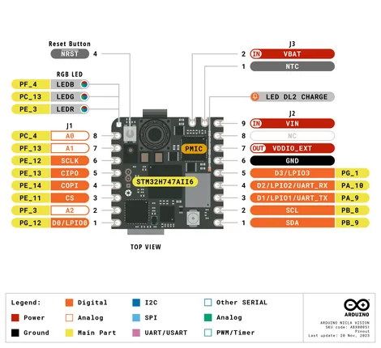
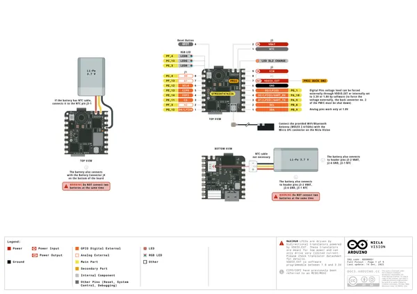
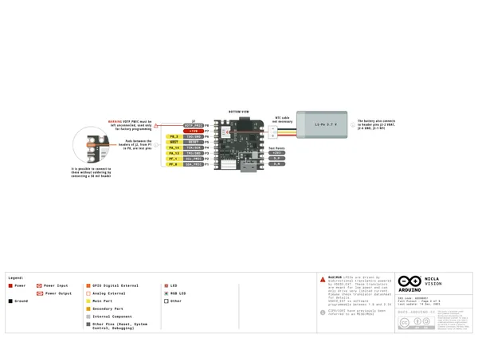
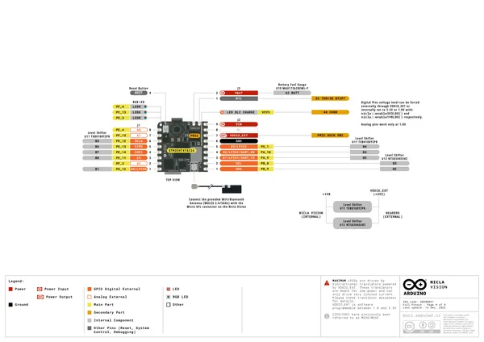
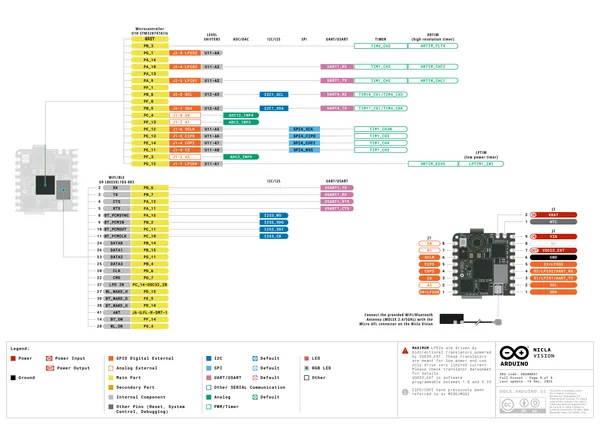
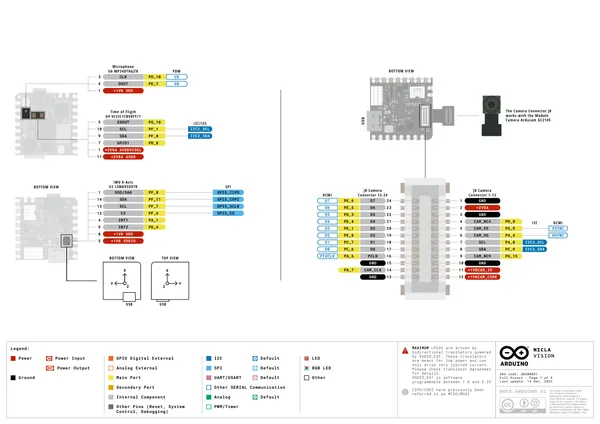
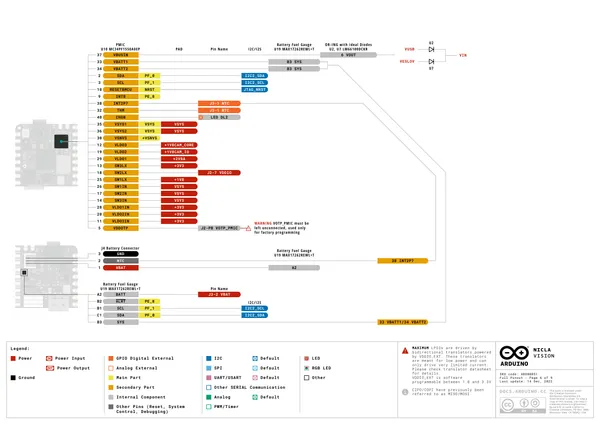
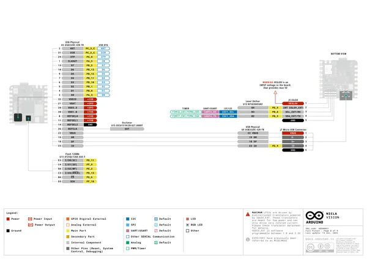
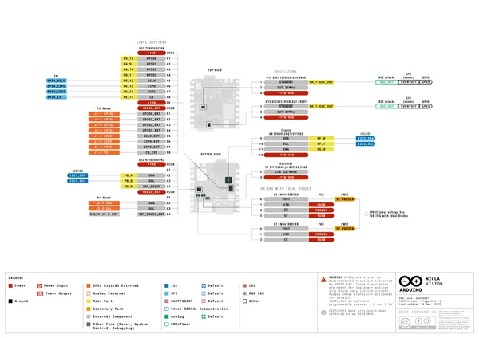

# Nicla Vision

**Arduino** · Other

Revision: Not identified  
Coverage: Pinout image collected

[Browse all manufacturers](../../../../BROWSE.md) · [Desktop app](https://github.com/valleytechsolutions/black-wire-desktop)

## ABX00051-pinout

**pinout image** · Reviewed source · PNG

[Open original reference](../../../../library/media/44cc00277f909a98fcef03bf400478d274b6e7919c485d1cad321df75c226b53.png)

**Credit and rights:** Not established; source attribution retained. Source/manufacturer: Arduino.

[Source 1](https://raw.githubusercontent.com/arduino/docs-content/dab66ecbd6ad52cd742da6c19c5b6330a7f2caae/content/hardware/nicla/boards/nicla-vision/tutorials/user-manual/assets/ABX00051-pinout.png) · [Source 2](https://docs.arduino.cc/hardware/nicla-vision/) · [Source 3](https://github.com/arduino/docs-content/blob/dab66ecbd6ad52cd742da6c19c5b6330a7f2caae/content/hardware/nicla/boards/nicla-vision/product.md) · [Source 4](https://github.com/arduino/docs-content/blob/dab66ecbd6ad52cd742da6c19c5b6330a7f2caae/content/hardware/nicla/boards/nicla-vision/tutorials/user-manual/assets/ABX00051-pinout.png)

Official Arduino documentation repository pinned at dab66ecbd6ad52cd742da6c19c5b6330a7f2caae. Match the board model, SKU and revision printed on each source sheet; lifecycle is not inferred from repository folder placement.

SHA-256: `44cc00277f909a98fcef03bf400478d274b6e7919c485d1cad321df75c226b53`

## Official full pinout - page 1

**pinout image** · Reviewed source · PNG

[Open original reference](../../../../library/media/fa9f48d1d029d7f75225a179ebdac083bf8338ad0387a6e8e253b7402f591cae.png)

**Credit and rights:** CC BY-SA 4.0 notice printed in the original PDF; preserve attribution and verify scope for publication.. Source/manufacturer: Arduino.

[Source 1](https://raw.githubusercontent.com/arduino/docs-content/dab66ecbd6ad52cd742da6c19c5b6330a7f2caae/content/hardware/nicla/boards/nicla-vision/downloads/ABX00051-full-pinout.pdf) · [Source 2](https://docs.arduino.cc/hardware/nicla-vision/) · [Source 3](https://github.com/arduino/docs-content/blob/dab66ecbd6ad52cd742da6c19c5b6330a7f2caae/content/hardware/nicla/boards/nicla-vision/product.md) · [Source 4](https://github.com/arduino/docs-content/blob/dab66ecbd6ad52cd742da6c19c5b6330a7f2caae/content/hardware/nicla/boards/nicla-vision/downloads/ABX00051-full-pinout.pdf)

Official Arduino documentation repository pinned at dab66ecbd6ad52cd742da6c19c5b6330a7f2caae. Match the board model, SKU and revision printed on each source sheet; lifecycle is not inferred from repository folder placement. Original PDF page 1 rendered at 220 dpi; no labels changed.

SHA-256: `fa9f48d1d029d7f75225a179ebdac083bf8338ad0387a6e8e253b7402f591cae`

## Official full pinout - page 2

**pinout image** · Reviewed source · PNG

[Open original reference](../../../../library/media/9d19f49410e0711a9ed7b7869b94608ee3795ae536157c63cf6d5c77e76db01b.png)

**Credit and rights:** CC BY-SA 4.0 notice printed in the original PDF; preserve attribution and verify scope for publication.. Source/manufacturer: Arduino.

[Source 1](https://raw.githubusercontent.com/arduino/docs-content/dab66ecbd6ad52cd742da6c19c5b6330a7f2caae/content/hardware/nicla/boards/nicla-vision/downloads/ABX00051-full-pinout.pdf) · [Source 2](https://docs.arduino.cc/hardware/nicla-vision/) · [Source 3](https://github.com/arduino/docs-content/blob/dab66ecbd6ad52cd742da6c19c5b6330a7f2caae/content/hardware/nicla/boards/nicla-vision/product.md) · [Source 4](https://github.com/arduino/docs-content/blob/dab66ecbd6ad52cd742da6c19c5b6330a7f2caae/content/hardware/nicla/boards/nicla-vision/downloads/ABX00051-full-pinout.pdf)

Official Arduino documentation repository pinned at dab66ecbd6ad52cd742da6c19c5b6330a7f2caae. Match the board model, SKU and revision printed on each source sheet; lifecycle is not inferred from repository folder placement. Original PDF page 2 rendered at 220 dpi; no labels changed.

SHA-256: `9d19f49410e0711a9ed7b7869b94608ee3795ae536157c63cf6d5c77e76db01b`

## Official full pinout - page 4

**pinout image** · Reviewed source · PNG

[Open original reference](../../../../library/media/7bdb3b509482f90f421a3ac1f32506c891ceb8578a19bb46b3857d84b59f5101.png)

**Credit and rights:** CC BY-SA 4.0 notice printed in the original PDF; preserve attribution and verify scope for publication.. Source/manufacturer: Arduino.

[Source 1](https://raw.githubusercontent.com/arduino/docs-content/dab66ecbd6ad52cd742da6c19c5b6330a7f2caae/content/hardware/nicla/boards/nicla-vision/downloads/ABX00051-full-pinout.pdf) · [Source 2](https://docs.arduino.cc/hardware/nicla-vision/) · [Source 3](https://github.com/arduino/docs-content/blob/dab66ecbd6ad52cd742da6c19c5b6330a7f2caae/content/hardware/nicla/boards/nicla-vision/product.md) · [Source 4](https://github.com/arduino/docs-content/blob/dab66ecbd6ad52cd742da6c19c5b6330a7f2caae/content/hardware/nicla/boards/nicla-vision/downloads/ABX00051-full-pinout.pdf)

Official Arduino documentation repository pinned at dab66ecbd6ad52cd742da6c19c5b6330a7f2caae. Match the board model, SKU and revision printed on each source sheet; lifecycle is not inferred from repository folder placement. Original PDF page 4 rendered at 220 dpi; no labels changed.

SHA-256: `7bdb3b509482f90f421a3ac1f32506c891ceb8578a19bb46b3857d84b59f5101`

## Official full pinout - page 5

**pinout image** · Reviewed source · PNG

[Open original reference](../../../../library/media/6a6c76c996bb3e66a5091f970e0a48e6f4c2540090ffefbcba6ef8739b0aca72.png)

**Credit and rights:** CC BY-SA 4.0 notice printed in the original PDF; preserve attribution and verify scope for publication.. Source/manufacturer: Arduino.

[Source 1](https://raw.githubusercontent.com/arduino/docs-content/dab66ecbd6ad52cd742da6c19c5b6330a7f2caae/content/hardware/nicla/boards/nicla-vision/downloads/ABX00051-full-pinout.pdf) · [Source 2](https://docs.arduino.cc/hardware/nicla-vision/) · [Source 3](https://github.com/arduino/docs-content/blob/dab66ecbd6ad52cd742da6c19c5b6330a7f2caae/content/hardware/nicla/boards/nicla-vision/product.md) · [Source 4](https://github.com/arduino/docs-content/blob/dab66ecbd6ad52cd742da6c19c5b6330a7f2caae/content/hardware/nicla/boards/nicla-vision/downloads/ABX00051-full-pinout.pdf)

Official Arduino documentation repository pinned at dab66ecbd6ad52cd742da6c19c5b6330a7f2caae. Match the board model, SKU and revision printed on each source sheet; lifecycle is not inferred from repository folder placement. Original PDF page 5 rendered at 220 dpi; no labels changed.

SHA-256: `6a6c76c996bb3e66a5091f970e0a48e6f4c2540090ffefbcba6ef8739b0aca72`

## Official full pinout - page 7

**pinout image** · Reviewed source · PNG

[Open original reference](../../../../library/media/ddd0ff14d6c611a2f77bcb47fd944edb2054157c67abd5efcf20f880948f1a24.png)

**Credit and rights:** CC BY-SA 4.0 notice printed in the original PDF; preserve attribution and verify scope for publication.. Source/manufacturer: Arduino.

[Source 1](https://raw.githubusercontent.com/arduino/docs-content/dab66ecbd6ad52cd742da6c19c5b6330a7f2caae/content/hardware/nicla/boards/nicla-vision/downloads/ABX00051-full-pinout.pdf) · [Source 2](https://docs.arduino.cc/hardware/nicla-vision/) · [Source 3](https://github.com/arduino/docs-content/blob/dab66ecbd6ad52cd742da6c19c5b6330a7f2caae/content/hardware/nicla/boards/nicla-vision/product.md) · [Source 4](https://github.com/arduino/docs-content/blob/dab66ecbd6ad52cd742da6c19c5b6330a7f2caae/content/hardware/nicla/boards/nicla-vision/downloads/ABX00051-full-pinout.pdf)

Official Arduino documentation repository pinned at dab66ecbd6ad52cd742da6c19c5b6330a7f2caae. Match the board model, SKU and revision printed on each source sheet; lifecycle is not inferred from repository folder placement. Original PDF page 7 rendered at 220 dpi; no labels changed.

SHA-256: `ddd0ff14d6c611a2f77bcb47fd944edb2054157c67abd5efcf20f880948f1a24`

## Official full pinout - page 6

**GPIO reference image** · Reviewed source · PNG

[Open original reference](../../../../library/media/2a56bd312954bd8d72fc127f8b185d9934199f0f43a35502743f005faa1172b6.png)

**Credit and rights:** CC BY-SA 4.0 notice printed in the original PDF; preserve attribution and verify scope for publication.. Source/manufacturer: Arduino.

[Source 1](https://raw.githubusercontent.com/arduino/docs-content/dab66ecbd6ad52cd742da6c19c5b6330a7f2caae/content/hardware/nicla/boards/nicla-vision/downloads/ABX00051-full-pinout.pdf) · [Source 2](https://docs.arduino.cc/hardware/nicla-vision/) · [Source 3](https://github.com/arduino/docs-content/blob/dab66ecbd6ad52cd742da6c19c5b6330a7f2caae/content/hardware/nicla/boards/nicla-vision/product.md) · [Source 4](https://github.com/arduino/docs-content/blob/dab66ecbd6ad52cd742da6c19c5b6330a7f2caae/content/hardware/nicla/boards/nicla-vision/downloads/ABX00051-full-pinout.pdf)

Official Arduino documentation repository pinned at dab66ecbd6ad52cd742da6c19c5b6330a7f2caae. Match the board model, SKU and revision printed on each source sheet; lifecycle is not inferred from repository folder placement. Original PDF page 6 rendered at 220 dpi; no labels changed.

SHA-256: `2a56bd312954bd8d72fc127f8b185d9934199f0f43a35502743f005faa1172b6`

## Official full pinout - page 8

**GPIO reference image** · Reviewed source · PNG

[Open original reference](../../../../library/media/92320fe6e32f4600a0d8465253fd49959e47ce1c941446ef794827f031b88549.png)

**Credit and rights:** CC BY-SA 4.0 notice printed in the original PDF; preserve attribution and verify scope for publication.. Source/manufacturer: Arduino.

[Source 1](https://raw.githubusercontent.com/arduino/docs-content/dab66ecbd6ad52cd742da6c19c5b6330a7f2caae/content/hardware/nicla/boards/nicla-vision/downloads/ABX00051-full-pinout.pdf) · [Source 2](https://docs.arduino.cc/hardware/nicla-vision/) · [Source 3](https://github.com/arduino/docs-content/blob/dab66ecbd6ad52cd742da6c19c5b6330a7f2caae/content/hardware/nicla/boards/nicla-vision/product.md) · [Source 4](https://github.com/arduino/docs-content/blob/dab66ecbd6ad52cd742da6c19c5b6330a7f2caae/content/hardware/nicla/boards/nicla-vision/downloads/ABX00051-full-pinout.pdf)

Official Arduino documentation repository pinned at dab66ecbd6ad52cd742da6c19c5b6330a7f2caae. Match the board model, SKU and revision printed on each source sheet; lifecycle is not inferred from repository folder placement. Original PDF page 8 rendered at 220 dpi; no labels changed.

SHA-256: `92320fe6e32f4600a0d8465253fd49959e47ce1c941446ef794827f031b88549`

## Official full pinout - page 9

**GPIO reference image** · Reviewed source · PNG

[Open original reference](../../../../library/media/df83aa0f2bbab8cb72592292c64e0f08617bc61a082697f3a5066e184e4703c2.png)

**Credit and rights:** CC BY-SA 4.0 notice printed in the original PDF; preserve attribution and verify scope for publication.. Source/manufacturer: Arduino.

[Source 1](https://raw.githubusercontent.com/arduino/docs-content/dab66ecbd6ad52cd742da6c19c5b6330a7f2caae/content/hardware/nicla/boards/nicla-vision/downloads/ABX00051-full-pinout.pdf) · [Source 2](https://docs.arduino.cc/hardware/nicla-vision/) · [Source 3](https://github.com/arduino/docs-content/blob/dab66ecbd6ad52cd742da6c19c5b6330a7f2caae/content/hardware/nicla/boards/nicla-vision/product.md) · [Source 4](https://github.com/arduino/docs-content/blob/dab66ecbd6ad52cd742da6c19c5b6330a7f2caae/content/hardware/nicla/boards/nicla-vision/downloads/ABX00051-full-pinout.pdf)

Official Arduino documentation repository pinned at dab66ecbd6ad52cd742da6c19c5b6330a7f2caae. Match the board model, SKU and revision printed on each source sheet; lifecycle is not inferred from repository folder placement. Original PDF page 9 rendered at 220 dpi; no labels changed.

SHA-256: `df83aa0f2bbab8cb72592292c64e0f08617bc61a082697f3a5066e184e4703c2`

## Full board pinout PDF

**original reference PDF** · Reviewed source · PDF

[Open original reference](../../../../library/media/c9990c6022153559b26f360c83009b48381b767bbaed6f2e64fbab407eb164ed.pdf)

**Credit and rights:** Not established; source attribution retained. Source/manufacturer: Arduino.

[Source 1](https://raw.githubusercontent.com/arduino/docs-content/dab66ecbd6ad52cd742da6c19c5b6330a7f2caae/content/hardware/nicla/boards/nicla-vision/downloads/ABX00051-full-pinout.pdf) · [Source 2](https://docs.arduino.cc/hardware/nicla-vision/) · [Source 3](https://github.com/arduino/docs-content/blob/dab66ecbd6ad52cd742da6c19c5b6330a7f2caae/content/hardware/nicla/boards/nicla-vision/product.md) · [Source 4](https://github.com/arduino/docs-content/blob/dab66ecbd6ad52cd742da6c19c5b6330a7f2caae/content/hardware/nicla/boards/nicla-vision/downloads/ABX00051-full-pinout.pdf)

Official Arduino documentation repository pinned at dab66ecbd6ad52cd742da6c19c5b6330a7f2caae. Match the board model, SKU and revision printed on each source sheet; lifecycle is not inferred from repository folder placement.

SHA-256: `c9990c6022153559b26f360c83009b48381b767bbaed6f2e64fbab407eb164ed`

Pin assignments have not been independently electrically verified. Check board revision before wiring.
