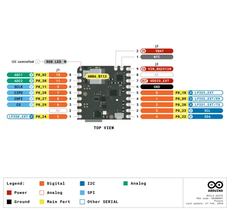
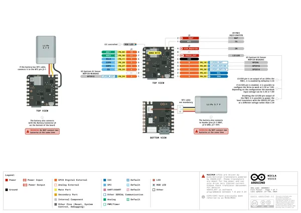
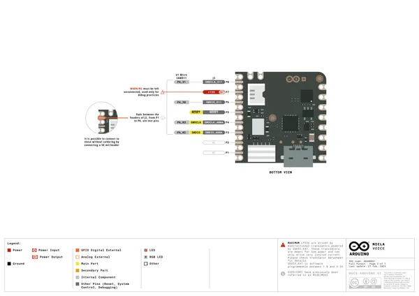
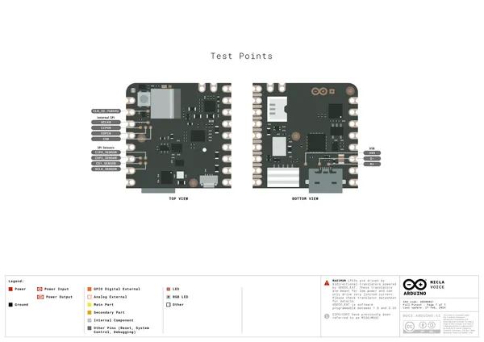
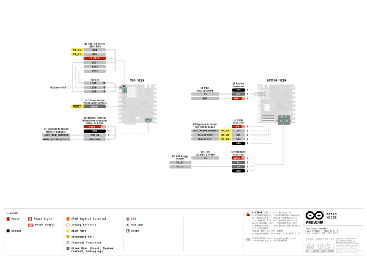
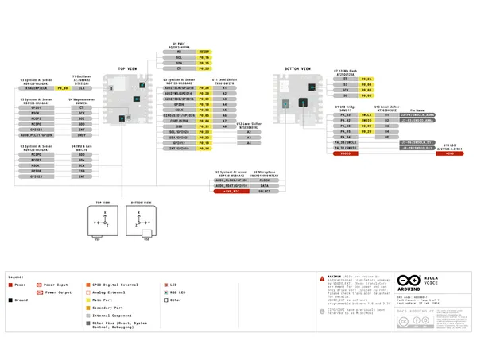
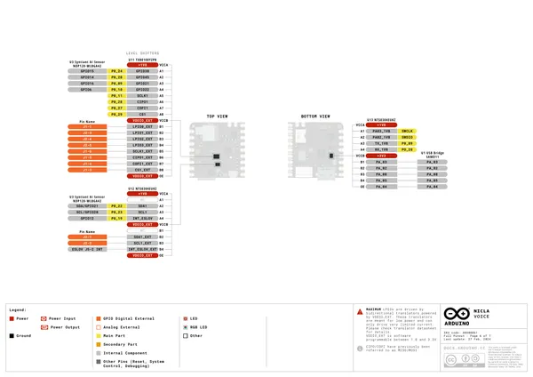

# Nicla Voice

**Arduino** · Other

Revision: Not identified  
Coverage: Pinout image collected

[Browse all manufacturers](../../../../BROWSE.md) · [Desktop app](https://github.com/valleytechsolutions/black-wire-desktop)

## nicla-voice-pinout

**pinout image** · Reviewed source · PNG

[Open original reference](../../../../library/media/57312121d512280e745c2ddc7fb8f6e0902586cad7b5ac1dc49444755913b90a.png)

**Credit and rights:** Not established; source attribution retained. Source/manufacturer: Arduino.

[Source 1](https://raw.githubusercontent.com/arduino/docs-content/dab66ecbd6ad52cd742da6c19c5b6330a7f2caae/content/hardware/nicla/boards/nicla-voice/tutorials/user-manual/assets/nicla-voice-pinout.png) · [Source 2](https://docs.arduino.cc/hardware/nicla-voice/) · [Source 3](https://github.com/arduino/docs-content/blob/dab66ecbd6ad52cd742da6c19c5b6330a7f2caae/content/hardware/nicla/boards/nicla-voice/product.md) · [Source 4](https://github.com/arduino/docs-content/blob/dab66ecbd6ad52cd742da6c19c5b6330a7f2caae/content/hardware/nicla/boards/nicla-voice/tutorials/user-manual/assets/nicla-voice-pinout.png)

Official Arduino documentation repository pinned at dab66ecbd6ad52cd742da6c19c5b6330a7f2caae. Match the board model, SKU and revision printed on each source sheet; lifecycle is not inferred from repository folder placement.

SHA-256: `57312121d512280e745c2ddc7fb8f6e0902586cad7b5ac1dc49444755913b90a`

## Official full pinout - page 1

**pinout image** · Reviewed source · PNG

[Open original reference](../../../../library/media/1b740abf1bf0b8493627ba3cc109263401515122592f2f3b6c3d57060b28045f.png)

**Credit and rights:** CC BY-SA 4.0 notice printed in the original PDF; preserve attribution and verify scope for publication.. Source/manufacturer: Arduino.

[Source 1](https://raw.githubusercontent.com/arduino/docs-content/dab66ecbd6ad52cd742da6c19c5b6330a7f2caae/content/hardware/nicla/boards/nicla-voice/downloads/ABX00061-full-pinout.pdf) · [Source 2](https://docs.arduino.cc/hardware/nicla-voice/) · [Source 3](https://github.com/arduino/docs-content/blob/dab66ecbd6ad52cd742da6c19c5b6330a7f2caae/content/hardware/nicla/boards/nicla-voice/product.md) · [Source 4](https://github.com/arduino/docs-content/blob/dab66ecbd6ad52cd742da6c19c5b6330a7f2caae/content/hardware/nicla/boards/nicla-voice/downloads/ABX00061-full-pinout.pdf)

Official Arduino documentation repository pinned at dab66ecbd6ad52cd742da6c19c5b6330a7f2caae. Match the board model, SKU and revision printed on each source sheet; lifecycle is not inferred from repository folder placement. Original PDF page 1 rendered at 220 dpi; no labels changed.

SHA-256: `1b740abf1bf0b8493627ba3cc109263401515122592f2f3b6c3d57060b28045f`

## Official full pinout - page 2

**pinout image** · Reviewed source · PNG

[Open original reference](../../../../library/media/15e60ad41930f0aa73d9f37fa1c4b4255597e475e21c2dfe4a27d5fe7f5c70d7.png)

**Credit and rights:** CC BY-SA 4.0 notice printed in the original PDF; preserve attribution and verify scope for publication.. Source/manufacturer: Arduino.

[Source 1](https://raw.githubusercontent.com/arduino/docs-content/dab66ecbd6ad52cd742da6c19c5b6330a7f2caae/content/hardware/nicla/boards/nicla-voice/downloads/ABX00061-full-pinout.pdf) · [Source 2](https://docs.arduino.cc/hardware/nicla-voice/) · [Source 3](https://github.com/arduino/docs-content/blob/dab66ecbd6ad52cd742da6c19c5b6330a7f2caae/content/hardware/nicla/boards/nicla-voice/product.md) · [Source 4](https://github.com/arduino/docs-content/blob/dab66ecbd6ad52cd742da6c19c5b6330a7f2caae/content/hardware/nicla/boards/nicla-voice/downloads/ABX00061-full-pinout.pdf)

Official Arduino documentation repository pinned at dab66ecbd6ad52cd742da6c19c5b6330a7f2caae. Match the board model, SKU and revision printed on each source sheet; lifecycle is not inferred from repository folder placement. Original PDF page 2 rendered at 220 dpi; no labels changed.

SHA-256: `15e60ad41930f0aa73d9f37fa1c4b4255597e475e21c2dfe4a27d5fe7f5c70d7`

## Official full pinout - page 7

**pinout image** · Reviewed source · PNG

[Open original reference](../../../../library/media/efc60e068021d41bfe65f09fae40125ad13a053dd1b9b53fe85af8b56c0c5861.png)

**Credit and rights:** CC BY-SA 4.0 notice printed in the original PDF; preserve attribution and verify scope for publication.. Source/manufacturer: Arduino.

[Source 1](https://raw.githubusercontent.com/arduino/docs-content/dab66ecbd6ad52cd742da6c19c5b6330a7f2caae/content/hardware/nicla/boards/nicla-voice/downloads/ABX00061-full-pinout.pdf) · [Source 2](https://docs.arduino.cc/hardware/nicla-voice/) · [Source 3](https://github.com/arduino/docs-content/blob/dab66ecbd6ad52cd742da6c19c5b6330a7f2caae/content/hardware/nicla/boards/nicla-voice/product.md) · [Source 4](https://github.com/arduino/docs-content/blob/dab66ecbd6ad52cd742da6c19c5b6330a7f2caae/content/hardware/nicla/boards/nicla-voice/downloads/ABX00061-full-pinout.pdf)

Official Arduino documentation repository pinned at dab66ecbd6ad52cd742da6c19c5b6330a7f2caae. Match the board model, SKU and revision printed on each source sheet; lifecycle is not inferred from repository folder placement. Original PDF page 7 rendered at 220 dpi; no labels changed.

SHA-256: `efc60e068021d41bfe65f09fae40125ad13a053dd1b9b53fe85af8b56c0c5861`

## Official full pinout - page 3

**GPIO reference image** · Reviewed source · PNG

[Open original reference](../../../../library/media/21052ebb918aacd6561dcb8a36892845562029f33f6d21d58b04d4d79dfb1b05.png)

**Credit and rights:** CC BY-SA 4.0 notice printed in the original PDF; preserve attribution and verify scope for publication.. Source/manufacturer: Arduino.

[Source 1](https://raw.githubusercontent.com/arduino/docs-content/dab66ecbd6ad52cd742da6c19c5b6330a7f2caae/content/hardware/nicla/boards/nicla-voice/downloads/ABX00061-full-pinout.pdf) · [Source 2](https://docs.arduino.cc/hardware/nicla-voice/) · [Source 3](https://github.com/arduino/docs-content/blob/dab66ecbd6ad52cd742da6c19c5b6330a7f2caae/content/hardware/nicla/boards/nicla-voice/product.md) · [Source 4](https://github.com/arduino/docs-content/blob/dab66ecbd6ad52cd742da6c19c5b6330a7f2caae/content/hardware/nicla/boards/nicla-voice/downloads/ABX00061-full-pinout.pdf)

Official Arduino documentation repository pinned at dab66ecbd6ad52cd742da6c19c5b6330a7f2caae. Match the board model, SKU and revision printed on each source sheet; lifecycle is not inferred from repository folder placement. Original PDF page 3 rendered at 220 dpi; no labels changed.

SHA-256: `21052ebb918aacd6561dcb8a36892845562029f33f6d21d58b04d4d79dfb1b05`

## Official full pinout - page 5

**GPIO reference image** · Reviewed source · PNG

[Open original reference](../../../../library/media/3eeda087289e650d8a64e3dfc99c99aeafcc0baae8a95cf8d120fc3075b3c493.png)

**Credit and rights:** CC BY-SA 4.0 notice printed in the original PDF; preserve attribution and verify scope for publication.. Source/manufacturer: Arduino.

[Source 1](https://raw.githubusercontent.com/arduino/docs-content/dab66ecbd6ad52cd742da6c19c5b6330a7f2caae/content/hardware/nicla/boards/nicla-voice/downloads/ABX00061-full-pinout.pdf) · [Source 2](https://docs.arduino.cc/hardware/nicla-voice/) · [Source 3](https://github.com/arduino/docs-content/blob/dab66ecbd6ad52cd742da6c19c5b6330a7f2caae/content/hardware/nicla/boards/nicla-voice/product.md) · [Source 4](https://github.com/arduino/docs-content/blob/dab66ecbd6ad52cd742da6c19c5b6330a7f2caae/content/hardware/nicla/boards/nicla-voice/downloads/ABX00061-full-pinout.pdf)

Official Arduino documentation repository pinned at dab66ecbd6ad52cd742da6c19c5b6330a7f2caae. Match the board model, SKU and revision printed on each source sheet; lifecycle is not inferred from repository folder placement. Original PDF page 5 rendered at 220 dpi; no labels changed.

SHA-256: `3eeda087289e650d8a64e3dfc99c99aeafcc0baae8a95cf8d120fc3075b3c493`

## Official full pinout - page 6

**GPIO reference image** · Reviewed source · PNG

[Open original reference](../../../../library/media/7922147d8ff53210e9dc20849a098f3b1f9273bc121883d5efe1a4a872664e8f.png)

**Credit and rights:** CC BY-SA 4.0 notice printed in the original PDF; preserve attribution and verify scope for publication.. Source/manufacturer: Arduino.

[Source 1](https://raw.githubusercontent.com/arduino/docs-content/dab66ecbd6ad52cd742da6c19c5b6330a7f2caae/content/hardware/nicla/boards/nicla-voice/downloads/ABX00061-full-pinout.pdf) · [Source 2](https://docs.arduino.cc/hardware/nicla-voice/) · [Source 3](https://github.com/arduino/docs-content/blob/dab66ecbd6ad52cd742da6c19c5b6330a7f2caae/content/hardware/nicla/boards/nicla-voice/product.md) · [Source 4](https://github.com/arduino/docs-content/blob/dab66ecbd6ad52cd742da6c19c5b6330a7f2caae/content/hardware/nicla/boards/nicla-voice/downloads/ABX00061-full-pinout.pdf)

Official Arduino documentation repository pinned at dab66ecbd6ad52cd742da6c19c5b6330a7f2caae. Match the board model, SKU and revision printed on each source sheet; lifecycle is not inferred from repository folder placement. Original PDF page 6 rendered at 220 dpi; no labels changed.

SHA-256: `7922147d8ff53210e9dc20849a098f3b1f9273bc121883d5efe1a4a872664e8f`

## Full board pinout PDF

**original reference PDF** · Reviewed source · PDF

[Open original reference](../../../../library/media/7e55ca07630d8d0dac0f86f72c2de80eab20525687fb37738217e21b1e9096fa.pdf)

**Credit and rights:** Not established; source attribution retained. Source/manufacturer: Arduino.

[Source 1](https://raw.githubusercontent.com/arduino/docs-content/dab66ecbd6ad52cd742da6c19c5b6330a7f2caae/content/hardware/nicla/boards/nicla-voice/downloads/ABX00061-full-pinout.pdf) · [Source 2](https://docs.arduino.cc/hardware/nicla-voice/) · [Source 3](https://github.com/arduino/docs-content/blob/dab66ecbd6ad52cd742da6c19c5b6330a7f2caae/content/hardware/nicla/boards/nicla-voice/product.md) · [Source 4](https://github.com/arduino/docs-content/blob/dab66ecbd6ad52cd742da6c19c5b6330a7f2caae/content/hardware/nicla/boards/nicla-voice/downloads/ABX00061-full-pinout.pdf)

Official Arduino documentation repository pinned at dab66ecbd6ad52cd742da6c19c5b6330a7f2caae. Match the board model, SKU and revision printed on each source sheet; lifecycle is not inferred from repository folder placement.

SHA-256: `7e55ca07630d8d0dac0f86f72c2de80eab20525687fb37738217e21b1e9096fa`

Pin assignments have not been independently electrically verified. Check board revision before wiring.
