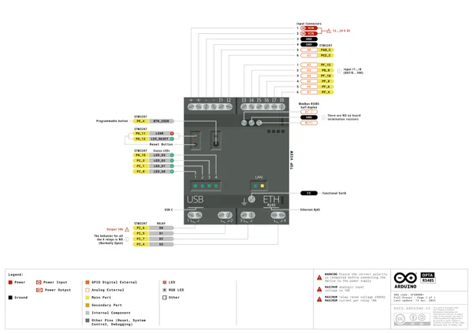
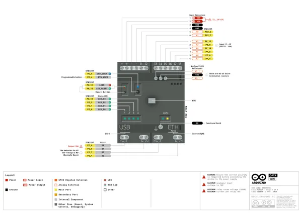
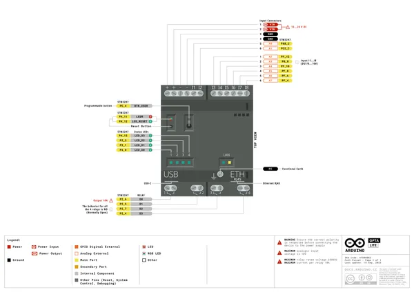

# Opta

**Arduino** · Other

Revision: Not identified  
Coverage: Pinout image collected

[Browse all manufacturers](../../../../BROWSE.md) · [Desktop app](https://github.com/valleytechsolutions/black-wire-desktop)

## Official full pinout - page 1

**pinout image** · Reviewed source · PNG

[Open original reference](../../../../library/media/2f3d8f1eb4f6b1bcd2836b3ba28158b1c8c395f56f3698887d4697d63f8f60ef.png)

**Credit and rights:** CC BY-SA 4.0 notice printed in the original PDF; preserve attribution and verify scope for publication.. Source/manufacturer: Arduino.

[Source 1](https://raw.githubusercontent.com/arduino/docs-content/dab66ecbd6ad52cd742da6c19c5b6330a7f2caae/content/hardware/opta/opta-family/opta/downloads/AFX00001-AFX00002-AFX00003-full-pinout.pdf) · [Source 2](https://docs.arduino.cc/hardware/opta/) · [Source 3](https://github.com/arduino/docs-content/blob/dab66ecbd6ad52cd742da6c19c5b6330a7f2caae/content/hardware/opta/opta-family/opta/product.md) · [Source 4](https://github.com/arduino/docs-content/blob/dab66ecbd6ad52cd742da6c19c5b6330a7f2caae/content/hardware/opta/opta-family/opta/downloads/AFX00001-AFX00002-AFX00003-full-pinout.pdf)

Official Arduino documentation repository pinned at dab66ecbd6ad52cd742da6c19c5b6330a7f2caae. Match the board model, SKU and revision printed on each source sheet; lifecycle is not inferred from repository folder placement. Original PDF page 1 rendered at 220 dpi; no labels changed.

SHA-256: `2f3d8f1eb4f6b1bcd2836b3ba28158b1c8c395f56f3698887d4697d63f8f60ef`

## Official full pinout - page 2

**pinout image** · Reviewed source · PNG

[Open original reference](../../../../library/media/7c8ea5b8878429fb037b005a1d80d7cbbfc999b0f6181f82dce97f832e9d5ebc.png)

**Credit and rights:** CC BY-SA 4.0 notice printed in the original PDF; preserve attribution and verify scope for publication.. Source/manufacturer: Arduino.

[Source 1](https://raw.githubusercontent.com/arduino/docs-content/dab66ecbd6ad52cd742da6c19c5b6330a7f2caae/content/hardware/opta/opta-family/opta/downloads/AFX00001-AFX00002-AFX00003-full-pinout.pdf) · [Source 2](https://docs.arduino.cc/hardware/opta/) · [Source 3](https://github.com/arduino/docs-content/blob/dab66ecbd6ad52cd742da6c19c5b6330a7f2caae/content/hardware/opta/opta-family/opta/product.md) · [Source 4](https://github.com/arduino/docs-content/blob/dab66ecbd6ad52cd742da6c19c5b6330a7f2caae/content/hardware/opta/opta-family/opta/downloads/AFX00001-AFX00002-AFX00003-full-pinout.pdf)

Official Arduino documentation repository pinned at dab66ecbd6ad52cd742da6c19c5b6330a7f2caae. Match the board model, SKU and revision printed on each source sheet; lifecycle is not inferred from repository folder placement. Original PDF page 2 rendered at 220 dpi; no labels changed.

SHA-256: `7c8ea5b8878429fb037b005a1d80d7cbbfc999b0f6181f82dce97f832e9d5ebc`

## Official full pinout - page 3

**pinout image** · Reviewed source · PNG

[Open original reference](../../../../library/media/95a454f4d2f18fc503b41608227696145728c522815219b6030c91796ce23630.png)

**Credit and rights:** CC BY-SA 4.0 notice printed in the original PDF; preserve attribution and verify scope for publication.. Source/manufacturer: Arduino.

[Source 1](https://raw.githubusercontent.com/arduino/docs-content/dab66ecbd6ad52cd742da6c19c5b6330a7f2caae/content/hardware/opta/opta-family/opta/downloads/AFX00001-AFX00002-AFX00003-full-pinout.pdf) · [Source 2](https://docs.arduino.cc/hardware/opta/) · [Source 3](https://github.com/arduino/docs-content/blob/dab66ecbd6ad52cd742da6c19c5b6330a7f2caae/content/hardware/opta/opta-family/opta/product.md) · [Source 4](https://github.com/arduino/docs-content/blob/dab66ecbd6ad52cd742da6c19c5b6330a7f2caae/content/hardware/opta/opta-family/opta/downloads/AFX00001-AFX00002-AFX00003-full-pinout.pdf)

Official Arduino documentation repository pinned at dab66ecbd6ad52cd742da6c19c5b6330a7f2caae. Match the board model, SKU and revision printed on each source sheet; lifecycle is not inferred from repository folder placement. Original PDF page 3 rendered at 220 dpi; no labels changed.

SHA-256: `95a454f4d2f18fc503b41608227696145728c522815219b6030c91796ce23630`

## Full board pinout PDF

**original reference PDF** · Reviewed source · PDF

[Open original reference](../../../../library/media/a503a2cb0c8f100ccd5fe28cbe057ebf5ae473b1fd44b5b20ae16e442412270d.pdf)

**Credit and rights:** Not established; source attribution retained. Source/manufacturer: Arduino.

[Source 1](https://raw.githubusercontent.com/arduino/docs-content/dab66ecbd6ad52cd742da6c19c5b6330a7f2caae/content/hardware/opta/opta-family/opta/downloads/AFX00001-AFX00002-AFX00003-full-pinout.pdf) · [Source 2](https://docs.arduino.cc/hardware/opta/) · [Source 3](https://github.com/arduino/docs-content/blob/dab66ecbd6ad52cd742da6c19c5b6330a7f2caae/content/hardware/opta/opta-family/opta/product.md) · [Source 4](https://github.com/arduino/docs-content/blob/dab66ecbd6ad52cd742da6c19c5b6330a7f2caae/content/hardware/opta/opta-family/opta/downloads/AFX00001-AFX00002-AFX00003-full-pinout.pdf)

Official Arduino documentation repository pinned at dab66ecbd6ad52cd742da6c19c5b6330a7f2caae. Match the board model, SKU and revision printed on each source sheet; lifecycle is not inferred from repository folder placement.

SHA-256: `a503a2cb0c8f100ccd5fe28cbe057ebf5ae473b1fd44b5b20ae16e442412270d`

Pin assignments have not been independently electrically verified. Check board revision before wiring.
