# Portenta C33

**Arduino** · Other

Revision: Not identified  
Coverage: Pinout image collected

[Browse all manufacturers](../../../../BROWSE.md) · [Desktop app](https://github.com/valleytechsolutions/black-wire-desktop)

## Portenta_C33_Pinout_HDC

**pinout image** · Reviewed source · PNG

[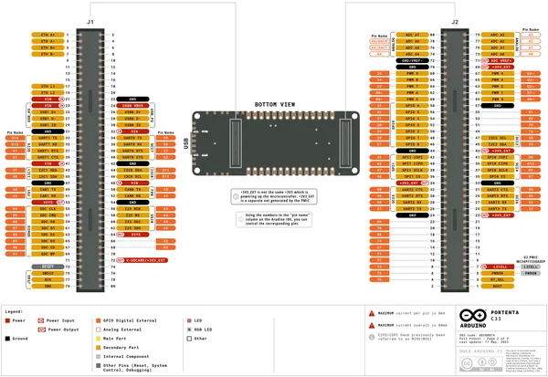](../../../../library/media/a0e5a6ad56bab1cd7d27e59baf8b398a5a420c72ef3cb2312ecdba8dbb1e34f3.png)

[Open original reference](../../../../library/media/a0e5a6ad56bab1cd7d27e59baf8b398a5a420c72ef3cb2312ecdba8dbb1e34f3.png)

**Credit and rights:** Not established; source attribution retained. Source/manufacturer: Arduino.

[Source 1](https://raw.githubusercontent.com/arduino/docs-content/dab66ecbd6ad52cd742da6c19c5b6330a7f2caae/content/hardware/pro/boards/portenta-c33/datasheet/assets/Portenta_C33_Pinout_HDC.png) · [Source 2](https://docs.arduino.cc/hardware/portenta-c33/) · [Source 3](https://github.com/arduino/docs-content/blob/dab66ecbd6ad52cd742da6c19c5b6330a7f2caae/content/hardware/pro/boards/portenta-c33/product.md) · [Source 4](https://github.com/arduino/docs-content/blob/dab66ecbd6ad52cd742da6c19c5b6330a7f2caae/content/hardware/pro/boards/portenta-c33/datasheet/assets/Portenta_C33_Pinout_HDC.png)

Official Arduino documentation repository pinned at dab66ecbd6ad52cd742da6c19c5b6330a7f2caae. Match the board model, SKU and revision printed on each source sheet; lifecycle is not inferred from repository folder placement.

SHA-256: `a0e5a6ad56bab1cd7d27e59baf8b398a5a420c72ef3cb2312ecdba8dbb1e34f3`

## Portenta_C33_Pinout_MKR

**pinout image** · Reviewed source · PNG

[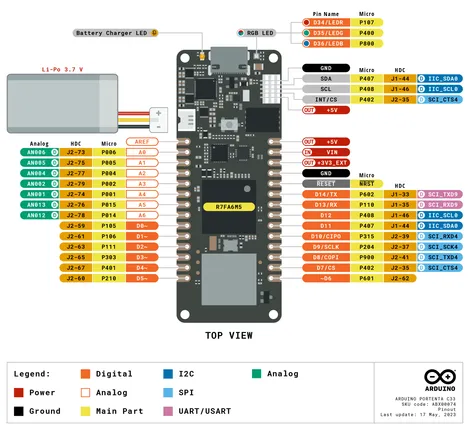](../../../../library/media/a8db52161884c4dd15b5954f5fb3d3ae359ba1664da09f09f88bc3c046fa623e.png)

[Open original reference](../../../../library/media/a8db52161884c4dd15b5954f5fb3d3ae359ba1664da09f09f88bc3c046fa623e.png)

**Credit and rights:** Not established; source attribution retained. Source/manufacturer: Arduino.

[Source 1](https://raw.githubusercontent.com/arduino/docs-content/dab66ecbd6ad52cd742da6c19c5b6330a7f2caae/content/hardware/pro/boards/portenta-c33/datasheet/assets/Portenta_C33_Pinout_MKR.png) · [Source 2](https://docs.arduino.cc/hardware/portenta-c33/) · [Source 3](https://github.com/arduino/docs-content/blob/dab66ecbd6ad52cd742da6c19c5b6330a7f2caae/content/hardware/pro/boards/portenta-c33/product.md) · [Source 4](https://github.com/arduino/docs-content/blob/dab66ecbd6ad52cd742da6c19c5b6330a7f2caae/content/hardware/pro/boards/portenta-c33/datasheet/assets/Portenta_C33_Pinout_MKR.png) · [Source 5](https://github.com/arduino/docs-content/blob/dab66ecbd6ad52cd742da6c19c5b6330a7f2caae/content/hardware/pro/boards/portenta-c33/tutorials/user-manual/assets/ABX00074-pinout-MKR.png)

Official Arduino documentation repository pinned at dab66ecbd6ad52cd742da6c19c5b6330a7f2caae. Match the board model, SKU and revision printed on each source sheet; lifecycle is not inferred from repository folder placement.

SHA-256: `a8db52161884c4dd15b5954f5fb3d3ae359ba1664da09f09f88bc3c046fa623e`

## ABX00074-pinout-HDC

**pinout image** · Reviewed source · PNG

[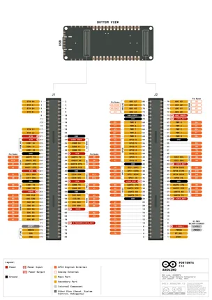](../../../../library/media/d9836ac5ca07f9e704b087508293cc048e6651570f02086cc102507dc99d6515.png)

[Open original reference](../../../../library/media/d9836ac5ca07f9e704b087508293cc048e6651570f02086cc102507dc99d6515.png)

**Credit and rights:** Not established; source attribution retained. Source/manufacturer: Arduino.

[Source 1](https://raw.githubusercontent.com/arduino/docs-content/dab66ecbd6ad52cd742da6c19c5b6330a7f2caae/content/hardware/pro/boards/portenta-c33/tutorials/user-manual/assets/ABX00074-pinout-HDC.png) · [Source 2](https://docs.arduino.cc/hardware/portenta-c33/) · [Source 3](https://github.com/arduino/docs-content/blob/dab66ecbd6ad52cd742da6c19c5b6330a7f2caae/content/hardware/pro/boards/portenta-c33/product.md) · [Source 4](https://github.com/arduino/docs-content/blob/dab66ecbd6ad52cd742da6c19c5b6330a7f2caae/content/hardware/pro/boards/portenta-c33/tutorials/user-manual/assets/ABX00074-pinout-HDC.png)

Official Arduino documentation repository pinned at dab66ecbd6ad52cd742da6c19c5b6330a7f2caae. Match the board model, SKU and revision printed on each source sheet; lifecycle is not inferred from repository folder placement.

SHA-256: `d9836ac5ca07f9e704b087508293cc048e6651570f02086cc102507dc99d6515`

## Official full pinout - page 1

**pinout image** · Reviewed source · PNG

[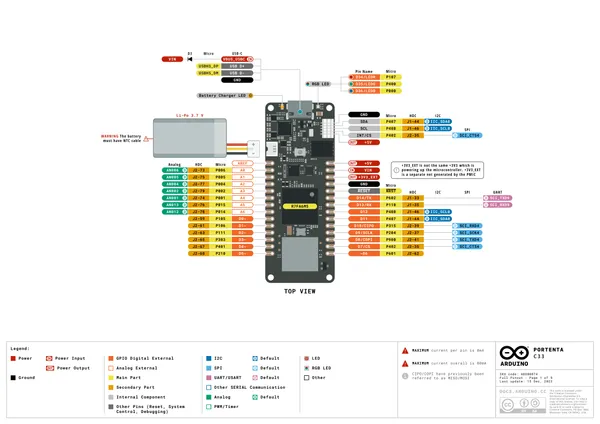](../../../../library/media/86574c9189c19e7669eb9adb03fd58eb4745603ad9b9c4b70f29a051ab92fce7.png)

[Open original reference](../../../../library/media/86574c9189c19e7669eb9adb03fd58eb4745603ad9b9c4b70f29a051ab92fce7.png)

**Credit and rights:** CC BY-SA 4.0 notice printed in the original PDF; preserve attribution and verify scope for publication.. Source/manufacturer: Arduino.

[Source 1](https://raw.githubusercontent.com/arduino/docs-content/dab66ecbd6ad52cd742da6c19c5b6330a7f2caae/content/hardware/pro/boards/portenta-c33/downloads/ABX00074-full-pinout.pdf) · [Source 2](https://docs.arduino.cc/hardware/portenta-c33/) · [Source 3](https://github.com/arduino/docs-content/blob/dab66ecbd6ad52cd742da6c19c5b6330a7f2caae/content/hardware/pro/boards/portenta-c33/product.md) · [Source 4](https://github.com/arduino/docs-content/blob/dab66ecbd6ad52cd742da6c19c5b6330a7f2caae/content/hardware/pro/boards/portenta-c33/downloads/ABX00074-full-pinout.pdf)

Official Arduino documentation repository pinned at dab66ecbd6ad52cd742da6c19c5b6330a7f2caae. Match the board model, SKU and revision printed on each source sheet; lifecycle is not inferred from repository folder placement. Original PDF page 1 rendered at 220 dpi; no labels changed.

SHA-256: `86574c9189c19e7669eb9adb03fd58eb4745603ad9b9c4b70f29a051ab92fce7`

## Official full pinout - page 2

**pinout image** · Reviewed source · PNG

[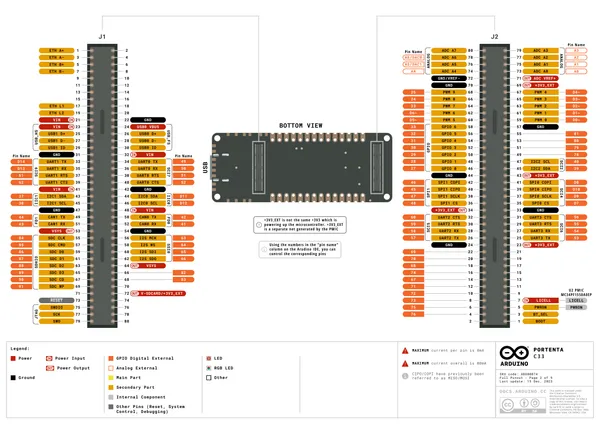](../../../../library/media/d776b169c93aa79ac321043c643804a96292611a68ef919694cc81b78c73fad4.png)

[Open original reference](../../../../library/media/d776b169c93aa79ac321043c643804a96292611a68ef919694cc81b78c73fad4.png)

**Credit and rights:** CC BY-SA 4.0 notice printed in the original PDF; preserve attribution and verify scope for publication.. Source/manufacturer: Arduino.

[Source 1](https://raw.githubusercontent.com/arduino/docs-content/dab66ecbd6ad52cd742da6c19c5b6330a7f2caae/content/hardware/pro/boards/portenta-c33/downloads/ABX00074-full-pinout.pdf) · [Source 2](https://docs.arduino.cc/hardware/portenta-c33/) · [Source 3](https://github.com/arduino/docs-content/blob/dab66ecbd6ad52cd742da6c19c5b6330a7f2caae/content/hardware/pro/boards/portenta-c33/product.md) · [Source 4](https://github.com/arduino/docs-content/blob/dab66ecbd6ad52cd742da6c19c5b6330a7f2caae/content/hardware/pro/boards/portenta-c33/downloads/ABX00074-full-pinout.pdf)

Official Arduino documentation repository pinned at dab66ecbd6ad52cd742da6c19c5b6330a7f2caae. Match the board model, SKU and revision printed on each source sheet; lifecycle is not inferred from repository folder placement. Original PDF page 2 rendered at 220 dpi; no labels changed.

SHA-256: `d776b169c93aa79ac321043c643804a96292611a68ef919694cc81b78c73fad4`

## Official full pinout - page 4

**pinout image** · Reviewed source · PNG

[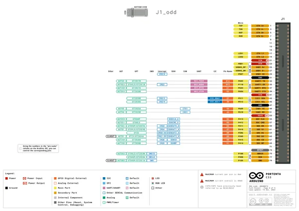](../../../../library/media/077a4b0df944c6af38600fac4d67ba5eadbca11de314ce7a10d4470093338c92.png)

[Open original reference](../../../../library/media/077a4b0df944c6af38600fac4d67ba5eadbca11de314ce7a10d4470093338c92.png)

**Credit and rights:** CC BY-SA 4.0 notice printed in the original PDF; preserve attribution and verify scope for publication.. Source/manufacturer: Arduino.

[Source 1](https://raw.githubusercontent.com/arduino/docs-content/dab66ecbd6ad52cd742da6c19c5b6330a7f2caae/content/hardware/pro/boards/portenta-c33/downloads/ABX00074-full-pinout.pdf) · [Source 2](https://docs.arduino.cc/hardware/portenta-c33/) · [Source 3](https://github.com/arduino/docs-content/blob/dab66ecbd6ad52cd742da6c19c5b6330a7f2caae/content/hardware/pro/boards/portenta-c33/product.md) · [Source 4](https://github.com/arduino/docs-content/blob/dab66ecbd6ad52cd742da6c19c5b6330a7f2caae/content/hardware/pro/boards/portenta-c33/downloads/ABX00074-full-pinout.pdf)

Official Arduino documentation repository pinned at dab66ecbd6ad52cd742da6c19c5b6330a7f2caae. Match the board model, SKU and revision printed on each source sheet; lifecycle is not inferred from repository folder placement. Original PDF page 4 rendered at 220 dpi; no labels changed.

SHA-256: `077a4b0df944c6af38600fac4d67ba5eadbca11de314ce7a10d4470093338c92`

## Official full pinout - page 5

**pinout image** · Reviewed source · PNG

[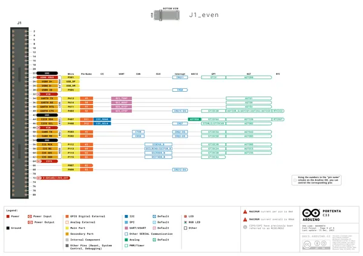](../../../../library/media/d08de749d248ad065eed7ff4346f66b541c13d33cebc2daafbbc5fbe6763b28a.png)

[Open original reference](../../../../library/media/d08de749d248ad065eed7ff4346f66b541c13d33cebc2daafbbc5fbe6763b28a.png)

**Credit and rights:** CC BY-SA 4.0 notice printed in the original PDF; preserve attribution and verify scope for publication.. Source/manufacturer: Arduino.

[Source 1](https://raw.githubusercontent.com/arduino/docs-content/dab66ecbd6ad52cd742da6c19c5b6330a7f2caae/content/hardware/pro/boards/portenta-c33/downloads/ABX00074-full-pinout.pdf) · [Source 2](https://docs.arduino.cc/hardware/portenta-c33/) · [Source 3](https://github.com/arduino/docs-content/blob/dab66ecbd6ad52cd742da6c19c5b6330a7f2caae/content/hardware/pro/boards/portenta-c33/product.md) · [Source 4](https://github.com/arduino/docs-content/blob/dab66ecbd6ad52cd742da6c19c5b6330a7f2caae/content/hardware/pro/boards/portenta-c33/downloads/ABX00074-full-pinout.pdf)

Official Arduino documentation repository pinned at dab66ecbd6ad52cd742da6c19c5b6330a7f2caae. Match the board model, SKU and revision printed on each source sheet; lifecycle is not inferred from repository folder placement. Original PDF page 5 rendered at 220 dpi; no labels changed.

SHA-256: `d08de749d248ad065eed7ff4346f66b541c13d33cebc2daafbbc5fbe6763b28a`

## Official full pinout - page 6

**pinout image** · Reviewed source · PNG

[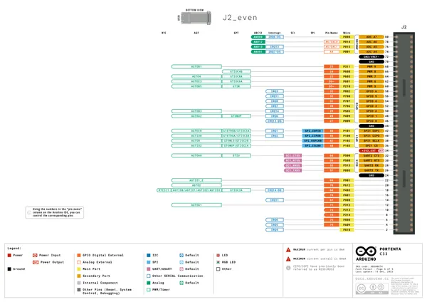](../../../../library/media/93b110cc793d08454f57941e2f0e8f58f33d22561ec27ad4ca153961e4099f62.png)

[Open original reference](../../../../library/media/93b110cc793d08454f57941e2f0e8f58f33d22561ec27ad4ca153961e4099f62.png)

**Credit and rights:** CC BY-SA 4.0 notice printed in the original PDF; preserve attribution and verify scope for publication.. Source/manufacturer: Arduino.

[Source 1](https://raw.githubusercontent.com/arduino/docs-content/dab66ecbd6ad52cd742da6c19c5b6330a7f2caae/content/hardware/pro/boards/portenta-c33/downloads/ABX00074-full-pinout.pdf) · [Source 2](https://docs.arduino.cc/hardware/portenta-c33/) · [Source 3](https://github.com/arduino/docs-content/blob/dab66ecbd6ad52cd742da6c19c5b6330a7f2caae/content/hardware/pro/boards/portenta-c33/product.md) · [Source 4](https://github.com/arduino/docs-content/blob/dab66ecbd6ad52cd742da6c19c5b6330a7f2caae/content/hardware/pro/boards/portenta-c33/downloads/ABX00074-full-pinout.pdf)

Official Arduino documentation repository pinned at dab66ecbd6ad52cd742da6c19c5b6330a7f2caae. Match the board model, SKU and revision printed on each source sheet; lifecycle is not inferred from repository folder placement. Original PDF page 6 rendered at 220 dpi; no labels changed.

SHA-256: `93b110cc793d08454f57941e2f0e8f58f33d22561ec27ad4ca153961e4099f62`

## Official full pinout - page 7

**pinout image** · Reviewed source · PNG

[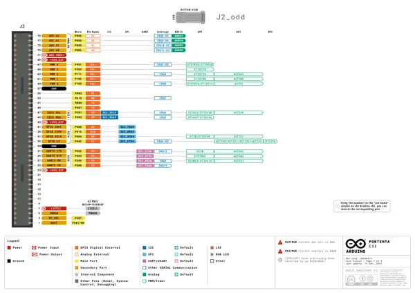](../../../../library/media/1fd72c8b498bc7602ccd858372147a1d4f447afa580abfb0ab1d2028a06eb694.png)

[Open original reference](../../../../library/media/1fd72c8b498bc7602ccd858372147a1d4f447afa580abfb0ab1d2028a06eb694.png)

**Credit and rights:** CC BY-SA 4.0 notice printed in the original PDF; preserve attribution and verify scope for publication.. Source/manufacturer: Arduino.

[Source 1](https://raw.githubusercontent.com/arduino/docs-content/dab66ecbd6ad52cd742da6c19c5b6330a7f2caae/content/hardware/pro/boards/portenta-c33/downloads/ABX00074-full-pinout.pdf) · [Source 2](https://docs.arduino.cc/hardware/portenta-c33/) · [Source 3](https://github.com/arduino/docs-content/blob/dab66ecbd6ad52cd742da6c19c5b6330a7f2caae/content/hardware/pro/boards/portenta-c33/product.md) · [Source 4](https://github.com/arduino/docs-content/blob/dab66ecbd6ad52cd742da6c19c5b6330a7f2caae/content/hardware/pro/boards/portenta-c33/downloads/ABX00074-full-pinout.pdf)

Official Arduino documentation repository pinned at dab66ecbd6ad52cd742da6c19c5b6330a7f2caae. Match the board model, SKU and revision printed on each source sheet; lifecycle is not inferred from repository folder placement. Original PDF page 7 rendered at 220 dpi; no labels changed.

SHA-256: `1fd72c8b498bc7602ccd858372147a1d4f447afa580abfb0ab1d2028a06eb694`

## Official full pinout - page 9

**pinout image** · Reviewed source · PNG

[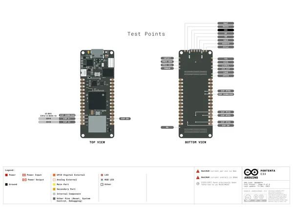](../../../../library/media/fc432df9a8bc30249e2e5d03d15faf634a552798f9a40e5fa84cfc1e42a603e7.png)

[Open original reference](../../../../library/media/fc432df9a8bc30249e2e5d03d15faf634a552798f9a40e5fa84cfc1e42a603e7.png)

**Credit and rights:** CC BY-SA 4.0 notice printed in the original PDF; preserve attribution and verify scope for publication.. Source/manufacturer: Arduino.

[Source 1](https://raw.githubusercontent.com/arduino/docs-content/dab66ecbd6ad52cd742da6c19c5b6330a7f2caae/content/hardware/pro/boards/portenta-c33/downloads/ABX00074-full-pinout.pdf) · [Source 2](https://docs.arduino.cc/hardware/portenta-c33/) · [Source 3](https://github.com/arduino/docs-content/blob/dab66ecbd6ad52cd742da6c19c5b6330a7f2caae/content/hardware/pro/boards/portenta-c33/product.md) · [Source 4](https://github.com/arduino/docs-content/blob/dab66ecbd6ad52cd742da6c19c5b6330a7f2caae/content/hardware/pro/boards/portenta-c33/downloads/ABX00074-full-pinout.pdf)

Official Arduino documentation repository pinned at dab66ecbd6ad52cd742da6c19c5b6330a7f2caae. Match the board model, SKU and revision printed on each source sheet; lifecycle is not inferred from repository folder placement. Original PDF page 9 rendered at 220 dpi; no labels changed.

SHA-256: `fc432df9a8bc30249e2e5d03d15faf634a552798f9a40e5fa84cfc1e42a603e7`

## Official full pinout - page 8

**GPIO reference image** · Reviewed source · PNG

[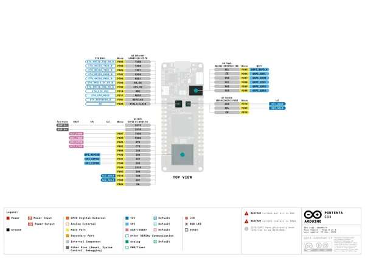](../../../../library/media/40c8f598d675242de27313b08b90de1c8d7287d9dbc40b6d10cac8641d78b8ee.png)

[Open original reference](../../../../library/media/40c8f598d675242de27313b08b90de1c8d7287d9dbc40b6d10cac8641d78b8ee.png)

**Credit and rights:** CC BY-SA 4.0 notice printed in the original PDF; preserve attribution and verify scope for publication.. Source/manufacturer: Arduino.

[Source 1](https://raw.githubusercontent.com/arduino/docs-content/dab66ecbd6ad52cd742da6c19c5b6330a7f2caae/content/hardware/pro/boards/portenta-c33/downloads/ABX00074-full-pinout.pdf) · [Source 2](https://docs.arduino.cc/hardware/portenta-c33/) · [Source 3](https://github.com/arduino/docs-content/blob/dab66ecbd6ad52cd742da6c19c5b6330a7f2caae/content/hardware/pro/boards/portenta-c33/product.md) · [Source 4](https://github.com/arduino/docs-content/blob/dab66ecbd6ad52cd742da6c19c5b6330a7f2caae/content/hardware/pro/boards/portenta-c33/downloads/ABX00074-full-pinout.pdf)

Official Arduino documentation repository pinned at dab66ecbd6ad52cd742da6c19c5b6330a7f2caae. Match the board model, SKU and revision printed on each source sheet; lifecycle is not inferred from repository folder placement. Original PDF page 8 rendered at 220 dpi; no labels changed.

SHA-256: `40c8f598d675242de27313b08b90de1c8d7287d9dbc40b6d10cac8641d78b8ee`

## Full board pinout PDF

**original reference PDF** · Reviewed source · PDF

[Open original reference](../../../../library/media/3869e1c56e905d37dc8a52e8ee40d49659b5e9190f56c343dd0e3a00048e572e.pdf)

**Credit and rights:** Not established; source attribution retained. Source/manufacturer: Arduino.

[Source 1](https://raw.githubusercontent.com/arduino/docs-content/dab66ecbd6ad52cd742da6c19c5b6330a7f2caae/content/hardware/pro/boards/portenta-c33/downloads/ABX00074-full-pinout.pdf) · [Source 2](https://docs.arduino.cc/hardware/portenta-c33/) · [Source 3](https://github.com/arduino/docs-content/blob/dab66ecbd6ad52cd742da6c19c5b6330a7f2caae/content/hardware/pro/boards/portenta-c33/product.md) · [Source 4](https://github.com/arduino/docs-content/blob/dab66ecbd6ad52cd742da6c19c5b6330a7f2caae/content/hardware/pro/boards/portenta-c33/downloads/ABX00074-full-pinout.pdf)

Official Arduino documentation repository pinned at dab66ecbd6ad52cd742da6c19c5b6330a7f2caae. Match the board model, SKU and revision printed on each source sheet; lifecycle is not inferred from repository folder placement.

SHA-256: `3869e1c56e905d37dc8a52e8ee40d49659b5e9190f56c343dd0e3a00048e572e`

Pin assignments have not been independently electrically verified. Check board revision before wiring.
