# Portenta H7

**Arduino** · Other

Revision: Not identified  
Coverage: Pinout image collected

[Browse all manufacturers](../../../../BROWSE.md) · [Desktop app](https://github.com/valleytechsolutions/black-wire-desktop)

## portentaH7_higDensity_pinOut

**pinout image** · Reviewed source · PNG

[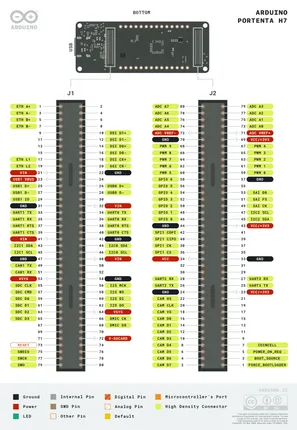](../../../../library/media/1913dba4a9b1e5f38a1b047b124db17bfec6611f1786fb1c15245e9b95317a44.png)

[Open original reference](../../../../library/media/1913dba4a9b1e5f38a1b047b124db17bfec6611f1786fb1c15245e9b95317a44.png)

**Credit and rights:** Not established; source attribution retained. Source/manufacturer: Arduino.

[Source 1](https://raw.githubusercontent.com/arduino/docs-content/dab66ecbd6ad52cd742da6c19c5b6330a7f2caae/content/hardware/pro/boards/portenta-h7/datasheet/assets/portentaH7_higDensity_pinOut.png) · [Source 2](https://docs.arduino.cc/hardware/portenta-h7/) · [Source 3](https://github.com/arduino/docs-content/blob/dab66ecbd6ad52cd742da6c19c5b6330a7f2caae/content/hardware/pro/boards/portenta-h7/product.md) · [Source 4](https://github.com/arduino/docs-content/blob/dab66ecbd6ad52cd742da6c19c5b6330a7f2caae/content/hardware/pro/boards/portenta-h7/datasheet/assets/portentaH7_higDensity_pinOut.png)

Official Arduino documentation repository pinned at dab66ecbd6ad52cd742da6c19c5b6330a7f2caae. Match the board model, SKU and revision printed on each source sheet; lifecycle is not inferred from repository folder placement.

SHA-256: `1913dba4a9b1e5f38a1b047b124db17bfec6611f1786fb1c15245e9b95317a44`

## portentaH7_mkr_pinouts

**pinout image** · Reviewed source · PNG

[Open original reference](../../../../library/media/e7e39a2ddcb37d3be4b8ec4b919fa038d4382d1af1af271b5148de146970b988.png)

**Credit and rights:** Not established; source attribution retained. Source/manufacturer: Arduino.

[Source 1](https://raw.githubusercontent.com/arduino/docs-content/dab66ecbd6ad52cd742da6c19c5b6330a7f2caae/content/hardware/pro/boards/portenta-h7/datasheet/assets/portentaH7_mkr_pinouts.png) · [Source 2](https://docs.arduino.cc/hardware/portenta-h7/) · [Source 3](https://github.com/arduino/docs-content/blob/dab66ecbd6ad52cd742da6c19c5b6330a7f2caae/content/hardware/pro/boards/portenta-h7/product.md) · [Source 4](https://github.com/arduino/docs-content/blob/dab66ecbd6ad52cd742da6c19c5b6330a7f2caae/content/hardware/pro/boards/portenta-h7/datasheet/assets/portentaH7_mkr_pinouts.png)

Official Arduino documentation repository pinned at dab66ecbd6ad52cd742da6c19c5b6330a7f2caae. Match the board model, SKU and revision printed on each source sheet; lifecycle is not inferred from repository folder placement.

SHA-256: `e7e39a2ddcb37d3be4b8ec4b919fa038d4382d1af1af271b5148de146970b988`

## ABX00042-pinout

**pinout image** · Reviewed source · PNG

[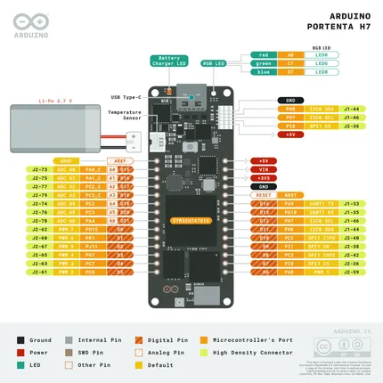](../../../../library/media/d7ccef67086782bc32284d71d0545787069be15589b807712fd2fcd5e79060ca.png)

[Open original reference](../../../../library/media/d7ccef67086782bc32284d71d0545787069be15589b807712fd2fcd5e79060ca.png)

**Credit and rights:** Not established; source attribution retained. Source/manufacturer: Arduino.

[Source 1](https://raw.githubusercontent.com/arduino/docs-content/dab66ecbd6ad52cd742da6c19c5b6330a7f2caae/content/hardware/pro/boards/portenta-h7/tutorials/openmv-cheat-sheet/assets/ABX00042-pinout.png) · [Source 2](https://docs.arduino.cc/hardware/portenta-h7/) · [Source 3](https://github.com/arduino/docs-content/blob/dab66ecbd6ad52cd742da6c19c5b6330a7f2caae/content/hardware/pro/boards/portenta-h7/product.md) · [Source 4](https://github.com/arduino/docs-content/blob/dab66ecbd6ad52cd742da6c19c5b6330a7f2caae/content/hardware/pro/boards/portenta-h7/tutorials/openmv-cheat-sheet/assets/ABX00042-pinout.png)

Official Arduino documentation repository pinned at dab66ecbd6ad52cd742da6c19c5b6330a7f2caae. Match the board model, SKU and revision printed on each source sheet; lifecycle is not inferred from repository folder placement.

SHA-256: `d7ccef67086782bc32284d71d0545787069be15589b807712fd2fcd5e79060ca`

## Official full pinout - page 1

**pinout image** · Reviewed source · PNG

[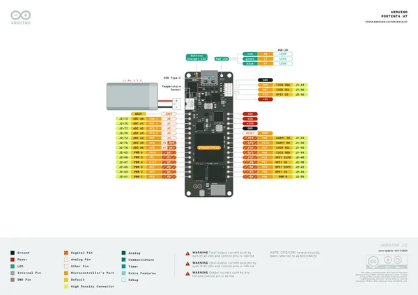](../../../../library/media/1ced3a3ee741dbfd4b142090b8aadc582b34fde5744437c47668eeb997194428.png)

[Open original reference](../../../../library/media/1ced3a3ee741dbfd4b142090b8aadc582b34fde5744437c47668eeb997194428.png)

**Credit and rights:** CC BY-SA 4.0 notice printed in the original PDF; preserve attribution and verify scope for publication.. Source/manufacturer: Arduino.

[Source 1](https://raw.githubusercontent.com/arduino/docs-content/dab66ecbd6ad52cd742da6c19c5b6330a7f2caae/content/hardware/pro/boards/portenta-h7/downloads/ABX00042-full-pinout.pdf) · [Source 2](https://docs.arduino.cc/hardware/portenta-h7/) · [Source 3](https://github.com/arduino/docs-content/blob/dab66ecbd6ad52cd742da6c19c5b6330a7f2caae/content/hardware/pro/boards/portenta-h7/product.md) · [Source 4](https://github.com/arduino/docs-content/blob/dab66ecbd6ad52cd742da6c19c5b6330a7f2caae/content/hardware/pro/boards/portenta-h7/downloads/ABX00042-full-pinout.pdf)

Official Arduino documentation repository pinned at dab66ecbd6ad52cd742da6c19c5b6330a7f2caae. Match the board model, SKU and revision printed on each source sheet; lifecycle is not inferred from repository folder placement. Original PDF page 1 rendered at 220 dpi; no labels changed.

SHA-256: `1ced3a3ee741dbfd4b142090b8aadc582b34fde5744437c47668eeb997194428`

## Official full pinout - page 2

**pinout image** · Reviewed source · PNG

[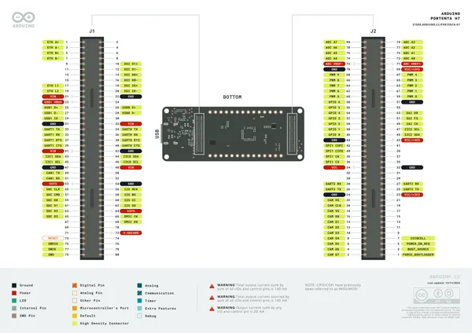](../../../../library/media/a04f393199d39a2b085e814f783d9e3820aae68042abdc108d66b77a2ee41651.png)

[Open original reference](../../../../library/media/a04f393199d39a2b085e814f783d9e3820aae68042abdc108d66b77a2ee41651.png)

**Credit and rights:** CC BY-SA 4.0 notice printed in the original PDF; preserve attribution and verify scope for publication.. Source/manufacturer: Arduino.

[Source 1](https://raw.githubusercontent.com/arduino/docs-content/dab66ecbd6ad52cd742da6c19c5b6330a7f2caae/content/hardware/pro/boards/portenta-h7/downloads/ABX00042-full-pinout.pdf) · [Source 2](https://docs.arduino.cc/hardware/portenta-h7/) · [Source 3](https://github.com/arduino/docs-content/blob/dab66ecbd6ad52cd742da6c19c5b6330a7f2caae/content/hardware/pro/boards/portenta-h7/product.md) · [Source 4](https://github.com/arduino/docs-content/blob/dab66ecbd6ad52cd742da6c19c5b6330a7f2caae/content/hardware/pro/boards/portenta-h7/downloads/ABX00042-full-pinout.pdf)

Official Arduino documentation repository pinned at dab66ecbd6ad52cd742da6c19c5b6330a7f2caae. Match the board model, SKU and revision printed on each source sheet; lifecycle is not inferred from repository folder placement. Original PDF page 2 rendered at 220 dpi; no labels changed.

SHA-256: `a04f393199d39a2b085e814f783d9e3820aae68042abdc108d66b77a2ee41651`

## Official full pinout - page 3

**pinout image** · Reviewed source · PNG

[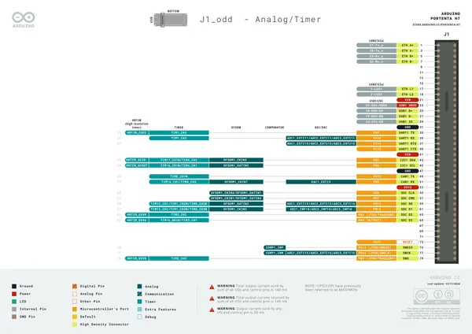](../../../../library/media/1e2c244eca66037243905e0064e7add17142dd85d25f0baac3905eb6b4bba645.png)

[Open original reference](../../../../library/media/1e2c244eca66037243905e0064e7add17142dd85d25f0baac3905eb6b4bba645.png)

**Credit and rights:** CC BY-SA 4.0 notice printed in the original PDF; preserve attribution and verify scope for publication.. Source/manufacturer: Arduino.

[Source 1](https://raw.githubusercontent.com/arduino/docs-content/dab66ecbd6ad52cd742da6c19c5b6330a7f2caae/content/hardware/pro/boards/portenta-h7/downloads/ABX00042-full-pinout.pdf) · [Source 2](https://docs.arduino.cc/hardware/portenta-h7/) · [Source 3](https://github.com/arduino/docs-content/blob/dab66ecbd6ad52cd742da6c19c5b6330a7f2caae/content/hardware/pro/boards/portenta-h7/product.md) · [Source 4](https://github.com/arduino/docs-content/blob/dab66ecbd6ad52cd742da6c19c5b6330a7f2caae/content/hardware/pro/boards/portenta-h7/downloads/ABX00042-full-pinout.pdf)

Official Arduino documentation repository pinned at dab66ecbd6ad52cd742da6c19c5b6330a7f2caae. Match the board model, SKU and revision printed on each source sheet; lifecycle is not inferred from repository folder placement. Original PDF page 3 rendered at 220 dpi; no labels changed.

SHA-256: `1e2c244eca66037243905e0064e7add17142dd85d25f0baac3905eb6b4bba645`

## Official full pinout - page 4

**pinout image** · Reviewed source · PNG

[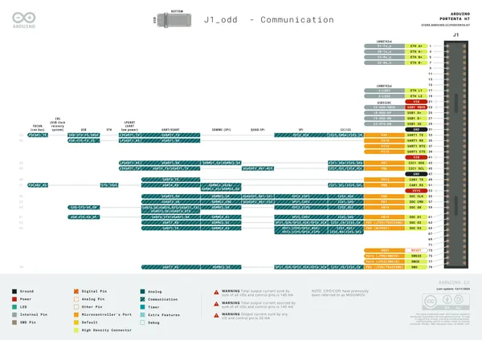](../../../../library/media/c8413fa102815fe5ccd0a76783c15ec64982e78e91b30198b83f4e226d936502.png)

[Open original reference](../../../../library/media/c8413fa102815fe5ccd0a76783c15ec64982e78e91b30198b83f4e226d936502.png)

**Credit and rights:** CC BY-SA 4.0 notice printed in the original PDF; preserve attribution and verify scope for publication.. Source/manufacturer: Arduino.

[Source 1](https://raw.githubusercontent.com/arduino/docs-content/dab66ecbd6ad52cd742da6c19c5b6330a7f2caae/content/hardware/pro/boards/portenta-h7/downloads/ABX00042-full-pinout.pdf) · [Source 2](https://docs.arduino.cc/hardware/portenta-h7/) · [Source 3](https://github.com/arduino/docs-content/blob/dab66ecbd6ad52cd742da6c19c5b6330a7f2caae/content/hardware/pro/boards/portenta-h7/product.md) · [Source 4](https://github.com/arduino/docs-content/blob/dab66ecbd6ad52cd742da6c19c5b6330a7f2caae/content/hardware/pro/boards/portenta-h7/downloads/ABX00042-full-pinout.pdf)

Official Arduino documentation repository pinned at dab66ecbd6ad52cd742da6c19c5b6330a7f2caae. Match the board model, SKU and revision printed on each source sheet; lifecycle is not inferred from repository folder placement. Original PDF page 4 rendered at 220 dpi; no labels changed.

SHA-256: `c8413fa102815fe5ccd0a76783c15ec64982e78e91b30198b83f4e226d936502`

## Official full pinout - page 5

**pinout image** · Reviewed source · PNG

[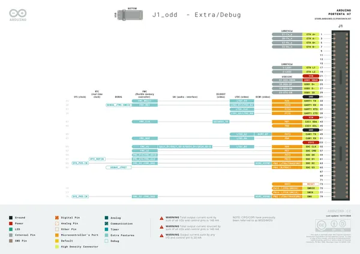](../../../../library/media/d12c7bab4a043a611cfae356346997a124753627a79e6ae1be00b1866192787f.png)

[Open original reference](../../../../library/media/d12c7bab4a043a611cfae356346997a124753627a79e6ae1be00b1866192787f.png)

**Credit and rights:** CC BY-SA 4.0 notice printed in the original PDF; preserve attribution and verify scope for publication.. Source/manufacturer: Arduino.

[Source 1](https://raw.githubusercontent.com/arduino/docs-content/dab66ecbd6ad52cd742da6c19c5b6330a7f2caae/content/hardware/pro/boards/portenta-h7/downloads/ABX00042-full-pinout.pdf) · [Source 2](https://docs.arduino.cc/hardware/portenta-h7/) · [Source 3](https://github.com/arduino/docs-content/blob/dab66ecbd6ad52cd742da6c19c5b6330a7f2caae/content/hardware/pro/boards/portenta-h7/product.md) · [Source 4](https://github.com/arduino/docs-content/blob/dab66ecbd6ad52cd742da6c19c5b6330a7f2caae/content/hardware/pro/boards/portenta-h7/downloads/ABX00042-full-pinout.pdf)

Official Arduino documentation repository pinned at dab66ecbd6ad52cd742da6c19c5b6330a7f2caae. Match the board model, SKU and revision printed on each source sheet; lifecycle is not inferred from repository folder placement. Original PDF page 5 rendered at 220 dpi; no labels changed.

SHA-256: `d12c7bab4a043a611cfae356346997a124753627a79e6ae1be00b1866192787f`

## Official full pinout - page 6

**pinout image** · Reviewed source · PNG

[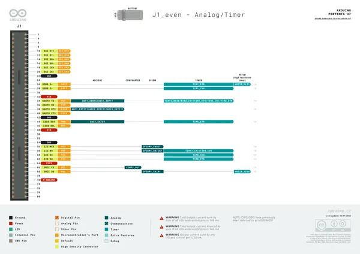](../../../../library/media/337a4c76ae7d880dbda6b597af3fa253b8c28c3911c6e640a852ce4d21daee81.png)

[Open original reference](../../../../library/media/337a4c76ae7d880dbda6b597af3fa253b8c28c3911c6e640a852ce4d21daee81.png)

**Credit and rights:** CC BY-SA 4.0 notice printed in the original PDF; preserve attribution and verify scope for publication.. Source/manufacturer: Arduino.

[Source 1](https://raw.githubusercontent.com/arduino/docs-content/dab66ecbd6ad52cd742da6c19c5b6330a7f2caae/content/hardware/pro/boards/portenta-h7/downloads/ABX00042-full-pinout.pdf) · [Source 2](https://docs.arduino.cc/hardware/portenta-h7/) · [Source 3](https://github.com/arduino/docs-content/blob/dab66ecbd6ad52cd742da6c19c5b6330a7f2caae/content/hardware/pro/boards/portenta-h7/product.md) · [Source 4](https://github.com/arduino/docs-content/blob/dab66ecbd6ad52cd742da6c19c5b6330a7f2caae/content/hardware/pro/boards/portenta-h7/downloads/ABX00042-full-pinout.pdf)

Official Arduino documentation repository pinned at dab66ecbd6ad52cd742da6c19c5b6330a7f2caae. Match the board model, SKU and revision printed on each source sheet; lifecycle is not inferred from repository folder placement. Original PDF page 6 rendered at 220 dpi; no labels changed.

SHA-256: `337a4c76ae7d880dbda6b597af3fa253b8c28c3911c6e640a852ce4d21daee81`

## Official full pinout - page 7

**pinout image** · Reviewed source · PNG

[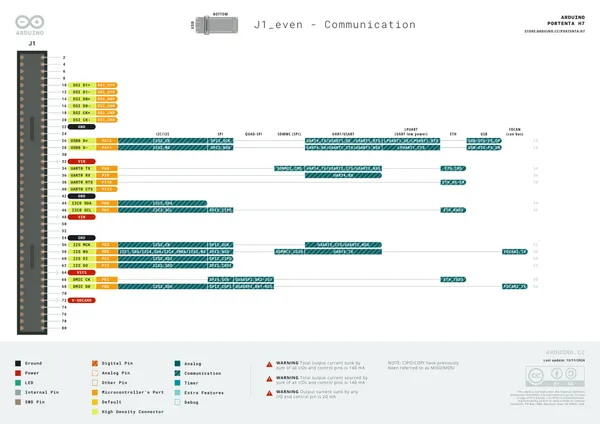](../../../../library/media/7bc4c2c30b7f65175a00f7b9307362d215112eaf9cd687a9b09d363beaf1e9fc.png)

[Open original reference](../../../../library/media/7bc4c2c30b7f65175a00f7b9307362d215112eaf9cd687a9b09d363beaf1e9fc.png)

**Credit and rights:** CC BY-SA 4.0 notice printed in the original PDF; preserve attribution and verify scope for publication.. Source/manufacturer: Arduino.

[Source 1](https://raw.githubusercontent.com/arduino/docs-content/dab66ecbd6ad52cd742da6c19c5b6330a7f2caae/content/hardware/pro/boards/portenta-h7/downloads/ABX00042-full-pinout.pdf) · [Source 2](https://docs.arduino.cc/hardware/portenta-h7/) · [Source 3](https://github.com/arduino/docs-content/blob/dab66ecbd6ad52cd742da6c19c5b6330a7f2caae/content/hardware/pro/boards/portenta-h7/product.md) · [Source 4](https://github.com/arduino/docs-content/blob/dab66ecbd6ad52cd742da6c19c5b6330a7f2caae/content/hardware/pro/boards/portenta-h7/downloads/ABX00042-full-pinout.pdf)

Official Arduino documentation repository pinned at dab66ecbd6ad52cd742da6c19c5b6330a7f2caae. Match the board model, SKU and revision printed on each source sheet; lifecycle is not inferred from repository folder placement. Original PDF page 7 rendered at 220 dpi; no labels changed.

SHA-256: `7bc4c2c30b7f65175a00f7b9307362d215112eaf9cd687a9b09d363beaf1e9fc`

## Official full pinout - page 8

**pinout image** · Reviewed source · PNG

[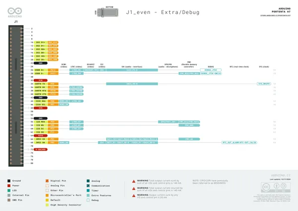](../../../../library/media/66db3622b514674c9e93d0a2b32e8c06a58635fd55bfd59427f36806608bf53c.png)

[Open original reference](../../../../library/media/66db3622b514674c9e93d0a2b32e8c06a58635fd55bfd59427f36806608bf53c.png)

**Credit and rights:** CC BY-SA 4.0 notice printed in the original PDF; preserve attribution and verify scope for publication.. Source/manufacturer: Arduino.

[Source 1](https://raw.githubusercontent.com/arduino/docs-content/dab66ecbd6ad52cd742da6c19c5b6330a7f2caae/content/hardware/pro/boards/portenta-h7/downloads/ABX00042-full-pinout.pdf) · [Source 2](https://docs.arduino.cc/hardware/portenta-h7/) · [Source 3](https://github.com/arduino/docs-content/blob/dab66ecbd6ad52cd742da6c19c5b6330a7f2caae/content/hardware/pro/boards/portenta-h7/product.md) · [Source 4](https://github.com/arduino/docs-content/blob/dab66ecbd6ad52cd742da6c19c5b6330a7f2caae/content/hardware/pro/boards/portenta-h7/downloads/ABX00042-full-pinout.pdf)

Official Arduino documentation repository pinned at dab66ecbd6ad52cd742da6c19c5b6330a7f2caae. Match the board model, SKU and revision printed on each source sheet; lifecycle is not inferred from repository folder placement. Original PDF page 8 rendered at 220 dpi; no labels changed.

SHA-256: `66db3622b514674c9e93d0a2b32e8c06a58635fd55bfd59427f36806608bf53c`

## Official full pinout - page 9

**pinout image** · Reviewed source · PNG

[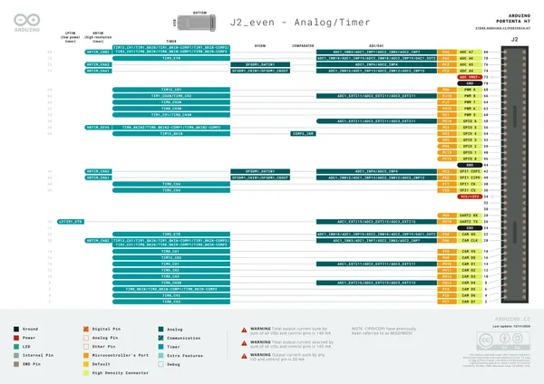](../../../../library/media/ce2d1a9980f55804f9d2b104c034c8eb6b1ce8c7df3bc03619b8cfcaf0b9b92c.png)

[Open original reference](../../../../library/media/ce2d1a9980f55804f9d2b104c034c8eb6b1ce8c7df3bc03619b8cfcaf0b9b92c.png)

**Credit and rights:** CC BY-SA 4.0 notice printed in the original PDF; preserve attribution and verify scope for publication.. Source/manufacturer: Arduino.

[Source 1](https://raw.githubusercontent.com/arduino/docs-content/dab66ecbd6ad52cd742da6c19c5b6330a7f2caae/content/hardware/pro/boards/portenta-h7/downloads/ABX00042-full-pinout.pdf) · [Source 2](https://docs.arduino.cc/hardware/portenta-h7/) · [Source 3](https://github.com/arduino/docs-content/blob/dab66ecbd6ad52cd742da6c19c5b6330a7f2caae/content/hardware/pro/boards/portenta-h7/product.md) · [Source 4](https://github.com/arduino/docs-content/blob/dab66ecbd6ad52cd742da6c19c5b6330a7f2caae/content/hardware/pro/boards/portenta-h7/downloads/ABX00042-full-pinout.pdf)

Official Arduino documentation repository pinned at dab66ecbd6ad52cd742da6c19c5b6330a7f2caae. Match the board model, SKU and revision printed on each source sheet; lifecycle is not inferred from repository folder placement. Original PDF page 9 rendered at 220 dpi; no labels changed.

SHA-256: `ce2d1a9980f55804f9d2b104c034c8eb6b1ce8c7df3bc03619b8cfcaf0b9b92c`

## Official full pinout - page 10

**pinout image** · Reviewed source · PNG

[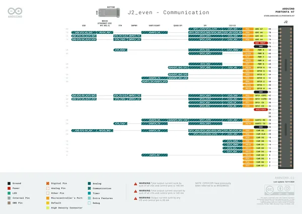](../../../../library/media/ed24c197fb99905287881ab30f1f5857a4d673e8d37b288171ec310bfa82d5ff.png)

[Open original reference](../../../../library/media/ed24c197fb99905287881ab30f1f5857a4d673e8d37b288171ec310bfa82d5ff.png)

**Credit and rights:** CC BY-SA 4.0 notice printed in the original PDF; preserve attribution and verify scope for publication.. Source/manufacturer: Arduino.

[Source 1](https://raw.githubusercontent.com/arduino/docs-content/dab66ecbd6ad52cd742da6c19c5b6330a7f2caae/content/hardware/pro/boards/portenta-h7/downloads/ABX00042-full-pinout.pdf) · [Source 2](https://docs.arduino.cc/hardware/portenta-h7/) · [Source 3](https://github.com/arduino/docs-content/blob/dab66ecbd6ad52cd742da6c19c5b6330a7f2caae/content/hardware/pro/boards/portenta-h7/product.md) · [Source 4](https://github.com/arduino/docs-content/blob/dab66ecbd6ad52cd742da6c19c5b6330a7f2caae/content/hardware/pro/boards/portenta-h7/downloads/ABX00042-full-pinout.pdf)

Official Arduino documentation repository pinned at dab66ecbd6ad52cd742da6c19c5b6330a7f2caae. Match the board model, SKU and revision printed on each source sheet; lifecycle is not inferred from repository folder placement. Original PDF page 10 rendered at 220 dpi; no labels changed.

SHA-256: `ed24c197fb99905287881ab30f1f5857a4d673e8d37b288171ec310bfa82d5ff`

## Official full pinout - page 11

**pinout image** · Reviewed source · PNG

[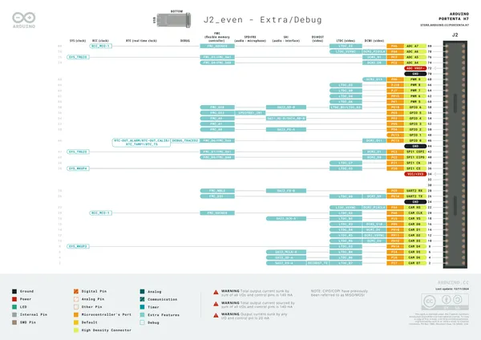](../../../../library/media/6392297499586422f8a034d911c935509cdcfe7b9513e6e84d345feaaa590990.png)

[Open original reference](../../../../library/media/6392297499586422f8a034d911c935509cdcfe7b9513e6e84d345feaaa590990.png)

**Credit and rights:** CC BY-SA 4.0 notice printed in the original PDF; preserve attribution and verify scope for publication.. Source/manufacturer: Arduino.

[Source 1](https://raw.githubusercontent.com/arduino/docs-content/dab66ecbd6ad52cd742da6c19c5b6330a7f2caae/content/hardware/pro/boards/portenta-h7/downloads/ABX00042-full-pinout.pdf) · [Source 2](https://docs.arduino.cc/hardware/portenta-h7/) · [Source 3](https://github.com/arduino/docs-content/blob/dab66ecbd6ad52cd742da6c19c5b6330a7f2caae/content/hardware/pro/boards/portenta-h7/product.md) · [Source 4](https://github.com/arduino/docs-content/blob/dab66ecbd6ad52cd742da6c19c5b6330a7f2caae/content/hardware/pro/boards/portenta-h7/downloads/ABX00042-full-pinout.pdf)

Official Arduino documentation repository pinned at dab66ecbd6ad52cd742da6c19c5b6330a7f2caae. Match the board model, SKU and revision printed on each source sheet; lifecycle is not inferred from repository folder placement. Original PDF page 11 rendered at 220 dpi; no labels changed.

SHA-256: `6392297499586422f8a034d911c935509cdcfe7b9513e6e84d345feaaa590990`

## Official full pinout - page 12

**pinout image** · Reviewed source · PNG

[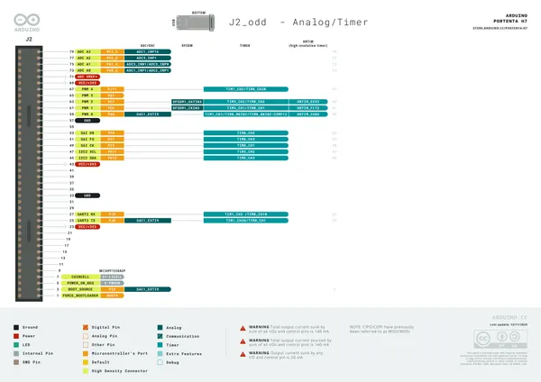](../../../../library/media/d47ddd041e7c28f8aadb477a25db176ff8c76037ff32fec691ec70d60f35aaf9.png)

[Open original reference](../../../../library/media/d47ddd041e7c28f8aadb477a25db176ff8c76037ff32fec691ec70d60f35aaf9.png)

**Credit and rights:** CC BY-SA 4.0 notice printed in the original PDF; preserve attribution and verify scope for publication.. Source/manufacturer: Arduino.

[Source 1](https://raw.githubusercontent.com/arduino/docs-content/dab66ecbd6ad52cd742da6c19c5b6330a7f2caae/content/hardware/pro/boards/portenta-h7/downloads/ABX00042-full-pinout.pdf) · [Source 2](https://docs.arduino.cc/hardware/portenta-h7/) · [Source 3](https://github.com/arduino/docs-content/blob/dab66ecbd6ad52cd742da6c19c5b6330a7f2caae/content/hardware/pro/boards/portenta-h7/product.md) · [Source 4](https://github.com/arduino/docs-content/blob/dab66ecbd6ad52cd742da6c19c5b6330a7f2caae/content/hardware/pro/boards/portenta-h7/downloads/ABX00042-full-pinout.pdf)

Official Arduino documentation repository pinned at dab66ecbd6ad52cd742da6c19c5b6330a7f2caae. Match the board model, SKU and revision printed on each source sheet; lifecycle is not inferred from repository folder placement. Original PDF page 12 rendered at 220 dpi; no labels changed.

SHA-256: `d47ddd041e7c28f8aadb477a25db176ff8c76037ff32fec691ec70d60f35aaf9`

## Official full pinout - page 13

**pinout image** · Reviewed source · PNG

[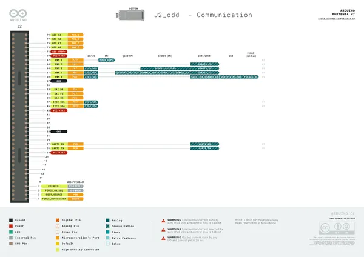](../../../../library/media/2a90e65028d30a2735a0cc771f4293d51b8677854fa7624779f9dfc35209273f.png)

[Open original reference](../../../../library/media/2a90e65028d30a2735a0cc771f4293d51b8677854fa7624779f9dfc35209273f.png)

**Credit and rights:** CC BY-SA 4.0 notice printed in the original PDF; preserve attribution and verify scope for publication.. Source/manufacturer: Arduino.

[Source 1](https://raw.githubusercontent.com/arduino/docs-content/dab66ecbd6ad52cd742da6c19c5b6330a7f2caae/content/hardware/pro/boards/portenta-h7/downloads/ABX00042-full-pinout.pdf) · [Source 2](https://docs.arduino.cc/hardware/portenta-h7/) · [Source 3](https://github.com/arduino/docs-content/blob/dab66ecbd6ad52cd742da6c19c5b6330a7f2caae/content/hardware/pro/boards/portenta-h7/product.md) · [Source 4](https://github.com/arduino/docs-content/blob/dab66ecbd6ad52cd742da6c19c5b6330a7f2caae/content/hardware/pro/boards/portenta-h7/downloads/ABX00042-full-pinout.pdf)

Official Arduino documentation repository pinned at dab66ecbd6ad52cd742da6c19c5b6330a7f2caae. Match the board model, SKU and revision printed on each source sheet; lifecycle is not inferred from repository folder placement. Original PDF page 13 rendered at 220 dpi; no labels changed.

SHA-256: `2a90e65028d30a2735a0cc771f4293d51b8677854fa7624779f9dfc35209273f`

## Official full pinout - page 14

**pinout image** · Reviewed source · PNG

[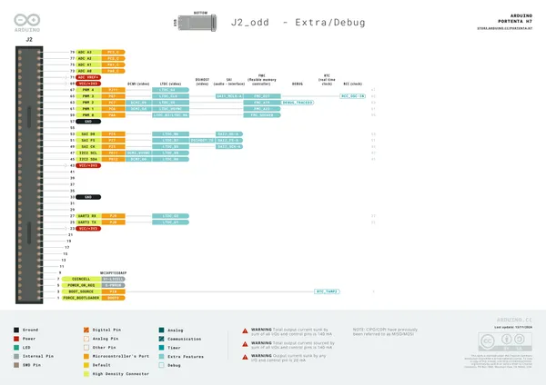](../../../../library/media/7dc4dd61035a4af3ba8d9e3bcdbe774f451cd1728b93ae6fdf70e5dcb945e26d.png)

[Open original reference](../../../../library/media/7dc4dd61035a4af3ba8d9e3bcdbe774f451cd1728b93ae6fdf70e5dcb945e26d.png)

**Credit and rights:** CC BY-SA 4.0 notice printed in the original PDF; preserve attribution and verify scope for publication.. Source/manufacturer: Arduino.

[Source 1](https://raw.githubusercontent.com/arduino/docs-content/dab66ecbd6ad52cd742da6c19c5b6330a7f2caae/content/hardware/pro/boards/portenta-h7/downloads/ABX00042-full-pinout.pdf) · [Source 2](https://docs.arduino.cc/hardware/portenta-h7/) · [Source 3](https://github.com/arduino/docs-content/blob/dab66ecbd6ad52cd742da6c19c5b6330a7f2caae/content/hardware/pro/boards/portenta-h7/product.md) · [Source 4](https://github.com/arduino/docs-content/blob/dab66ecbd6ad52cd742da6c19c5b6330a7f2caae/content/hardware/pro/boards/portenta-h7/downloads/ABX00042-full-pinout.pdf)

Official Arduino documentation repository pinned at dab66ecbd6ad52cd742da6c19c5b6330a7f2caae. Match the board model, SKU and revision printed on each source sheet; lifecycle is not inferred from repository folder placement. Original PDF page 14 rendered at 220 dpi; no labels changed.

SHA-256: `7dc4dd61035a4af3ba8d9e3bcdbe774f451cd1728b93ae6fdf70e5dcb945e26d`

## portentaH7_PinoutUSB-C

**GPIO reference image** · Reviewed source · PNG

[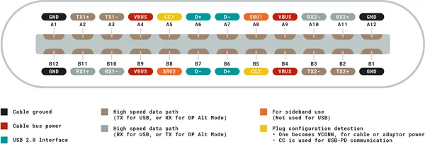](../../../../library/media/eea09765efb73073b729926fdb8e7dc831c06ad866af8ca4364522b79c13d8b3.png)

[Open original reference](../../../../library/media/eea09765efb73073b729926fdb8e7dc831c06ad866af8ca4364522b79c13d8b3.png)

**Credit and rights:** Not established; source attribution retained. Source/manufacturer: Arduino.

[Source 1](https://raw.githubusercontent.com/arduino/docs-content/dab66ecbd6ad52cd742da6c19c5b6330a7f2caae/content/hardware/pro/boards/portenta-h7/datasheet/assets/portentaH7_PinoutUSB-C.png) · [Source 2](https://docs.arduino.cc/hardware/portenta-h7/) · [Source 3](https://github.com/arduino/docs-content/blob/dab66ecbd6ad52cd742da6c19c5b6330a7f2caae/content/hardware/pro/boards/portenta-h7/product.md) · [Source 4](https://github.com/arduino/docs-content/blob/dab66ecbd6ad52cd742da6c19c5b6330a7f2caae/content/hardware/pro/boards/portenta-h7/datasheet/assets/portentaH7_PinoutUSB-C.png)

Official Arduino documentation repository pinned at dab66ecbd6ad52cd742da6c19c5b6330a7f2caae. Match the board model, SKU and revision printed on each source sheet; lifecycle is not inferred from repository folder placement.

SHA-256: `eea09765efb73073b729926fdb8e7dc831c06ad866af8ca4364522b79c13d8b3`

## Official full pinout - page 15

**GPIO reference image** · Reviewed source · PNG

[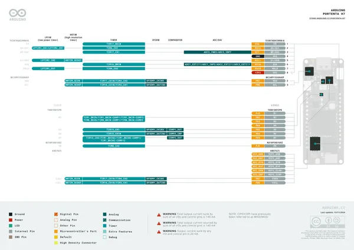](../../../../library/media/f325854a5c9cef8b81d16e79aad1a276b9fa159c30ef33a1346013025c37a130.png)

[Open original reference](../../../../library/media/f325854a5c9cef8b81d16e79aad1a276b9fa159c30ef33a1346013025c37a130.png)

**Credit and rights:** CC BY-SA 4.0 notice printed in the original PDF; preserve attribution and verify scope for publication.. Source/manufacturer: Arduino.

[Source 1](https://raw.githubusercontent.com/arduino/docs-content/dab66ecbd6ad52cd742da6c19c5b6330a7f2caae/content/hardware/pro/boards/portenta-h7/downloads/ABX00042-full-pinout.pdf) · [Source 2](https://docs.arduino.cc/hardware/portenta-h7/) · [Source 3](https://github.com/arduino/docs-content/blob/dab66ecbd6ad52cd742da6c19c5b6330a7f2caae/content/hardware/pro/boards/portenta-h7/product.md) · [Source 4](https://github.com/arduino/docs-content/blob/dab66ecbd6ad52cd742da6c19c5b6330a7f2caae/content/hardware/pro/boards/portenta-h7/downloads/ABX00042-full-pinout.pdf)

Official Arduino documentation repository pinned at dab66ecbd6ad52cd742da6c19c5b6330a7f2caae. Match the board model, SKU and revision printed on each source sheet; lifecycle is not inferred from repository folder placement. Original PDF page 15 rendered at 220 dpi; no labels changed.

SHA-256: `f325854a5c9cef8b81d16e79aad1a276b9fa159c30ef33a1346013025c37a130`

## Official full pinout - page 16

**GPIO reference image** · Reviewed source · PNG

[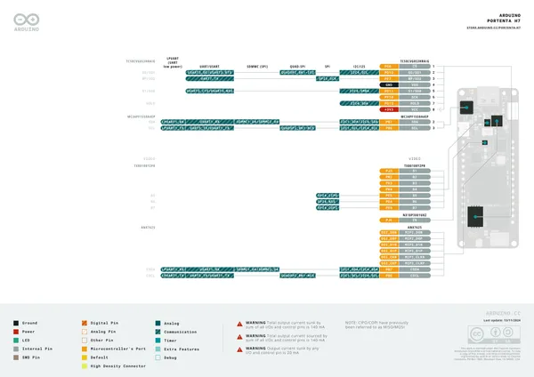](../../../../library/media/0dde9debdb5270312f87d878469e17bd772352056f60f14b6b04be31cae828f5.png)

[Open original reference](../../../../library/media/0dde9debdb5270312f87d878469e17bd772352056f60f14b6b04be31cae828f5.png)

**Credit and rights:** CC BY-SA 4.0 notice printed in the original PDF; preserve attribution and verify scope for publication.. Source/manufacturer: Arduino.

[Source 1](https://raw.githubusercontent.com/arduino/docs-content/dab66ecbd6ad52cd742da6c19c5b6330a7f2caae/content/hardware/pro/boards/portenta-h7/downloads/ABX00042-full-pinout.pdf) · [Source 2](https://docs.arduino.cc/hardware/portenta-h7/) · [Source 3](https://github.com/arduino/docs-content/blob/dab66ecbd6ad52cd742da6c19c5b6330a7f2caae/content/hardware/pro/boards/portenta-h7/product.md) · [Source 4](https://github.com/arduino/docs-content/blob/dab66ecbd6ad52cd742da6c19c5b6330a7f2caae/content/hardware/pro/boards/portenta-h7/downloads/ABX00042-full-pinout.pdf)

Official Arduino documentation repository pinned at dab66ecbd6ad52cd742da6c19c5b6330a7f2caae. Match the board model, SKU and revision printed on each source sheet; lifecycle is not inferred from repository folder placement. Original PDF page 16 rendered at 220 dpi; no labels changed.

SHA-256: `0dde9debdb5270312f87d878469e17bd772352056f60f14b6b04be31cae828f5`

## Official full pinout - page 17

**GPIO reference image** · Reviewed source · PNG

[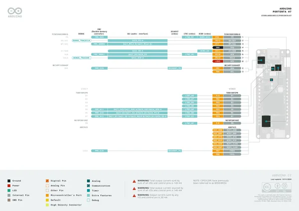](../../../../library/media/d5278a4b41bd22e615a8f16e9950f25fd07edae62047e92f2c65d24bd2341e32.png)

[Open original reference](../../../../library/media/d5278a4b41bd22e615a8f16e9950f25fd07edae62047e92f2c65d24bd2341e32.png)

**Credit and rights:** CC BY-SA 4.0 notice printed in the original PDF; preserve attribution and verify scope for publication.. Source/manufacturer: Arduino.

[Source 1](https://raw.githubusercontent.com/arduino/docs-content/dab66ecbd6ad52cd742da6c19c5b6330a7f2caae/content/hardware/pro/boards/portenta-h7/downloads/ABX00042-full-pinout.pdf) · [Source 2](https://docs.arduino.cc/hardware/portenta-h7/) · [Source 3](https://github.com/arduino/docs-content/blob/dab66ecbd6ad52cd742da6c19c5b6330a7f2caae/content/hardware/pro/boards/portenta-h7/product.md) · [Source 4](https://github.com/arduino/docs-content/blob/dab66ecbd6ad52cd742da6c19c5b6330a7f2caae/content/hardware/pro/boards/portenta-h7/downloads/ABX00042-full-pinout.pdf)

Official Arduino documentation repository pinned at dab66ecbd6ad52cd742da6c19c5b6330a7f2caae. Match the board model, SKU and revision printed on each source sheet; lifecycle is not inferred from repository folder placement. Original PDF page 17 rendered at 220 dpi; no labels changed.

SHA-256: `d5278a4b41bd22e615a8f16e9950f25fd07edae62047e92f2c65d24bd2341e32`

## Official full pinout - page 18

**GPIO reference image** · Reviewed source · PNG

[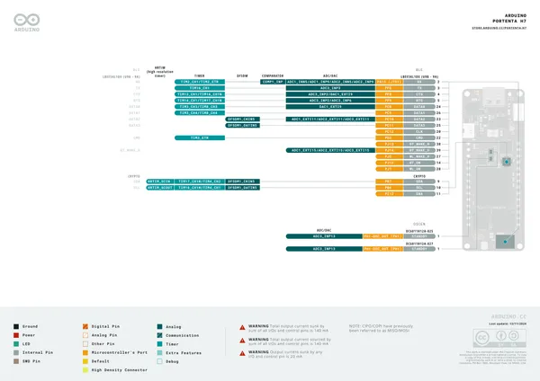](../../../../library/media/14121c9afda30f1f2eea5c844a64b28a9906d1c5a540568c3ae264c498fdacfa.png)

[Open original reference](../../../../library/media/14121c9afda30f1f2eea5c844a64b28a9906d1c5a540568c3ae264c498fdacfa.png)

**Credit and rights:** CC BY-SA 4.0 notice printed in the original PDF; preserve attribution and verify scope for publication.. Source/manufacturer: Arduino.

[Source 1](https://raw.githubusercontent.com/arduino/docs-content/dab66ecbd6ad52cd742da6c19c5b6330a7f2caae/content/hardware/pro/boards/portenta-h7/downloads/ABX00042-full-pinout.pdf) · [Source 2](https://docs.arduino.cc/hardware/portenta-h7/) · [Source 3](https://github.com/arduino/docs-content/blob/dab66ecbd6ad52cd742da6c19c5b6330a7f2caae/content/hardware/pro/boards/portenta-h7/product.md) · [Source 4](https://github.com/arduino/docs-content/blob/dab66ecbd6ad52cd742da6c19c5b6330a7f2caae/content/hardware/pro/boards/portenta-h7/downloads/ABX00042-full-pinout.pdf)

Official Arduino documentation repository pinned at dab66ecbd6ad52cd742da6c19c5b6330a7f2caae. Match the board model, SKU and revision printed on each source sheet; lifecycle is not inferred from repository folder placement. Original PDF page 18 rendered at 220 dpi; no labels changed.

SHA-256: `14121c9afda30f1f2eea5c844a64b28a9906d1c5a540568c3ae264c498fdacfa`

## Official full pinout - page 19

**GPIO reference image** · Reviewed source · PNG

[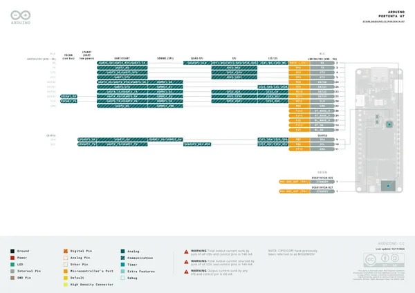](../../../../library/media/ca47638de7f748f18d65316ad1ec00bef763896e1f423989981175f01b37c156.png)

[Open original reference](../../../../library/media/ca47638de7f748f18d65316ad1ec00bef763896e1f423989981175f01b37c156.png)

**Credit and rights:** CC BY-SA 4.0 notice printed in the original PDF; preserve attribution and verify scope for publication.. Source/manufacturer: Arduino.

[Source 1](https://raw.githubusercontent.com/arduino/docs-content/dab66ecbd6ad52cd742da6c19c5b6330a7f2caae/content/hardware/pro/boards/portenta-h7/downloads/ABX00042-full-pinout.pdf) · [Source 2](https://docs.arduino.cc/hardware/portenta-h7/) · [Source 3](https://github.com/arduino/docs-content/blob/dab66ecbd6ad52cd742da6c19c5b6330a7f2caae/content/hardware/pro/boards/portenta-h7/product.md) · [Source 4](https://github.com/arduino/docs-content/blob/dab66ecbd6ad52cd742da6c19c5b6330a7f2caae/content/hardware/pro/boards/portenta-h7/downloads/ABX00042-full-pinout.pdf)

Official Arduino documentation repository pinned at dab66ecbd6ad52cd742da6c19c5b6330a7f2caae. Match the board model, SKU and revision printed on each source sheet; lifecycle is not inferred from repository folder placement. Original PDF page 19 rendered at 220 dpi; no labels changed.

SHA-256: `ca47638de7f748f18d65316ad1ec00bef763896e1f423989981175f01b37c156`

## Official full pinout - page 20

**GPIO reference image** · Reviewed source · PNG

[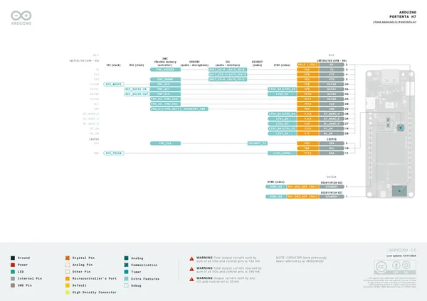](../../../../library/media/ad36f0946b5c01b4a2aafecff3d4a379b200be321eb3ad78cb684f40b91f3462.png)

[Open original reference](../../../../library/media/ad36f0946b5c01b4a2aafecff3d4a379b200be321eb3ad78cb684f40b91f3462.png)

**Credit and rights:** CC BY-SA 4.0 notice printed in the original PDF; preserve attribution and verify scope for publication.. Source/manufacturer: Arduino.

[Source 1](https://raw.githubusercontent.com/arduino/docs-content/dab66ecbd6ad52cd742da6c19c5b6330a7f2caae/content/hardware/pro/boards/portenta-h7/downloads/ABX00042-full-pinout.pdf) · [Source 2](https://docs.arduino.cc/hardware/portenta-h7/) · [Source 3](https://github.com/arduino/docs-content/blob/dab66ecbd6ad52cd742da6c19c5b6330a7f2caae/content/hardware/pro/boards/portenta-h7/product.md) · [Source 4](https://github.com/arduino/docs-content/blob/dab66ecbd6ad52cd742da6c19c5b6330a7f2caae/content/hardware/pro/boards/portenta-h7/downloads/ABX00042-full-pinout.pdf)

Official Arduino documentation repository pinned at dab66ecbd6ad52cd742da6c19c5b6330a7f2caae. Match the board model, SKU and revision printed on each source sheet; lifecycle is not inferred from repository folder placement. Original PDF page 20 rendered at 220 dpi; no labels changed.

SHA-256: `ad36f0946b5c01b4a2aafecff3d4a379b200be321eb3ad78cb684f40b91f3462`

## Official full pinout - page 21

**GPIO reference image** · Reviewed source · PNG

[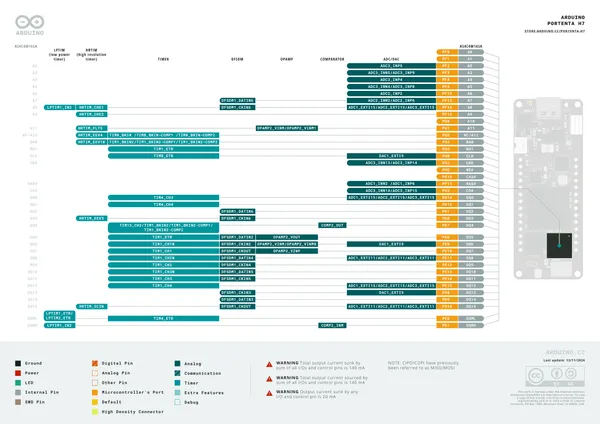](../../../../library/media/a2df4c763a829cac356ac3178e7823b5c5cbddca5f4018c563b6562d9fb3f4d9.png)

[Open original reference](../../../../library/media/a2df4c763a829cac356ac3178e7823b5c5cbddca5f4018c563b6562d9fb3f4d9.png)

**Credit and rights:** CC BY-SA 4.0 notice printed in the original PDF; preserve attribution and verify scope for publication.. Source/manufacturer: Arduino.

[Source 1](https://raw.githubusercontent.com/arduino/docs-content/dab66ecbd6ad52cd742da6c19c5b6330a7f2caae/content/hardware/pro/boards/portenta-h7/downloads/ABX00042-full-pinout.pdf) · [Source 2](https://docs.arduino.cc/hardware/portenta-h7/) · [Source 3](https://github.com/arduino/docs-content/blob/dab66ecbd6ad52cd742da6c19c5b6330a7f2caae/content/hardware/pro/boards/portenta-h7/product.md) · [Source 4](https://github.com/arduino/docs-content/blob/dab66ecbd6ad52cd742da6c19c5b6330a7f2caae/content/hardware/pro/boards/portenta-h7/downloads/ABX00042-full-pinout.pdf)

Official Arduino documentation repository pinned at dab66ecbd6ad52cd742da6c19c5b6330a7f2caae. Match the board model, SKU and revision printed on each source sheet; lifecycle is not inferred from repository folder placement. Original PDF page 21 rendered at 220 dpi; no labels changed.

SHA-256: `a2df4c763a829cac356ac3178e7823b5c5cbddca5f4018c563b6562d9fb3f4d9`

## Official full pinout - page 22

**GPIO reference image** · Reviewed source · PNG

[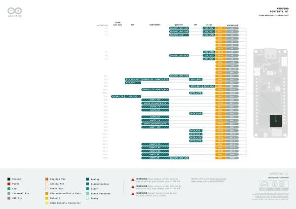](../../../../library/media/cb10fbfc1608e1b4442043df4f5e58a717713beb0c01c33839c87e898d3cdc91.png)

[Open original reference](../../../../library/media/cb10fbfc1608e1b4442043df4f5e58a717713beb0c01c33839c87e898d3cdc91.png)

**Credit and rights:** CC BY-SA 4.0 notice printed in the original PDF; preserve attribution and verify scope for publication.. Source/manufacturer: Arduino.

[Source 1](https://raw.githubusercontent.com/arduino/docs-content/dab66ecbd6ad52cd742da6c19c5b6330a7f2caae/content/hardware/pro/boards/portenta-h7/downloads/ABX00042-full-pinout.pdf) · [Source 2](https://docs.arduino.cc/hardware/portenta-h7/) · [Source 3](https://github.com/arduino/docs-content/blob/dab66ecbd6ad52cd742da6c19c5b6330a7f2caae/content/hardware/pro/boards/portenta-h7/product.md) · [Source 4](https://github.com/arduino/docs-content/blob/dab66ecbd6ad52cd742da6c19c5b6330a7f2caae/content/hardware/pro/boards/portenta-h7/downloads/ABX00042-full-pinout.pdf)

Official Arduino documentation repository pinned at dab66ecbd6ad52cd742da6c19c5b6330a7f2caae. Match the board model, SKU and revision printed on each source sheet; lifecycle is not inferred from repository folder placement. Original PDF page 22 rendered at 220 dpi; no labels changed.

SHA-256: `cb10fbfc1608e1b4442043df4f5e58a717713beb0c01c33839c87e898d3cdc91`

## Official full pinout - page 23

**GPIO reference image** · Reviewed source · PNG

[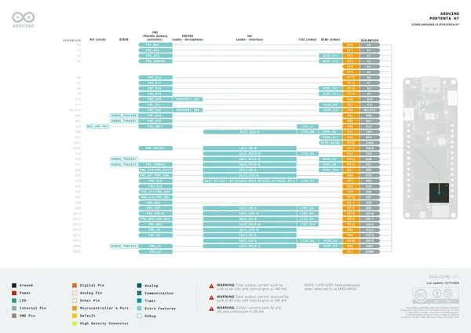](../../../../library/media/91f3465c63b42f324f18363f4929f64068d9e8b31eef59584b9a4fb62e744cbb.png)

[Open original reference](../../../../library/media/91f3465c63b42f324f18363f4929f64068d9e8b31eef59584b9a4fb62e744cbb.png)

**Credit and rights:** CC BY-SA 4.0 notice printed in the original PDF; preserve attribution and verify scope for publication.. Source/manufacturer: Arduino.

[Source 1](https://raw.githubusercontent.com/arduino/docs-content/dab66ecbd6ad52cd742da6c19c5b6330a7f2caae/content/hardware/pro/boards/portenta-h7/downloads/ABX00042-full-pinout.pdf) · [Source 2](https://docs.arduino.cc/hardware/portenta-h7/) · [Source 3](https://github.com/arduino/docs-content/blob/dab66ecbd6ad52cd742da6c19c5b6330a7f2caae/content/hardware/pro/boards/portenta-h7/product.md) · [Source 4](https://github.com/arduino/docs-content/blob/dab66ecbd6ad52cd742da6c19c5b6330a7f2caae/content/hardware/pro/boards/portenta-h7/downloads/ABX00042-full-pinout.pdf)

Official Arduino documentation repository pinned at dab66ecbd6ad52cd742da6c19c5b6330a7f2caae. Match the board model, SKU and revision printed on each source sheet; lifecycle is not inferred from repository folder placement. Original PDF page 23 rendered at 220 dpi; no labels changed.

SHA-256: `91f3465c63b42f324f18363f4929f64068d9e8b31eef59584b9a4fb62e744cbb`

## Official full pinout - page 24

**GPIO reference image** · Reviewed source · PNG

[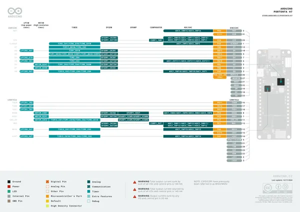](../../../../library/media/1adec83737619eea72999a0919b7d57105750f4bc80073f06fded914424a0430.png)

[Open original reference](../../../../library/media/1adec83737619eea72999a0919b7d57105750f4bc80073f06fded914424a0430.png)

**Credit and rights:** CC BY-SA 4.0 notice printed in the original PDF; preserve attribution and verify scope for publication.. Source/manufacturer: Arduino.

[Source 1](https://raw.githubusercontent.com/arduino/docs-content/dab66ecbd6ad52cd742da6c19c5b6330a7f2caae/content/hardware/pro/boards/portenta-h7/downloads/ABX00042-full-pinout.pdf) · [Source 2](https://docs.arduino.cc/hardware/portenta-h7/) · [Source 3](https://github.com/arduino/docs-content/blob/dab66ecbd6ad52cd742da6c19c5b6330a7f2caae/content/hardware/pro/boards/portenta-h7/product.md) · [Source 4](https://github.com/arduino/docs-content/blob/dab66ecbd6ad52cd742da6c19c5b6330a7f2caae/content/hardware/pro/boards/portenta-h7/downloads/ABX00042-full-pinout.pdf)

Official Arduino documentation repository pinned at dab66ecbd6ad52cd742da6c19c5b6330a7f2caae. Match the board model, SKU and revision printed on each source sheet; lifecycle is not inferred from repository folder placement. Original PDF page 24 rendered at 220 dpi; no labels changed.

SHA-256: `1adec83737619eea72999a0919b7d57105750f4bc80073f06fded914424a0430`

## Official full pinout - page 25

**GPIO reference image** · Reviewed source · PNG

[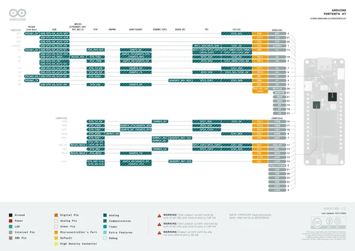](../../../../library/media/3e88ca4c29582a4096f423a22601cbca9440c776741554af02d0e087fa26892e.png)

[Open original reference](../../../../library/media/3e88ca4c29582a4096f423a22601cbca9440c776741554af02d0e087fa26892e.png)

**Credit and rights:** CC BY-SA 4.0 notice printed in the original PDF; preserve attribution and verify scope for publication.. Source/manufacturer: Arduino.

[Source 1](https://raw.githubusercontent.com/arduino/docs-content/dab66ecbd6ad52cd742da6c19c5b6330a7f2caae/content/hardware/pro/boards/portenta-h7/downloads/ABX00042-full-pinout.pdf) · [Source 2](https://docs.arduino.cc/hardware/portenta-h7/) · [Source 3](https://github.com/arduino/docs-content/blob/dab66ecbd6ad52cd742da6c19c5b6330a7f2caae/content/hardware/pro/boards/portenta-h7/product.md) · [Source 4](https://github.com/arduino/docs-content/blob/dab66ecbd6ad52cd742da6c19c5b6330a7f2caae/content/hardware/pro/boards/portenta-h7/downloads/ABX00042-full-pinout.pdf)

Official Arduino documentation repository pinned at dab66ecbd6ad52cd742da6c19c5b6330a7f2caae. Match the board model, SKU and revision printed on each source sheet; lifecycle is not inferred from repository folder placement. Original PDF page 25 rendered at 220 dpi; no labels changed.

SHA-256: `3e88ca4c29582a4096f423a22601cbca9440c776741554af02d0e087fa26892e`

## Official full pinout - page 26

**GPIO reference image** · Reviewed source · PNG

[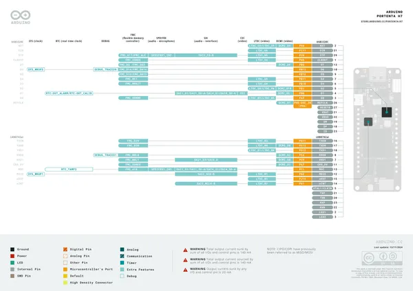](../../../../library/media/568535dd9d1e12e163d0b70f16ec1e1253f1217c806657018aed9b9b6d9a0b65.png)

[Open original reference](../../../../library/media/568535dd9d1e12e163d0b70f16ec1e1253f1217c806657018aed9b9b6d9a0b65.png)

**Credit and rights:** CC BY-SA 4.0 notice printed in the original PDF; preserve attribution and verify scope for publication.. Source/manufacturer: Arduino.

[Source 1](https://raw.githubusercontent.com/arduino/docs-content/dab66ecbd6ad52cd742da6c19c5b6330a7f2caae/content/hardware/pro/boards/portenta-h7/downloads/ABX00042-full-pinout.pdf) · [Source 2](https://docs.arduino.cc/hardware/portenta-h7/) · [Source 3](https://github.com/arduino/docs-content/blob/dab66ecbd6ad52cd742da6c19c5b6330a7f2caae/content/hardware/pro/boards/portenta-h7/product.md) · [Source 4](https://github.com/arduino/docs-content/blob/dab66ecbd6ad52cd742da6c19c5b6330a7f2caae/content/hardware/pro/boards/portenta-h7/downloads/ABX00042-full-pinout.pdf)

Official Arduino documentation repository pinned at dab66ecbd6ad52cd742da6c19c5b6330a7f2caae. Match the board model, SKU and revision printed on each source sheet; lifecycle is not inferred from repository folder placement. Original PDF page 26 rendered at 220 dpi; no labels changed.

SHA-256: `568535dd9d1e12e163d0b70f16ec1e1253f1217c806657018aed9b9b6d9a0b65`

## Full board pinout PDF

**original reference PDF** · Reviewed source · PDF

[Open original reference](../../../../library/media/56f4206aedb81a4e72ce44c0d734ebe9269d67d63f0585dea96e5e557b2e9b1d.pdf)

**Credit and rights:** Not established; source attribution retained. Source/manufacturer: Arduino.

[Source 1](https://raw.githubusercontent.com/arduino/docs-content/dab66ecbd6ad52cd742da6c19c5b6330a7f2caae/content/hardware/pro/boards/portenta-h7/downloads/ABX00042-full-pinout.pdf) · [Source 2](https://docs.arduino.cc/hardware/portenta-h7/) · [Source 3](https://github.com/arduino/docs-content/blob/dab66ecbd6ad52cd742da6c19c5b6330a7f2caae/content/hardware/pro/boards/portenta-h7/product.md) · [Source 4](https://github.com/arduino/docs-content/blob/dab66ecbd6ad52cd742da6c19c5b6330a7f2caae/content/hardware/pro/boards/portenta-h7/downloads/ABX00042-full-pinout.pdf)

Official Arduino documentation repository pinned at dab66ecbd6ad52cd742da6c19c5b6330a7f2caae. Match the board model, SKU and revision printed on each source sheet; lifecycle is not inferred from repository folder placement.

SHA-256: `56f4206aedb81a4e72ce44c0d734ebe9269d67d63f0585dea96e5e557b2e9b1d`

Pin assignments have not been independently electrically verified. Check board revision before wiring.
