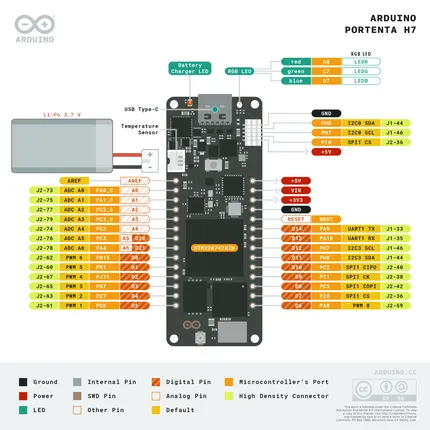

# Portenta H7 Lite Connected

**Arduino** · Other

Revision: Not identified  
Coverage: Pinout image collected

[Browse all manufacturers](../../../../BROWSE.md) · [Desktop app](https://github.com/valleytechsolutions/black-wire-desktop)

## ABX00042-pinout

**pinout image** · Reviewed source · PNG

[Open original reference](../../../../library/media/e7e39a2ddcb37d3be4b8ec4b919fa038d4382d1af1af271b5148de146970b988.png)

**Credit and rights:** Not established; source attribution retained. Source/manufacturer: Arduino.

[Source 1](https://raw.githubusercontent.com/arduino/docs-content/dab66ecbd6ad52cd742da6c19c5b6330a7f2caae/content/hardware/pro/boards/portenta-h7-lite-connected/interactive/ABX00042-pinout.png) · [Source 2](https://docs.arduino.cc/hardware/portenta-h7-lite-connected/) · [Source 3](https://github.com/arduino/docs-content/blob/dab66ecbd6ad52cd742da6c19c5b6330a7f2caae/content/hardware/pro/boards/portenta-h7-lite-connected/product.md) · [Source 4](https://github.com/arduino/docs-content/blob/dab66ecbd6ad52cd742da6c19c5b6330a7f2caae/content/hardware/pro/boards/portenta-h7-lite-connected/interactive/ABX00042-pinout.png)

Official Arduino documentation repository pinned at dab66ecbd6ad52cd742da6c19c5b6330a7f2caae. Match the board model, SKU and revision printed on each source sheet; lifecycle is not inferred from repository folder placement. Manufacturer publishes this H7-named header card under the exact Lite product directory. This source reuse does not establish identical onboard peripherals; confirm the populated hardware and exact revision.

SHA-256: `e7e39a2ddcb37d3be4b8ec4b919fa038d4382d1af1af271b5148de146970b988`

Pin assignments have not been independently electrically verified. Check board revision before wiring.
