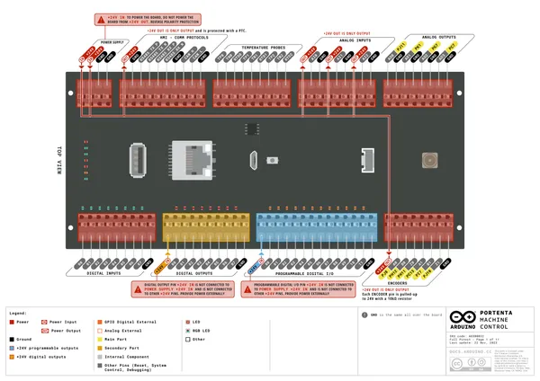
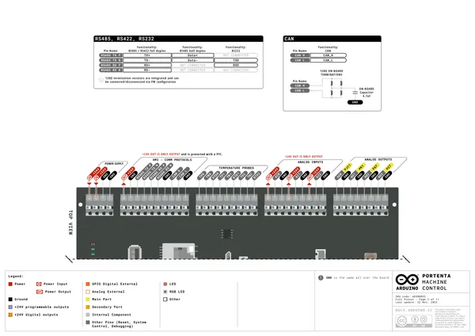
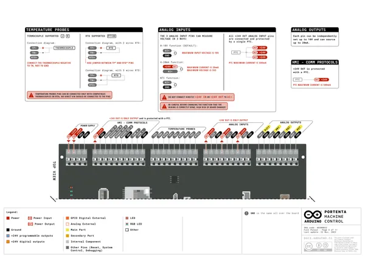
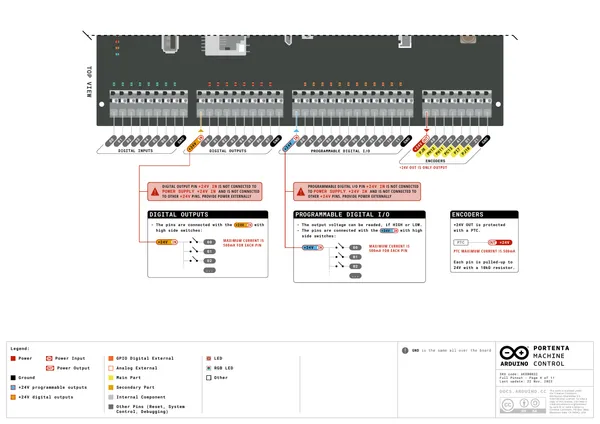
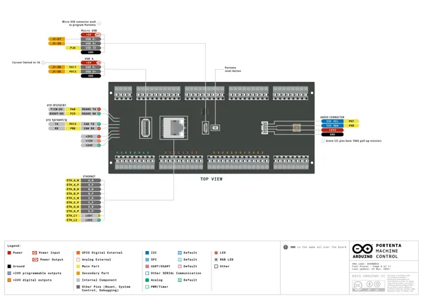
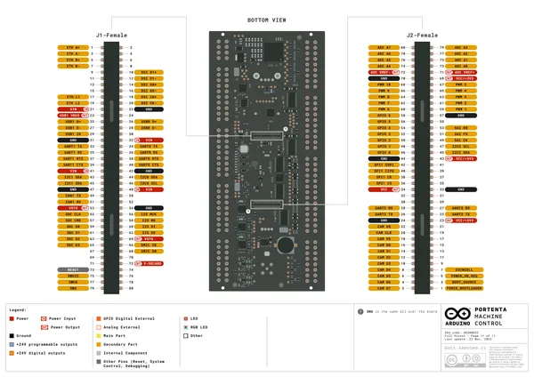
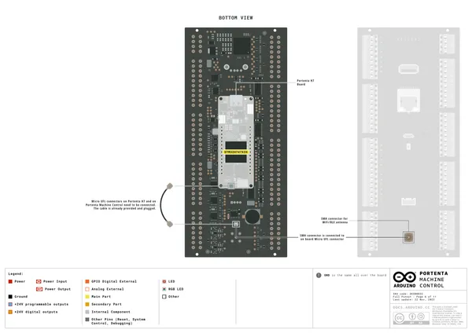
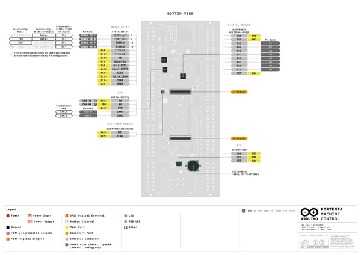
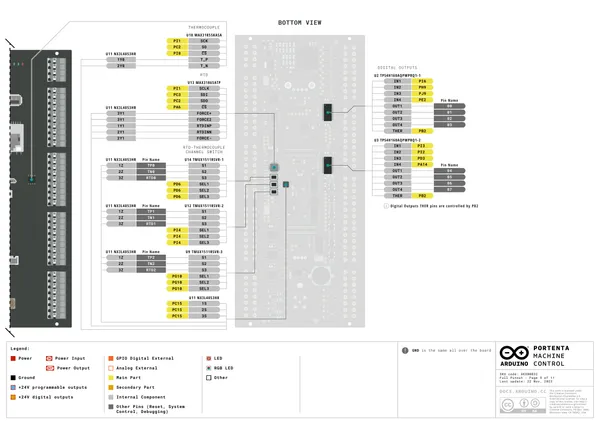
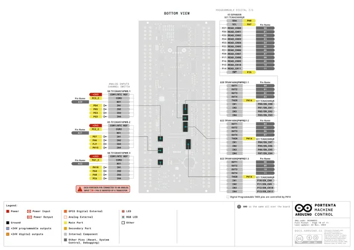

# Portenta Machine Control

**Arduino** · Other

Revision: Not identified  
Coverage: Pinout image collected

[Browse all manufacturers](../../../../BROWSE.md) · [Desktop app](https://github.com/valleytechsolutions/black-wire-desktop)

## Official full pinout - page 1

**pinout image** · Reviewed source · PNG

[Open original reference](../../../../library/media/7bf9cf6e637c7669f53d21c1bee6cae5dfde358e03e8fa455a51aa5477e3e250.png)

**Credit and rights:** CC BY-SA 4.0 notice printed in the original PDF; preserve attribution and verify scope for publication.. Source/manufacturer: Arduino.

[Source 1](https://raw.githubusercontent.com/arduino/docs-content/dab66ecbd6ad52cd742da6c19c5b6330a7f2caae/content/hardware/pro-solutions/solutions-and-kits/portenta-machine-control/downloads/AKX00032-full-pinout.pdf) · [Source 2](https://docs.arduino.cc/hardware/portenta-machine-control/) · [Source 3](https://github.com/arduino/docs-content/blob/dab66ecbd6ad52cd742da6c19c5b6330a7f2caae/content/hardware/pro-solutions/solutions-and-kits/portenta-machine-control/product.md) · [Source 4](https://github.com/arduino/docs-content/blob/dab66ecbd6ad52cd742da6c19c5b6330a7f2caae/content/hardware/pro-solutions/solutions-and-kits/portenta-machine-control/downloads/AKX00032-full-pinout.pdf)

Official Arduino documentation repository pinned at dab66ecbd6ad52cd742da6c19c5b6330a7f2caae. Match the board model, SKU and revision printed on each source sheet; lifecycle is not inferred from repository folder placement. Original PDF page 1 rendered at 220 dpi; no labels changed.

SHA-256: `7bf9cf6e637c7669f53d21c1bee6cae5dfde358e03e8fa455a51aa5477e3e250`

## Official full pinout - page 2

**pinout image** · Reviewed source · PNG

[Open original reference](../../../../library/media/df68408b82dc9d8881d88d4448705b1a96df8e9567f6307bc4c4b8dac2cbef47.png)

**Credit and rights:** CC BY-SA 4.0 notice printed in the original PDF; preserve attribution and verify scope for publication.. Source/manufacturer: Arduino.

[Source 1](https://raw.githubusercontent.com/arduino/docs-content/dab66ecbd6ad52cd742da6c19c5b6330a7f2caae/content/hardware/pro-solutions/solutions-and-kits/portenta-machine-control/downloads/AKX00032-full-pinout.pdf) · [Source 2](https://docs.arduino.cc/hardware/portenta-machine-control/) · [Source 3](https://github.com/arduino/docs-content/blob/dab66ecbd6ad52cd742da6c19c5b6330a7f2caae/content/hardware/pro-solutions/solutions-and-kits/portenta-machine-control/product.md) · [Source 4](https://github.com/arduino/docs-content/blob/dab66ecbd6ad52cd742da6c19c5b6330a7f2caae/content/hardware/pro-solutions/solutions-and-kits/portenta-machine-control/downloads/AKX00032-full-pinout.pdf)

Official Arduino documentation repository pinned at dab66ecbd6ad52cd742da6c19c5b6330a7f2caae. Match the board model, SKU and revision printed on each source sheet; lifecycle is not inferred from repository folder placement. Original PDF page 2 rendered at 220 dpi; no labels changed.

SHA-256: `df68408b82dc9d8881d88d4448705b1a96df8e9567f6307bc4c4b8dac2cbef47`

## Official full pinout - page 3

**pinout image** · Reviewed source · PNG

[Open original reference](../../../../library/media/b0924059b624eb056948b8112fd61ac9ce27175b9c06b964a3ec3b840fede7aa.png)

**Credit and rights:** CC BY-SA 4.0 notice printed in the original PDF; preserve attribution and verify scope for publication.. Source/manufacturer: Arduino.

[Source 1](https://raw.githubusercontent.com/arduino/docs-content/dab66ecbd6ad52cd742da6c19c5b6330a7f2caae/content/hardware/pro-solutions/solutions-and-kits/portenta-machine-control/downloads/AKX00032-full-pinout.pdf) · [Source 2](https://docs.arduino.cc/hardware/portenta-machine-control/) · [Source 3](https://github.com/arduino/docs-content/blob/dab66ecbd6ad52cd742da6c19c5b6330a7f2caae/content/hardware/pro-solutions/solutions-and-kits/portenta-machine-control/product.md) · [Source 4](https://github.com/arduino/docs-content/blob/dab66ecbd6ad52cd742da6c19c5b6330a7f2caae/content/hardware/pro-solutions/solutions-and-kits/portenta-machine-control/downloads/AKX00032-full-pinout.pdf)

Official Arduino documentation repository pinned at dab66ecbd6ad52cd742da6c19c5b6330a7f2caae. Match the board model, SKU and revision printed on each source sheet; lifecycle is not inferred from repository folder placement. Original PDF page 3 rendered at 220 dpi; no labels changed.

SHA-256: `b0924059b624eb056948b8112fd61ac9ce27175b9c06b964a3ec3b840fede7aa`

## Official full pinout - page 4

**pinout image** · Reviewed source · PNG

[Open original reference](../../../../library/media/eab811ca93774ec426e600be203f8512c1701fd7ca619d57e6a67915473f7695.png)

**Credit and rights:** CC BY-SA 4.0 notice printed in the original PDF; preserve attribution and verify scope for publication.. Source/manufacturer: Arduino.

[Source 1](https://raw.githubusercontent.com/arduino/docs-content/dab66ecbd6ad52cd742da6c19c5b6330a7f2caae/content/hardware/pro-solutions/solutions-and-kits/portenta-machine-control/downloads/AKX00032-full-pinout.pdf) · [Source 2](https://docs.arduino.cc/hardware/portenta-machine-control/) · [Source 3](https://github.com/arduino/docs-content/blob/dab66ecbd6ad52cd742da6c19c5b6330a7f2caae/content/hardware/pro-solutions/solutions-and-kits/portenta-machine-control/product.md) · [Source 4](https://github.com/arduino/docs-content/blob/dab66ecbd6ad52cd742da6c19c5b6330a7f2caae/content/hardware/pro-solutions/solutions-and-kits/portenta-machine-control/downloads/AKX00032-full-pinout.pdf)

Official Arduino documentation repository pinned at dab66ecbd6ad52cd742da6c19c5b6330a7f2caae. Match the board model, SKU and revision printed on each source sheet; lifecycle is not inferred from repository folder placement. Original PDF page 4 rendered at 220 dpi; no labels changed.

SHA-256: `eab811ca93774ec426e600be203f8512c1701fd7ca619d57e6a67915473f7695`

## Official full pinout - page 5

**pinout image** · Reviewed source · PNG

[Open original reference](../../../../library/media/9255f4a25238ecc441b5abb79c9955e5984ca3bcfbf903c4e46c045b66c49a2f.png)

**Credit and rights:** CC BY-SA 4.0 notice printed in the original PDF; preserve attribution and verify scope for publication.. Source/manufacturer: Arduino.

[Source 1](https://raw.githubusercontent.com/arduino/docs-content/dab66ecbd6ad52cd742da6c19c5b6330a7f2caae/content/hardware/pro-solutions/solutions-and-kits/portenta-machine-control/downloads/AKX00032-full-pinout.pdf) · [Source 2](https://docs.arduino.cc/hardware/portenta-machine-control/) · [Source 3](https://github.com/arduino/docs-content/blob/dab66ecbd6ad52cd742da6c19c5b6330a7f2caae/content/hardware/pro-solutions/solutions-and-kits/portenta-machine-control/product.md) · [Source 4](https://github.com/arduino/docs-content/blob/dab66ecbd6ad52cd742da6c19c5b6330a7f2caae/content/hardware/pro-solutions/solutions-and-kits/portenta-machine-control/downloads/AKX00032-full-pinout.pdf)

Official Arduino documentation repository pinned at dab66ecbd6ad52cd742da6c19c5b6330a7f2caae. Match the board model, SKU and revision printed on each source sheet; lifecycle is not inferred from repository folder placement. Original PDF page 5 rendered at 220 dpi; no labels changed.

SHA-256: `9255f4a25238ecc441b5abb79c9955e5984ca3bcfbf903c4e46c045b66c49a2f`

## Official full pinout - page 11

**pinout image** · Reviewed source · PNG

[Open original reference](../../../../library/media/7cc795113c2e0dd9ad1f421e294157d0415b71ac0dc5512a04c44899013ea628.png)

**Credit and rights:** CC BY-SA 4.0 notice printed in the original PDF; preserve attribution and verify scope for publication.. Source/manufacturer: Arduino.

[Source 1](https://raw.githubusercontent.com/arduino/docs-content/dab66ecbd6ad52cd742da6c19c5b6330a7f2caae/content/hardware/pro-solutions/solutions-and-kits/portenta-machine-control/downloads/AKX00032-full-pinout.pdf) · [Source 2](https://docs.arduino.cc/hardware/portenta-machine-control/) · [Source 3](https://github.com/arduino/docs-content/blob/dab66ecbd6ad52cd742da6c19c5b6330a7f2caae/content/hardware/pro-solutions/solutions-and-kits/portenta-machine-control/product.md) · [Source 4](https://github.com/arduino/docs-content/blob/dab66ecbd6ad52cd742da6c19c5b6330a7f2caae/content/hardware/pro-solutions/solutions-and-kits/portenta-machine-control/downloads/AKX00032-full-pinout.pdf)

Official Arduino documentation repository pinned at dab66ecbd6ad52cd742da6c19c5b6330a7f2caae. Match the board model, SKU and revision printed on each source sheet; lifecycle is not inferred from repository folder placement. Original PDF page 11 rendered at 220 dpi; no labels changed.

SHA-256: `7cc795113c2e0dd9ad1f421e294157d0415b71ac0dc5512a04c44899013ea628`

## Official full pinout - page 6

**GPIO reference image** · Reviewed source · PNG

[Open original reference](../../../../library/media/94c15238359e1359b42aed692f9eb20c6e14266209d6b372c9c50b7d3c0a015b.png)

**Credit and rights:** CC BY-SA 4.0 notice printed in the original PDF; preserve attribution and verify scope for publication.. Source/manufacturer: Arduino.

[Source 1](https://raw.githubusercontent.com/arduino/docs-content/dab66ecbd6ad52cd742da6c19c5b6330a7f2caae/content/hardware/pro-solutions/solutions-and-kits/portenta-machine-control/downloads/AKX00032-full-pinout.pdf) · [Source 2](https://docs.arduino.cc/hardware/portenta-machine-control/) · [Source 3](https://github.com/arduino/docs-content/blob/dab66ecbd6ad52cd742da6c19c5b6330a7f2caae/content/hardware/pro-solutions/solutions-and-kits/portenta-machine-control/product.md) · [Source 4](https://github.com/arduino/docs-content/blob/dab66ecbd6ad52cd742da6c19c5b6330a7f2caae/content/hardware/pro-solutions/solutions-and-kits/portenta-machine-control/downloads/AKX00032-full-pinout.pdf)

Official Arduino documentation repository pinned at dab66ecbd6ad52cd742da6c19c5b6330a7f2caae. Match the board model, SKU and revision printed on each source sheet; lifecycle is not inferred from repository folder placement. Original PDF page 6 rendered at 220 dpi; no labels changed.

SHA-256: `94c15238359e1359b42aed692f9eb20c6e14266209d6b372c9c50b7d3c0a015b`

## Official full pinout - page 8

**GPIO reference image** · Reviewed source · PNG

[Open original reference](../../../../library/media/b7a024bc55e49ae37c32a88770de7c0575a4556193884f7a4a4b6a11c128cecd.png)

**Credit and rights:** CC BY-SA 4.0 notice printed in the original PDF; preserve attribution and verify scope for publication.. Source/manufacturer: Arduino.

[Source 1](https://raw.githubusercontent.com/arduino/docs-content/dab66ecbd6ad52cd742da6c19c5b6330a7f2caae/content/hardware/pro-solutions/solutions-and-kits/portenta-machine-control/downloads/AKX00032-full-pinout.pdf) · [Source 2](https://docs.arduino.cc/hardware/portenta-machine-control/) · [Source 3](https://github.com/arduino/docs-content/blob/dab66ecbd6ad52cd742da6c19c5b6330a7f2caae/content/hardware/pro-solutions/solutions-and-kits/portenta-machine-control/product.md) · [Source 4](https://github.com/arduino/docs-content/blob/dab66ecbd6ad52cd742da6c19c5b6330a7f2caae/content/hardware/pro-solutions/solutions-and-kits/portenta-machine-control/downloads/AKX00032-full-pinout.pdf)

Official Arduino documentation repository pinned at dab66ecbd6ad52cd742da6c19c5b6330a7f2caae. Match the board model, SKU and revision printed on each source sheet; lifecycle is not inferred from repository folder placement. Original PDF page 8 rendered at 220 dpi; no labels changed.

SHA-256: `b7a024bc55e49ae37c32a88770de7c0575a4556193884f7a4a4b6a11c128cecd`

## Official full pinout - page 9

**GPIO reference image** · Reviewed source · PNG

[Open original reference](../../../../library/media/7cd8ae9e423b7eff48347de5a646178c3d51b59e7d7aee2c5df121e05999108f.png)

**Credit and rights:** CC BY-SA 4.0 notice printed in the original PDF; preserve attribution and verify scope for publication.. Source/manufacturer: Arduino.

[Source 1](https://raw.githubusercontent.com/arduino/docs-content/dab66ecbd6ad52cd742da6c19c5b6330a7f2caae/content/hardware/pro-solutions/solutions-and-kits/portenta-machine-control/downloads/AKX00032-full-pinout.pdf) · [Source 2](https://docs.arduino.cc/hardware/portenta-machine-control/) · [Source 3](https://github.com/arduino/docs-content/blob/dab66ecbd6ad52cd742da6c19c5b6330a7f2caae/content/hardware/pro-solutions/solutions-and-kits/portenta-machine-control/product.md) · [Source 4](https://github.com/arduino/docs-content/blob/dab66ecbd6ad52cd742da6c19c5b6330a7f2caae/content/hardware/pro-solutions/solutions-and-kits/portenta-machine-control/downloads/AKX00032-full-pinout.pdf)

Official Arduino documentation repository pinned at dab66ecbd6ad52cd742da6c19c5b6330a7f2caae. Match the board model, SKU and revision printed on each source sheet; lifecycle is not inferred from repository folder placement. Original PDF page 9 rendered at 220 dpi; no labels changed.

SHA-256: `7cd8ae9e423b7eff48347de5a646178c3d51b59e7d7aee2c5df121e05999108f`

## Official full pinout - page 10

**GPIO reference image** · Reviewed source · PNG

[Open original reference](../../../../library/media/b53971f42e456187670d13958ea67c6f26e7b103859d7671f57b56b67d6d6dfa.png)

**Credit and rights:** CC BY-SA 4.0 notice printed in the original PDF; preserve attribution and verify scope for publication.. Source/manufacturer: Arduino.

[Source 1](https://raw.githubusercontent.com/arduino/docs-content/dab66ecbd6ad52cd742da6c19c5b6330a7f2caae/content/hardware/pro-solutions/solutions-and-kits/portenta-machine-control/downloads/AKX00032-full-pinout.pdf) · [Source 2](https://docs.arduino.cc/hardware/portenta-machine-control/) · [Source 3](https://github.com/arduino/docs-content/blob/dab66ecbd6ad52cd742da6c19c5b6330a7f2caae/content/hardware/pro-solutions/solutions-and-kits/portenta-machine-control/product.md) · [Source 4](https://github.com/arduino/docs-content/blob/dab66ecbd6ad52cd742da6c19c5b6330a7f2caae/content/hardware/pro-solutions/solutions-and-kits/portenta-machine-control/downloads/AKX00032-full-pinout.pdf)

Official Arduino documentation repository pinned at dab66ecbd6ad52cd742da6c19c5b6330a7f2caae. Match the board model, SKU and revision printed on each source sheet; lifecycle is not inferred from repository folder placement. Original PDF page 10 rendered at 220 dpi; no labels changed.

SHA-256: `b53971f42e456187670d13958ea67c6f26e7b103859d7671f57b56b67d6d6dfa`

## Full board pinout PDF

**original reference PDF** · Reviewed source · PDF

[Open original reference](../../../../library/media/047ad6e8ef672c751196d2b0c5b4b38b912fad106fd311eb7446605c700e8484.pdf)

**Credit and rights:** Not established; source attribution retained. Source/manufacturer: Arduino.

[Source 1](https://raw.githubusercontent.com/arduino/docs-content/dab66ecbd6ad52cd742da6c19c5b6330a7f2caae/content/hardware/pro-solutions/solutions-and-kits/portenta-machine-control/downloads/AKX00032-full-pinout.pdf) · [Source 2](https://docs.arduino.cc/hardware/portenta-machine-control/) · [Source 3](https://github.com/arduino/docs-content/blob/dab66ecbd6ad52cd742da6c19c5b6330a7f2caae/content/hardware/pro-solutions/solutions-and-kits/portenta-machine-control/product.md) · [Source 4](https://github.com/arduino/docs-content/blob/dab66ecbd6ad52cd742da6c19c5b6330a7f2caae/content/hardware/pro-solutions/solutions-and-kits/portenta-machine-control/downloads/AKX00032-full-pinout.pdf)

Official Arduino documentation repository pinned at dab66ecbd6ad52cd742da6c19c5b6330a7f2caae. Match the board model, SKU and revision printed on each source sheet; lifecycle is not inferred from repository folder placement.

SHA-256: `047ad6e8ef672c751196d2b0c5b4b38b912fad106fd311eb7446605c700e8484`

Pin assignments have not been independently electrically verified. Check board revision before wiring.
