# Portenta X8

**Arduino** · Other

Revision: Not identified  
Coverage: Pinout image collected

[Browse all manufacturers](../../../../BROWSE.md) · [Desktop app](https://github.com/valleytechsolutions/black-wire-desktop)

## x8HDCPinout

**pinout image** · Reviewed source · PNG

[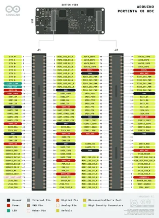](../../../../library/media/66aeb94227332c59635abdea72d0818bcaeff970cf47b6fa130728e67a10e8f3.png)

[Open original reference](../../../../library/media/66aeb94227332c59635abdea72d0818bcaeff970cf47b6fa130728e67a10e8f3.png)

**Credit and rights:** Not established; source attribution retained. Source/manufacturer: Arduino.

[Source 1](https://raw.githubusercontent.com/arduino/docs-content/dab66ecbd6ad52cd742da6c19c5b6330a7f2caae/content/hardware/pro/boards/portenta-x8/datasheet/assets/x8HDCPinout.png) · [Source 2](https://docs.arduino.cc/hardware/portenta-x8/) · [Source 3](https://github.com/arduino/docs-content/blob/dab66ecbd6ad52cd742da6c19c5b6330a7f2caae/content/hardware/pro/boards/portenta-x8/product.md) · [Source 4](https://github.com/arduino/docs-content/blob/dab66ecbd6ad52cd742da6c19c5b6330a7f2caae/content/hardware/pro/boards/portenta-x8/datasheet/assets/x8HDCPinout.png)

Official Arduino documentation repository pinned at dab66ecbd6ad52cd742da6c19c5b6330a7f2caae. Match the board model, SKU and revision printed on each source sheet; lifecycle is not inferred from repository folder placement.

SHA-256: `66aeb94227332c59635abdea72d0818bcaeff970cf47b6fa130728e67a10e8f3`

## Official full pinout - page 2

**pinout image** · Reviewed source · PNG

[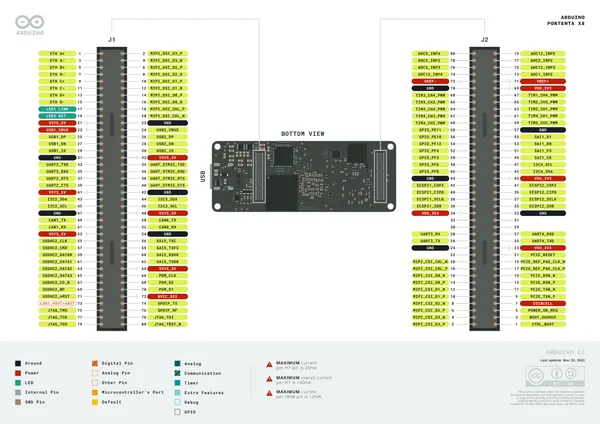](../../../../library/media/706c290831598823acadd59f81b3509ff539743b5bf8f7620dba0881aa5fd885.png)

[Open original reference](../../../../library/media/706c290831598823acadd59f81b3509ff539743b5bf8f7620dba0881aa5fd885.png)

**Credit and rights:** CC BY-SA 4.0 notice printed in the original PDF; preserve attribution and verify scope for publication.. Source/manufacturer: Arduino.

[Source 1](https://raw.githubusercontent.com/arduino/docs-content/dab66ecbd6ad52cd742da6c19c5b6330a7f2caae/content/hardware/pro/boards/portenta-x8/downloads/ABX00049-full-pinout.pdf) · [Source 2](https://docs.arduino.cc/hardware/portenta-x8/) · [Source 3](https://github.com/arduino/docs-content/blob/dab66ecbd6ad52cd742da6c19c5b6330a7f2caae/content/hardware/pro/boards/portenta-x8/product.md) · [Source 4](https://github.com/arduino/docs-content/blob/dab66ecbd6ad52cd742da6c19c5b6330a7f2caae/content/hardware/pro/boards/portenta-x8/downloads/ABX00049-full-pinout.pdf)

Official Arduino documentation repository pinned at dab66ecbd6ad52cd742da6c19c5b6330a7f2caae. Match the board model, SKU and revision printed on each source sheet; lifecycle is not inferred from repository folder placement. Original PDF page 2 rendered at 220 dpi; no labels changed.

SHA-256: `706c290831598823acadd59f81b3509ff539743b5bf8f7620dba0881aa5fd885`

## Official full pinout - page 3

**pinout image** · Reviewed source · PNG

[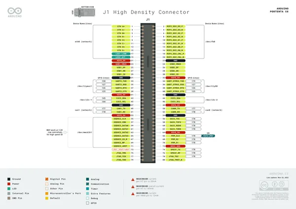](../../../../library/media/3f7e3dfaba9e7e53f73fdd90027b28cafa779930bcbda15f06749948b9983085.png)

[Open original reference](../../../../library/media/3f7e3dfaba9e7e53f73fdd90027b28cafa779930bcbda15f06749948b9983085.png)

**Credit and rights:** CC BY-SA 4.0 notice printed in the original PDF; preserve attribution and verify scope for publication.. Source/manufacturer: Arduino.

[Source 1](https://raw.githubusercontent.com/arduino/docs-content/dab66ecbd6ad52cd742da6c19c5b6330a7f2caae/content/hardware/pro/boards/portenta-x8/downloads/ABX00049-full-pinout.pdf) · [Source 2](https://docs.arduino.cc/hardware/portenta-x8/) · [Source 3](https://github.com/arduino/docs-content/blob/dab66ecbd6ad52cd742da6c19c5b6330a7f2caae/content/hardware/pro/boards/portenta-x8/product.md) · [Source 4](https://github.com/arduino/docs-content/blob/dab66ecbd6ad52cd742da6c19c5b6330a7f2caae/content/hardware/pro/boards/portenta-x8/downloads/ABX00049-full-pinout.pdf)

Official Arduino documentation repository pinned at dab66ecbd6ad52cd742da6c19c5b6330a7f2caae. Match the board model, SKU and revision printed on each source sheet; lifecycle is not inferred from repository folder placement. Original PDF page 3 rendered at 220 dpi; no labels changed.

SHA-256: `3f7e3dfaba9e7e53f73fdd90027b28cafa779930bcbda15f06749948b9983085`

## Official full pinout - page 4

**pinout image** · Reviewed source · PNG

[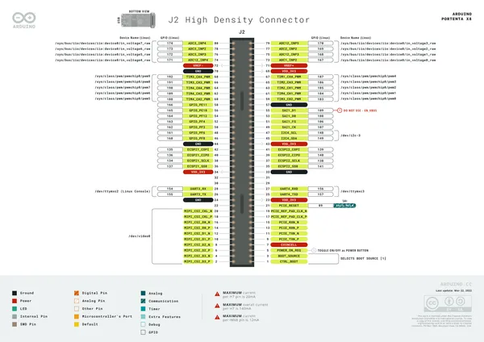](../../../../library/media/4d8bd6d09daf781a8bbb571c55228608aa27792b55f0da8ce974bc3619af885c.png)

[Open original reference](../../../../library/media/4d8bd6d09daf781a8bbb571c55228608aa27792b55f0da8ce974bc3619af885c.png)

**Credit and rights:** CC BY-SA 4.0 notice printed in the original PDF; preserve attribution and verify scope for publication.. Source/manufacturer: Arduino.

[Source 1](https://raw.githubusercontent.com/arduino/docs-content/dab66ecbd6ad52cd742da6c19c5b6330a7f2caae/content/hardware/pro/boards/portenta-x8/downloads/ABX00049-full-pinout.pdf) · [Source 2](https://docs.arduino.cc/hardware/portenta-x8/) · [Source 3](https://github.com/arduino/docs-content/blob/dab66ecbd6ad52cd742da6c19c5b6330a7f2caae/content/hardware/pro/boards/portenta-x8/product.md) · [Source 4](https://github.com/arduino/docs-content/blob/dab66ecbd6ad52cd742da6c19c5b6330a7f2caae/content/hardware/pro/boards/portenta-x8/downloads/ABX00049-full-pinout.pdf)

Official Arduino documentation repository pinned at dab66ecbd6ad52cd742da6c19c5b6330a7f2caae. Match the board model, SKU and revision printed on each source sheet; lifecycle is not inferred from repository folder placement. Original PDF page 4 rendered at 220 dpi; no labels changed.

SHA-256: `4d8bd6d09daf781a8bbb571c55228608aa27792b55f0da8ce974bc3619af885c`

## Official full pinout - page 7

**pinout image** · Reviewed source · PNG

[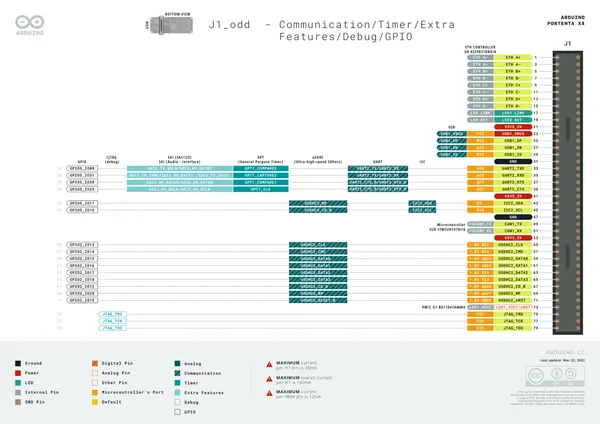](../../../../library/media/f380eb3099b0341397e310df31e97a275e4ab5ba166ab766f6dbfe80676f9a50.png)

[Open original reference](../../../../library/media/f380eb3099b0341397e310df31e97a275e4ab5ba166ab766f6dbfe80676f9a50.png)

**Credit and rights:** CC BY-SA 4.0 notice printed in the original PDF; preserve attribution and verify scope for publication.. Source/manufacturer: Arduino.

[Source 1](https://raw.githubusercontent.com/arduino/docs-content/dab66ecbd6ad52cd742da6c19c5b6330a7f2caae/content/hardware/pro/boards/portenta-x8/downloads/ABX00049-full-pinout.pdf) · [Source 2](https://docs.arduino.cc/hardware/portenta-x8/) · [Source 3](https://github.com/arduino/docs-content/blob/dab66ecbd6ad52cd742da6c19c5b6330a7f2caae/content/hardware/pro/boards/portenta-x8/product.md) · [Source 4](https://github.com/arduino/docs-content/blob/dab66ecbd6ad52cd742da6c19c5b6330a7f2caae/content/hardware/pro/boards/portenta-x8/downloads/ABX00049-full-pinout.pdf)

Official Arduino documentation repository pinned at dab66ecbd6ad52cd742da6c19c5b6330a7f2caae. Match the board model, SKU and revision printed on each source sheet; lifecycle is not inferred from repository folder placement. Original PDF page 7 rendered at 220 dpi; no labels changed.

SHA-256: `f380eb3099b0341397e310df31e97a275e4ab5ba166ab766f6dbfe80676f9a50`

## Official full pinout - page 8

**pinout image** · Reviewed source · PNG

[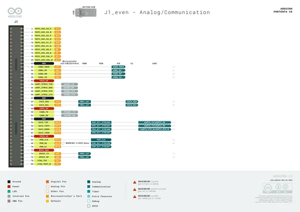](../../../../library/media/93e40c96903493d6f398e315960ed2d884ac53069a0ddfba78a57c8b1fdf311f.png)

[Open original reference](../../../../library/media/93e40c96903493d6f398e315960ed2d884ac53069a0ddfba78a57c8b1fdf311f.png)

**Credit and rights:** CC BY-SA 4.0 notice printed in the original PDF; preserve attribution and verify scope for publication.. Source/manufacturer: Arduino.

[Source 1](https://raw.githubusercontent.com/arduino/docs-content/dab66ecbd6ad52cd742da6c19c5b6330a7f2caae/content/hardware/pro/boards/portenta-x8/downloads/ABX00049-full-pinout.pdf) · [Source 2](https://docs.arduino.cc/hardware/portenta-x8/) · [Source 3](https://github.com/arduino/docs-content/blob/dab66ecbd6ad52cd742da6c19c5b6330a7f2caae/content/hardware/pro/boards/portenta-x8/product.md) · [Source 4](https://github.com/arduino/docs-content/blob/dab66ecbd6ad52cd742da6c19c5b6330a7f2caae/content/hardware/pro/boards/portenta-x8/downloads/ABX00049-full-pinout.pdf)

Official Arduino documentation repository pinned at dab66ecbd6ad52cd742da6c19c5b6330a7f2caae. Match the board model, SKU and revision printed on each source sheet; lifecycle is not inferred from repository folder placement. Original PDF page 8 rendered at 220 dpi; no labels changed.

SHA-256: `93e40c96903493d6f398e315960ed2d884ac53069a0ddfba78a57c8b1fdf311f`

## Official full pinout - page 9

**pinout image** · Reviewed source · PNG

[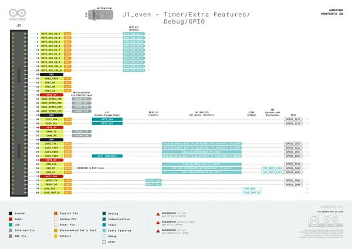](../../../../library/media/c9cdff9c46d8d2de0f3c0e28857cc98677e9172a3d6d5c63e0c347a08065c9e0.png)

[Open original reference](../../../../library/media/c9cdff9c46d8d2de0f3c0e28857cc98677e9172a3d6d5c63e0c347a08065c9e0.png)

**Credit and rights:** CC BY-SA 4.0 notice printed in the original PDF; preserve attribution and verify scope for publication.. Source/manufacturer: Arduino.

[Source 1](https://raw.githubusercontent.com/arduino/docs-content/dab66ecbd6ad52cd742da6c19c5b6330a7f2caae/content/hardware/pro/boards/portenta-x8/downloads/ABX00049-full-pinout.pdf) · [Source 2](https://docs.arduino.cc/hardware/portenta-x8/) · [Source 3](https://github.com/arduino/docs-content/blob/dab66ecbd6ad52cd742da6c19c5b6330a7f2caae/content/hardware/pro/boards/portenta-x8/product.md) · [Source 4](https://github.com/arduino/docs-content/blob/dab66ecbd6ad52cd742da6c19c5b6330a7f2caae/content/hardware/pro/boards/portenta-x8/downloads/ABX00049-full-pinout.pdf)

Official Arduino documentation repository pinned at dab66ecbd6ad52cd742da6c19c5b6330a7f2caae. Match the board model, SKU and revision printed on each source sheet; lifecycle is not inferred from repository folder placement. Original PDF page 9 rendered at 220 dpi; no labels changed.

SHA-256: `c9cdff9c46d8d2de0f3c0e28857cc98677e9172a3d6d5c63e0c347a08065c9e0`

## Official full pinout - page 10

**pinout image** · Reviewed source · PNG

[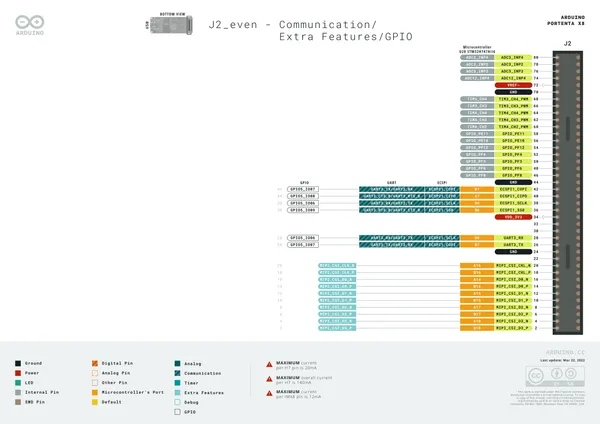](../../../../library/media/b3713f736e6c11024b2494a6716e557843a18b714dc1eedf9fc8e12b1bf44e55.png)

[Open original reference](../../../../library/media/b3713f736e6c11024b2494a6716e557843a18b714dc1eedf9fc8e12b1bf44e55.png)

**Credit and rights:** CC BY-SA 4.0 notice printed in the original PDF; preserve attribution and verify scope for publication.. Source/manufacturer: Arduino.

[Source 1](https://raw.githubusercontent.com/arduino/docs-content/dab66ecbd6ad52cd742da6c19c5b6330a7f2caae/content/hardware/pro/boards/portenta-x8/downloads/ABX00049-full-pinout.pdf) · [Source 2](https://docs.arduino.cc/hardware/portenta-x8/) · [Source 3](https://github.com/arduino/docs-content/blob/dab66ecbd6ad52cd742da6c19c5b6330a7f2caae/content/hardware/pro/boards/portenta-x8/product.md) · [Source 4](https://github.com/arduino/docs-content/blob/dab66ecbd6ad52cd742da6c19c5b6330a7f2caae/content/hardware/pro/boards/portenta-x8/downloads/ABX00049-full-pinout.pdf)

Official Arduino documentation repository pinned at dab66ecbd6ad52cd742da6c19c5b6330a7f2caae. Match the board model, SKU and revision printed on each source sheet; lifecycle is not inferred from repository folder placement. Original PDF page 10 rendered at 220 dpi; no labels changed.

SHA-256: `b3713f736e6c11024b2494a6716e557843a18b714dc1eedf9fc8e12b1bf44e55`

## Official full pinout - page 11

**pinout image** · Reviewed source · PNG

[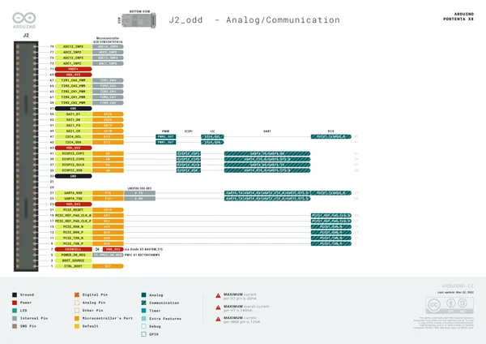](../../../../library/media/9f4da0daebf7231c79baf86950420d5ec26e042ad79f165d06ec7d6a37b3c514.png)

[Open original reference](../../../../library/media/9f4da0daebf7231c79baf86950420d5ec26e042ad79f165d06ec7d6a37b3c514.png)

**Credit and rights:** CC BY-SA 4.0 notice printed in the original PDF; preserve attribution and verify scope for publication.. Source/manufacturer: Arduino.

[Source 1](https://raw.githubusercontent.com/arduino/docs-content/dab66ecbd6ad52cd742da6c19c5b6330a7f2caae/content/hardware/pro/boards/portenta-x8/downloads/ABX00049-full-pinout.pdf) · [Source 2](https://docs.arduino.cc/hardware/portenta-x8/) · [Source 3](https://github.com/arduino/docs-content/blob/dab66ecbd6ad52cd742da6c19c5b6330a7f2caae/content/hardware/pro/boards/portenta-x8/product.md) · [Source 4](https://github.com/arduino/docs-content/blob/dab66ecbd6ad52cd742da6c19c5b6330a7f2caae/content/hardware/pro/boards/portenta-x8/downloads/ABX00049-full-pinout.pdf)

Official Arduino documentation repository pinned at dab66ecbd6ad52cd742da6c19c5b6330a7f2caae. Match the board model, SKU and revision printed on each source sheet; lifecycle is not inferred from repository folder placement. Original PDF page 11 rendered at 220 dpi; no labels changed.

SHA-256: `9f4da0daebf7231c79baf86950420d5ec26e042ad79f165d06ec7d6a37b3c514`

## Official full pinout - page 12

**pinout image** · Reviewed source · PNG

[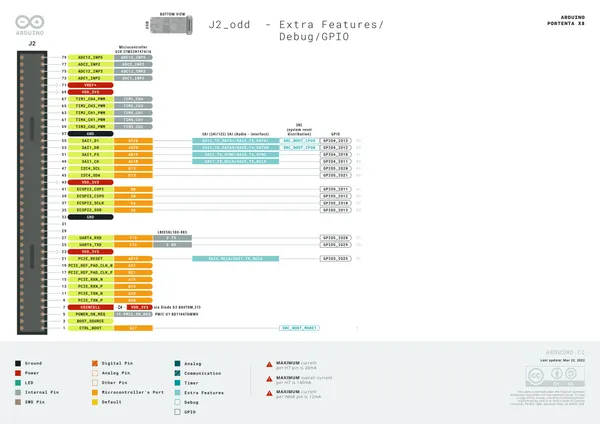](../../../../library/media/df4289db97902e47562b2e74c638c0e95d5259af5c09d05ea2fb23bb76c6b666.png)

[Open original reference](../../../../library/media/df4289db97902e47562b2e74c638c0e95d5259af5c09d05ea2fb23bb76c6b666.png)

**Credit and rights:** CC BY-SA 4.0 notice printed in the original PDF; preserve attribution and verify scope for publication.. Source/manufacturer: Arduino.

[Source 1](https://raw.githubusercontent.com/arduino/docs-content/dab66ecbd6ad52cd742da6c19c5b6330a7f2caae/content/hardware/pro/boards/portenta-x8/downloads/ABX00049-full-pinout.pdf) · [Source 2](https://docs.arduino.cc/hardware/portenta-x8/) · [Source 3](https://github.com/arduino/docs-content/blob/dab66ecbd6ad52cd742da6c19c5b6330a7f2caae/content/hardware/pro/boards/portenta-x8/product.md) · [Source 4](https://github.com/arduino/docs-content/blob/dab66ecbd6ad52cd742da6c19c5b6330a7f2caae/content/hardware/pro/boards/portenta-x8/downloads/ABX00049-full-pinout.pdf)

Official Arduino documentation repository pinned at dab66ecbd6ad52cd742da6c19c5b6330a7f2caae. Match the board model, SKU and revision printed on each source sheet; lifecycle is not inferred from repository folder placement. Original PDF page 12 rendered at 220 dpi; no labels changed.

SHA-256: `df4289db97902e47562b2e74c638c0e95d5259af5c09d05ea2fb23bb76c6b666`

## usbCPinout

**GPIO reference image** · Reviewed source · PNG

[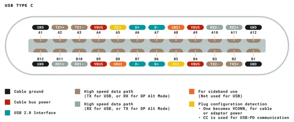](../../../../library/media/a900aa02a820a8304bd0337efb48bd822466322facf07af76ee8524909eebf95.png)

[Open original reference](../../../../library/media/a900aa02a820a8304bd0337efb48bd822466322facf07af76ee8524909eebf95.png)

**Credit and rights:** Not established; source attribution retained. Source/manufacturer: Arduino.

[Source 1](https://raw.githubusercontent.com/arduino/docs-content/dab66ecbd6ad52cd742da6c19c5b6330a7f2caae/content/hardware/pro/boards/portenta-x8/datasheet/assets/usbCPinout.png) · [Source 2](https://docs.arduino.cc/hardware/portenta-x8/) · [Source 3](https://github.com/arduino/docs-content/blob/dab66ecbd6ad52cd742da6c19c5b6330a7f2caae/content/hardware/pro/boards/portenta-x8/product.md) · [Source 4](https://github.com/arduino/docs-content/blob/dab66ecbd6ad52cd742da6c19c5b6330a7f2caae/content/hardware/pro/boards/portenta-x8/datasheet/assets/usbCPinout.png)

Official Arduino documentation repository pinned at dab66ecbd6ad52cd742da6c19c5b6330a7f2caae. Match the board model, SKU and revision printed on each source sheet; lifecycle is not inferred from repository folder placement.

SHA-256: `a900aa02a820a8304bd0337efb48bd822466322facf07af76ee8524909eebf95`

## Official full pinout - page 5

**GPIO reference image** · Reviewed source · PNG

[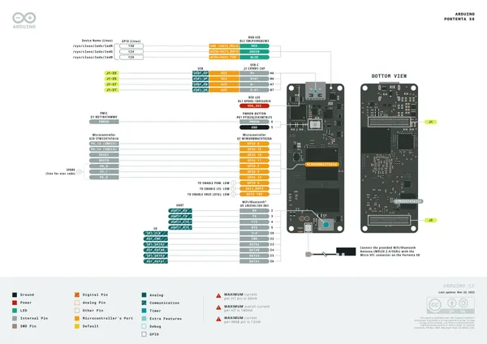](../../../../library/media/9d5cb1a31cc2de0363afe64133f806e31726d14c593236bb27b2ed38e6eb2525.png)

[Open original reference](../../../../library/media/9d5cb1a31cc2de0363afe64133f806e31726d14c593236bb27b2ed38e6eb2525.png)

**Credit and rights:** CC BY-SA 4.0 notice printed in the original PDF; preserve attribution and verify scope for publication.. Source/manufacturer: Arduino.

[Source 1](https://raw.githubusercontent.com/arduino/docs-content/dab66ecbd6ad52cd742da6c19c5b6330a7f2caae/content/hardware/pro/boards/portenta-x8/downloads/ABX00049-full-pinout.pdf) · [Source 2](https://docs.arduino.cc/hardware/portenta-x8/) · [Source 3](https://github.com/arduino/docs-content/blob/dab66ecbd6ad52cd742da6c19c5b6330a7f2caae/content/hardware/pro/boards/portenta-x8/product.md) · [Source 4](https://github.com/arduino/docs-content/blob/dab66ecbd6ad52cd742da6c19c5b6330a7f2caae/content/hardware/pro/boards/portenta-x8/downloads/ABX00049-full-pinout.pdf)

Official Arduino documentation repository pinned at dab66ecbd6ad52cd742da6c19c5b6330a7f2caae. Match the board model, SKU and revision printed on each source sheet; lifecycle is not inferred from repository folder placement. Original PDF page 5 rendered at 220 dpi; no labels changed.

SHA-256: `9d5cb1a31cc2de0363afe64133f806e31726d14c593236bb27b2ed38e6eb2525`

## Official full pinout - page 13

**GPIO reference image** · Reviewed source · PNG

[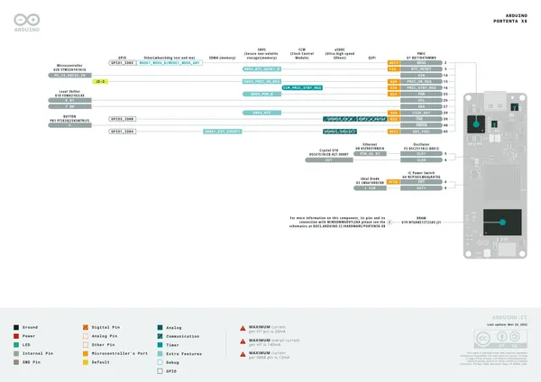](../../../../library/media/facb9fab60630729553d76e4142b8a1392b45551222a75c60c5fd7c2c6d5e0ae.png)

[Open original reference](../../../../library/media/facb9fab60630729553d76e4142b8a1392b45551222a75c60c5fd7c2c6d5e0ae.png)

**Credit and rights:** CC BY-SA 4.0 notice printed in the original PDF; preserve attribution and verify scope for publication.. Source/manufacturer: Arduino.

[Source 1](https://raw.githubusercontent.com/arduino/docs-content/dab66ecbd6ad52cd742da6c19c5b6330a7f2caae/content/hardware/pro/boards/portenta-x8/downloads/ABX00049-full-pinout.pdf) · [Source 2](https://docs.arduino.cc/hardware/portenta-x8/) · [Source 3](https://github.com/arduino/docs-content/blob/dab66ecbd6ad52cd742da6c19c5b6330a7f2caae/content/hardware/pro/boards/portenta-x8/product.md) · [Source 4](https://github.com/arduino/docs-content/blob/dab66ecbd6ad52cd742da6c19c5b6330a7f2caae/content/hardware/pro/boards/portenta-x8/downloads/ABX00049-full-pinout.pdf)

Official Arduino documentation repository pinned at dab66ecbd6ad52cd742da6c19c5b6330a7f2caae. Match the board model, SKU and revision printed on each source sheet; lifecycle is not inferred from repository folder placement. Original PDF page 13 rendered at 220 dpi; no labels changed.

SHA-256: `facb9fab60630729553d76e4142b8a1392b45551222a75c60c5fd7c2c6d5e0ae`

## Official full pinout - page 14

**GPIO reference image** · Reviewed source · PNG

[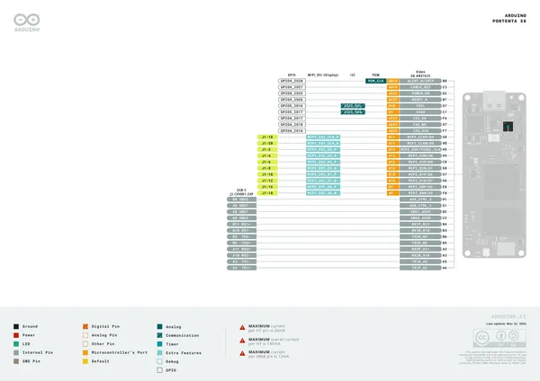](../../../../library/media/245d8e822fada7a34b9d6299af1a5cffd869d04790d88bc8f9db5cdd6e5b7dc8.png)

[Open original reference](../../../../library/media/245d8e822fada7a34b9d6299af1a5cffd869d04790d88bc8f9db5cdd6e5b7dc8.png)

**Credit and rights:** CC BY-SA 4.0 notice printed in the original PDF; preserve attribution and verify scope for publication.. Source/manufacturer: Arduino.

[Source 1](https://raw.githubusercontent.com/arduino/docs-content/dab66ecbd6ad52cd742da6c19c5b6330a7f2caae/content/hardware/pro/boards/portenta-x8/downloads/ABX00049-full-pinout.pdf) · [Source 2](https://docs.arduino.cc/hardware/portenta-x8/) · [Source 3](https://github.com/arduino/docs-content/blob/dab66ecbd6ad52cd742da6c19c5b6330a7f2caae/content/hardware/pro/boards/portenta-x8/product.md) · [Source 4](https://github.com/arduino/docs-content/blob/dab66ecbd6ad52cd742da6c19c5b6330a7f2caae/content/hardware/pro/boards/portenta-x8/downloads/ABX00049-full-pinout.pdf)

Official Arduino documentation repository pinned at dab66ecbd6ad52cd742da6c19c5b6330a7f2caae. Match the board model, SKU and revision printed on each source sheet; lifecycle is not inferred from repository folder placement. Original PDF page 14 rendered at 220 dpi; no labels changed.

SHA-256: `245d8e822fada7a34b9d6299af1a5cffd869d04790d88bc8f9db5cdd6e5b7dc8`

## Official full pinout - page 15

**GPIO reference image** · Reviewed source · PNG

[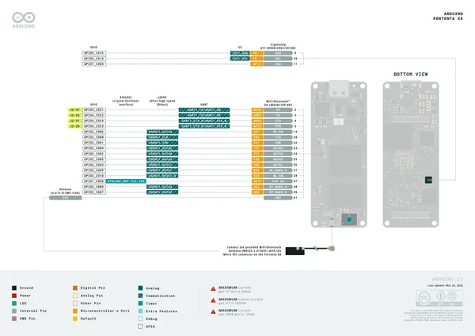](../../../../library/media/7e366e5e91b688f35bf63e42d2243fd909aba69e9d9247a739361f73a0cfc728.png)

[Open original reference](../../../../library/media/7e366e5e91b688f35bf63e42d2243fd909aba69e9d9247a739361f73a0cfc728.png)

**Credit and rights:** CC BY-SA 4.0 notice printed in the original PDF; preserve attribution and verify scope for publication.. Source/manufacturer: Arduino.

[Source 1](https://raw.githubusercontent.com/arduino/docs-content/dab66ecbd6ad52cd742da6c19c5b6330a7f2caae/content/hardware/pro/boards/portenta-x8/downloads/ABX00049-full-pinout.pdf) · [Source 2](https://docs.arduino.cc/hardware/portenta-x8/) · [Source 3](https://github.com/arduino/docs-content/blob/dab66ecbd6ad52cd742da6c19c5b6330a7f2caae/content/hardware/pro/boards/portenta-x8/product.md) · [Source 4](https://github.com/arduino/docs-content/blob/dab66ecbd6ad52cd742da6c19c5b6330a7f2caae/content/hardware/pro/boards/portenta-x8/downloads/ABX00049-full-pinout.pdf)

Official Arduino documentation repository pinned at dab66ecbd6ad52cd742da6c19c5b6330a7f2caae. Match the board model, SKU and revision printed on each source sheet; lifecycle is not inferred from repository folder placement. Original PDF page 15 rendered at 220 dpi; no labels changed.

SHA-256: `7e366e5e91b688f35bf63e42d2243fd909aba69e9d9247a739361f73a0cfc728`

## Official full pinout - page 16

**GPIO reference image** · Reviewed source · PNG

[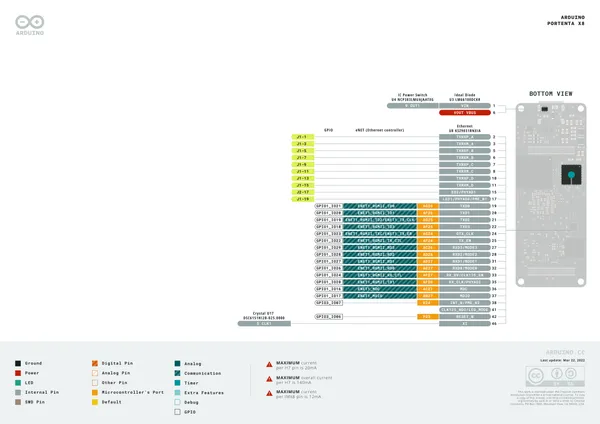](../../../../library/media/2ce6e3a128de0a16387331edc9a4be35fb1eb474d9fa7339933788a1c08b035c.png)

[Open original reference](../../../../library/media/2ce6e3a128de0a16387331edc9a4be35fb1eb474d9fa7339933788a1c08b035c.png)

**Credit and rights:** CC BY-SA 4.0 notice printed in the original PDF; preserve attribution and verify scope for publication.. Source/manufacturer: Arduino.

[Source 1](https://raw.githubusercontent.com/arduino/docs-content/dab66ecbd6ad52cd742da6c19c5b6330a7f2caae/content/hardware/pro/boards/portenta-x8/downloads/ABX00049-full-pinout.pdf) · [Source 2](https://docs.arduino.cc/hardware/portenta-x8/) · [Source 3](https://github.com/arduino/docs-content/blob/dab66ecbd6ad52cd742da6c19c5b6330a7f2caae/content/hardware/pro/boards/portenta-x8/product.md) · [Source 4](https://github.com/arduino/docs-content/blob/dab66ecbd6ad52cd742da6c19c5b6330a7f2caae/content/hardware/pro/boards/portenta-x8/downloads/ABX00049-full-pinout.pdf)

Official Arduino documentation repository pinned at dab66ecbd6ad52cd742da6c19c5b6330a7f2caae. Match the board model, SKU and revision printed on each source sheet; lifecycle is not inferred from repository folder placement. Original PDF page 16 rendered at 220 dpi; no labels changed.

SHA-256: `2ce6e3a128de0a16387331edc9a4be35fb1eb474d9fa7339933788a1c08b035c`

## Official full pinout - page 17

**GPIO reference image** · Reviewed source · PNG

[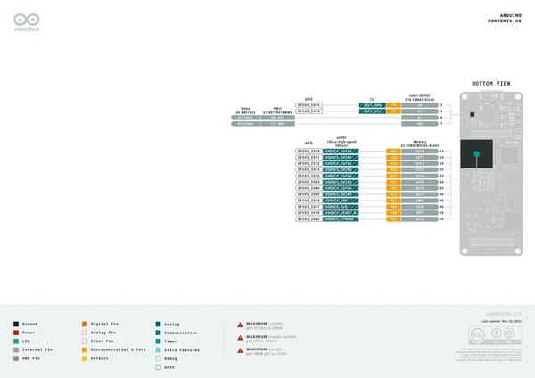](../../../../library/media/100cc3e9ea423da98f530e58414cd7a05fd2f58037d0f71ea53cd683d24d5130.png)

[Open original reference](../../../../library/media/100cc3e9ea423da98f530e58414cd7a05fd2f58037d0f71ea53cd683d24d5130.png)

**Credit and rights:** CC BY-SA 4.0 notice printed in the original PDF; preserve attribution and verify scope for publication.. Source/manufacturer: Arduino.

[Source 1](https://raw.githubusercontent.com/arduino/docs-content/dab66ecbd6ad52cd742da6c19c5b6330a7f2caae/content/hardware/pro/boards/portenta-x8/downloads/ABX00049-full-pinout.pdf) · [Source 2](https://docs.arduino.cc/hardware/portenta-x8/) · [Source 3](https://github.com/arduino/docs-content/blob/dab66ecbd6ad52cd742da6c19c5b6330a7f2caae/content/hardware/pro/boards/portenta-x8/product.md) · [Source 4](https://github.com/arduino/docs-content/blob/dab66ecbd6ad52cd742da6c19c5b6330a7f2caae/content/hardware/pro/boards/portenta-x8/downloads/ABX00049-full-pinout.pdf)

Official Arduino documentation repository pinned at dab66ecbd6ad52cd742da6c19c5b6330a7f2caae. Match the board model, SKU and revision printed on each source sheet; lifecycle is not inferred from repository folder placement. Original PDF page 17 rendered at 220 dpi; no labels changed.

SHA-256: `100cc3e9ea423da98f530e58414cd7a05fd2f58037d0f71ea53cd683d24d5130`

## ABX00049-pinout

**board labeling image** · Reviewed source · JPG

[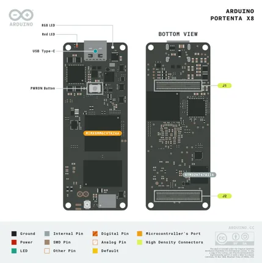](../../../../library/media/60da237defcf61c467df600bd86b7fa09d7ac14bf29f0f717843ad7ab3b2d395.jpg)

[Open original reference](../../../../library/media/60da237defcf61c467df600bd86b7fa09d7ac14bf29f0f717843ad7ab3b2d395.jpg)

**Credit and rights:** Not established; source attribution retained. Source/manufacturer: Arduino.

[Source 1](https://raw.githubusercontent.com/arduino/docs-content/dab66ecbd6ad52cd742da6c19c5b6330a7f2caae/content/hardware/pro/boards/portenta-x8/tutorials/01.user-manual/assets/ABX00049-pinout.jpg) · [Source 2](https://docs.arduino.cc/hardware/portenta-x8/) · [Source 3](https://github.com/arduino/docs-content/blob/dab66ecbd6ad52cd742da6c19c5b6330a7f2caae/content/hardware/pro/boards/portenta-x8/product.md) · [Source 4](https://github.com/arduino/docs-content/blob/dab66ecbd6ad52cd742da6c19c5b6330a7f2caae/content/hardware/pro/boards/portenta-x8/tutorials/01.user-manual/assets/ABX00049-pinout.jpg)

Official Arduino documentation repository pinned at dab66ecbd6ad52cd742da6c19c5b6330a7f2caae. Match the board model, SKU and revision printed on each source sheet; lifecycle is not inferred from repository folder placement.

SHA-256: `60da237defcf61c467df600bd86b7fa09d7ac14bf29f0f717843ad7ab3b2d395`

## Official full pinout - page 1

**board labeling image** · Reviewed source · PNG

[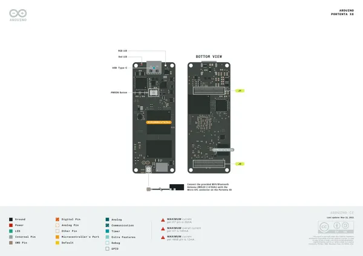](../../../../library/media/c0ef3a27935299f26732852de5eac7f366e95b1ebbfb44d5d8f0e316fd2cb764.png)

[Open original reference](../../../../library/media/c0ef3a27935299f26732852de5eac7f366e95b1ebbfb44d5d8f0e316fd2cb764.png)

**Credit and rights:** CC BY-SA 4.0 notice printed in the original PDF; preserve attribution and verify scope for publication.. Source/manufacturer: Arduino.

[Source 1](https://raw.githubusercontent.com/arduino/docs-content/dab66ecbd6ad52cd742da6c19c5b6330a7f2caae/content/hardware/pro/boards/portenta-x8/downloads/ABX00049-full-pinout.pdf) · [Source 2](https://docs.arduino.cc/hardware/portenta-x8/) · [Source 3](https://github.com/arduino/docs-content/blob/dab66ecbd6ad52cd742da6c19c5b6330a7f2caae/content/hardware/pro/boards/portenta-x8/product.md) · [Source 4](https://github.com/arduino/docs-content/blob/dab66ecbd6ad52cd742da6c19c5b6330a7f2caae/content/hardware/pro/boards/portenta-x8/downloads/ABX00049-full-pinout.pdf)

Official Arduino documentation repository pinned at dab66ecbd6ad52cd742da6c19c5b6330a7f2caae. Match the board model, SKU and revision printed on each source sheet; lifecycle is not inferred from repository folder placement. Original PDF page 1 rendered at 220 dpi; no labels changed.

SHA-256: `c0ef3a27935299f26732852de5eac7f366e95b1ebbfb44d5d8f0e316fd2cb764`

## Full board pinout PDF

**original reference PDF** · Reviewed source · PDF

[Open original reference](../../../../library/media/cf1609c2df275f6c9314e7aa84b2b649897af77b5b215a41c7930d58dd7978b3.pdf)

**Credit and rights:** Not established; source attribution retained. Source/manufacturer: Arduino.

[Source 1](https://raw.githubusercontent.com/arduino/docs-content/dab66ecbd6ad52cd742da6c19c5b6330a7f2caae/content/hardware/pro/boards/portenta-x8/downloads/ABX00049-full-pinout.pdf) · [Source 2](https://docs.arduino.cc/hardware/portenta-x8/) · [Source 3](https://github.com/arduino/docs-content/blob/dab66ecbd6ad52cd742da6c19c5b6330a7f2caae/content/hardware/pro/boards/portenta-x8/product.md) · [Source 4](https://github.com/arduino/docs-content/blob/dab66ecbd6ad52cd742da6c19c5b6330a7f2caae/content/hardware/pro/boards/portenta-x8/downloads/ABX00049-full-pinout.pdf)

Official Arduino documentation repository pinned at dab66ecbd6ad52cd742da6c19c5b6330a7f2caae. Match the board model, SKU and revision printed on each source sheet; lifecycle is not inferred from repository folder placement.

SHA-256: `cf1609c2df275f6c9314e7aa84b2b649897af77b5b215a41c7930d58dd7978b3`

Pin assignments have not been independently electrically verified. Check board revision before wiring.
