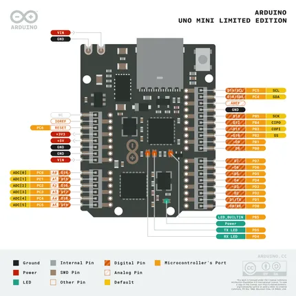
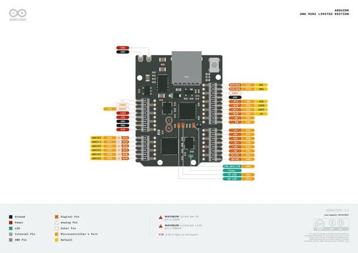
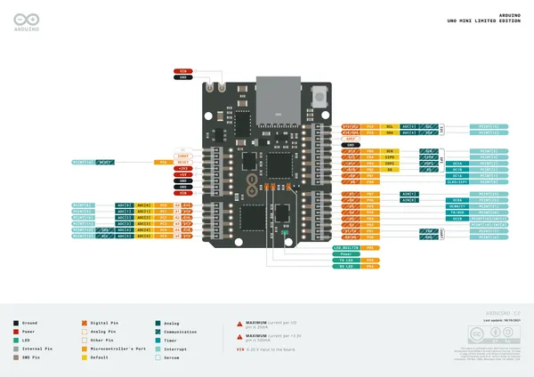
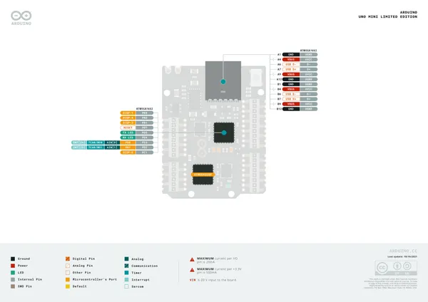
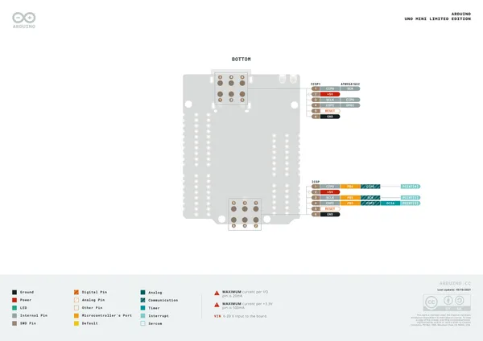

# UNO Mini Limited Edition

**Arduino** · Other

Revision: Not identified  
Coverage: Pinout image collected

[Browse all manufacturers](../../../../BROWSE.md) · [Desktop app](https://github.com/valleytechsolutions/black-wire-desktop)

## Pinout_UNOMiniLE_80

**pinout image** · Reviewed source · PNG

[Open original reference](../../../../library/media/16daad3f50771413b4b8404416e5df4e1880addf09cb5a8680bad6f384cfe7ed.png)

**Credit and rights:** Not established; source attribution retained. Source/manufacturer: Arduino.

[Source 1](https://raw.githubusercontent.com/arduino/docs-content/dab66ecbd6ad52cd742da6c19c5b6330a7f2caae/content/hardware/uno/boards/uno-mini-limited-edition/datasheet/assets/Pinout_UNOMiniLE_80.png) · [Source 2](https://docs.arduino.cc/hardware/uno-mini-limited-edition/) · [Source 3](https://github.com/arduino/docs-content/blob/dab66ecbd6ad52cd742da6c19c5b6330a7f2caae/content/hardware/uno/boards/uno-mini-limited-edition/product.md) · [Source 4](https://github.com/arduino/docs-content/blob/dab66ecbd6ad52cd742da6c19c5b6330a7f2caae/content/hardware/uno/boards/uno-mini-limited-edition/datasheet/assets/Pinout_UNOMiniLE_80.png) · [Source 5](https://github.com/arduino/docs-content/blob/dab66ecbd6ad52cd742da6c19c5b6330a7f2caae/content/hardware/uno/boards/uno-mini-limited-edition/tutorials/uno-mini-le-guide/assets/ABX00062-pinout.png)

Official Arduino documentation repository pinned at dab66ecbd6ad52cd742da6c19c5b6330a7f2caae. Match the board model, SKU and revision printed on each source sheet; lifecycle is not inferred from repository folder placement.

SHA-256: `16daad3f50771413b4b8404416e5df4e1880addf09cb5a8680bad6f384cfe7ed`

## Official full pinout - page 1

**pinout image** · Reviewed source · PNG

[Open original reference](../../../../library/media/d7e59a16b00d93071daf4b14ae79ba9bd92c03f53b476b74020781ca63b9251a.png)

**Credit and rights:** CC BY-SA 4.0 notice printed in the original PDF; preserve attribution and verify scope for publication.. Source/manufacturer: Arduino.

[Source 1](https://raw.githubusercontent.com/arduino/docs-content/dab66ecbd6ad52cd742da6c19c5b6330a7f2caae/content/hardware/uno/boards/uno-mini-limited-edition/downloads/ABX00062-full-pinout.pdf) · [Source 2](https://docs.arduino.cc/hardware/uno-mini-limited-edition/) · [Source 3](https://github.com/arduino/docs-content/blob/dab66ecbd6ad52cd742da6c19c5b6330a7f2caae/content/hardware/uno/boards/uno-mini-limited-edition/product.md) · [Source 4](https://github.com/arduino/docs-content/blob/dab66ecbd6ad52cd742da6c19c5b6330a7f2caae/content/hardware/uno/boards/uno-mini-limited-edition/downloads/ABX00062-full-pinout.pdf)

Official Arduino documentation repository pinned at dab66ecbd6ad52cd742da6c19c5b6330a7f2caae. Match the board model, SKU and revision printed on each source sheet; lifecycle is not inferred from repository folder placement. Original PDF page 1 rendered at 220 dpi; no labels changed.

SHA-256: `d7e59a16b00d93071daf4b14ae79ba9bd92c03f53b476b74020781ca63b9251a`

## Official full pinout - page 2

**pinout image** · Reviewed source · PNG

[Open original reference](../../../../library/media/aef49d1f3c42d7f717e6ed900458ab80bc8ea46eef291d2502b8b7ef570d0e3d.png)

**Credit and rights:** CC BY-SA 4.0 notice printed in the original PDF; preserve attribution and verify scope for publication.. Source/manufacturer: Arduino.

[Source 1](https://raw.githubusercontent.com/arduino/docs-content/dab66ecbd6ad52cd742da6c19c5b6330a7f2caae/content/hardware/uno/boards/uno-mini-limited-edition/downloads/ABX00062-full-pinout.pdf) · [Source 2](https://docs.arduino.cc/hardware/uno-mini-limited-edition/) · [Source 3](https://github.com/arduino/docs-content/blob/dab66ecbd6ad52cd742da6c19c5b6330a7f2caae/content/hardware/uno/boards/uno-mini-limited-edition/product.md) · [Source 4](https://github.com/arduino/docs-content/blob/dab66ecbd6ad52cd742da6c19c5b6330a7f2caae/content/hardware/uno/boards/uno-mini-limited-edition/downloads/ABX00062-full-pinout.pdf)

Official Arduino documentation repository pinned at dab66ecbd6ad52cd742da6c19c5b6330a7f2caae. Match the board model, SKU and revision printed on each source sheet; lifecycle is not inferred from repository folder placement. Original PDF page 2 rendered at 220 dpi; no labels changed.

SHA-256: `aef49d1f3c42d7f717e6ed900458ab80bc8ea46eef291d2502b8b7ef570d0e3d`

## Official full pinout - page 3

**pinout image** · Reviewed source · PNG

[Open original reference](../../../../library/media/bfdfeddeae08ea8efa71f8b2229e4d93bb01234e29f928176fb502507b255ae9.png)

**Credit and rights:** CC BY-SA 4.0 notice printed in the original PDF; preserve attribution and verify scope for publication.. Source/manufacturer: Arduino.

[Source 1](https://raw.githubusercontent.com/arduino/docs-content/dab66ecbd6ad52cd742da6c19c5b6330a7f2caae/content/hardware/uno/boards/uno-mini-limited-edition/downloads/ABX00062-full-pinout.pdf) · [Source 2](https://docs.arduino.cc/hardware/uno-mini-limited-edition/) · [Source 3](https://github.com/arduino/docs-content/blob/dab66ecbd6ad52cd742da6c19c5b6330a7f2caae/content/hardware/uno/boards/uno-mini-limited-edition/product.md) · [Source 4](https://github.com/arduino/docs-content/blob/dab66ecbd6ad52cd742da6c19c5b6330a7f2caae/content/hardware/uno/boards/uno-mini-limited-edition/downloads/ABX00062-full-pinout.pdf)

Official Arduino documentation repository pinned at dab66ecbd6ad52cd742da6c19c5b6330a7f2caae. Match the board model, SKU and revision printed on each source sheet; lifecycle is not inferred from repository folder placement. Original PDF page 3 rendered at 220 dpi; no labels changed.

SHA-256: `bfdfeddeae08ea8efa71f8b2229e4d93bb01234e29f928176fb502507b255ae9`

## Official full pinout - page 4

**pinout image** · Reviewed source · PNG

[Open original reference](../../../../library/media/a570bf6910c58c6a1811c8ec4d300210085ba1dae6a2620dfd8d24f04c57c986.png)

**Credit and rights:** CC BY-SA 4.0 notice printed in the original PDF; preserve attribution and verify scope for publication.. Source/manufacturer: Arduino.

[Source 1](https://raw.githubusercontent.com/arduino/docs-content/dab66ecbd6ad52cd742da6c19c5b6330a7f2caae/content/hardware/uno/boards/uno-mini-limited-edition/downloads/ABX00062-full-pinout.pdf) · [Source 2](https://docs.arduino.cc/hardware/uno-mini-limited-edition/) · [Source 3](https://github.com/arduino/docs-content/blob/dab66ecbd6ad52cd742da6c19c5b6330a7f2caae/content/hardware/uno/boards/uno-mini-limited-edition/product.md) · [Source 4](https://github.com/arduino/docs-content/blob/dab66ecbd6ad52cd742da6c19c5b6330a7f2caae/content/hardware/uno/boards/uno-mini-limited-edition/downloads/ABX00062-full-pinout.pdf)

Official Arduino documentation repository pinned at dab66ecbd6ad52cd742da6c19c5b6330a7f2caae. Match the board model, SKU and revision printed on each source sheet; lifecycle is not inferred from repository folder placement. Original PDF page 4 rendered at 220 dpi; no labels changed.

SHA-256: `a570bf6910c58c6a1811c8ec4d300210085ba1dae6a2620dfd8d24f04c57c986`

## Full board pinout PDF

**original reference PDF** · Reviewed source · PDF

[Open original reference](../../../../library/media/52fcc5e2b16a03c43d24df1725b7979714fa7bd9d0f8e0b69e22a4a4128a1064.pdf)

**Credit and rights:** Not established; source attribution retained. Source/manufacturer: Arduino.

[Source 1](https://raw.githubusercontent.com/arduino/docs-content/dab66ecbd6ad52cd742da6c19c5b6330a7f2caae/content/hardware/uno/boards/uno-mini-limited-edition/downloads/ABX00062-full-pinout.pdf) · [Source 2](https://docs.arduino.cc/hardware/uno-mini-limited-edition/) · [Source 3](https://github.com/arduino/docs-content/blob/dab66ecbd6ad52cd742da6c19c5b6330a7f2caae/content/hardware/uno/boards/uno-mini-limited-edition/product.md) · [Source 4](https://github.com/arduino/docs-content/blob/dab66ecbd6ad52cd742da6c19c5b6330a7f2caae/content/hardware/uno/boards/uno-mini-limited-edition/downloads/ABX00062-full-pinout.pdf)

Official Arduino documentation repository pinned at dab66ecbd6ad52cd742da6c19c5b6330a7f2caae. Match the board model, SKU and revision printed on each source sheet; lifecycle is not inferred from repository folder placement.

SHA-256: `52fcc5e2b16a03c43d24df1725b7979714fa7bd9d0f8e0b69e22a4a4128a1064`

Pin assignments have not been independently electrically verified. Check board revision before wiring.
