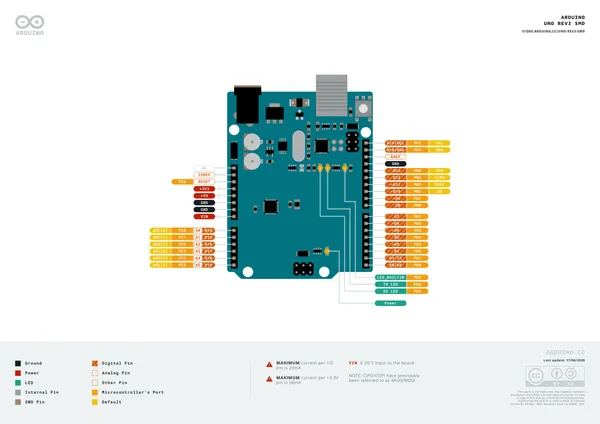
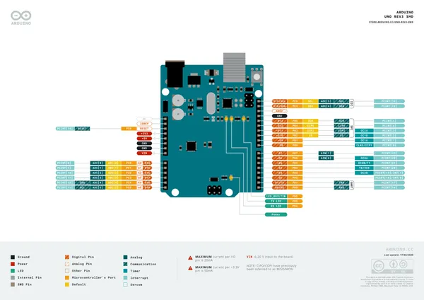
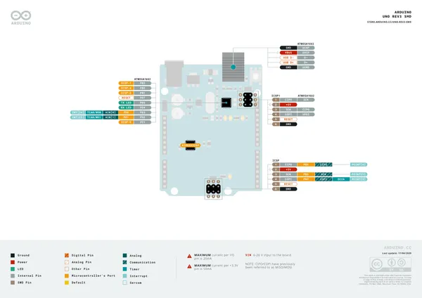
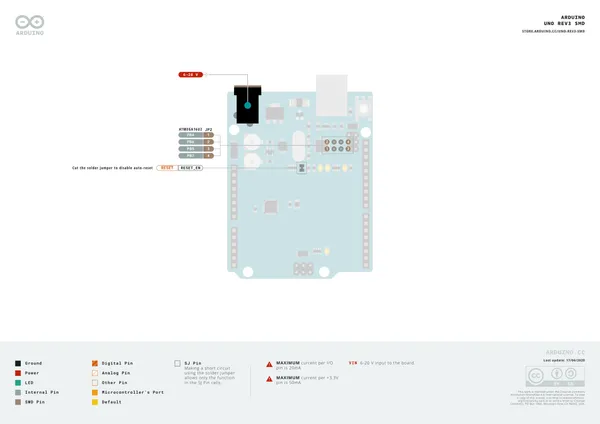

# UNO R3 SMD

**Arduino** · Other

Revision: Not identified  
Coverage: Pinout image collected

[Browse all manufacturers](../../../../BROWSE.md) · [Desktop app](https://github.com/valleytechsolutions/black-wire-desktop)

## Official full pinout - page 1

**pinout image** · Reviewed source · PNG

[Open original reference](../../../../library/media/5c383ad93c73e50c9a6bd35a128c7b942d3d4ca12fefaab2d2091927ec65bf9a.png)

**Credit and rights:** CC BY-SA 4.0 notice printed in the original PDF; preserve attribution and verify scope for publication.. Source/manufacturer: Arduino.

[Source 1](https://raw.githubusercontent.com/arduino/docs-content/dab66ecbd6ad52cd742da6c19c5b6330a7f2caae/content/hardware/uno/boards/uno-rev3-smd/downloads/A000073-full-pinout.pdf) · [Source 2](https://docs.arduino.cc/hardware/uno-rev3-smd/) · [Source 3](https://github.com/arduino/docs-content/blob/dab66ecbd6ad52cd742da6c19c5b6330a7f2caae/content/hardware/uno/boards/uno-rev3-smd/product.md) · [Source 4](https://github.com/arduino/docs-content/blob/dab66ecbd6ad52cd742da6c19c5b6330a7f2caae/content/hardware/uno/boards/uno-rev3-smd/downloads/A000073-full-pinout.pdf)

Official Arduino documentation repository pinned at dab66ecbd6ad52cd742da6c19c5b6330a7f2caae. Match the board model, SKU and revision printed on each source sheet; lifecycle is not inferred from repository folder placement. Original PDF page 1 rendered at 220 dpi; no labels changed.

SHA-256: `5c383ad93c73e50c9a6bd35a128c7b942d3d4ca12fefaab2d2091927ec65bf9a`

## Official full pinout - page 2

**pinout image** · Reviewed source · PNG

[Open original reference](../../../../library/media/f4ada025903e4e89b48ae3c13f947cdf3a15f1676712ca20ec7e29acc4f8e2f7.png)

**Credit and rights:** CC BY-SA 4.0 notice printed in the original PDF; preserve attribution and verify scope for publication.. Source/manufacturer: Arduino.

[Source 1](https://raw.githubusercontent.com/arduino/docs-content/dab66ecbd6ad52cd742da6c19c5b6330a7f2caae/content/hardware/uno/boards/uno-rev3-smd/downloads/A000073-full-pinout.pdf) · [Source 2](https://docs.arduino.cc/hardware/uno-rev3-smd/) · [Source 3](https://github.com/arduino/docs-content/blob/dab66ecbd6ad52cd742da6c19c5b6330a7f2caae/content/hardware/uno/boards/uno-rev3-smd/product.md) · [Source 4](https://github.com/arduino/docs-content/blob/dab66ecbd6ad52cd742da6c19c5b6330a7f2caae/content/hardware/uno/boards/uno-rev3-smd/downloads/A000073-full-pinout.pdf)

Official Arduino documentation repository pinned at dab66ecbd6ad52cd742da6c19c5b6330a7f2caae. Match the board model, SKU and revision printed on each source sheet; lifecycle is not inferred from repository folder placement. Original PDF page 2 rendered at 220 dpi; no labels changed.

SHA-256: `f4ada025903e4e89b48ae3c13f947cdf3a15f1676712ca20ec7e29acc4f8e2f7`

## Official full pinout - page 3

**pinout image** · Reviewed source · PNG

[Open original reference](../../../../library/media/af56889ded236fadd501b231ff35d6d46a77657d4b801f98dec4f85731a405ab.png)

**Credit and rights:** CC BY-SA 4.0 notice printed in the original PDF; preserve attribution and verify scope for publication.. Source/manufacturer: Arduino.

[Source 1](https://raw.githubusercontent.com/arduino/docs-content/dab66ecbd6ad52cd742da6c19c5b6330a7f2caae/content/hardware/uno/boards/uno-rev3-smd/downloads/A000073-full-pinout.pdf) · [Source 2](https://docs.arduino.cc/hardware/uno-rev3-smd/) · [Source 3](https://github.com/arduino/docs-content/blob/dab66ecbd6ad52cd742da6c19c5b6330a7f2caae/content/hardware/uno/boards/uno-rev3-smd/product.md) · [Source 4](https://github.com/arduino/docs-content/blob/dab66ecbd6ad52cd742da6c19c5b6330a7f2caae/content/hardware/uno/boards/uno-rev3-smd/downloads/A000073-full-pinout.pdf)

Official Arduino documentation repository pinned at dab66ecbd6ad52cd742da6c19c5b6330a7f2caae. Match the board model, SKU and revision printed on each source sheet; lifecycle is not inferred from repository folder placement. Original PDF page 3 rendered at 220 dpi; no labels changed.

SHA-256: `af56889ded236fadd501b231ff35d6d46a77657d4b801f98dec4f85731a405ab`

## Official full pinout - page 4

**pinout image** · Reviewed source · PNG

[Open original reference](../../../../library/media/73c0769beff3f0e19d8320e15891f1700be0c7ef4612ec4d70f314d989b1a781.png)

**Credit and rights:** CC BY-SA 4.0 notice printed in the original PDF; preserve attribution and verify scope for publication.. Source/manufacturer: Arduino.

[Source 1](https://raw.githubusercontent.com/arduino/docs-content/dab66ecbd6ad52cd742da6c19c5b6330a7f2caae/content/hardware/uno/boards/uno-rev3-smd/downloads/A000073-full-pinout.pdf) · [Source 2](https://docs.arduino.cc/hardware/uno-rev3-smd/) · [Source 3](https://github.com/arduino/docs-content/blob/dab66ecbd6ad52cd742da6c19c5b6330a7f2caae/content/hardware/uno/boards/uno-rev3-smd/product.md) · [Source 4](https://github.com/arduino/docs-content/blob/dab66ecbd6ad52cd742da6c19c5b6330a7f2caae/content/hardware/uno/boards/uno-rev3-smd/downloads/A000073-full-pinout.pdf)

Official Arduino documentation repository pinned at dab66ecbd6ad52cd742da6c19c5b6330a7f2caae. Match the board model, SKU and revision printed on each source sheet; lifecycle is not inferred from repository folder placement. Original PDF page 4 rendered at 220 dpi; no labels changed.

SHA-256: `73c0769beff3f0e19d8320e15891f1700be0c7ef4612ec4d70f314d989b1a781`

## Full board pinout PDF

**original reference PDF** · Reviewed source · PDF

[Open original reference](../../../../library/media/9b5b545b7e932b3dcc7aa6a2883c38b78c0c04bbdd3f78b9e4da8a6f5068955e.pdf)

**Credit and rights:** Not established; source attribution retained. Source/manufacturer: Arduino.

[Source 1](https://raw.githubusercontent.com/arduino/docs-content/dab66ecbd6ad52cd742da6c19c5b6330a7f2caae/content/hardware/uno/boards/uno-rev3-smd/downloads/A000073-full-pinout.pdf) · [Source 2](https://docs.arduino.cc/hardware/uno-rev3-smd/) · [Source 3](https://github.com/arduino/docs-content/blob/dab66ecbd6ad52cd742da6c19c5b6330a7f2caae/content/hardware/uno/boards/uno-rev3-smd/product.md) · [Source 4](https://github.com/arduino/docs-content/blob/dab66ecbd6ad52cd742da6c19c5b6330a7f2caae/content/hardware/uno/boards/uno-rev3-smd/downloads/A000073-full-pinout.pdf)

Official Arduino documentation repository pinned at dab66ecbd6ad52cd742da6c19c5b6330a7f2caae. Match the board model, SKU and revision printed on each source sheet; lifecycle is not inferred from repository folder placement.

SHA-256: `9b5b545b7e932b3dcc7aa6a2883c38b78c0c04bbdd3f78b9e4da8a6f5068955e`

Pin assignments have not been independently electrically verified. Check board revision before wiring.
