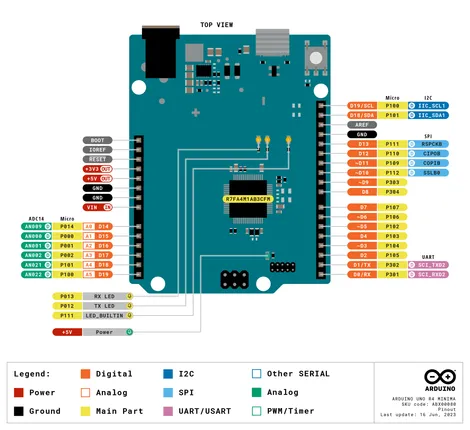
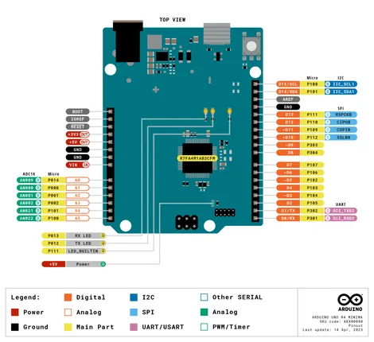
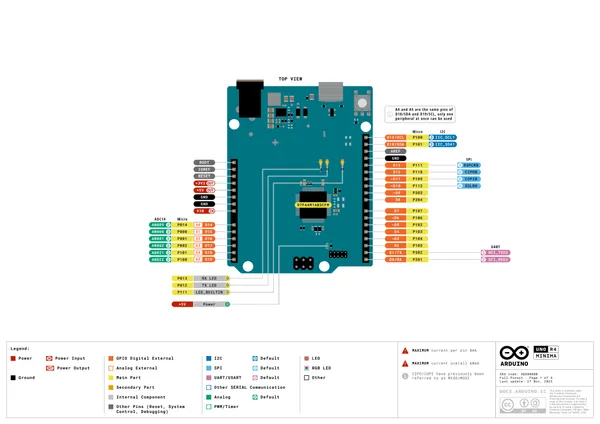
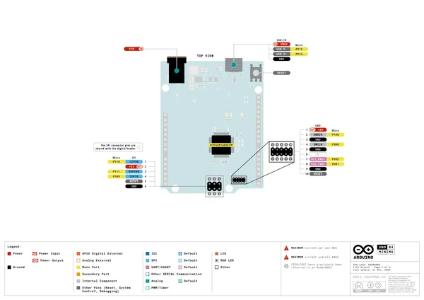
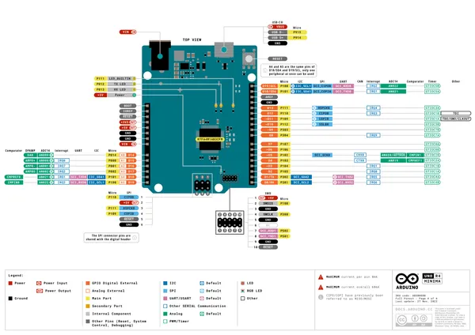

# UNO R4 Minima

**Arduino** · Other

Revision: Not identified  
Coverage: Pinout image collected

[Browse all manufacturers](../../../../BROWSE.md) · [Desktop app](https://github.com/valleytechsolutions/black-wire-desktop)

## ABX00080-pinout

**pinout image** · Reviewed source · PNG

[Open original reference](../../../../library/media/c4fa0b5145cfd203abf0f329fe9011be2121e4b72201a74987b23c799f44c1fd.png)

**Credit and rights:** Not established; source attribution retained. Source/manufacturer: Arduino.

[Source 1](https://raw.githubusercontent.com/arduino/docs-content/dab66ecbd6ad52cd742da6c19c5b6330a7f2caae/content/hardware/uno/boards/uno-r4-minima/datasheet/assets/ABX00080-pinout.png) · [Source 2](https://docs.arduino.cc/hardware/uno-r4-minima/) · [Source 3](https://github.com/arduino/docs-content/blob/dab66ecbd6ad52cd742da6c19c5b6330a7f2caae/content/hardware/uno/boards/uno-r4-minima/product.md) · [Source 4](https://github.com/arduino/docs-content/blob/dab66ecbd6ad52cd742da6c19c5b6330a7f2caae/content/hardware/uno/boards/uno-r4-minima/datasheet/assets/ABX00080-pinout.png)

Official Arduino documentation repository pinned at dab66ecbd6ad52cd742da6c19c5b6330a7f2caae. Match the board model, SKU and revision printed on each source sheet; lifecycle is not inferred from repository folder placement.

SHA-256: `c4fa0b5145cfd203abf0f329fe9011be2121e4b72201a74987b23c799f44c1fd`

## ABX00080-pinout

**pinout image** · Reviewed source · PNG

[Open original reference](../../../../library/media/4a1ef20b64e7ec547bf3d5f8b5fc345f385803e7933e87a71d8cb44f18039b8b.png)

**Credit and rights:** Not established; source attribution retained. Source/manufacturer: Arduino.

[Source 1](https://raw.githubusercontent.com/arduino/docs-content/dab66ecbd6ad52cd742da6c19c5b6330a7f2caae/content/hardware/uno/boards/uno-r4-minima/tutorials/shield-guide/assets/ABX00080-pinout.png) · [Source 2](https://docs.arduino.cc/hardware/uno-r4-minima/) · [Source 3](https://github.com/arduino/docs-content/blob/dab66ecbd6ad52cd742da6c19c5b6330a7f2caae/content/hardware/uno/boards/uno-r4-minima/product.md) · [Source 4](https://github.com/arduino/docs-content/blob/dab66ecbd6ad52cd742da6c19c5b6330a7f2caae/content/hardware/uno/boards/uno-r4-minima/tutorials/shield-guide/assets/ABX00080-pinout.png)

Official Arduino documentation repository pinned at dab66ecbd6ad52cd742da6c19c5b6330a7f2caae. Match the board model, SKU and revision printed on each source sheet; lifecycle is not inferred from repository folder placement.

SHA-256: `4a1ef20b64e7ec547bf3d5f8b5fc345f385803e7933e87a71d8cb44f18039b8b`

## Official full pinout - page 1

**pinout image** · Reviewed source · PNG

[Open original reference](../../../../library/media/5be4c222de3eefff54059c7757b2d318e697edc843d7e14d093812d7d378949c.png)

**Credit and rights:** CC BY-SA 4.0 notice printed in the original PDF; preserve attribution and verify scope for publication.. Source/manufacturer: Arduino.

[Source 1](https://raw.githubusercontent.com/arduino/docs-content/dab66ecbd6ad52cd742da6c19c5b6330a7f2caae/content/hardware/uno/boards/uno-r4-minima/downloads/ABX00080-full-pinout.pdf) · [Source 2](https://docs.arduino.cc/hardware/uno-r4-minima/) · [Source 3](https://github.com/arduino/docs-content/blob/dab66ecbd6ad52cd742da6c19c5b6330a7f2caae/content/hardware/uno/boards/uno-r4-minima/product.md) · [Source 4](https://github.com/arduino/docs-content/blob/dab66ecbd6ad52cd742da6c19c5b6330a7f2caae/content/hardware/uno/boards/uno-r4-minima/downloads/ABX00080-full-pinout.pdf)

Official Arduino documentation repository pinned at dab66ecbd6ad52cd742da6c19c5b6330a7f2caae. Match the board model, SKU and revision printed on each source sheet; lifecycle is not inferred from repository folder placement. Original PDF page 1 rendered at 220 dpi; no labels changed.

SHA-256: `5be4c222de3eefff54059c7757b2d318e697edc843d7e14d093812d7d378949c`

## Official full pinout - page 2

**pinout image** · Reviewed source · PNG

[Open original reference](../../../../library/media/f5d09ac71140acf6c0453e2b49cfcf95c138ca03ad4384d6cb025c60fbafdfcb.png)

**Credit and rights:** CC BY-SA 4.0 notice printed in the original PDF; preserve attribution and verify scope for publication.. Source/manufacturer: Arduino.

[Source 1](https://raw.githubusercontent.com/arduino/docs-content/dab66ecbd6ad52cd742da6c19c5b6330a7f2caae/content/hardware/uno/boards/uno-r4-minima/downloads/ABX00080-full-pinout.pdf) · [Source 2](https://docs.arduino.cc/hardware/uno-r4-minima/) · [Source 3](https://github.com/arduino/docs-content/blob/dab66ecbd6ad52cd742da6c19c5b6330a7f2caae/content/hardware/uno/boards/uno-r4-minima/product.md) · [Source 4](https://github.com/arduino/docs-content/blob/dab66ecbd6ad52cd742da6c19c5b6330a7f2caae/content/hardware/uno/boards/uno-r4-minima/downloads/ABX00080-full-pinout.pdf)

Official Arduino documentation repository pinned at dab66ecbd6ad52cd742da6c19c5b6330a7f2caae. Match the board model, SKU and revision printed on each source sheet; lifecycle is not inferred from repository folder placement. Original PDF page 2 rendered at 220 dpi; no labels changed.

SHA-256: `f5d09ac71140acf6c0453e2b49cfcf95c138ca03ad4384d6cb025c60fbafdfcb`

## Official full pinout - page 4

**pinout image** · Reviewed source · PNG

[Open original reference](../../../../library/media/7b75ccac3fad2d85c80d84a4ca306e578f739f4fadfd6875029f542600ea9a2b.png)

**Credit and rights:** CC BY-SA 4.0 notice printed in the original PDF; preserve attribution and verify scope for publication.. Source/manufacturer: Arduino.

[Source 1](https://raw.githubusercontent.com/arduino/docs-content/dab66ecbd6ad52cd742da6c19c5b6330a7f2caae/content/hardware/uno/boards/uno-r4-minima/downloads/ABX00080-full-pinout.pdf) · [Source 2](https://docs.arduino.cc/hardware/uno-r4-minima/) · [Source 3](https://github.com/arduino/docs-content/blob/dab66ecbd6ad52cd742da6c19c5b6330a7f2caae/content/hardware/uno/boards/uno-r4-minima/product.md) · [Source 4](https://github.com/arduino/docs-content/blob/dab66ecbd6ad52cd742da6c19c5b6330a7f2caae/content/hardware/uno/boards/uno-r4-minima/downloads/ABX00080-full-pinout.pdf)

Official Arduino documentation repository pinned at dab66ecbd6ad52cd742da6c19c5b6330a7f2caae. Match the board model, SKU and revision printed on each source sheet; lifecycle is not inferred from repository folder placement. Original PDF page 4 rendered at 220 dpi; no labels changed.

SHA-256: `7b75ccac3fad2d85c80d84a4ca306e578f739f4fadfd6875029f542600ea9a2b`

## Full board pinout PDF

**original reference PDF** · Reviewed source · PDF

[Open original reference](../../../../library/media/853b0664a1cf51040738a51385693f9a5c615d4337035d6b36c3c00f6ff76f3c.pdf)

**Credit and rights:** Not established; source attribution retained. Source/manufacturer: Arduino.

[Source 1](https://raw.githubusercontent.com/arduino/docs-content/dab66ecbd6ad52cd742da6c19c5b6330a7f2caae/content/hardware/uno/boards/uno-r4-minima/downloads/ABX00080-full-pinout.pdf) · [Source 2](https://docs.arduino.cc/hardware/uno-r4-minima/) · [Source 3](https://github.com/arduino/docs-content/blob/dab66ecbd6ad52cd742da6c19c5b6330a7f2caae/content/hardware/uno/boards/uno-r4-minima/product.md) · [Source 4](https://github.com/arduino/docs-content/blob/dab66ecbd6ad52cd742da6c19c5b6330a7f2caae/content/hardware/uno/boards/uno-r4-minima/downloads/ABX00080-full-pinout.pdf)

Official Arduino documentation repository pinned at dab66ecbd6ad52cd742da6c19c5b6330a7f2caae. Match the board model, SKU and revision printed on each source sheet; lifecycle is not inferred from repository folder placement.

SHA-256: `853b0664a1cf51040738a51385693f9a5c615d4337035d6b36c3c00f6ff76f3c`

Pin assignments have not been independently electrically verified. Check board revision before wiring.
